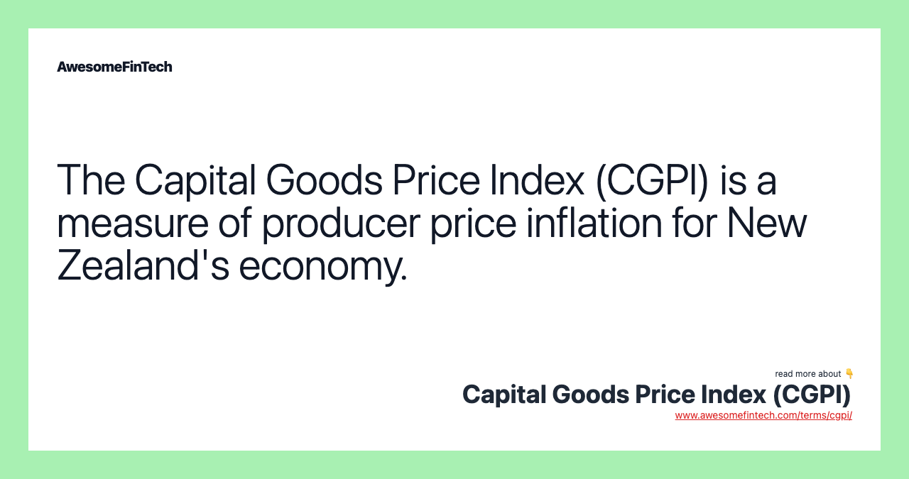

The Capital Goods Price Index (CGPI) is a key economic indicator in New Zealand, providing critical insights into the price movements of fixed capital assets. These assets include residential and non-residential buildings, transportation equipment, plant machinery, and infrastructure projects. By monitoring changes in the prices of these goods, the CGPI plays a vital role in assessing economic inflation and guiding policy decisions. This article offers an examination of CGPI, highlighting its importance in economic assessments and algorithmic trading involving capital goods.

Understanding CGPI's role within New Zealand's economy requires a discussion of its integration into the Business Price Index (BPI) framework and its periodic updates adapted to reflect current economic conditions. This exploration enhances comprehension of broader economic trends and policy-making processes.



In addition, the comparison of CGPI with other indices, such as the Producer Price Index (PPI) in the United States, reveals different perspectives on price changes. While CGPI focuses on capital goods prices, emphasizing their impact on investment decisions, PPI provides insights into production costs, offering a broader view of producer price changes.

Moreover, these indices are instrumental in economic policy formulation and algorithmic trading strategies. By utilizing price indices like the CGPI, policymakers can derive inflation measurements to craft monetary policies such as interest rate adjustments. Likewise, algorithmic traders benefit from CGPI's detailed data to optimize trading strategies, predict market movements, and enhance investment decisions.

Overall, the CGPI stands as an essential tool for evaluating economic health, influencing both trading strategies and policymaking in New Zealand. This article aims to elucidate the significance of CGPI, its comparisons with other indices, and its applications in both economic policy and algorithmic trading, thereby serving as a valuable resource for economists, traders, and policymakers alike.

## Table of Contents

## Understanding Capital Goods Price Index (CGPI)

The Capital Goods Price Index (CGPI) is a key economic tool for monitoring variations in the prices of fixed capital assets, crucial for understanding economic inflation dynamics. This index is particularly significant in New Zealand as it uniquely captures price movements across various types of capital assets such as residential and non-residential buildings, transportation equipment, plant machinery, and infrastructure projects. The specificity of the CGPI to New Zealand's economic structure provides insights that equip policymakers and investors to make informed decisions.

Initially, the CGPI was a standalone index pertinent to New Zealand’s economy. However, since 2015, it has been seamlessly integrated into the larger framework of New Zealand's Business Price Index (BPI). This integration underscores the importance of capital goods pricing within the broader context of business pricing trends, allowing for a more consolidated approach to analyzing economic fluctuations. Post-2015, the periodic updates of the CGPI have become a regular component of statistical releases, providing timely information about the state and shifts in capital asset prices.

To understand the significance of CGPI, it's essential to comprehend its components. The CGPI includes a detailed categorization of various capital goods, capturing price changes in these assets over time. This categorization is vital for identifying economic trends and informing policy-oriented decisions. For instance, fluctuations in the price indices of non-residential buildings might indicate changes in the commercial real estate market, while shifts in transportation equipment prices might reflect broader economic adjustments impacting trade and logistics.

The CGPI’s detailed focus on capital goods pricing aids in drawing a more comprehensive picture of economic trends. By closely observing these trends, policymakers can discern underlying inflationary pressures and macroeconomic shifts. For instance, if the CGPI reflects a steady increase in asset prices, this may signal building inflation, prompting policymakers to adjust monetary policies, such as interest rates, to mitigate potential economic overheating.

Furthermore, the integration of CGPI data into broader policy-making processes helps in crafting strategies that are responsive to prevailing economic conditions. This integration allows for a more fine-tuned approach to economic management, ensuring that policies are not only reactive but also proactive in fostering economic stability and growth. Through its detailed tracking and periodic updates, CGPI remains an indispensable index for appraising New Zealand's economic landscape and guiding strategic economic planning.

## Role of CGPI in Algorithmic Trading

The Capital Goods Price Index (CGPI) provides a granular view of price fluctuations within capital goods, presenting a valuable resource for algorithmic traders who aim to forecast market movements and optimize trading strategies. By breaking down data into specific categories such as residential buildings, transportation equipment, and plant machinery, traders can harness this detailed information to develop algorithms that accurately mirror market realities.

Integrating CGPI data into trading algorithms involves assessing historical price trends and using these insights to predict future market movements. This requires sophisticated models that account for various economic indicators. For example, statistical methods such as time series analysis or [machine learning](/wiki/machine-learning) models can be employed. In Python, a basic implementation might utilize libraries like `pandas` for data manipulation and `scikit-learn` for model development. Here's a simple illustration using a time series forecasting approach:

```python
import pandas as pd
from sklearn.model_selection import train_test_split
from sklearn.ensemble import RandomForestRegressor

# Load CGPI dataset
data = pd.read_csv('cgpi_data.csv')
X = data.drop('price', axis=1)  # Features
y = data['price']  # Target variable (price)

# Split the data into training and testing sets
X_train, X_test, y_train, y_test = train_test_split(X, y, test_size=0.2, random_state=42)

# Train a regression model
model = RandomForestRegressor(n_estimators=100, random_state=42)
model.fit(X_train, y_train)

# Predict future prices
predictions = model.predict(X_test)
```

Automation plays a critical role in utilizing CGPI data for investment decisions. Algorithmic trading systems can be programmed to execute trades based on specific CGPI trends, reducing the need for manual intervention and optimizing transaction timing. This can involve setting predefined conditions under which trades are automatically initiated or adjusted in response to significant data shifts. For instance, if the CGPI for transportation equipment indicates a sustained price increase, the algorithm might adjust investment allocations towards this sector, anticipating future growth.

Several practical examples illustrate algorithmic adjustments in reaction to CGPI data changes. An algorithm might, for instance, buy futures contracts in industrial machinery when CGPI data shows a decline in prices, possibly anticipating a rebound. Conversely, if the data suggests persistent inflation in infrastructure projects, algorithms might short securities related to those areas, predicting reduced future profitability.

In conclusion, integrating CGPI data into [algorithmic trading](/wiki/algorithmic-trading) enables the development of informed, data-driven strategies that can anticipate and capitalize on market trends. Automation and sophisticated predictive models, built upon detailed CGPI analyses, offer substantial advantage in capital goods investment, ensuring traders remain responsive and competitive in dynamic financial environments.

## Comparison with Other Price Indices

The Producer Price Index (PPI) in the United States and the Capital Goods Price Index (CGPI) in New Zealand are both instrumental in economic analysis, yet they serve distinct purposes. The CGPI is specifically designed to provide an in-depth examination of capital goods pricing, capturing price fluctuations in assets such as buildings, machinery, and transportation equipment. It offers a comprehensive perspective that is crucial for understanding the capital-intensive sectors of an economy. In contrast, the PPI primarily focuses on the changes in prices received by domestic producers for their output, aiding in the assessment of production costs and wholesale inflation.

The CGPI's specificity to capital goods makes it an invaluable tool for nations like New Zealand, where the economic structure and size might warrant a closer look at capital asset pricing independently from broader price indices. The absence of a direct U.S. equivalent to CGPI highlights a significant difference in economic monitoring approaches between the two countries. The U.S. does not segment capital goods pricing in the same standalone manner, relying instead on the broader PPI, which incorporates wholesale prices across a wide range of products and industries.

In economic analyses, these indices cater to different facets. The PPI allows analysts to track price movements from the perspective of producers, providing data that can help predict consumer price changes by gauging upstream costs. This producer-oriented view assists in identifying inflationary trends and cost pressures within the supply chain. Conversely, the CGPI's focus on end-use capital goods pricing provides insights into long-term investment trends and the health of sectors dealing heavily in infrastructure and advanced machinery.

For traders, understanding these differences is crucial. Traders leveraging PPI data can better forecast consumer inflation trends and anticipate market shifts driven by changes in production costs. Meanwhile, the detailed capital goods data in CGPI can enable more precise investment strategies in industries reliant on physical infrastructure and machinery. By optimizing algorithmic trading models to account for data from each type of index, traders can enhance their predictions of market movements and economic health.

In summary, while both CGPI and PPI serve distinct purposes, their roles in economic analysis are complementary. Recognizing the specificity and scope of each index allows for a more nuanced understanding of market and economic dynamics, offering tailored insights into inflationary pressures and investment opportunities.

## Applications in Economic Policy

The Capital Goods Price Index (CGPI) serves as a vital tool in the formulation of New Zealand's monetary policy, primarily through its role in measuring inflation. By providing detailed insights into the price movements of capital goods, CGPI enables policymakers to evaluate the inflationary pressures present in the economy. This information is crucial when making decisions on interest rates, as it helps the Reserve Bank of New Zealand (RBNZ) balance its dual mandate of controlling inflation and supporting economic growth.

CGPI data's influence extends beyond national borders, impacting global economic strategies. In a globally interconnected market, the economic health of one nation can have ripple effects internationally. An increase in capital goods prices, as indicated by the CGPI, can lead to a rise in production costs, affecting export competitiveness and leading to trade imbalances. Consequently, international investors and economic strategists closely monitor New Zealand's CGPI to anticipate changes in market conditions and adjust their portfolios accordingly.

Economic policies derived from CGPI data also significantly impact investment environments and business operations. For instance, a rise in the CGPI might signal upcoming cost pressures for businesses reliant on capital goods, prompting them to adjust their investment strategies. This could include seeking alternative suppliers, investing in technology to reduce capital goods dependency, or adjusting pricing strategies to maintain competitiveness.

Moreover, CGPI-driven policies influence taxation and government spending. By understanding the implications of capital goods pricing on the broader economy, the government can allocate resources more effectively, supporting sectors most vulnerable to price fluctuations. For example, if CGPI data indicates a downturn in infrastructure investment due to rising costs, policymakers might introduce tax incentives to stimulate activity in that sector.

In summary, the CGPI is integral to shaping New Zealand’s economic policies. Its use in inflation measurement, [interest rate](/wiki/interest-rate-trading-strategies) decisions, and broader economic strategies underscores its importance. By influencing investment climates and business operations, the CGPI ensures that New Zealand remains responsive and adaptive to both domestic and international economic challenges.

## Conclusion

In summary, the Capital Goods Price Index (CGPI) stands as a cornerstone in understanding New Zealand's economic health and forms a critical component in crafting robust trading strategies. By facilitating comparative analysis with other indices and fostering applications in algorithmic trading and economic policy, CGPI has demonstrated its vast influence. It acts as a crucial indicator for traders and policymakers, offering insights into market trends and economic dynamics, thus enabling informed decision-making. 

Unique to New Zealand, CGPI's role extends beyond traditional economic measures, providing a nuanced view that aids in inflation assessments and capital asset pricing, which are fundamental in addressing economic challenges and strategizing growth. The integration of CGPI data into trading algorithms offers a methodical approach to anticipate market movements, highlighting its utility in the sphere of automated trading strategies.

Looking forward, CGPI's potential evolution is promising, particularly with advancements in technology-driven trading solutions. The ongoing digitization and data analytics innovations present opportunities for enhanced application of CGPI data, potentially transforming how market analyses and trading decisions are performed. As the landscape of economic indicators evolves, CGPI may further integrate with sophisticated trading models, solidifying its status as an indispensable tool for economic analysis and strategic planning.

## References & Further Reading

[1]: Statistics New Zealand. ["Business Price Index: Sources and Methods."](https://www.stats.govt.nz/topics/price-indexes) Referenced for understanding methodologies related to CGPI.

[2]: New Zealand Treasury. ["Cost Pressure Analysis Using Capital Goods Price Indices."](https://www.treasury.govt.nz/cost-benefit-and-multi-criteria-analysis) This report discusses CGPI's role in economic analysis.

[3]: International Monetary Fund. ["Producer Price Index Manual: Theory and Practice."](https://www.imf.org/en/Publications/Manuals-Guides/Issues/2016/12/30/Producer-Price-Index-Manual-Theory-and-Practice-16966) Essential for understanding how different countries utilize price indices including CGPI and PPI.

[4]: O’Sullivan, C., & Kennedy, N. (2010). ["Capital Goods Price Index in New Zealand."](https://onlinelibrary.wiley.com/doi/full/10.1111/j.1467-6486.2010.00923.x) A government publication examining the specifics of CGPI.

[5]: Stevens, J. (2017). ["Algorithmic Trading and Computational Finance."](https://scholar.google.com/citations?user=2EG--bsAAAAJ&hl=en) Springer. Provides insights into how indices like CGPI are used in algorithmic trading models.