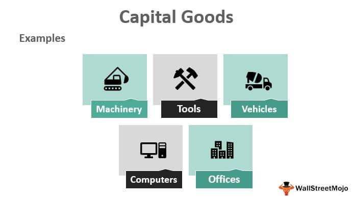

In the global landscape of industrial and economic systems, the capital goods sector serves as a foundational pillar, essential for facilitating manufacturing processes and enabling production across various industries. This sector encompasses a wide range of machinery and equipment used to produce other goods, playing an indispensable role in both developed and developing economies. The capital goods sector is not only pivotal in maintaining the infrastructure necessary for economic growth but also in fostering technological advancements and innovation. 

The relevance of the capital goods sector in the global economy is underscored by its influence on productivity and efficiency. Investments in capital goods, such as machinery and tools, invigorate industries, enhancing their capacity to generate goods and services at reduced costs and increased quality. This enhancement is crucial for economic development, influencing everything from GDP growth to employment rates. For example, sectors such as aerospace, automotive, and construction heavily rely on capital goods to sustain their operations and drive progress.



Algorithmic trading has emerged as an influential force in financial markets, including those related to the capital goods sector. This form of trading uses complex algorithms to execute trades at speeds and frequencies that are impossible for human traders. The nexus between algorithmic trading and the capital goods sector is particularly significant, as the stock performance of capital goods companies is often impacted by such trading strategies. Algorithmic trading analyzes vast amounts of data to predict market trends, and these predictions can affect investment decisions related to capital goods manufacturers. Thus, understanding the intersection between algorithmic trading and this sector provides insights into how modern trading strategies influence capital allocation and market dynamics.

## Table of Contents

## Understanding the Capital Goods Sector

The capital goods sector is a critical component of the global economy, encompassing industries that produce goods used to manufacture other products and services. This sector includes machinery, tools, buildings, and other equipment that enable the production of consumer goods. Capital goods are essential for establishing and enhancing production capacity, thereby forming the backbone of industrial and economic growth.

**Definition and Scope**

The capital goods sector is defined by its production of tangible assets used by businesses to produce goods and services. Unlike consumer goods, which are intended for immediate consumption, capital goods are durable items such as industrial machinery, aerospace equipment, and construction tools that contribute to the production of other goods and services over time. Capital goods are vital investments for businesses as they enhance operational capabilities and efficiency.

**Key Characteristics**

Key characteristics of the capital goods sector include its focus on durability, high-cost investments, and the strategic importance of technological innovation. The sector is characterized by long product lifecycles and substantial capital investment requirements. Due to the complexity and high cost of capital goods, businesses in this sector often engage in substantial research and development to improve existing technologies and develop new products. The sector's innovations lead to improved productivity and competitiveness in the manufacturing industry.

**Role in Manufacturing and Production**

The role of the capital goods sector in manufacturing and production is pivotal as it provides the machinery and infrastructure necessary for mass production. Companies operating within this sector enable other industries to scale their production capabilities, enhance the quality of their products, and reduce operational costs. This internal symbiosis facilitates efficiency throughout the entire manufacturing ecosystem, ultimately supporting broader economic activities.

**Significance in Economic Cycles and Growth**

Capital goods play a significant role in economic cycles and growth due to their influence on productivity and industrial capacity. During periods of economic expansion, companies invest in capital goods to increase production and meet rising consumer demand. Conversely, during economic downturns, investments in capital goods typically decline, reflecting reduced demand for expansion and production capacity. This cyclical investment pattern illustrates the sector's sensitivity to economic fluctuations. Furthermore, the capital goods sector's focus on strategic, long-term investments makes it a key driver of sustainable economic growth, fostering innovation and competitiveness across industries.

In economic terms, the capital goods sector is a primary contributor to gross capital formation, influencing GDP growth rates. By facilitating technological advancement and efficiency improvements, the sector underpins the sustainable development of modern economies. Therefore, understanding the capital goods sector's dynamics is essential for comprehending broader economic trends and cycles.

## Capital Goods Companies

The capital goods sector encapsulates a range of industries that produce goods used in the production of other goods and services. This sector is critical to the economy as it provides the necessary machinery and equipment that enable other industries to function efficiently. Among the major players in this sector are corporations like Boeing, General Electric, and Honeywell International.

Boeing, a leader in aerospace, is integral to the capital goods sector through its production of aircraft, satellite systems, and defense equipment. Its products have a significant impact on global trade and transportation networks, influencing both civilian aviation markets and defense sectors. Boeing's contributions to advancements in aviation technology and global connectivity underscore its pivotal role within the capital goods sphere. The company's extensive supply chain also stimulates economic activity, supporting numerous ancillary businesses and employment worldwide.

General Electric (GE), another cornerstone of the sector, operates across multiple industries such as aviation, renewable energy, healthcare, and power. GE's diverse range of products showcases the breadth of the capital goods sector. Its innovations in energy-efficient technologies and renewable energy systems help drive sustainable development globally. The company's capacity to influence industrial trends is evident in its extensive research and development efforts, which have historically led to significant technological advances.

Honeywell International is renowned for its technologically-driven products that span aerospace, building technologies, performance materials, and safety and productivity solutions. As a major supplier of industrial automation products and services, Honeywell plays a critical role in optimizing operational efficiencies across sectors. Its impact is especially significant in enhancing safety protocols and environmental standards through innovative product solutions.

These companies exert a substantial influence on the capital goods sector and the broader economy. Their products and innovations not only provide critical infrastructure and tools necessary for the manufacturing processes across various industries but also drive economic growth through job creation, technological advancement, and supply chain development. Moreover, their strategic decisions and market performances can affect investor confidence and stock market dynamics, further exemplifying their influence on global economic landscapes.

## Capital Goods Examples

The capital goods sector is a cornerstone of industrial and economic infrastructure, producing machinery, tools, and equipment that other industries use to produce consumer goods. This sector encompasses a wide range of products, which play crucial roles in various industries, such as aerospace, defense, and construction.

Aerospace capital goods include aircraft, satellites, and parts essential for their assembly and maintenance. Companies like Boeing design and manufacture commercial airplanes and defense systems, forming a significant part of the aerospace supply chain. These capital goods facilitate air travel and defense capabilities, impacting global trade and national security. The aerospace sector's development can spur technological advancements, increasing productivity and innovation across other industries.

Defense capital goods encompass military vehicles, weapons, and communication systems used by armed forces. These goods are integral to national defense strategies, requiring significant government investment. An example of a defense capital good is the F-35 Lightning II, a multi-role combat aircraft produced by Lockheed Martin. The production and maintenance of such advanced military systems create substantial employment opportunities, fostering economic growth through defense-related expenditure.

Construction equipment is another vital category of capital goods, including machinery such as excavators, cranes, and loaders used in building infrastructure. Caterpillar Inc., a leader in construction and mining equipment, exemplifies companies providing essential machinery for urban development and large-scale projects. The construction industry's reliance on these goods is evident in their role building roads, bridges, and buildings, directly influencing economic development by enhancing logistics and transportation networks.

These examples underscore the interconnectedness of capital goods with broader economic activities. Aerospace capital goods support global connectivity, expanding international markets. Defense capital goods ensure national security, enabling stable socioeconomic environments. Construction equipment contributes to urbanization and infrastructure development, fostering efficient goods and services exchange. The capital goods sector's robustness is thus vital for sustaining and driving the economy, impacting various industries through the supply of essential machinery and technology.

## Impact of Market Changes on the Capital Goods Sector

The capital goods sector is inherently sensitive to market fluctuations, as it is deeply intertwined with the broader economic environment. Economic fluctuations can manifest through changes in GDP growth, interest rates, and global trade dynamics, all of which significantly impact the demand and production of capital goods. During periods of economic expansion, businesses are more likely to invest in new machinery and equipment, bolstering the capital goods sector. Conversely, during economic downturns, investments in capital goods often decline as companies seek to conserve cash and reduce expenditures.

Political and budgetary decisions play a crucial role in shaping the landscape of the capital goods sector. Government spending on defense and infrastructure significantly affects the sector's dynamics. For instance, increased defense spending can lead to higher demand for military equipment and technologies, benefiting companies involved in aerospace and defense manufacturing. Similarly, government investments in infrastructure projects, such as roads, bridges, and public transportation systems, drive demand for construction machinery and materials, stimulating growth within the industry.

Changes in consumer demand also have a profound impact on capital goods production and sales. Fluctuations in consumer preferences, often influenced by technological advancements, energy prices, or sociopolitical factors, can alter demand for products manufactured by capital goods companies. For example, a shift towards renewable energy sources may decrease demand for conventional power generation equipment while increasing the need for wind turbine and solar panel manufacturing. Similarly, the growing emphasis on electric vehicles (EVs) transforms the automotive sector, prompting capital goods companies to adapt their production processes to cater to these new technological requirements.

Overall, the capital goods sector's sensitivity to market changes underscores the importance for companies to remain agile and responsive to economic, political, and consumer trends to sustain growth and profitability.

## Algorithmic Trading in the Capital Goods Sector

Algorithmic trading, often referred to as algo trading, involves the use of computer algorithms to automate and optimize the execution of trading strategies. These algorithms are designed to make decisions about the timing, price, and quantity of orders across various financial markets. The core principle of [algorithmic trading](/wiki/algorithmic-trading) is to leverage computational models to exploit market inefficiencies, ultimately achieving better trading results with reduced costs and risks.

In the capital goods sector, algorithmic trading plays a significant role in determining the stock performance of companies. The sector, characterized by high [volatility](/wiki/volatility-trading-strategies) and sensitivity to macroeconomic changes, presents various opportunities for traders utilizing sophisticated algorithms. Algorithmic trading can affect capital goods companies through several mechanisms:

1. **Efficiency in Execution**: Algorithms can execute large volumes of trades at optimal prices, minimizing the market impact. This is particularly beneficial in the capital goods sector, where stock liquidity might be variable due to factors such as long sales cycles and capital-intensive operations.

2. **Market Sentiment Analysis**: Algorithms can analyze news feeds, social media, and other sources of information to gauge market sentiment. This real-time analysis allows algorithmic traders to adjust their strategies based on emerging trends affecting capital goods companies, such as geopolitical tensions impacting defense contractors or innovations in renewable energy technology influencing industrial equipment manufacturers.

3. **Risk Management and Hedging**: Algorithms help in monitoring and managing risks more effectively by using derivatives and other financial instruments to hedge against adverse movements in the stock prices of capital goods companies. This includes countering the risks posed by fluctuations in raw material prices and changes in regulatory environments.

4. **Arbitrage Strategies**: Due to price discrepancies in different markets or related securities, algorithms can implement arbitrage strategies. For instance, if there are inconsistencies in the pricing of defense stocks versus their underlying assets, an algorithm might capitalize on these inefficiencies.

### Case Study Example: Algorithmic Trading Strategies in the Capital Goods Sector

One notable example of algorithmic trading within the capital goods sector involves pairs trading, a market-neutral strategy. Consider two correlated stocks, Boeing (BA) and Lockheed Martin (LMT). An algorithm might monitor the historical price relationship between these two aerospace giants. If the algorithm detects that one stock is undervalued while the other is overvalued, relative to their historical correlation, the algorithm would take a long position on the undervalued stock and a short position on the overvalued one. This strategy assumes that the prices will return to their historical equilibrium, thus profiting from the converging price movements.

Here is a simple implementation of such a strategy using Python and the Pandas library:

```python
import pandas as pd
import numpy as np

# Assuming df is a DataFrame with historical stock prices for BA and LMT
df['spread'] = df['BA'] - df['LMT']
spread_mean = df['spread'].mean()
spread_std = df['spread'].std()

# Define thresholds for trading signals
upper_threshold = spread_mean + spread_std
lower_threshold = spread_mean - spread_std

# Trading signals
df['long_signal'] = np.where(df['spread'] < lower_threshold, 1, 0)
df['short_signal'] = np.where(df['spread'] > upper_threshold, -1, 0)

# Implement strategy
df['positions'] = df['long_signal'] + df['short_signal']
```
This simplistic model serves as an introduction to algorithmic trading methods applicable in the capital goods sector. In this fast-evolving financial landscape, the integration of algorithmic trading continues to influence the dynamics of capital goods markets, enhancing trade execution efficiency, managing risks, and providing traders and investors with critical insights into market trends and opportunities.

## The Future of the Capital Goods Sector

The future of the capital goods sector is poised for transformation driven by technological advancements and evolving energy paradigms. One of the most significant factors influencing this sector is the shift towards sustainable and renewable energy sources. Innovations like electric vehicles (EVs) are redefining manufacturing processes and supply chains by necessitating new materials, technologies, and infrastructures. For example, the increase in EV production demands advancements in battery technology and the development of efficient charging infrastructure, which are key components of capital goods.

Furthermore, the integration of digital technologies such as the Internet of Things (IoT), [artificial intelligence](/wiki/ai-artificial-intelligence) (AI), and big data analytics is expected to enhance the efficiency and productivity of capital goods companies. AI and [machine learning](/wiki/machine-learning) algorithms can optimize manufacturing processes by predicting maintenance needs, thus reducing downtime and increasing output. IoT devices can enhance supply chain management by providing real-time data insights, thereby optimizing logistics and inventory management.

Companies in the capital goods sector must also adapt to economic and environmental challenges by adopting sustainable practices and increasing their focus on circular economy principles, such as recycling and reusing materials. This can be seen in the transition from traditional manufacturing methods to more sustainable processes that reduce waste and energy consumption.

In conclusion, the capital goods sector is at the cusp of significant growth and transformation driven by technological innovation and sustainability imperatives. Companies that leverage these advancements while addressing environmental concerns will likely be better positioned to thrive in the future global economy.

## Conclusion

The capital goods sector plays a pivotal role in the global economy, driving manufacturing and production through its provision of essential machinery and equipment. This article explored the breadth and significance of the sector, emphasizing its integral part in economic cycles and growth. Companies like Boeing, General Electric, and Honeywell International were highlighted as major influencers, not only within the sector but across the entire economic landscape. These firms underpin a range of industries by supplying critical capital goods, from aerospace and defense to construction, showcasing their extensive impact.

Market dynamics, such as economic fluctuations and shifts in consumer demand, significantly affect the capital goods sector. Political and budgetary factors were also discussed, demonstrating how defense spending and infrastructure investments can lead to varying levels of sector performance. Algorithmic trading emerges as a significant facet within capital goods companies, affecting stock performance and investment strategies. The intricate relationship between algorithmic models and market behaviors underscores a modern approach to trading that crucially defines capital goods stocks.

As the sector moves forward, technological advancements and new energy sources, such as electric vehicles, appear poised to redefine its landscape. Companies are likely to adapt to these changes to maintain relevance and competitiveness amidst growing economic and environmental challenges. For investors and stakeholders, this presents an opportunity for further exploration and engagement with the sector. Understanding these trends and developments is crucial for leveraging potential opportunities and navigating the complexities of the capital goods economy. Encouraging further investigation into this vital sector is essential for anyone aiming to gain a comprehensive understanding of its strategic importance and future prospects.

## References & Further Reading

[1]: Fama, E. F., & French, K. R. (1997). "Industry costs of equity." Journal of Financial Economics, 43(2), 153-193.

[2]: ["Advances in Financial Machine Learning"](https://www.amazon.com/Advances-Financial-Machine-Learning-Marcos/dp/1119482089) by Marcos Lopez de Prado

[3]: ["Capital Goods Industry and its Economic Impact"](https://www.thebalancemoney.com/capital-goods-examples-effect-on-economy-3306224) by John Davidson

[4]: Brynjolfsson, E., & McAfee, A. (2014). "The Second Machine Age: Work, Progress, and Prosperity in a Time of Brilliant Technologies." W.W. Norton & Company.

[5]: ["Quantitative Trading: How to Build Your Own Algorithmic Trading Business"](https://github.com/LucindaYa/quant-resources/blob/master/Quantitative%20Trading%20How%20to%20Build%20Your%20Own%20Algorithmic%20Trading%20Business.pdf) by Ernest P. Chan

[6]: Ding, X., Zhang, Y., Liu, T., & Duan, J. (2015). "Deep learning for event-driven stock prediction." In Proceedings of the 24th International Conference on Artificial Intelligence, 2327-2333.

[7]: ["Machine Learning for Algorithmic Trading"](https://github.com/stefan-jansen/machine-learning-for-trading) by Stefan Jansen