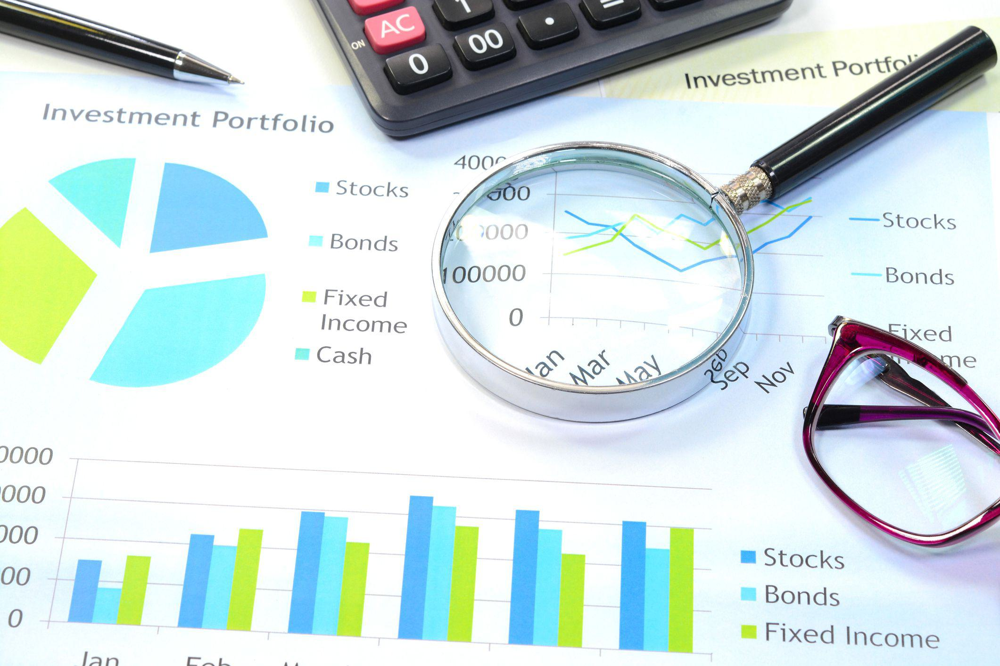

In today's fast-paced financial world, the development of effective investment strategies is crucial to achieving capital growth and securing long-term financial goals. As financial markets evolve, investors are increasingly turning to technology-driven approaches to optimize their investment decision-making processes. The integration of financial planning with advanced technologies, such as algorithmic trading, presents robust opportunities for enhancing portfolio performance.

Algorithmic trading, commonly known as algo trading, employs complex algorithms to automate trading decisions and execute trades at speeds and accuracy beyond human capabilities. This technological advancement enables investors to exploit market inefficiencies and capture profitable trends, a feat difficult to accomplish through traditional methods.



Effective investment strategies not only focus on capital growth but also involve comprehensive financial planning. This planning accounts for variables such as risk tolerance, investment horizons, and market dynamics. The synergy between sound financial planning and algorithmic methodologies provides investors with a strategic advantage, allowing for a dynamic approach to achieving financial objectives.

In this article, we explore various investment strategies that focus on capital growth, the significance of incorporating financial planning, and the transformative role of algorithmic trading in modern investment practices. Our aim is to equip readers with comprehensive insights that can enhance their investment portfolios, providing a balanced approach to both maximizing returns and managing risks. Through a thorough understanding of these elements, investors can navigate the complexities of financial markets more effectively and pursue their financial goals with confidence.

## Table of Contents

## Understanding Investment Strategies

Investment strategies are methods employed by individuals or institutions to allocate resources effectively to maximize returns over time. A primary goal of these strategies is capital growth, which involves selecting investments that are likely to increase in value. Common assets targeted for capital growth include equities such as stocks and collective investment vehicles like mutual funds. These strategies encompass a range of approaches to navigate market dynamics and achieve financial objectives.

### Capital Growth

Capital growth is the increase in value of an investment or portfolio over time. For investors seeking substantial capital appreciation, stocks are a popular choice due to their potential for significant value increases. Mutual funds provide a diversified approach to achieving capital growth by pooling funds from multiple investors to invest in a diverse portfolio of securities.

### Diversification

Diversification is a fundamental technique in investment strategy. It involves spreading investments across various asset classes, sectors, or geographic regions to reduce risk. By not putting all their financial resources into a single investment or type of asset, investors can mitigate the impact of a poor-performing investment on the overall portfolio. The principle of diversification aligns with the adage "don't put all your eggs in one basket."

### Risk Management Techniques

Effective investment strategies must incorporate risk management to navigate market [volatility](/wiki/volatility-trading-strategies) and protect against potential loss. Below are some techniques commonly used to manage risk:

1. **Asset Allocation:** This involves distributing investments across different asset classes, such as stocks, bonds, and real estate, depending on the investor's risk tolerance and time horizon.

2. **Hedging:** Investors use financial instruments like options and futures contracts to offset potential losses in their portfolio.

3. **Stop-Loss Orders:** These are predefined orders to sell an asset when it reaches a certain price, limiting the investor's potential loss.

4. **Regular Portfolio Reviews:** By consistently monitoring and adjusting their investment portfolio, investors can respond to changes in market conditions and align their investments with their long-term goals.

By understanding and implementing these strategies, investors can position their portfolios to capitalize on growth opportunities while maintaining a balanced risk profile.

## Capital Growth in Financial Planning

Capital growth is a key aspect of financial planning focused on increasing the value of assets over time. This growth is essential for investors aiming to achieve long-term financial objectives, such as retirement savings and funding education. To effectively incorporate capital growth into financial planning, investors need to adopt strategies that acknowledge the trade-off between risk and return. 

In essence, capital growth is achieved through the appreciation of investment assets like stocks, real estate, or mutual funds. Investors who prioritize capital growth are typically willing to accept higher levels of risk compared to those focusing on income-generating investments. This approach is rooted in the premise that riskier ventures often yield greater returns. For instance, equity investments are generally associated with higher volatility but also offer the potential for significant appreciation over time.

In financial planning, capital growth is integrated by aligning investment choices with individual financial timelines. For example, a younger investor saving for retirement may allocate a significant portion of their portfolio to growth-focused assets, as they have the advantage of time to weather market fluctuations. Conversely, an investor with short-term goals might prefer a more balanced portfolio that combines both growth and income elements to mitigate risks.

When planning for retirement, capital growth plays a critical role in ensuring that investment portfolios can support future expenses. The goal is to build a nest egg that not only preserves its purchasing power against inflation but also grows sufficient to cover anticipated needs. Similarly, when planning for educational expenses, capital growth helps investors build an investment fund that can meet tuition costs and other related expenditures.

Incorporating capital growth into financial planning involves a rigorous evaluation of market opportunities and judicious asset allocation. Diversification is a practical approach used to spread risk across various asset classes and sectors, thereby enhancing the potential for capital appreciation. This strategy reduces the impact of market volatility on the overall portfolio, promoting a steadier path to capital growth.

In summary, capital growth is integral to achieving long-term financial goals within an investment strategy. By striving for asset value appreciation and carefully considering the risk-return relationship, investors can significantly enhance their financial well-being through strategic planning and informed decision-making.

## Algorithmic Trading and its Advantages

Algorithmic trading, often abbreviated as algo trading, involves the use of computer programs and algorithms to execute trades at high speeds and efficiencies that surpass human capabilities. This technology-driven approach leverages pre-set rules for trading, which can include timing, price, quantity, or any mathematical model to optimize investment strategies. The primary advantage of [algorithmic trading](/wiki/algorithmic-trading) is its ability to process multiple data streams simultaneously, execute orders at rapid speeds, and reduce the impact of human errors or emotions.

One of the core benefits of algorithmic trading is the ability to automate investment strategies, which aids investors in capturing profitable opportunities from market inefficiencies. These inefficiencies can arise from various factors such as mispricing, market microstructure issues, or temporal anomalies, and algorithmic trading is well-suited to exploit these situations due to its fast execution and analytical rigor.

Two common strategies used in algorithmic trading are trend-following and statistical [arbitrage](/wiki/arbitrage):

1. **Trend-Following Strategies**: These algorithms are designed to capture gains through the analysis of a security's momentum in a particular direction. Trend-following does not predict market movements but reacts to them. A basic example could be the Moving Average Crossover strategy, where trades are executed based on the crossing over of short-term and long-term moving averages. A simple implementation in Python could be:

    ```python
    import numpy as np
    import pandas as pd

    def moving_average_cross(data, short_window=40, long_window=100):
        signals = pd.DataFrame(index=data.index)
        signals['price'] = data['price']
        signals['short_mavg'] = signals['price'].rolling(window=short_window, min_periods=1, center=False).mean()
        signals['long_mavg'] = signals['price'].rolling(window=long_window, min_periods=1, center=False).mean()
        signals['signal'] = 0.0
        signals['signal'][short_window:] = np.where(signals['short_mavg'][short_window:] > 
                                                    signals['long_mavg'][short_window:], 1.0, 0.0)
        signals['positions'] = signals['signal'].diff()
        return signals
    ```

2. **Statistical Arbitrage**: This involves statistical and econometric techniques to exploit pricing inefficiencies between related instruments. Strategies might involve pairs trading, where a trader might consider two historically correlated stocks. When the correlation diverges, the strategy would simultaneously buy the underperforming stock and short the outperforming one, anticipating that they will revert to their mean. Mathematical models determine entry and exit points, often leveraging principles like autoregressive moving average (ARMA) models for predicting shifts.

Algorithmic trading offers a more accessible way for traders to manage and refine their strategies, ensuring adherence to disciplined trading processes without delays. With its precise, data-driven decision-making, algorithmic trading stands out as a sophisticated tool for investors looking to improve their competitive edge in dynamic and fast-moving financial markets.

## Building an Effective Algo Trading Strategy

Constructing a successful algo trading strategy requires a well-rounded understanding of market dynamics and the ability to make data-driven decisions. The foundation of an effective algorithmic trading strategy lies in clearly defining trading objectives. Objectives can range from generating consistent returns, minimizing risk, to achieving specific financial goals. Establishing these goals helps shape the strategy’s design and performance metrics.

Backtesting is a crucial step that involves testing the trading strategy against historical data to evaluate its potential performance. It's a way to simulate how the strategy would have performed in the past, providing insights into its effectiveness. This process involves using historical price data and applying the algorithm's rules to determine hypothetical trade outcomes. Performance metrics such as the Sharpe ratio, maximum drawdown, and win-to-loss ratio can be used to assess the strategy’s viability.

Continuous optimization is necessary for adapting to evolving market conditions. Optimization involves fine-tuning parameters and improving components of the algorithm to enhance performance. However, it is essential to avoid overfitting, which occurs when a model is excessively tailored to past data, reducing its effectiveness on unseen data. Techniques like cross-validation can help in identifying a model’s robustness.

In algo trading, balancing technical indicators with risk management tools is crucial. Technical indicators, such as moving averages, RSI, and MACD, help in identifying trading signals and market trends. However, relying solely on technical indicators can expose the strategy to unintended risks. Risk management tools such as stop-loss orders, position sizing, and diversification are indispensable in controlling potential losses and protecting capital.

Algorithmic traders can also employ advanced programming techniques to refine their strategies. Here is a simple Python pseudocode snippet illustrating a moving average crossover strategy:

```python
import pandas as pd

# Load historical price data
data = pd.read_csv('price_data.csv')

# Calculate moving averages
data['Short_MA'] = data['Close'].rolling(window=50).mean()
data['Long_MA'] = data['Close'].rolling(window=200).mean()

# Generate trading signals
data['Signal'] = 0
data['Signal'][50:] = np.where(data['Short_MA'][50:] > data['Long_MA'][50:], 1, 0)

# Calculate strategy returns
data['Strategy_Returns'] = data['Signal'].shift(1) * data['Log_Returns']

# Evaluate strategy performance
sharpe_ratio = data['Strategy_Returns'].mean() / data['Strategy_Returns'].std()

print('Strategy Sharpe Ratio:', sharpe_ratio)
```

This code outlines a simple strategy involving two moving averages: a short-term and a long-term average. A buy signal is generated when the short-term average crosses above the long-term average, indicating a potential upward trend.

In summary, building an effective algo trading strategy involves defining clear objectives, employing rigorous [backtesting](/wiki/backtesting), optimizing the strategy continually, and balancing technical indicators with robust risk management practices. By doing so, traders can enhance their decision-making and seek out profitable opportunities in the market.

## Integrating Algo Trading in Financial Planning

Integrating algorithmic trading into financial planning can significantly enhance both diversification and efficiency of investment portfolios. This integration allows investors to leverage advanced computational algorithms to automate and optimize their trading strategies, providing a seamless combination with traditional investment methods.

Algorithmic trading (algo trading) operates by using computer algorithms to execute trades at specific signals or market conditions. This automated process offers a distinct advantage in terms of speed and precision, enabling investors to capitalize on market opportunities that may be fleeting or difficult for human traders to exploit.

### Complementing Traditional Investment Approaches

Algo trading can serve as an effective supplement to traditional investment strategies. By automating certain aspects of trading, it allows investors to pursue diverse strategies simultaneously, mitigating risks and seeking growth opportunities. For instance, while traditional investments may focus on long-term positions in stocks or bonds, an algorithmic overlay can execute short-term trades, capturing intraday volatility to enhance returns.

Moreover, algorithmic systems can be programmed to follow specific market conditions, allowing them to react faster than human traders to emerging trends, whether bullish or bearish. This responsiveness helps maintain a balanced portfolio, where risk is spread across varying asset classes and trading styles.

### Optimizing Portfolios for Growth and Risk Mitigation

The integration of algo trading naturally leads to enhanced portfolio performance by systematically managing risk. Algorithms can constantly analyze vast amounts of data to assess market volatility, [liquidity](/wiki/liquidity-risk-premium), and other risk factors. Based on these analyses, they can adapt trading positions in real-time, ensuring that portfolio allocations remain aligned with the investor’s risk tolerance and growth objectives.

For example, algorithms might use advanced statistical methods like Monte Carlo simulations to predict potential future price movements and adjust asset allocations accordingly. By dynamically adjusting for anticipated market changes, these systems help safeguard investments and optimize potential returns.

### Selecting Algorithmic Trading Platforms

Choosing the right algorithmic trading platform is critical for successful integration into financial planning. Platforms should offer robust backtesting capabilities, allowing users to simulate trading strategies on historical data to validate performance before real capital is committed. Additionally, intuitive interfaces and comprehensive analytical tools can enhance user experience and enable informed decision-making.

When selecting a platform, investors should consider factors such as transaction costs, latency, and the types of available financial instruments. Platforms might also provide APIs for custom trading strategy development, providing flexibility for sophisticated users who wish to implement bespoke algorithms tailored to specific financial goals.

### Integrating with Existing Financial Plans

Seamlessly incorporating algo trading into existing financial plans necessitates careful consideration and strategic alignment with current objectives. Investors should ensure that their algo trading systems are not operating in isolation but are instead integrated with other financial planning components. This integration can be achieved through regular reviews and adjustments of both algorithmic strategies and traditional investments, ensuring coherence across the entire investment strategy.

A well-structured integration should consider periodic rebalancing of portfolios, a critical aspect for maintaining the desired risk-return profile. Additionally, advisors and investors might leverage software solutions that provide holistic views of portfolio performance, blending algorithmic and traditional metrics.

By thoughtfully embedding algorithmic trading within the larger framework of financial planning, investors can achieve diversified, efficient, and adaptive investment portfolios that respond adeptly to changing market dynamics.

## Conclusion

Investment strategy, capital growth, and financial planning are integral to successful wealth management, forming the backbone of a well-rounded financial approach. A meticulously crafted investment strategy helps in effectively allocating resources to maximize returns while minimizing risks. Capital growth, being one of the core aims, involves selecting assets that have the potential to increase in value over time, contributing significantly to long-term financial objectives.

Moreover, the advent of algorithmic trading presents investors with a contemporary advantage. By utilizing algorithms, investors can execute trades rapidly and with precision, far surpassing the capabilities of manual trading. This technological edge enables quick adaptation to market changes, ensuring that investment strategies remain agile and relevant. The dynamic nature of algo trading helps in exploiting market inefficiencies and identifying profitable trends, thereby enhancing the overall performance of an investment portfolio.

Integrating algorithmic trading within financial planning allows for an optimized balance between traditional investment methods and modern technological solutions. This integration ensures a well-diversified portfolio that can withstand market volatilities while capitalizing on growth opportunities. Investors are encouraged to make informed decisions based on comprehensive data analysis and strategic planning, which is facilitated by the algorithmic approach.

In conclusion, by combining investment strategies, focusing on capital growth, and incorporating algorithmic trading, investors can establish a robust financial framework. This approach not only aims for higher returns but also provides a strategic pathway to achieving financial goals, making the most of both traditional wisdom and technological advancements in the investment landscape.

## Frequently Asked Questions (FAQ)

### What is capital growth and how can it benefit my financial planning?

Capital growth refers to the increase in the value of an investment or asset over time. It is primarily achieved when the market price of assets such as stocks, real estate, or mutual funds appreciates. The benefit of capital growth in financial planning lies in its potential to enhance the future value of your portfolio, thus allowing you to meet long-term financial goals like retirement, purchasing a home, or funding education. For instance, if you invest $10,000 in a stock with an annual growth rate of 7%, using the formula for compound interest, $FV = PV \times (1 + r)^n$, where $FV$ is the future value, $PV$ is the present value ($10,000), $r$ is the annual growth rate (0.07), and $n$ is the number of years invested, the future value after 10 years would be approximately $19,671.51.

### How does algorithmic trading differ from traditional trading strategies?

Algorithmic trading differs from traditional trading strategies in its use of automated, pre-programmed instructions to execute trades. Traditional trading often relies on manual decision-making, typically by traders or brokers who analyze market trends and make buy or sell decisions based on their expertise and experience. In contrast, algorithmic trading uses mathematical models and algorithms to execute trades at much faster speeds and with higher precision. This automation allows for rapid reactions to market changes and the ability to exploit market inefficiencies, which would be challenging to achieve manually.

### What are the risks associated with algo trading and how can they be managed?

The principal risks associated with algorithmic trading include technological failures, market volatility, and overfitting of algorithms. Technological failures can occur due to software bugs or hardware malfunctions, potentially leading to significant financial losses. Market volatility can result in algorithms executing trades at unfavorable prices, amplifying losses. Overfitting occurs when an algorithm is too closely tailored to historical data, making it less effective in real-time trading.

To manage these risks, robust risk management strategies should be employed. These include:

1. **Regular Backtesting:** Continuously test algorithms using historical data to ensure they perform well under various market conditions.
2. **Stop-Loss Orders:** Use stop-loss orders to limit potential losses during volatile market conditions.
3. **Diversification:** Employ a diversified set of algorithms and trading strategies to spread risk.
4. **Infrastructure:** Utilize reliable hardware and software solutions to mitigate operational risks.

### How can I start using algorithmic trading in my investment strategy?

To start using algorithmic trading in your investment strategy, follow these steps:

1. **Learn the Basics:** Understand fundamental concepts of algorithmic trading, including data analysis, programming, and financial markets.

2. **Choose a Platform:** Select a trading platform that supports algorithmic trading. Popular platforms include MetaTrader, QuantConnect, and Interactive Brokers.

3. **Develop or Purchase Algorithms:** Either develop your trading algorithms using programming languages like Python or purchase them from trusted vendors.

4. **Backtest Algorithms:** Test your algorithms rigorously using historical data to assess their performance.

5. **Risk Management:** Implement risk management techniques such as stop-loss orders and position sizing.

6. **Start Small:** Begin with a small amount of capital to test the effectiveness of your chosen strategies before increasing your investment.

7. **Continuous Monitoring and Adjustment:** Regularly monitor the performance of your algorithms and make necessary adjustments based on market conditions.

By starting with a solid understanding and gradually integrating algorithmic strategies, you can enhance your investment portfolio's potential and efficiency.

## References & Further Reading

[1]: Bergstra, J., Bardenet, R., Bengio, Y., & Kégl, B. (2011). ["Algorithms for Hyper-Parameter Optimization."](https://dl.acm.org/doi/10.5555/2986459.2986743) Advances in Neural Information Processing Systems 24.

[2]: ["Advances in Financial Machine Learning"](https://www.amazon.com/Advances-Financial-Machine-Learning-Marcos/dp/1119482089) by Marcos Lopez de Prado

[3]: ["Evidence-Based Technical Analysis: Applying the Scientific Method and Statistical Inference to Trading Signals"](https://www.amazon.com/Evidence-Based-Technical-Analysis-Scientific-Statistical/dp/0470008741) by David Aronson

[4]: ["Machine Learning for Algorithmic Trading"](https://github.com/stefan-jansen/machine-learning-for-trading) by Stefan Jansen

[5]: ["Quantitative Trading: How to Build Your Own Algorithmic Trading Business"](https://www.amazon.com/Quantitative-Trading-Build-Algorithmic-Business/dp/1119800064) by Ernest P. Chan