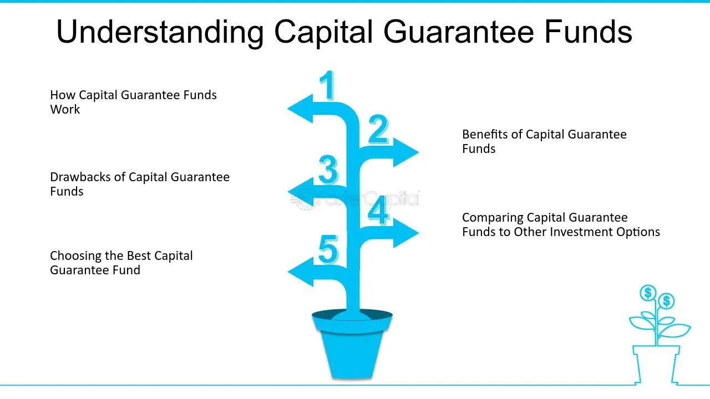

## Table of Contents

## What is a Capital Guarantee Fund?

A Capital Guarantee Fund is a type of investment fund that promises to return at least the initial amount of money that you invest, even if the investments the fund makes don't do well. This means that if you put $100 into the fund, you are guaranteed to get at least $100 back, no matter what happens to the investments inside the fund. This can make it a safer choice for people who want to invest but are worried about losing their money.

These funds usually invest in a mix of things like stocks, bonds, and other securities. To make sure they can return your initial investment, they often use special financial strategies or buy insurance. This protection comes at a cost, though, because the fees for these funds can be higher than for other types of funds. So, while they offer safety, they might not grow your money as much as riskier investments.

## What is the purpose of a Capital Guarantee Fund?

The main purpose of a Capital Guarantee Fund is to provide investors with a safe way to invest their money. When you put your money into this kind of fund, you know that you will get at least your original amount back, even if the investments the fund makes don't do well. This makes it a good choice for people who want to grow their money but are scared of losing it.

These funds work by investing in different things like stocks and bonds, but they also use special strategies or buy insurance to make sure they can return your initial investment. However, this safety comes with a cost. Capital Guarantee Funds often have higher fees than other funds, which means they might not make as much money for you as riskier investments. So, while they offer peace of mind, they might not be the best choice if you're looking for big returns.

## How does a Capital Guarantee Fund work?

A Capital Guarantee Fund works by promising to give you back at least the money you put in, even if the investments it makes don't do well. Imagine you put $100 into the fund. No matter what happens to the stocks, bonds, or other things the fund invests in, you will get at least $100 back when the fund ends. This makes it a safe choice for people who don't want to lose their money.

To make sure they can return your original investment, Capital Guarantee Funds use special financial tricks or buy insurance. This safety net means the fund might not make as much money as other, riskier investments. Also, these funds often charge higher fees to cover the cost of the guarantee. So, while they offer peace of mind, they might not be the best choice if you're looking to grow your money a lot.

## Who can benefit from a Capital Guarantee Fund?

People who want to keep their money safe but still want to invest can benefit from a Capital Guarantee Fund. If you're scared of losing your money in the stock market or other investments, these funds are a good choice. They promise to give you back at least the amount you put in, so you don't have to worry about losing everything.

These funds are also good for people who are new to investing. If you're just starting out and don't want to take big risks, a Capital Guarantee Fund can help you feel more comfortable. It's like a safety net that lets you try investing without the fear of losing your money. Just remember, while these funds are safe, they might not make you as much money as riskier investments because of the fees they charge.

## What are the typical sources of funding for a Capital Guarantee Fund?

Capital Guarantee Funds get their money from people who want to invest safely. These people, called investors, put their money into the fund hoping to make some profit but without the risk of losing their original investment. The fund uses this money to buy different kinds of investments, like stocks, bonds, and other securities, trying to grow the money over time.

To make sure they can give the investors their money back, Capital Guarantee Funds often use special financial tools or buy insurance. This means they might borrow money or use other strategies to protect the investments. The costs of these safety measures are usually covered by the fees the fund charges its investors. So, while the fund aims to grow the money, it also has to manage these costs to keep its promise of returning the original investment.

## How is the risk managed in a Capital Guarantee Fund?

In a Capital Guarantee Fund, risk is managed by using special financial tools and strategies. The fund might buy insurance or use something called derivatives to protect the money that investors put in. This means that even if the stocks or bonds the fund invests in go down in value, the fund can still pay back the original amount to the investors. It's like having a safety net that catches the money if it starts to fall.

These tools and strategies cost money, though. The fund has to pay for the insurance or the financial tools it uses, and these costs are usually covered by the fees that investors pay. So, while the fund works hard to keep the money safe, it might not make as much profit as other, riskier investments. But for people who want to keep their money safe, this trade-off can be worth it.

## What are the key components of a Capital Guarantee Fund?

A Capital Guarantee Fund has a few important parts that make it work. The main part is the promise to give back at least the money you put in, no matter how the investments do. This promise is what makes the fund safe for people who don't want to lose their money. To make this promise, the fund uses special financial tools or buys insurance to protect the investments. This means if the stocks or bonds the fund invests in go down, the fund can still pay you back your original amount.

Another important part is the money that comes from investors. People put their money into the fund hoping to make some profit but without the risk of losing their original investment. The fund then uses this money to buy different kinds of investments like stocks, bonds, and other securities. The fund also charges fees to cover the costs of the financial tools or insurance it uses. These fees can make the fund a bit more expensive than other investments, but they help keep the money safe.

## How do Capital Guarantee Funds differ from other financial protection mechanisms?

Capital Guarantee Funds are different from other financial protection mechanisms because they promise to give back at least the money you put in, no matter how the investments do. This makes them a safe choice for people who want to invest but are scared of losing their money. Other financial protection mechanisms, like insurance or annuities, might also offer some protection, but they work in different ways. For example, insurance might cover specific risks, like damage to your home, but it doesn't guarantee your investment will be safe. Annuities, on the other hand, might give you regular payments, but they don't always promise to return your original investment.

Another way Capital Guarantee Funds differ is in how they manage risk. They use special financial tools or buy insurance to protect the money that investors put in. This means if the stocks or bonds the fund invests in go down, the fund can still pay back the original amount. Other mechanisms, like stop-loss orders in stock trading, might help limit losses, but they don't guarantee you'll get all your money back. Also, Capital Guarantee Funds often charge higher fees to cover the cost of these safety measures, which is different from other protections that might have different costs or no costs at all.

## What are the legal and regulatory frameworks governing Capital Guarantee Funds?

Capital Guarantee Funds are governed by different laws and rules depending on the country they operate in. In many places, these funds need to follow strict rules set by financial authorities to make sure they can keep their promise of returning investors' money. For example, in the United States, the Securities and Exchange Commission (SEC) and the Financial Industry Regulatory Authority (FINRA) have rules that these funds must follow. These rules make sure the funds are honest about what they can do and how they manage risk. They also need to tell investors clearly about any risks and fees.

In Europe, Capital Guarantee Funds are regulated by the European Securities and Markets Authority (ESMA) and national regulators in each country. These rules are meant to protect investors by making sure the funds are managed well and can meet their promises. The funds have to show how they will guarantee the capital, often by using special financial tools or insurance. No matter where they are, these funds have to follow laws about how they can invest money, how they handle fees, and how they report to investors. This helps make sure the funds are safe and fair for everyone who puts money into them.

## How does the performance of a Capital Guarantee Fund get evaluated?

The performance of a Capital Guarantee Fund is evaluated by looking at how well it keeps its promise to return at least the money you put in. This means checking if the fund can pay back the original investment when it's supposed to. People also look at how much extra money the fund makes on top of the original amount. This extra money is called the return, and it's important because it shows how well the fund is doing compared to other investments.

Another way to evaluate the performance is by comparing the fund to other similar funds or to a benchmark, like a stock market index. This helps see if the fund is doing better or worse than other safe investments. People also pay attention to the fees the fund charges, because high fees can eat into the returns. So, even if the fund keeps its promise to return the original investment, if the fees are too high, it might not be a good choice compared to other options.

## What are the challenges and limitations of Capital Guarantee Funds?

One of the main challenges of Capital Guarantee Funds is their cost. These funds often charge higher fees to cover the cost of the special financial tools or insurance they use to protect your money. These higher fees can eat into the money the fund makes, so even if you get your original investment back, you might not make as much extra money as you would with other investments. This can make Capital Guarantee Funds less appealing if you're looking to grow your money a lot.

Another limitation is that these funds might not be as flexible as other investments. Because they need to make sure they can return your original investment, they can't take as many risks or invest in as many different things as other funds. This means they might miss out on some good investment opportunities that could make more money. Also, the promise of getting your money back might make you feel too safe, so you might not pay attention to how the fund is really doing or if it's the best choice for your money.

## What are the future trends and innovations in Capital Guarantee Funds?

In the future, Capital Guarantee Funds might see new ways to keep your money safe while trying to make more money. One trend could be using new technology like [artificial intelligence](/wiki/ai-artificial-intelligence) to pick the best investments. This could help the funds do better without taking more risks. Another trend might be new types of financial tools that help protect your money in different ways. These tools could be cheaper or work better than the ones used now, which could make the funds more appealing to more people.

Another change might be in how these funds are set up. Instead of just promising to return your original investment, some funds might offer different levels of protection. For example, you could choose a fund that promises to return 90% of your money instead of 100%, but it might charge lower fees or try to make more money. This could let you decide how much safety you want and how much risk you're willing to take. As people learn more about investing and want more choices, Capital Guarantee Funds might need to change to meet these new needs.

## What are Capital Guarantee Funds and how do they provide security through investment?

Capital guarantee funds offer an investment vehicle designed to preserve capital while providing exposure to potential returns. These funds are particularly appealing to risk-averse investors seeking security for their principal investment. The fundamental principle behind capital guarantee funds is the protection of the initial investment amount through a combination of safe investment strategies and financial instruments, such as derivatives.

### Investment Strategy and Composition

Capital guarantee funds predominantly invest in low-risk securities, such as government bonds or highly-rated corporate bonds, to ensure the safety of the principal. These securities form the core of the fund's portfolio, providing stability and predictable returns. To enhance returns and provide additional security, these funds often use derivatives. Derivatives, such as options and futures, allow fund managers to hedge against market [volatility](/wiki/volatility-trading-strategies) and potential losses or gain additional leverage to capture upside potential without exposing the fund to significant risk.

### Mechanism of Operation

The typical structure of a capital guarantee fund involves allocating a portion of the investment to low-risk, fixed-income securities that will cumulatively return the principal at maturity. The remaining portion may be invested in riskier assets or derivatives to generate potential upside. For instance, if a fund ensures a capital guarantee over a specific period, part of the capital would be allocated to bonds maturing at the end of this period, ensuring that principal returns are achieved.

An illustrative calculation can be shown for a hypothetical $1000 investment in a 5-year capital guarantee fund:

1. **Principal Allocation to Bonds**: If the current bond yields are 3%, the fund would calculate the present value needed to ensure $1000 in 5 years using the formula:
$$
   \text{PV} = \frac{\text{FV}}{(1 + r)^n}

$$
   where $\text{PV}$ is the present value, $\text{FV}$ is the future value ($1000), $r$ is the bond yield (0.03), and $n$ is the number of years (5).

2. **Calculation**:
$$
   \text{PV} = \frac{1000}{(1 + 0.03)^5} \approx 862.61

$$
   This means $862.61 would be allocated to bonds, and the rest towards riskier investments or derivatives.

3. **Optional Derivative Use**: The remaining $137.39 can be used for options or held in more volatile stocks to potentially capture additional returns. 

### Benefits and Trade-offs

One significant benefit of capital guarantee funds is the peace of mind they offer investors who prioritize principal protection over potentially higher returns. Additionally, these funds provide a structured investment strategy, often with a predefined duration, enhancing predictability.

However, the trade-off for such security is the potential for only moderate returns. The conservative investment strategy that underpins capital guarantee funds often means they cannot capture high market upside compared to non-guaranteed investment funds. Furthermore, there may be costs associated with the derivatives used to secure the principal, impacting the net returns.

### Practical Examples

An example includes funds that are structured as a zero-coupon bond with call options. The bond component safeguards the principal, while the options offer upside potential tied to an equity index. Over time, the guarantee ensures the repayment of the initial investment while providing a chance to earn additional profits if market conditions are favorable.

In summary, capital guarantee funds align well with investors looking for security in volatile markets. However, they should be carefully evaluated against the investor's financial goals and the current market environment to ensure they meet the individual’s investment objectives.

 to Algorithmic Trading

Algorithmic trading represents a transformative approach to executing trades in financial markets by leveraging sophisticated computer algorithms. These algorithms operate on predefined criteria, enabling trades to be executed with minimal human intervention and error. This method is particularly advantageous in volatile or fast-paced market environments, where speed and precision are critical.

At its core, [algorithmic trading](/wiki/algorithmic-trading) relies on a set of mathematical models and rules to determine trade execution. These models can analyze vast amounts of market data in real-time, identifying patterns and opportunities that might be invisible to human traders. The primary goal is to capitalize on market inefficiencies by executing trades at the optimal price and time.

The development of algorithmic trading can be traced back to the late 20th century, a period when technological advancements began to revolutionize financial markets. High-frequency trading ([HFT](/wiki/high-frequency-trading-strategies)), a subset of algorithmic trading, emerged around this time, characterized by extremely high-speed trade execution. Algorithms in HFT make decisions in microseconds, enabling traders to profit from price discrepancies across markets.

The impact of algorithmic trading on modern market strategies is profound. It has increased market [liquidity](/wiki/liquidity-risk-premium), narrowed bid-ask spreads, and enabled the execution of large orders without significantly impacting market prices. Moreover, it allows traders to implement complex strategies that account for multiple variables simultaneously.

Several types of algorithms are commonly employed in trading:
1. **Trend-following algorithms**: These algorithms identify and exploit trends in the market, buying securities in an uptrend and selling in a downtrend. They use technical indicators such as moving averages to signal trades.

2. **Arbitrage algorithms**: Designed to identify discrepancies in pricing across different markets or instruments, arbitrage algorithms execute trades to profit from these inefficiencies. A typical example is the simultaneous purchase and sale of an asset in different markets to exploit price differences.

3. **Market-making algorithms**: These algorithms provide liquidity to markets by continuously quoting buy and sell prices, earning the spread. They enable continuous trading and smooth out price volatility.

4. **Statistical arbitrage algorithms**: Employing quantitative models, these algorithms identify and exploit short-term mispricings based on statistical methods. A common strategy might involve pairs trading, where one buys a stock and shorts a highly correlated counterpart.

The advantages of algorithmic trading are manifold. By eliminating human emotions from trading, it reduces the risk of emotional decision-making, such as panic selling. Algorithms also facilitate [backtesting](/wiki/backtesting), allowing traders to evaluate strategies on historical data before live implementation. Furthermore, the scalability of algorithmic strategies enables traders to handle multiple assets and markets concurrently.

Despite its advantages, algorithmic trading is not without challenges. The reliance on technology means that system failures or errors in algorithm design can lead to significant losses. Additionally, the rapid execution of trades can exacerbate market volatility during times of stress.

In conclusion, algorithmic trading represents a paradigm shift in financial markets, offering enhanced efficiency, precision, and potential profitability for traders who skillfully harness its capabilities.

## References & Further Reading

[1]: De Prado, M. L. (2018). ["Advances in Financial Machine Learning"](https://www.amazon.com/Advances-Financial-Machine-Learning-Marcos/dp/1119482089). Wiley.

[2]: Chan, E. (2009). ["Quantitative Trading: How to Build Your Own Algorithmic Trading Business"](https://github.com/ftvision/quant_trading_echan_book). Wiley.

[3]: Aronson, D. R. (2006). ["Evidence-Based Technical Analysis: Applying the Scientific Method and Statistical Inference to Trading Signals"](https://www.amazon.com/Evidence-Based-Technical-Analysis-Scientific-Statistical/dp/0470008741). Wiley.

[4]: Jansen, S. (2018). ["Machine Learning for Algorithmic Trading: Second Edition"](https://github.com/stefan-jansen/machine-learning-for-trading). Packt Publishing.

[5]: Lintner, J. (1965). "The Valuation of Risk Assets and the Selection of Risky Investments in Stock Portfolios and Capital Budgets". *The Review of Economics and Statistics*, 47(1), 13-37.

[6]: Sharpe, W. F. (1964). "Capital Asset Prices: A Theory of Market Equilibrium under Conditions of Risk". *The Journal of Finance*, 19(3), 425-442.