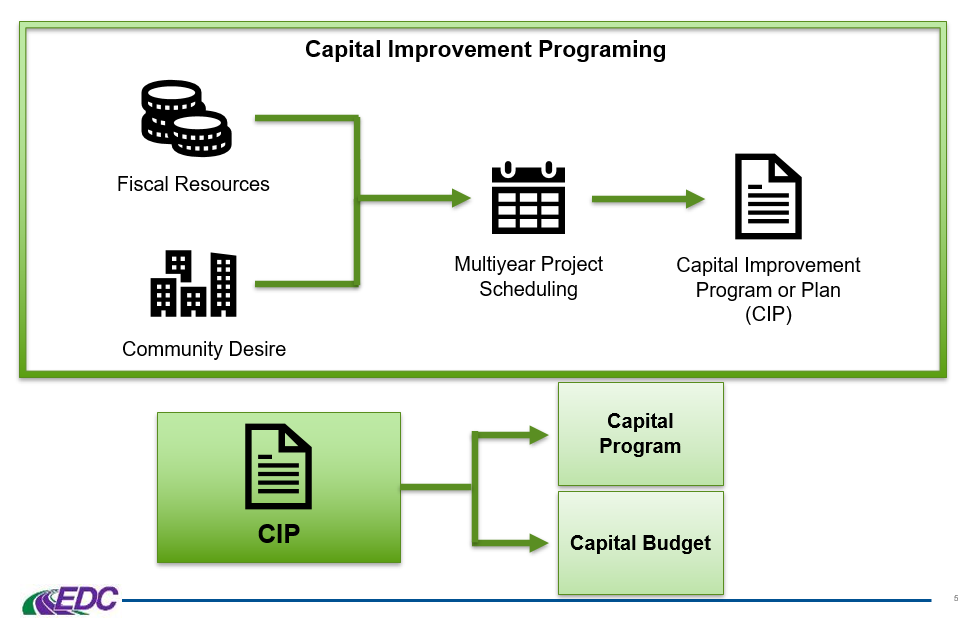

## Table of Contents

## What is a capital improvement?

A capital improvement is a big change or addition to a property that makes it last longer or worth more. This could be things like adding a new room, fixing the roof, or putting in a new heating system. These improvements are not just small fixes or regular upkeep; they are major projects that make the property better or more useful.

People often do capital improvements to their homes or businesses to increase their value or to make them more enjoyable to live or work in. For example, if someone adds a new kitchen to their house, it might make the house easier to sell for a higher price later. Businesses might do things like building a new parking lot to attract more customers. These improvements can also have tax benefits, as they can sometimes be deducted over time, which helps businesses and homeowners save money.

## Why are capital improvements important for a community or business?

Capital improvements are important for a community because they help make the place better for everyone who lives there. When a community puts money into things like fixing roads, building parks, or improving schools, it makes the area nicer and more enjoyable to live in. These improvements can also make the community more attractive to new people and businesses, which can help the local economy grow. People often feel prouder of their community when they see it getting better, and this can bring everyone closer together.

For a business, capital improvements are key to staying competitive and growing. When a business spends money on things like new equipment, expanding their building, or improving their technology, it can help them work better and serve their customers more effectively. These improvements can make the business more efficient, which can lead to higher profits. Plus, when a business shows it is investing in itself, it can attract more customers and even better employees, which is good for the long-term success of the company.

## How do capital improvements differ from regular maintenance?

Capital improvements are big changes or additions to a property that make it last longer or worth more. They are not just small fixes or regular upkeep. For example, adding a new room to a house or putting in a new heating system are capital improvements. These projects are major and often expensive, but they can increase the value of the property and make it more useful or enjoyable.

Regular maintenance, on the other hand, is the work done to keep a property in good shape. This includes things like painting walls, fixing leaky faucets, or mowing the lawn. These tasks are routine and necessary to prevent the property from getting worse over time. Unlike capital improvements, regular maintenance does not usually increase the value of the property; it just keeps it from going down.

In simple terms, capital improvements are like big upgrades that make a property better, while regular maintenance is like the everyday care that keeps it from falling apart. Both are important, but they serve different purposes and have different effects on the property's value and usefulness.

## What types of projects are typically considered capital improvements?

Capital improvements are big projects that make a property last longer or worth more. They are not just small fixes or regular upkeep. Some examples of capital improvements are adding a new room to a house, putting in a new roof, or installing a new heating system. These projects are major and often expensive, but they can increase the value of the property and make it more useful or enjoyable.

Another type of capital improvement is when a business builds a new parking lot or adds new equipment to their factory. These projects can help the business work better and serve their customers more effectively. They can also make the business more efficient, which can lead to higher profits. Capital improvements can also include things like building new roads or parks in a community, which can make the area nicer and more attractive to people and businesses.

In summary, capital improvements are big changes or additions to a property that make it better. They can be things like adding a new room to a house, building a new parking lot for a business, or improving public spaces in a community. These projects are different from regular maintenance because they are major and can increase the value and usefulness of the property.

## Who funds capital improvement projects?

Capital improvement projects are often funded by the people or groups who own the property. For a home, this means the homeowner pays for the project, like adding a new room or fixing the roof. For a business, the company uses its own money or might take out a loan to pay for things like new equipment or a bigger building. Sometimes, businesses can also get money from investors who believe in the project and want to help it happen.

Communities also fund capital improvements, but they usually use money from taxes or special funds set aside for these projects. For example, a city might use tax money to build a new park or fix the roads. Sometimes, communities can get help from the government, like grants or loans, to pay for big projects that will help everyone in the area. This way, everyone who lives in the community helps pay for the improvements, and everyone can enjoy the benefits.

## How are capital improvement projects prioritized?

Capital improvement projects are chosen based on what is most important and urgent for the community or business. For a community, leaders look at things like safety, how much people will use the new project, and how it will help the local economy. For example, fixing a dangerous road might be more important than building a new park. They also think about how much money they have and how the project will help everyone in the community. 

For a business, the focus is on what will help them make more money or work better. They might choose to buy new equipment if it will make their work faster or to expand their building if it means they can serve more customers. Businesses look at how much the project will cost and how quickly they will see benefits from it. Both communities and businesses have to balance what they need now with what they want to do in the future.

## What is the process for planning and implementing a capital improvement project?

Planning a capital improvement project starts with figuring out what needs to be done. People or groups who want to make the improvement first think about what will make the property better or more useful. They might talk to experts like architects or engineers to get ideas and plans. Then, they look at how much money they have and how much the project will cost. They might need to find more money by taking out a loan or getting help from the government. Once they know what they want to do and how they will pay for it, they make a detailed plan that includes a timeline and a budget.

After the planning is done, it's time to start the project. This means hiring workers and buying materials to do the work. The people in charge make sure everything is going according to the plan and that the work is being done right. They keep an eye on the budget to make sure they don't spend too much money. As the project goes on, they might need to make changes if something unexpected happens. When the work is finished, they check to make sure it was done well and that it meets all the rules and safety standards. Then, everyone can start enjoying the new improvement.

## How can the impact of capital improvements be measured?

The impact of capital improvements can be measured by looking at how they change the value of the property. For a home, this might mean seeing if the house sells for more money after the improvement is done. For a business, it could mean checking if the new equipment or bigger building helps them make more money. People can also look at how the improvement makes the place better to live or work in. For example, if a new park makes the neighborhood nicer, that's a good sign the improvement was worth it.

Another way to measure the impact is by looking at how the community or business feels about the improvement. Surveys or feedback from people who live or work there can show if they think the project was a good idea. If a lot of people use the new park or if workers say the new equipment makes their job easier, that's a positive sign. Over time, keeping track of things like how much the property is worth, how much money the business makes, and how happy people are can show if the capital improvement was a success.

## What are some common challenges faced during capital improvement projects?

Capital improvement projects often face challenges with money. These projects can be very expensive, and it can be hard to find enough money to pay for them. Sometimes, people have to take out loans or find other ways to get the money they need. If the cost of the project goes up while it's happening, it can be even harder to pay for everything. This can lead to delays or even stopping the project if the money runs out.

Another common challenge is dealing with unexpected problems. When people start working on a big project, they might find things they didn't know about before, like old pipes or bad foundations. These surprises can make the project take longer and cost more money. It can also be hard to keep everyone happy during the project. Neighbors or workers might not like the noise and mess, and it can be tough to explain why the project is important and how it will help in the end.

Keeping the project on track can also be tricky. It takes good planning and clear communication to make sure everyone knows what they are supposed to do and when. If something goes wrong or if the plan changes, it can be hard to adjust and keep moving forward. All these challenges can make capital improvement projects tough, but with careful planning and good teamwork, they can be overcome.

## How do regulations and compliance affect capital improvement projects?

Regulations and compliance can have a big impact on capital improvement projects. They are rules that people have to follow when they are working on a project. These rules can be about safety, the environment, or how buildings should be made. For example, if someone wants to add a new room to their house, they might need to follow rules about how strong the walls need to be or what kind of materials they can use. These rules are important because they help keep people safe and protect the environment, but they can also make the project more complicated and expensive. People might need to spend more time and money to make sure they are following all the rules.

Dealing with regulations and compliance can also slow down a project. Before starting work, people often need to get permits or approvals from the government. This can take a long time, and sometimes the government might say no to the project if it doesn't meet all the rules. If the project is already started and someone finds out it's not following the rules, they might have to stop working until they fix the problem. This can be frustrating and can make the project take longer and cost more money. Even though regulations and compliance can be challenging, they are important for making sure that capital improvement projects are done the right way.

## What role does technology play in modern capital improvement projects?

Technology plays a big role in making capital improvement projects easier and better. People use computers and special software to plan out the project before they start. This helps them see what the project will look like and figure out how much it will cost. They can also use technology to keep track of how the project is going, making sure everything is on time and on budget. For example, drones can take pictures from above to help people see the whole project and spot any problems.

Technology also helps with the actual work of the project. Machines like excavators and 3D printers can do the work faster and more accurately than people could by hand. This can save time and money, and it can also make the project safer because there's less chance of someone getting hurt. Plus, new technology can help make buildings and other improvements more energy-efficient, which is good for the environment and can save money in the long run.

## How can stakeholders be effectively engaged throughout a capital improvement project?

Engaging stakeholders effectively in a capital improvement project means keeping everyone who cares about the project involved and informed from start to finish. This includes homeowners, business owners, community members, and even workers on the project. One good way to do this is by having regular meetings where people can ask questions and give their ideas. It's important to listen to what everyone says and try to use their feedback to make the project better. By keeping everyone in the loop, people feel like they are part of the project and are more likely to support it.

Another way to engage stakeholders is by using clear and simple communication. This could mean sending out newsletters or emails to keep everyone updated on how the project is going. It's also helpful to have a website or a place where people can go to find information about the project anytime. When people understand what is happening and why it's important, they are more likely to be happy with the changes. Keeping stakeholders engaged helps make sure the project goes smoothly and that everyone can enjoy the benefits of the capital improvement when it's finished.

## How can one finance capital improvements?

Financing capital improvements is a strategic decision that significantly impacts the financial trajectory of a property investment. Cash reserves, loans, refinancing, and equity partnerships are common financial instruments utilized to support these enhancements.

Cash reserves offer the advantage of immediate [liquidity](/wiki/liquidity-risk-premium) without incurring debt, maintaining the investor’s credit standing. However, utilizing cash depletes reserves, potentially limiting future investment opportunities or emergency funds.

Loans are a prevalent choice, providing upfront capital in exchange for repayment with interest over time. Effective loan management requires understanding interest rates which are influenced by market conditions and creditworthiness. A lower [interest rate](/wiki/interest-rate-trading-strategies) reduces the cost of borrowing and enhances the project's financial viability.

Refinancing entails replacing an existing mortgage with a new one, possibly at a lower interest rate or extended term, thereby freeing up capital for improvements. The decision to refinance depends on current market rates compared to the existing mortgage terms and the timeline for return on investment.

Equity partnerships involve multiple parties investing capital, sharing both risks and rewards. This option diversifies financial exposure and brings in additional expertise and resources. Equity partnerships require careful structuring to ensure equitable profit sharing and governance.

The selection of a financing option should consider the scale of the capital improvement project, expected return on investment, and the current financial health of the company. A large-scale project may justify a loan or equity partnership, while smaller projects might be efficiently funded through reserves.

Budgeting and cost control are critical components in managing capital improvements. Establishing a detailed budget helps monitor expenses and avoid cost overruns. Implementing strong financial controls ensures that expenditures align with projected budgets, maintaining financial stability.

Financial planning for capital improvements is essential for long-term success. By calculating expected returns and assessing the payback period, an informed decision can be made regarding the viability of the project. For instance, the payback period approach evaluates the time required to recover the capital investment, facilitating comparison of multiple financing scenarios:

$$
\text{Payback Period} = \frac{\text{Initial Investment}}{\text{Annual Cash Inflows}}
$$

Ultimately, prudent financial planning enables businesses and individuals to leverage capital improvements effectively, enhancing property value and achieving strategic financial objectives.

## References & Further Reading

[1]: Bergstra, J., Bardenet, R., Bengio, Y., & Kégl, B. (2011). ["Algorithms for Hyper-Parameter Optimization."](https://papers.nips.cc/paper/4443-algorithms-for-hyper-parameter-optimization) Advances in Neural Information Processing Systems 24.

[2]: ["Advances in Financial Machine Learning"](https://www.amazon.com/Advances-Financial-Machine-Learning-Marcos/dp/1119482089) by Marcos Lopez de Prado

[3]: ["Evidence-Based Technical Analysis: Applying the Scientific Method and Statistical Inference to Trading Signals"](https://www.amazon.com/Evidence-Based-Technical-Analysis-Scientific-Statistical/dp/0470008741) by David Aronson

[4]: ["Machine Learning for Algorithmic Trading"](https://github.com/stefan-jansen/machine-learning-for-trading) by Stefan Jansen

[5]: ["Quantitative Trading: How to Build Your Own Algorithmic Trading Business"](https://www.amazon.com/Quantitative-Trading-Build-Algorithmic-Business/dp/1119800064) by Ernest P. Chan