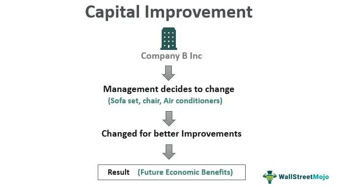

In the ever-evolving world of finance and technology, the combination of property enhancement, real estate investment, capital improvement, and algorithmic trading is creating new opportunities and strategies. Each of these domains influences modern investment approaches in unique ways, and understanding their interplay is crucial for optimizing outcomes.

Real estate remains a fundamental component of diversified investment portfolios. It provides a stable source of income, potential appreciation, and a hedge against inflation. Investors, both large and small, recognize the enduring value of real estate as an asset class. However, the landscape of real estate investment is changing, influenced by advancements in technology and innovative financial strategies.

Algorithmic trading, on the other hand, is dramatically shaping financial markets. By leveraging computer algorithms to execute trades based on predetermined criteria, this method allows for rapid and emotion-free investment decisions. The precision and speed of algorithmic trading have brought about a paradigm shift, enabling investors to refine their strategies, minimize risks, and capitalize on market opportunities more effectively.

Capital improvements represent a tangible means of enhancing property value. These involve making substantial upgrades or alterations to a property to increase its market worth, extend its lifespan, or adapt it for new uses. Such enhancements not only bolster property value but also offer possible tax advantages. Understanding the financial management of these investments, including how they are financed and accounted for, is essential for maximizing returns.

Technology plays a significant role in optimizing investment outcomes across these domains. Whether through data analytics, smart building technologies, or IoT-enabled systems, technological advancements are changing how properties are managed and evaluated. They also assist in making informed and strategic investment decisions based on real-time data and analytics.

Collectively, these elements represent a transformative approach to modern investments. By harnessing the synergies between property enhancement, real estate, capital improvements, and algorithmic trading, investors can achieve more sophisticated and adaptive investment strategies capable of thriving in an increasingly complex financial environment.

## Table of Contents

## Understanding Real Estate Investment

Real estate investment involves acquiring, holding, managing, and eventually selling properties to produce income and realize capital appreciation. This form of investment is a fundamental aspect of many diversified portfolios, offering several financial benefits.

Primarily, real estate can deliver a steady cash flow. Properties such as residential rentals or commercial facilities often produce regular rental income, providing investors with a consistent revenue stream. This income can offset property maintenance costs and mortgage payments, often resulting in net positive cash flow.

Another significant advantage is tax benefits. Real estate investors can leverage depreciation deductions, mortgage interest deductions, and other tax incentives to minimize taxable income. These tax advantages can significantly enhance the net return on investment.

Real estate is also considered a robust hedge against inflation. Historically, property values and rental income have tended to rise with or above inflation, preserving the investor's purchasing power. This characteristic makes real estate a strategic component in managing inflation risk within an investment portfolio.

The potential for asset appreciation is another compelling reason for investing in real estate. Over time, properties can increase in value due to factors like market demand, location developments, and capital improvements. This appreciation can lead to significant financial gains when the property is sold.

Investors are presented with a variety of real estate investment options. These include residential properties like single-family homes and multi-family apartments, commercial real estate such as office and retail spaces, industrial properties like warehouses, and retail properties. Each type has unique characteristics, returns, and risk profiles.

Investment approaches vary between direct ownership and Real Estate Investment Trusts (REITs). Direct ownership entails personally managing the property and bearing related responsibilities, which might appeal to those seeking control over their investments. Conversely, REITs offer a more liquid form of real estate investment akin to buying stocks, allowing investors to purchase shares in a real estate portfolio managed by professionals.

Despite its advantages, real estate investment comes with challenges. Market [volatility](/wiki/volatility-trading-strategies) can impact property values and rental income, affecting overall return on investment. Effective property management requires significant time and expertise. Investors must handle tenant relations, maintenance issues, and regulatory compliance. Additionally, financing hurdles can arise, especially during economic downturns when securing favorable loan terms becomes more difficult.

In summary, successful real estate investing demands a comprehensive understanding of property markets, careful management, and strategic financial planning. By balancing the potential benefits and inherent risks, investors can optimize their portfolios and capitalize on real estate's potential for steady income and capital appreciation.

## Capital Improvements: Enhancing Property Value

Capital improvements are significant alterations to a property that enhance its value, extend its useful life, or adapt it to new uses. Unlike regular maintenance or repairs, which are often recurring and aim to preserve the property's current condition, capital improvements involve substantial investments that result in material changes to the property.

### Examples of Capital Improvements

Typical examples of capital improvements include kitchen renovations, the addition of new rooms or extensions, and the upgrading of heating, ventilation, and air conditioning (HVAC) systems. Installing energy-efficient systems, such as solar panels or high-efficiency windows, also qualifies as a capital improvement, as these changes enhance the property's value and functionality.

### Financial and Tax Implications

Capital improvements have notable financial implications, particularly concerning taxation. By increasing the property's cost basis, capital improvements can reduce the capital gains tax liability at the time of sale. The cost basis is the original value of a property, adjusted for improvements, which is subtracted from the selling price to determine taxable capital gains. For example, if a property is purchased for $300,000 and $50,000 is spent on capital improvements, the new cost basis becomes $350,000. Upon selling the property for $500,000, the capital gain would be $150,000, rather than $200,000 if no improvements had been made.

### Distinguishing Capital Improvements from Repairs

It is essential to distinguish between capital improvements and regular repairs for accurate financial reporting and to maximize tax efficiency. Repairs are expenses incurred to maintain the property's existing conditions, such as fixing a leaky roof or repainting walls, and are typically deductible as business expenses in the year they occur. In contrast, capital improvements are capitalized and added to the property's basis rather than expensed immediately.

Accurate categorization of these expenses is crucial for property owners and investors seeking to optimize their financial and tax strategies. Understanding when an expenditure qualifies as a capital improvement can lead to more effective long-term asset management and financial planning.

## Financing Capital Improvements

Financing capital improvements is a strategic decision that significantly impacts the financial trajectory of a property investment. Cash reserves, loans, refinancing, and equity partnerships are common financial instruments utilized to support these enhancements.

Cash reserves offer the advantage of immediate [liquidity](/wiki/liquidity-risk-premium) without incurring debt, maintaining the investor’s credit standing. However, utilizing cash depletes reserves, potentially limiting future investment opportunities or emergency funds.

Loans are a prevalent choice, providing upfront capital in exchange for repayment with interest over time. Effective loan management requires understanding interest rates which are influenced by market conditions and creditworthiness. A lower [interest rate](/wiki/interest-rate-trading-strategies) reduces the cost of borrowing and enhances the project's financial viability.

Refinancing entails replacing an existing mortgage with a new one, possibly at a lower interest rate or extended term, thereby freeing up capital for improvements. The decision to refinance depends on current market rates compared to the existing mortgage terms and the timeline for return on investment.

Equity partnerships involve multiple parties investing capital, sharing both risks and rewards. This option diversifies financial exposure and brings in additional expertise and resources. Equity partnerships require careful structuring to ensure equitable profit sharing and governance.

The selection of a financing option should consider the scale of the capital improvement project, expected return on investment, and the current financial health of the company. A large-scale project may justify a loan or equity partnership, while smaller projects might be efficiently funded through reserves.

Budgeting and cost control are critical components in managing capital improvements. Establishing a detailed budget helps monitor expenses and avoid cost overruns. Implementing strong financial controls ensures that expenditures align with projected budgets, maintaining financial stability.

Financial planning for capital improvements is essential for long-term success. By calculating expected returns and assessing the payback period, an informed decision can be made regarding the viability of the project. For instance, the payback period approach evaluates the time required to recover the capital investment, facilitating comparison of multiple financing scenarios:

$$
\text{Payback Period} = \frac{\text{Initial Investment}}{\text{Annual Cash Inflows}}
$$

Ultimately, prudent financial planning enables businesses and individuals to leverage capital improvements effectively, enhancing property value and achieving strategic financial objectives.

## Algorithmic Trading in Real Estate Investments

Algorithmic trading employs advanced computer programs and sophisticated algorithms to automate the execution of trades, adhering to predefined criteria and strategies. This form of trading has gained traction in various financial markets, and its application to real estate investments is an emerging trend.

In real estate, [algorithmic trading](/wiki/algorithmic-trading) can optimize the timing of investment entries and exits by analyzing a multitude of factors such as market trends, liquidity patterns, and price movements. This analytical capability allows investors to identify optimum trade opportunities, potentially maximizing returns and minimizing risks. Algorithms can scour massive datasets within seconds, making them exceptionally efficient in capturing short-lived opportunities that may not be apparent through manual analysis.

Potential benefits of implementing algorithmic trading in real estate include increased operational efficiency and reduced emotional bias in decision-making processes. Automated systems can execute trades at high speed and precision, facilitating faster and more accurate responses to market conditions. This rapid execution helps investors capitalize on fluctuating market conditions, achieving gains that might have been missed otherwise.

Despite its advantages, algorithmic trading in real estate also faces significant challenges. Algorithm failure is a prominent risk, where errors in the trading code can lead to substantial financial losses. Additionally, the need for continuous monitoring and regular updates to the algorithms is critical to ensure accuracy and relevance to market dynamics. Furthermore, high-frequency trading can induce market volatility, necessitating robust risk management strategies.

Ultimately, algorithmic trading represents a valuable tool for enhancing decision-making and performance in real estate investments. However, the complexities and inherent risks require a careful balancing act. Successful implementation hinges on technological expertise, vigilant risk assessment, and adaptive strategies to navigate the multifaceted landscape of real estate trading.

## The Intersection of Tech and Real Estate

PropTech innovations are significantly impacting the real estate industry by integrating advanced technology into everyday property management operations and tenant interactions. These technological enhancements are not only redefining tenant experiences but are also streamlining property management processes, ultimately leading to increased operational efficiency and property value.

Smart building management systems utilize advanced software to automate and optimize building operations such as lighting, heating, ventilation, and security. By leveraging algorithms and IoT (Internet of Things) technology, property managers can monitor and control these systems in real-time, leading to reduced energy consumption and lower operational costs. For instance, IoT-enabled devices can collect and analyze data on usage patterns, enabling predictive maintenance and efficient resource allocation.

Energy-efficient technologies are becoming standard features in contemporary real estate investments. Modern buildings are increasingly incorporating renewable energy sources such as solar panels and energy-efficient HVAC systems. These technologies not only reduce environmental impact but also enhance the sustainability profile of the property, making it more attractive to environmentally conscious investors and tenants.

The integration of IoT-enabled amenities in residential and commercial properties is further enhancing tenant experiences. These amenities may include smart home devices, wireless internet, and app-controlled access systems, which provide tenants with convenience and personalization options. A connected network of devices allows seamless communication and enhances security, thereby increasing tenant satisfaction and retention rates.

Moreover, tech-driven solutions are transforming property investment decisions by enabling data-driven analysis. Advanced analytical tools harness large sets of property data, including market trends, tenant demographics, and financial performance. This data assists investors in making informed decisions about property acquisition, development, and management. By utilizing big data analytics, investors can more accurately predict investment returns and identify market opportunities.

In summary, technology is playing an integral role in optimizing asset management in the real estate sector. The adoption of smart systems and energy-efficient technologies is enhancing property value, while data-driven strategies are enabling more precise investment decisions. As PropTech continues to evolve, it is set to further revolutionize the industry, promoting enhanced efficiency and sustainability.

## Tips for Successful Integration

Aligning real estate strategies with technological advances is crucial for maximizing returns on investment. It begins with integrating innovative technologies such as Smart Building Systems, which can drastically enhance property value and operational efficiency. Tools like IoT-enabled devices offer detailed insights into energy consumption and maintenance needs, allowing landlords to reduce costs and improve tenant experiences.

Engaging in detailed market research and trend analysis is essential for identifying profitable investment opportunities. Investors can leverage data analytics platforms to parse large datasets, recognizing patterns and forecasting future trends. This quantitative approach helps in making informed decisions, especially in selecting optimal property types, locations, and timing for investment.

Diversity in investment portfolios remains a sound strategy to mitigate risks and capture growth across various real estate sectors. A mix of residential, commercial, and industrial properties can balance portfolio risks. For instance, the residential sector might remain stable during economic downturns, while commercial properties can provide high-income yields during economic booms. Utilizing algorithmic trading strategies further aids in monitoring and adjusting the portfolio dynamically in response to real-time market conditions.

Embracing sustainable and eco-friendly practices increasingly attracts modern investors and tenants. Properties with energy-efficient upgrades, such as solar panels or high-performance HVAC systems, not only reduce operational costs but also align with growing environmental consciousness among consumers. Green certifications typically increase property desirability and can command premium prices, thereby enhancing overall investment returns. 

Lastly, staying informed about technological and environmental standards fosters the ability to anticipate shifts in market expectations, enabling proactive adjustments to investment strategies for sustained growth and resilience.

## Conclusion

The convergence of property enhancement, real estate investment, capital improvement, and algorithmic trading is reshaping the landscape of modern investment strategies. This amalgamation offers a comprehensive and dynamic approach that enables investors to optimize their portfolios for improved financial outcomes. By effectively understanding and applying the principles inherent in each of these domains, investors can unlock unique opportunities and diversify their investment strategies for maximum returns.

To optimize investment outcomes, a multifaceted approach involving robust property enhancement and strategic real estate investments, coupled with the precision of algorithmic trading, is essential. Property enhancements through capital improvements not only increase market value but also contribute to sustainability and tenant satisfaction, further bolstering investment returns. On the other hand, algorithmic trading provides tools for making swift and informed decisions, reducing human bias, and enhancing market efficiency.

The dynamic nature of these investment strategies necessitates an ongoing commitment to learning and adaptation. As technology continues to evolve, staying informed about the latest advancements in property technology (PropTech) and trading algorithms becomes crucial. Investors who remain agile and open to incorporating innovative techniques are more likely to navigate the complexities of the real estate market successfully.

Ultimately, the strategic integration of these elements serves as a transformative catalyst in achieving long-term financial growth. Investors who leverage the synergy between property improvement, real estate acumen, and algorithmic precision are better positioned to capitalize on emerging trends and adapt to shifts within the financial landscape. As the market continues to evolve, the ability to integrate these aspects effectively will prove indispensable in driving sustainable investment success.

## References & Further Reading

[1]: Bergstra, J., Bardenet, R., Bengio, Y., & Kégl, B. (2011). ["Algorithms for Hyper-Parameter Optimization."](https://papers.nips.cc/paper/4443-algorithms-for-hyper-parameter-optimization) Advances in Neural Information Processing Systems 24.

[2]: ["Advances in Financial Machine Learning"](https://www.amazon.com/Advances-Financial-Machine-Learning-Marcos/dp/1119482089) by Marcos Lopez de Prado

[3]: ["Evidence-Based Technical Analysis: Applying the Scientific Method and Statistical Inference to Trading Signals"](https://www.amazon.com/Evidence-Based-Technical-Analysis-Scientific-Statistical/dp/0470008741) by David Aronson

[4]: ["Machine Learning for Algorithmic Trading"](https://github.com/stefan-jansen/machine-learning-for-trading) by Stefan Jansen

[5]: ["Quantitative Trading: How to Build Your Own Algorithmic Trading Business"](https://www.amazon.com/Quantitative-Trading-Build-Algorithmic-Business/dp/1119800064) by Ernest P. Chan