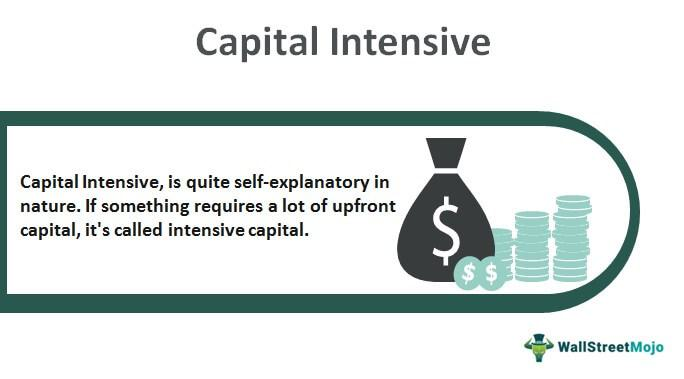

In today's dynamic economic environment, understanding capital-intensive businesses is crucial for investors, economists, and entrepreneurs. These industries demand significant investment in fixed assets, such as property, plant, and equipment, to produce goods or services. As a result, they are pivotal in shaping global economic dynamics. Capital-intensive industries include sectors like automobile manufacturing, oil production, and telecommunications, which require extensive investment to maintain and enhance production capabilities. The importance of these industries is underscored by their substantial contribution to GDP, technological advancements, and employment generation.

Economic measurements related to capital-intensive industries are vital for evaluating their performance and sustainability. Investors and business strategists benefit from understanding metrics such as the capital expenditure-to-sales ratio and asset turnover ratio. These metrics provide insights into how efficiently companies employ their capital assets to generate revenue and optimize operational efficiencies. Furthermore, comparing capital and labor expenses helps gauge a company's reliance on physical assets versus human resources, informing decisions on resource allocation and investment strategies.

Algorithmic trading has become an integral part of modern financial markets, especially in capital-intensive sectors characterized by high volume and volatility. Through algorithmic trading, financial markets can respond quickly to economic data from these sectors, enhancing the capabilities of investors to make informed decisions. The integration of economic data into trading algorithms enables the mitigation of risks and identification of opportunities in rapidly changing market conditions.

Overall, the exploration of capital-intensive industries, economic measurements, and their interplay with algorithmic trading provides valuable insights for various stakeholders. Understanding these dynamics is essential for optimizing resource allocation, improving financial performance, and sustaining competitive advantage in a tech-driven economic landscape.

## Table of Contents

## What is a Capital-Intensive Business?

A capital-intensive business is characterized by the substantial investment required in fixed assets such as property, plant, and equipment (PP&E) to produce goods or services. These businesses rely heavily on these physical assets, making the initial and ongoing investment costs high. The core of a capital-intensive enterprise is its dependence on these long-lasting assets to generate revenue, necessitating significant capital for establishment and expansion. 

Industries such as automobile manufacturing, oil production, and telecommunications are prime examples of capital-intensive sectors. Automobile manufacturers invest heavily in machinery, robotics, and manufacturing plants, while oil companies require expensive exploration and drilling equipment. Telecommunications companies spend vast amounts on network infrastructure, including towers and cables, to provide continuous service.

The high investment in PP&E leads to substantial depreciation costs for businesses in capital-intensive industries. Depreciation, the process of allocating the cost of tangible assets over their useful lives, is a significant expense that affects a company's financial statements. Such companies must regularly upgrade and replace equipment to maintain competitiveness, driving the need for constant reinvestment.

To contextualize, let's consider an automobile manufacturer. High capital expenditure upfront for assembly lines and robotic systems depreciates over time, reducing taxable income, but also necessitates cash outflows to ensure technological relevance and efficiency. The following formula represents the annual depreciation expense for a capital asset:
$$

\text{Depreciation Expense} = \frac{\text{Initial Cost} - \text{Residual Value}}{\text{Useful Life}} 
$$
where the Initial Cost is the purchase price of the asset, the Residual Value is the expected value at the end of its useful life, and Useful Life is the duration the asset is expected to be productive.

Furthermore, these businesses need strategic financial planning to manage the high fixed costs associated with capital investments. The capital-intensive nature of businesses directly impacts their risk profile and operational flexibility, requiring diligent asset management to maximize returns.

## Economic Measurement of Capital Intensity

Capital intensity is a critical metric used to assess how a company utilizes its capital to generate revenue. The primary measure of capital intensity is the Capital Expenditure to Sales ratio (CapEx to Sales), which shows the proportion of sales generated per unit of capital expenditure. This ratio is calculated as follows:

$$
\text{CapEx to Sales Ratio} = \frac{\text{Capital Expenditures}}{\text{Total Sales}}
$$

A high CapEx to Sales ratio indicates that a company needs substantial investment to produce its sales, characteristic of capital-intensive industries. Conversely, a low ratio may suggest efficient utilization of capital or a less capital-demanding business model.

Another important metric is the Asset Turnover Ratio, which measures how efficiently a company uses its assets to generate sales. The formula is:

$$
\text{Asset Turnover Ratio} = \frac{\text{Net Sales}}{\text{Average Total Assets}}
$$

A higher asset turnover ratio indicates better efficiency, meaning the company can generate more sales per dollar of asset invested. In capital-intensive businesses, maintaining a favorable asset turnover ratio is crucial as it reflects their capability to use substantial and essential fixed assets effectively.

Additionally, comparing capital expenses to labor expenses provides insight into a business's reliance on physical assets versus human resources. This comparison is important for identifying whether the company invests more in capital assets like machinery and infrastructure or in labor. The Capital to Labor expense ratio can be represented as:

$$
\text{Capital to Labor Expense Ratio} = \frac{\text{Total Capital Expenses}}{\text{Total Labor Expenses}}
$$

A higher ratio signifies a greater reliance on capital assets, typical of industries like manufacturing and telecommunications. Conversely, a lower ratio indicates a more labor-intensive operation, which is often seen in sectors such as services or hospitality.

Understanding these ratios helps stakeholders analyze how effectively companies balance their investments between capital and labor, with implications for cost management, efficiency, and strategic planning. These metrics not only assist in assessing current performance but also in forecasting future capital and operational requirements, ultimately influencing investment decisions and competitive strategy.

## Examples of Capital-Intensive Industries

Capital-intensive industries are characterized by their significant requirement for heavy financial investments in fixed assets and infrastructure to maintain operations. These industries often necessitate substantial initial capital outlay, continuous technological advancements, and regular maintenance and upgrades. Notable among these sectors are energy, telecommunications, and manufacturing, each presenting unique challenges and opportunities.

The energy sector stands as a quintessential example of a capital-intensive industry. Companies like ExxonMobil and Chevron invest heavily in exploration, extraction, refining, and distribution infrastructure. The high costs associated with these activities, including the development of oil rigs and refineries, make capital deployment a critical aspect of their business strategy. Furthermore, the sector faces strategic challenges, such as fluctuating commodity prices, shifting regulatory environments, and the drive toward renewable energy sources. As a result, energy companies must balance substantial upfront investments with ongoing operating costs while navigating environmental, social, and governance ([ESG](/wiki/esg-investing)) factors. 

In telecommunications, the constant demand for technological innovation dictates substantial capital investments. Companies like AT&T and Verizon need to deploy extensive network infrastructure, from fiber-optic cables to cellular towers, to maintain competitive service offerings. The sector's challenges include the rapid pace of technological evolution, which necessitates frequent upgrades and expansions, and regulatory scrutiny. However, the proliferation of mobile internet and the advent of 5G technology present lucrative opportunities for growth and expansion.

Manufacturing, another prominent capital-intensive industry, often involves substantial investments in facilities, machinery, and equipment necessary for production processes. Boeing, a key player in the aerospace manufacturing sector, allocates significant capital resources toward research and development, as well as production facilities for complex aircraft manufacturing. The strategic challenges confronting this industry include fluctuating demand cycles, supply chain disruptions, and stringent safety and quality standards. Nevertheless, innovation and automation offer avenues for improving operational efficiencies and reducing long-term costs.

In conclusion, capital-intensive industries are pivotal to global economic structures, necessitating substantial financial commitment and strategic dexterity to navigate their intrinsic challenges. Companies operating within these sectors are required to adopt robust capital management practices while remaining agile to adapt to technological advancements and market shifts.

## Algo Trading in Capital-Intensive Markets

Algorithmic trading, often referred to as algo trading, is the use of computer programs and algorithms to execute trading strategies at speeds and frequencies that are beyond human capabilities. This approach has become increasingly significant in modern financial markets due to its ability to process vast amounts of data efficiently and execute trades at optimal prices.

Capital-intensive industries, characterized by high levels of investment in physical assets, exhibit substantial volumes and [volatility](/wiki/volatility-trading-strategies)—ideal conditions for deploying [algorithmic trading](/wiki/algorithmic-trading). The high transaction volumes in sectors such as energy, telecommunications, and manufacturing present opportunities for traders to profit from small price changes. Algo trading leverages these conditions by utilizing strategies such as statistical [arbitrage](/wiki/arbitrage), [momentum](/wiki/momentum) trading, and mean reversion, allowing traders to capitalize on market inefficiencies.

Economic data from capital-intensive sectors plays a crucial role in shaping trading algorithms. This data includes key performance indicators like production volumes, capital expenditures, and profit margins, which can influence asset prices and market sentiment. For instance, fluctuations in oil production or announcements of new infrastructure investments in the telecommunications sector can create price movements that algorithms can exploit.

Moreover, algo trading systems can be programmed to react to economic indicators and news releases pertinent to capital-intensive industries. For example, a trader might implement a strategy that automatically buys energy stocks when oil supply reports suggest potential future scarcity. This integration of economic data into trading strategies underscores the symbiotic relationship between capital-intensive industries and algorithmic trading.

In conclusion, the interplay between capital-intensive markets and algorithmic trading is significant and multifaceted. By harnessing high-frequency trading and utilising economic data, algo trading not only enhances market efficiency but also provides traders with a competitive edge in navigating the complexities of these sectors.

## Impact of Capital Intensity on Business Performance

Capital intensity, characterized by substantial initial investments in fixed assets such as machinery, property, and technology, plays a vital role in business performance, particularly in capital-intensive industries. This intensity influences various aspects of a business, especially its profitability and risk profile during economic downturns.

### Profitability and Risk During Economic Downturns

In capital-intensive sectors, profitability often hinges on the efficient utilization of fixed assets. These industries tend to have high fixed costs due to the extensive investment in physical assets, which means they are more affected by fluctuations in demand. During economic downturns, when consumer spending and industrial activities decrease, these businesses might struggle to cover their fixed costs due to reduced revenues. Consequently, capital intensity can increase the risk of losses during such periods, necessitating robust risk management strategies.

One key aspect is the depreciation of fixed assets, which is a significant non-cash expense impacting profitability. High depreciation costs, while reducing taxable income, also reflect the spreading of initial investments over time. In economic slowdowns, companies that cannot effectively manage this depreciation may see a pronounced dip in profits.

### Financial Leverage and Capital Assets Management

Companies in capital-intensive industries often use financial leverage as a tool to finance their sizeable capital requirements. Leverage involves using borrowed capital to enhance potential returns on investment. However, this approach comes with heightened financial risk, particularly in volatile markets. Managing this leverage involves balancing the cost of debt with the expected returns from investments in capital assets. 

A common financial metric used is the **Debt-to-Equity Ratio (D/E)**, which measures the relative proportion of shareholders' equity and debt used to finance a company’s assets:
$$
D/E = \frac{\text{Total Liabilities}}{\text{Shareholders' Equity}}
$$
A high D/E ratio suggests more leverage and, therefore, higher risk, underscoring the necessity for prudent financial management.

### Strategies for Maintaining Competitiveness

Successful capital-intensive businesses deploy several strategic approaches to maintain competitiveness, even during economic downturns. 

1. **Operational Efficiency:** These businesses focus on maximizing the use of their capital assets. Techniques such as Lean Manufacturing and Six Sigma help optimize processes, reducing waste and increasing productivity.

2. **Technology Adoption:** Investing in technology, such as automation and AI, can streamline operations and reduce long-term costs. Although the initial investment might be high, technology can offer significant returns through increased efficiency and reduced labor costs.

3. **Diversification:** Companies often diversify their product lines or market reach to mitigate the risks associated with dependence on a single revenue stream. Diversification can provide buffer revenue streams when core areas are underperforming.

4. **Cost Management:** Stringent cost control measures, including negotiating better terms with suppliers and optimizing supply chains, can help maintain profitability during tough economic times.

5. **Flexible Financing:** Establishing diverse and flexible financing arrangements, such as revolving credit facilities or securing long-term debt at fixed interest rates, can provide financial stability, allowing the business to endure market downturns.

By understanding how capital intensity impacts business performance and implementing strategic measures, capital-intensive firms can not only survive but also thrive in the face of economic challenges.

## Conclusion

Capital-intensive industries play a pivotal role in the economy, driving growth and shaping financial markets. These sectors, characterized by the substantial investment required in physical assets, often set the economic rhythms due to their significant contributions to gross domestic product, employment, and technological advancements. They act as bellwethers in financial markets, where their capital deployment strategies influence investment flows and risk assessments.

Understanding the metrics associated with capital-intensive businesses is essential for investors and business strategists. Key indicators such as capital expenditure, asset turnover ratios, and the balance between capital and labor costs provide insights into a company's operational efficiency and financial health. For instance, a robust capital expenditure to sales ratio can signal a company's commitment to sustaining long-term growth, while a high asset turnover ratio indicates effective utilization of assets to generate revenue. These metrics help investors assess potential returns and strategists to devise informed operational and financial plans.

In a tech-driven era, the strategies for deploying capital in these industries are evolving. Emerging technologies like [artificial intelligence](/wiki/ai-artificial-intelligence), IoT, and blockchain are transforming asset management and operational efficiencies. Companies are increasingly adopting advanced analytics and real-time data monitoring to optimize production processes, reduce costs, and enhance investment performance. Automation and digitalization provide opportunities for improving speed and accuracy in capital deployment, helping businesses remain competitive in a rapidly changing global market.

Moreover, capital-intensive sectors must navigate regulatory landscapes while integrating sustainable practices to meet environmental and social governance criteria. The dynamic nature of technology and global economic policies demands adaptability and foresight in capital management strategies. As industries adapt, capital intensity will continue to challenge traditional business models, pushing for innovation in financing and strategic planning.

In conclusion, capital-intensive industries are not just foundational to economic structure but also influential in financial market trends. Understanding their metrics is crucial for economic stakeholders, while adapting to technological advancements ensures sustainable and competitive business operations in the future.

## References & Further Reading

[1]: ["The Lean Six Sigma Pocket Toolbook: A Quick Reference Guide to Nearly 100 Tools for Improving Quality and Speed"](https://www.amazon.com/Lean-Six-Sigma-Pocket-Toolbook/dp/0071441190) by Michael L. George

[2]: ["Capital in the Twenty-First Century"](https://www.hup.harvard.edu/books/9780674430006) by Thomas Piketty

[3]: Campion, A., & Neuhuaser, H. (2007). ["Analyzing the Impact of Algorithmic Trading on Markets."](https://www.semanticscholar.org/paper/Assessing-the-Impact-of-Algorithmic-Trading-on-A-Gsell/820fa261b451f5b57decf4f8ccf526247fcbc2ff) Financial Management Association Annual Meeting.

[4]: ["Finance and the Good Society"](https://press.princeton.edu/books/hardcover/9780691154886/finance-and-the-good-society) by Robert J. Shiller

[5]: ["High-Frequency Trading: A Practical Guide to Algorithmic Strategies and Trading Systems"](https://www.ahmetbeyefendi.com/wp-content/uploads/2020/07/High-Frequency-Trading-Irene-Aldridge.pdf) by Irene Aldridge

[6]: Tobin, J. (1969). ["A General Equilibrium Approach To Monetary Theory."](https://mail.tku.edu.tw/niehcc/paper/T(1969-jmcb).pdf) Journal of Money, Credit and Banking, 1(1), 15-29.

[7]: ["Principles of Corporate Finance"](https://info.mheducation.com/rs/128-SJW-347/images/bre80948_fm_i-xxx.pdf) by Richard A. Brealey, Stewart C. Myers, and Franklin Allen