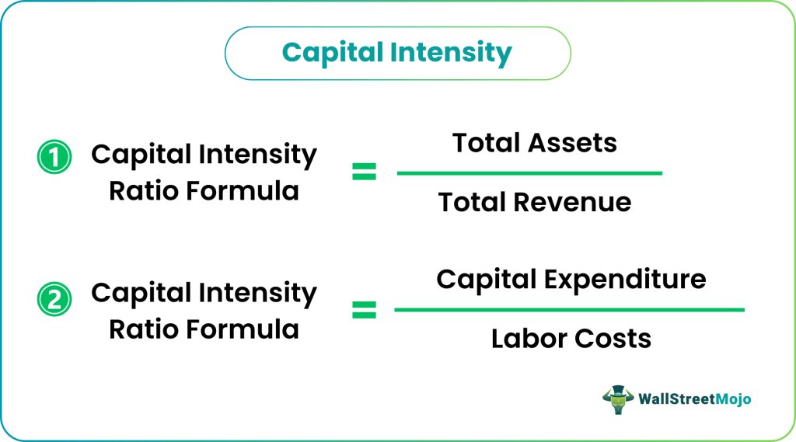

## Table of Contents

## What is capital intensity?

Capital intensity refers to how much money a business needs to spend on assets like buildings, machines, and equipment to generate revenue. If a company has high capital intensity, it means they need to invest a lot in these assets to operate and make money. For example, a car factory would be considered capital intensive because it needs a lot of expensive machinery to produce cars.

On the other hand, a business with low capital intensity doesn't need to spend as much on these types of assets. A consulting firm, for instance, mainly relies on the skills and time of its employees rather than heavy machinery or buildings. Understanding capital intensity helps businesses plan their investments and manage their finances better.

## How is capital intensity measured?

Capital intensity is measured by looking at the ratio of a company's total assets to its total sales or revenue. This ratio shows how much money the company needs to spend on things like buildings and machines to make one dollar of sales. If the ratio is high, it means the company is capital intensive, because it needs a lot of money tied up in assets to generate sales.

For example, if a company has total assets worth $10 million and total sales of $5 million, the capital intensity ratio would be 2. This means the company needs $2 in assets to generate $1 in sales. This simple calculation helps business owners and investors understand how much money they need to invest in assets to keep the business running and growing.

## Why is capital intensity important for businesses?

Capital intensity is important for businesses because it shows how much money they need to spend on things like buildings and machines to make money. If a business needs a lot of these things, it is called capital intensive. This can affect how much money the business can make. If a business has to spend a lot on these things, it might not have as much money left over for other important things, like paying employees or growing the business.

Understanding capital intensity helps business owners plan better. They can see if they need to borrow money to buy more machines or if they can grow their business without spending too much. It also helps them know if their business is the kind that needs a lot of money to start or keep running. This can be really helpful when deciding if a new business idea is worth trying or if they should stick with what they are already doing.

## Can you give examples of industries with high capital intensity?

Some industries that need a lot of money to spend on buildings and machines are oil and gas, and manufacturing. In the oil and gas industry, companies need to spend a lot of money on drilling rigs, pipelines, and refineries to get oil out of the ground and turn it into something useful like gasoline. This makes it a very capital intensive industry because they need a lot of expensive equipment to make money.

Manufacturing is another industry with high capital intensity. Companies that make cars, airplanes, or heavy machinery need big factories filled with machines that can cost millions of dollars. These machines help them make a lot of products quickly, but they also need a lot of money to buy and maintain. So, these companies have to be careful about how they spend their money because they need so much of it just to keep their factories running.

## What are the differences between capital intensity and labor intensity?

Capital intensity and labor intensity are two ways to look at how a business makes money. Capital intensity is about how much money a business needs to spend on things like buildings and machines to make money. If a business needs a lot of these things, it is called capital intensive. For example, a car factory needs a lot of expensive machines to make cars, so it is capital intensive.

Labor intensity, on the other hand, is about how much a business relies on people to make money. If a business needs a lot of workers to do its work, it is called labor intensive. For example, a restaurant needs a lot of cooks and servers to make and serve food, so it is labor intensive. The main difference is that capital intensive businesses spend more money on machines and buildings, while labor intensive businesses spend more money on paying workers.

## How does capital intensity affect a company's financial performance?

Capital intensity can have a big impact on a company's financial performance. If a company is very capital intensive, it means they need to spend a lot of money on things like buildings and machines to make money. This can make it harder for the company to make a profit because they have to pay for these expensive things before they can start making money from selling their products. If the company can't make enough money to cover these costs, they might have to borrow money, which can lead to more financial problems if they can't pay it back.

On the other hand, if a company can use its capital intensive assets well, it can lead to good financial performance. For example, if a car factory uses its machines to make a lot of cars quickly and cheaply, they can sell more cars and make more money. This can help the company make a profit and grow. But it's important for the company to keep an eye on how much they are spending on these assets and make sure they are using them in the best way possible to keep their financial performance strong.

## What strategies can companies use to manage high capital intensity?

Companies can manage high capital intensity by carefully planning their investments in buildings and machines. They need to make sure they are spending their money wisely on assets that will help them make more money. One way to do this is by using their machines and equipment as much as possible to get the most out of them. They can also look for ways to make their machines work better or last longer, so they don't have to buy new ones as often.

Another strategy is to lease or rent equipment instead of buying it. This can save money because the company doesn't have to pay a big amount all at once. Leasing can also help the company keep up with new technology without having to buy new machines every time something better comes out. By using these strategies, companies can handle the high costs of being capital intensive and still make a profit.

## How does capital intensity influence investment decisions?

Capital intensity affects how a business makes choices about where to put its money. If a company needs a lot of buildings and machines to make money, it is called capital intensive. This means they need to think carefully about buying new equipment or building new factories. They need to make sure that the money they spend on these things will help them make more money in the future. If they spend too much and can't make enough money to cover the costs, they might have to borrow money, which can be risky.

On the other hand, if a company is not very capital intensive, they might have more freedom to invest in other areas like hiring more people or trying new business ideas. They can also choose to spend money on things that will help them grow faster, like marketing or research and development. Understanding how much money they need to spend on buildings and machines helps them make better choices about where to put their money to grow their business and make more profit.

## What are the risks associated with high capital intensity?

High capital intensity means a business needs to spend a lot of money on things like buildings and machines to make money. This can be risky because if the business can't make enough money to pay for these expensive things, they might have to borrow money. Borrowing money can be dangerous because if the business can't pay it back, they could get into big financial trouble. Also, if the machines or buildings break down or become outdated, the business might have to spend even more money to fix or replace them, which can hurt their profits.

Another risk is that the business might not be able to change quickly if something unexpected happens. For example, if there is a new technology that makes their machines less useful, or if there is a big drop in demand for their products, they might be stuck with a lot of expensive equipment they can't use. This can make it hard for the business to adapt and stay competitive. So, businesses with high capital intensity need to be very careful about how they spend their money and plan for the future.

## How does capital intensity vary across different economic cycles?

Capital intensity can change during different economic cycles. When the economy is doing well, businesses might feel more confident about spending money on big things like buildings and machines. They think they can make more money with these investments because people are buying more stuff. So, during good economic times, businesses might increase their capital intensity, spending more on assets to grow and make more profits.

But when the economy is not doing well, businesses might be more careful about spending money on big things. They might worry that they won't be able to make enough money to pay for these expensive assets if people are not buying as much. So, during bad economic times, businesses might try to lower their capital intensity, focusing on using what they already have or finding cheaper ways to operate until the economy gets better.

## What role does technological advancement play in changing capital intensity?

Technological advancement can change how much money a business needs to spend on buildings and machines, which is called capital intensity. New technology can make machines work better or last longer, which means businesses might need to spend less money to make the same amount of products. For example, if a new machine can make more cars in less time, a car factory might not need as many machines as before. This can lower the capital intensity because the business doesn't need to spend as much money on equipment.

On the other hand, new technology can also make businesses more capital intensive. If a new machine is very expensive but can do a lot more than the old ones, businesses might need to spend more money to stay competitive. For example, if a new type of computer is much faster and can help a business make more money, they might need to buy these expensive computers. So, technological advancement can either increase or decrease capital intensity depending on how businesses use the new technology.

## How can companies optimize their capital intensity to improve competitiveness?

Companies can optimize their capital intensity to improve competitiveness by making smart choices about how they spend money on buildings and machines. If they can use their machines and equipment more efficiently, they can make more products without spending more money. For example, a factory could run its machines for more hours each day or find ways to make them work faster. By doing this, the company can get more out of what they already have, which can help them make more money and stay competitive.

Another way to optimize capital intensity is by choosing the right technology. If new machines can help the company make more products or make them cheaper, it might be worth spending money on them, even if they are expensive. But the company needs to be careful and make sure the new technology will really help them make more money. By balancing the costs of new technology with the benefits it brings, companies can keep their capital intensity at a level that helps them stay competitive in the market.

## What is the Economic Measurement of Capital Intensity?

Capital intensity is a critical metric used to assess how a company utilizes its capital to generate revenue. The primary measure of capital intensity is the Capital Expenditure to Sales ratio (CapEx to Sales), which shows the proportion of sales generated per unit of capital expenditure. This ratio is calculated as follows:

$$
\text{CapEx to Sales Ratio} = \frac{\text{Capital Expenditures}}{\text{Total Sales}}
$$

A high CapEx to Sales ratio indicates that a company needs substantial investment to produce its sales, characteristic of capital-intensive industries. Conversely, a low ratio may suggest efficient utilization of capital or a less capital-demanding business model.

Another important metric is the Asset Turnover Ratio, which measures how efficiently a company uses its assets to generate sales. The formula is:

$$
\text{Asset Turnover Ratio} = \frac{\text{Net Sales}}{\text{Average Total Assets}}
$$

A higher asset turnover ratio indicates better efficiency, meaning the company can generate more sales per dollar of asset invested. In capital-intensive businesses, maintaining a favorable asset turnover ratio is crucial as it reflects their capability to use substantial and essential fixed assets effectively.

Additionally, comparing capital expenses to labor expenses provides insight into a business's reliance on physical assets versus human resources. This comparison is important for identifying whether the company invests more in capital assets like machinery and infrastructure or in labor. The Capital to Labor expense ratio can be represented as:

$$
\text{Capital to Labor Expense Ratio} = \frac{\text{Total Capital Expenses}}{\text{Total Labor Expenses}}
$$

A higher ratio signifies a greater reliance on capital assets, typical of industries like manufacturing and telecommunications. Conversely, a lower ratio indicates a more labor-intensive operation, which is often seen in sectors such as services or hospitality.

Understanding these ratios helps stakeholders analyze how effectively companies balance their investments between capital and labor, with implications for cost management, efficiency, and strategic planning. These metrics not only assist in assessing current performance but also in forecasting future capital and operational requirements, ultimately influencing investment decisions and competitive strategy.

## References & Further Reading

[1]: ["The Lean Six Sigma Pocket Toolbook: A Quick Reference Guide to Nearly 100 Tools for Improving Quality and Speed"](https://www.amazon.com/Lean-Six-Sigma-Pocket-Toolbook/dp/0071441190) by Michael L. George

[2]: ["Capital in the Twenty-First Century"](https://www.hup.harvard.edu/books/9780674430006) by Thomas Piketty

[3]: Campion, A., & Neuhuaser, H. (2007). ["Analyzing the Impact of Algorithmic Trading on Markets."](https://www.semanticscholar.org/paper/Assessing-the-Impact-of-Algorithmic-Trading-on-A-Gsell/820fa261b451f5b57decf4f8ccf526247fcbc2ff) Financial Management Association Annual Meeting.

[4]: ["Finance and the Good Society"](https://press.princeton.edu/books/hardcover/9780691154886/finance-and-the-good-society) by Robert J. Shiller

[5]: ["High-Frequency Trading: A Practical Guide to Algorithmic Strategies and Trading Systems"](https://www.ahmetbeyefendi.com/wp-content/uploads/2020/07/High-Frequency-Trading-Irene-Aldridge.pdf) by Irene Aldridge

[6]: Tobin, J. (1969). ["A General Equilibrium Approach To Monetary Theory."](https://mail.tku.edu.tw/niehcc/paper/T(1969-jmcb).pdf) Journal of Money, Credit and Banking, 1(1), 15-29.

[7]: ["Principles of Corporate Finance"](https://info.mheducation.com/rs/128-SJW-347/images/bre80948_fm_i-xxx.pdf) by Richard A. Brealey, Stewart C. Myers, and Franklin Allen