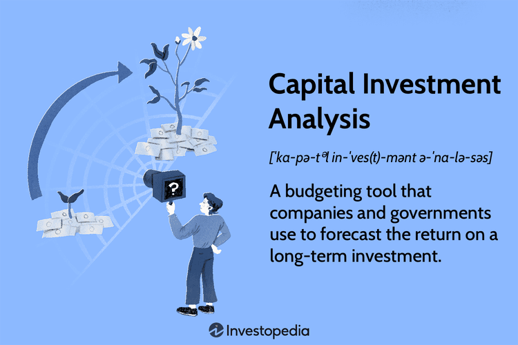

In the evolving world of finance, making informed investment decisions is more complex and diverse than ever. The rapid advancement of technology, coupled with a broader range of financial instruments, has significantly transformed the financial landscape. Investors are now presented with a myriad of options, making it imperative to possess a comprehensive understanding of available tools and strategies to optimize portfolio performance.

This article will explore key investment techniques, highlight the importance of thorough investment analysis, introduce capital investment strategies, and examine the innovative domain of algorithmic trading. By dissecting these elements, investors can gain insights into the intricacies of modern investing and equip themselves with the knowledge necessary to navigate volatile markets.



Investment techniques encompass a wide array of strategies, each with unique risks and rewards. Investors must craft personalized strategies that align with their specific financial goals and risk tolerance. Similarly, investment analysis serves as a crucial component in assessing the potential value and risks associated with different financial instruments. Methods such as fundamental and technical analysis are instrumental in formulating strategies that respond to dynamic market conditions and personal financial objectives.

Capital investment strategies focus on long-term asset acquisitions like real estate or technology, aimed at boosting business capacity or efficiency. Understanding mechanisms such as Net Present Value (NPV) and Discounted Cash Flow (DCF) is critical in evaluating these investments and ensuring maximum returns.

Algorithmic trading represents the cutting-edge future of finance, leveraging computer algorithms to execute trades based on predefined criteria. It allows for the fast processing of large datasets, enabling trades to be executed at unprecedented speeds and efficiencies. Popular strategies within this domain include high-frequency trading, trend-following, and statistical arbitrage.

By understanding and integrating investment techniques, analysis, capital investments, and algorithmic trading, investors can enhance decision-making processes and optimize their financial returns. This comprehensive guide aims to demystify these concepts and illustrate their interconnections, empowering investors to leverage modern finance's evolving tools and opportunities.

## Table of Contents

## Investment Techniques: A Foundation for Success

Investment techniques form an integral part of successful investing, offering a wide array of strategies that cater to different investor preferences and goals. The primary investment instruments include stocks, bonds, Exchange-Traded Funds (ETFs), and options. Each of these has distinct characteristics and risk-reward profiles, necessitating that investors align their strategies with personal financial objectives.

Stocks represent ownership in a company and provide investors with a share of the corporate profits in the form of dividends. The potential for capital appreciation makes stocks an attractive long-term investment, though they are often accompanied by higher [volatility](/wiki/volatility-trading-strategies) and risk. Historical data suggests that while stocks may experience short-term fluctuations, they generally offer superior returns compared to other asset classes over extended periods. 

Bonds are fixed-income investments where an investor loans money to an entity, typically a corporation or government, in exchange for periodic interest payments and the return of the bond's face value upon maturity. Bonds are generally regarded as less risky than stocks but offer lower returns. However, incorporating bonds into a portfolio can provide stability and regular income, particularly for risk-averse investors or those approaching retirement.

Exchange-Traded Funds (ETFs) are investment funds traded on stock exchanges, much like stocks. They hold a diversified portfolio of assets, such as stocks, bonds, commodities, or a combination thereof. ETFs offer investors an efficient way to achieve diversification with potentially lower costs and greater flexibility than mutual funds. Given their [liquidity](/wiki/liquidity-risk-premium) and ability to track various indexes, ETFs are popular among investors seeking exposure to specific sectors or regions.

Options are financial derivatives that provide the right, but not the obligation, to buy or sell an underlying asset at a predetermined price before a specified expiration date. Options can be used to hedge risk or speculate on market direction. They require a sophisticated understanding of market dynamics and can multiply gains; however, they can also lead to substantial losses if not managed accurately. 

Diversification, a fundamental principle of investing, involves spreading investments across different asset classes to reduce risk. By understanding and employing various investment techniques, investors can better manage risk and enhance their potential for returns. For instance, a well-diversified portfolio might blend the growth potential of stocks with the stability of bonds, the diversification advantages of ETFs, and the strategic opportunities presented by options.

Successful investment requires a careful assessment of one’s risk tolerance, investment goals, and market conditions. By tailoring strategies around these factors, investors can position themselves to optimize portfolio outcomes. Recognizing and leveraging the strengths and limitations of each investment technique allows for a balanced approach to building and maintaining a resilient investment portfolio.

## The Role of Investment Analysis in Decision Making

Investment analysis is a crucial process for assessing the potential value and inherent risks associated with different investment opportunities. By evaluating both quantitative and qualitative information, investment analysis provides investors with insights necessary for making informed decisions. Two primary methods often utilized in investment analysis are [fundamental analysis](/wiki/fundamental-analysis) and technical analysis.

Fundamental analysis involves examining a company's financial statements, management structure, competitive advantages, market conditions, and macroeconomic factors. This type of analysis aims to estimate an asset's intrinsic value by looking at data from financial reports such as income statements, balance sheets, and cash flow statements. Key ratios such as the Price-to-Earnings (P/E) ratio, Return on Equity (ROE), and Debt-to-Equity ratio are often used to evaluate a company's financial health. Additionally, fundamental analysis considers larger economic indicators, such as interest rates, GDP growth rates, and employment [statistics](/wiki/bayesian-statistics), which can significantly impact investment performance.

On the other hand, technical analysis focuses on predicting the future price movements of an asset by analyzing historical trading activity and statistical trends. This method relies on charts and patterns to identify signals and trends in the investment's price behavior. Common tools used in technical analysis include moving averages, relative strength index (RSI), and Bollinger bands. These tools help investors understand market sentiment and investor behavior, allowing them to make short-term investment decisions.

Both fundamental and technical analyses play integral roles in crafting investment strategies that align with market conditions and individual financial goals. Combining these methods can offer a comprehensive perspective, as fundamental analysis can highlight the long-term value of an asset, while technical analysis provides insights into short-term price movements.

To further enhance investment strategies, investors can utilize advanced computational tools and programming languages, such as Python, to perform quantitative analysis. By using libraries like NumPy and Pandas, investors can analyze large datasets and apply complex algorithms to improve the accuracy of their predictions. Below is a simple Python code snippet demonstrating how one might calculate a moving average, commonly used in technical analysis:

```python
import pandas as pd

# Sample data
data = {'price': [100, 102, 101, 105, 107, 110, 111]}
df = pd.DataFrame(data)

# Calculate moving average
window_size = 3
df['moving_average'] = df['price'].rolling(window=window_size).mean()

print(df)
```

Investment analysis supports investors in navigating the complexities of the financial markets, ultimately guiding them towards achieving their personal financial objectives. By understanding and applying these analytical methods, investors can optimize their portfolios and enhance their decision-making processes.

## Understanding Capital Investment Strategies

Capital investment refers to the commitment of substantial long-term resources in assets such as real estate, equipment, or technology. These investments are crucial for businesses aiming to expand their capacity, improve efficiency, or maintain a competitive edge. To achieve these objectives, understanding and implementing effective capital investment strategies is essential.

Evaluating potential capital investments requires thorough analysis to ensure that the expected returns justify the investment's size and risk. The two primary methods used in this analysis are Net Present Value (NPV) and Discounted Cash Flow (DCF).

### Net Present Value (NPV)

Net Present Value is a fundamental concept in capital investment analysis. NPV calculates the difference between the present value of cash inflows and the present value of cash outflows over a period of time. This method helps in determining the profitability of an investment.

The NPV is computed using the formula:

$$

NPV = \sum_{t=0}^{n} \frac{C_t}{(1 + r)^t} 
$$

where:
- $C_t$ is the net cash flow at time $t$,
- $r$ is the discount rate,
- $n$ is the total number of periods.

A positive NPV indicates that the projected earnings (adjusted for time and risk) exceed the anticipated costs, thus deeming the investment potentially lucrative.

### Discounted Cash Flow (DCF)

Discounted Cash Flow analysis is a method used to estimate the value of an investment based on its expected future cash flows. The DCF method involves forecasting the cash flows over the investment's life and discounting them back to their present value using a discount rate.

The DCF formula is similar to NPV:

$$

DCF = \sum_{t=0}^{n} \frac{CF_t}{(1 + i)^t}
$$

where:
- $CF_t$ represents the cash flow at each time period $t$,
- $i$ is the discount rate,
- $n$ is the number of periods.

DCF is instrumental in assessing whether an investment will generate enough revenue to meet or exceed the initial outlay and the required rate of return.

Understanding these methods enables investors and businesses to make informed decisions about which projects to undertake, ensuring resources are allocated efficiently and effectively. By carefully analyzing potential investments using NPV and DCF, stakeholders can better predict outcomes and tailor investment strategies to align with their financial goals.

## Algorithmic Trading: The Future of Finance

Algorithmic trading, often referred to as algo trading, represents a significant shift in the financial industry's approach to buying and selling securities. At its core, [algorithmic trading](/wiki/algorithmic-trading) leverages computer algorithms to execute trades based on specified criteria, allowing for a highly systematic approach that minimizes human intervention. This approach enables the processing of substantial volumes of data and the execution of trades at speeds that are unattainable by human traders alone.

The efficiency of algorithmic trading lies in its ability to handle complex calculations and analyze vast datasets quickly. Traders can set predefined rules for trade entries and exits, such as timing, price, or quantity, and these rules can encompass intricate mathematical models or strategies based on statistics, economics, and financial criteria.

One of the prominent strategies within algorithmic trading is high-frequency trading ([HFT](/wiki/high-frequency-trading-strategies)). HFT involves executing a large number of orders at extremely high speeds. This method capitalizes on very short-term market inefficiencies and often relies on powerful computing to process high volumes of orders placed across multiple markets and platforms in fractions of a second. The sheer speed and scale of HFT can lead to both significant profits and systemic risks, sparking ongoing debates and regulatory scrutiny.

Trend-following is another common strategy employed in algorithmic trading. It is based on the principle that markets have a propensity to move in trends, whether upward or downward. Traders program algorithms to identify and follow these trends, entering or exiting positions based on trend indicators. The approach does not attempt to predict market directions but instead follows the direction of a current trend, relying on moving averages, [momentum](/wiki/momentum) indicators, or channel breakouts.

Statistical [arbitrage](/wiki/arbitrage), or stat arb, represents a sophisticated algorithmic strategy that utilizes mathematical models to identify and exploit pricing inefficiencies between securities. The strategy typically involves the simultaneous buying and selling of assets to capitalize on discrepancies in their prices. Algorithms can swiftly process complex calculations and historical data to identify patterns or co-integrated pairs, thereby executing trades when statistical models suggest high probability opportunities for profit.

The combination of algorithmic strategies and their inherent ability to manage vast data sets positions algorithmic trading as a transformative force in finance. As technology advances, the capability to refine algorithms and enhance their predictive power continues to grow, offering traders and financial institutions innovative tools to optimize trading performance and mitigate risks. The ongoing evolution in this sector highlights its potential to redefine traditional trading paradigms, making it a crucial component in the future landscape of finance.

## Connecting Capital Investment and Algorithmic Trading

In recent years, the integration of algorithmic trading strategies in capital investment processes has shown promising potential for optimizing asset management and profitability. Algorithmic trading, which utilizes computer algorithms to execute trades based on predetermined criteria, offers precision and speed in handling large volumes of data and transactions. When combined with capital investment strategies, it presents a powerful synergy capable of transforming traditional investment approaches into sophisticated, data-driven models.

One of the main benefits of merging capital investments and algorithmic trading is the ability to perform comprehensive quantitative analysis. This approach helps investors assess risks more accurately and forecast financial outcomes with greater confidence. For instance, by applying predictive analytics, algorithms can evaluate historical data to identify patterns that may indicate future market behavior, thus enhancing decision-making processes for capital investments.

Moreover, advanced algorithmic trading techniques such as high-frequency trading (HFT) can significantly influence capital investment outcomes. HFT strategies operate by executing a large number of orders at extremely high speeds, thereby capitalizing on minute price discrepancies in the market. This rapid execution capability can optimize the timing of capital investments, ensuring they are made under optimal market conditions and thus potentially increasing returns.

Python language offers an effective platform for implementing these strategies due to its robustness and the availability of powerful libraries, such as NumPy for numerical operations and Pandas for data manipulation. For example, Python scripts can be developed to calculate the Net Present Value (NPV) of a proposed investment by using real-time market data processed by algorithms to provide instant feedback on the viability of an investment.

Consider the following simple Python code illustrating how algorithmic trading can assist in evaluating an investment's NPV:

```python
import numpy as np

# Example cash inflows and outflows over time
cash_flows = [-100000, 30000, 40000, 30000, 50000]

# Discount rate
discount_rate = 0.1

# Calculating the NPV
npv = np.npv(discount_rate, cash_flows)

print(f"The Net Present Value of the investment is: ${npv:.2f}")
```

This code enables investors to quickly recompute NPV under various discount rates or cash flow scenarios, reflecting the dynamic nature of market conditions facilitated by algorithmic inputs.

Furthermore, the use of [statistical arbitrage](/wiki/statistical-arbitrage) within the algorithmic trading domain allows investors to execute strategies that exploit price inefficiencies between related security pricing. This is essential for capital investments as it ensures the acquisition of assets at the most advantageous prices.

By integrating algorithmic trading with capital investment decisions, investors can harness a blend of speed, data analytics, and precise execution, thus positioning themselves to capitalize on emerging market trends and enhance portfolio performance. This synergy not only supports better risk management but also aligns investment strategies with technological advancements that continue to define the modern financial landscape.

## Conclusion

Investment techniques, analysis, capital investments, and algorithmic trading are integral components that drive the complex and dynamic world of modern finance. These elements not only stand alone in their significance but also intertwine to create a robust framework for investors aiming to enhance their decision-making capabilities and optimize returns. Understanding these aspects provides investors with a comprehensive toolkit to navigate diverse financial environments and adapt their strategies accordingly.

Investment techniques, whether involving stocks, bonds, ETFs, or options, offer diverse avenues for portfolio diversification and risk management. By mastering these techniques, investors can tailor their strategies to achieve specific financial goals and manage their risk exposure effectively.

Investment analysis plays a pivotal role in evaluating the potential risks and returns associated with different investment options. Through fundamental and technical analysis, investors can interpret market signals, evaluate company performance, and align their strategies with both macroeconomic conditions and personal financial objectives.

Capital investment strategies, focused on long-term asset commitments, are crucial for enhancing business capacity and operational efficiency. Using valuation methods like Net Present Value (NPV) and Discounted Cash Flow (DCF), investors can assess the profitability of significant investments and make informed decisions that align with their broader financial goals.

Moreover, the advent of algorithmic trading represents a transformative shift in the financial landscape. By employing sophisticated algorithms to analyze market data and execute trades at unprecedented speeds, investors can capitalize on market trends and arbitrage opportunities with enhanced precision and efficiency.

The integration of these components — investment techniques, analysis, capital investments, and algorithmic trading — empowers investors to leverage quantitative analysis tools for superior asset management and risk assessment. As technology continues to advance, it continually reshapes the trading landscape, presenting limitless opportunities for strategic adaptation and learning. Those who embrace and harness these evolving technologies can significantly enhance their financial outcomes and sustain competitive advantages in the increasingly complex world of finance.

## References & Further Reading

[1]: Bergstra, J., Bardenet, R., Bengio, Y., & Kégl, B. (2011). ["Algorithms for Hyper-Parameter Optimization."](https://dl.acm.org/doi/10.5555/2986459.2986743) Advances in Neural Information Processing Systems 24.

[2]: ["Advances in Financial Machine Learning"](https://www.amazon.com/Advances-Financial-Machine-Learning-Marcos/dp/1119482089) by Marcos Lopez de Prado

[3]: ["Evidence-Based Technical Analysis: Applying the Scientific Method and Statistical Inference to Trading Signals"](https://www.amazon.com/Evidence-Based-Technical-Analysis-Scientific-Statistical/dp/0470008741) by David Aronson

[4]: ["Machine Learning for Algorithmic Trading"](https://github.com/stefan-jansen/machine-learning-for-trading) by Stefan Jansen

[5]: ["Quantitative Trading: How to Build Your Own Algorithmic Trading Business"](https://www.amazon.com/Quantitative-Trading-Build-Algorithmic-Business/dp/1119800064) by Ernest P. Chan