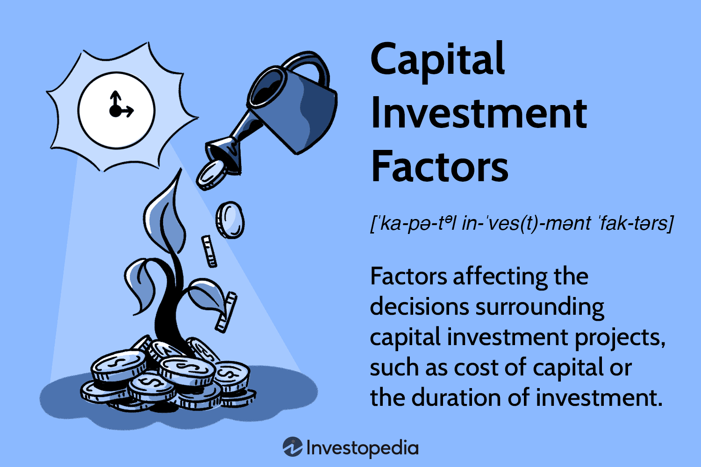

## Table of Contents

## What is capital investment?

Capital investment is when a business spends money to buy long-term assets that will help it grow or make more money in the future. These assets can be things like buildings, machinery, or even technology that the business will use for a long time. The idea is that by spending money now, the business will be able to make more money later.

For example, a company might buy a new factory to make more products. This is a capital investment because the factory will help the company produce more goods and earn more money over time. It's different from spending money on things like office supplies or employee salaries, which are used up quickly and don't help the business grow in the same way.

## Why is capital investment important for businesses?

Capital investment is important for businesses because it helps them grow and make more money in the future. When a business buys things like new machines or buildings, it can make more products or offer new services. This can lead to more sales and bigger profits. For example, if a bakery buys a new oven, it can bake more bread and sell more to customers. This means the bakery can earn more money over time.

Also, capital investment can help a business stay competitive. If a company doesn't invest in new technology or equipment, it might fall behind other businesses that do. For instance, if a car company doesn't update its factories, it might not be able to make cars as efficiently as its competitors. By investing in new equipment, the company can keep up with or even surpass its rivals. This helps the business stay strong and successful in the long run.

## What are the different types of capital investments?

Capital investments can be split into two main types: tangible and intangible. Tangible investments are things you can touch, like buildings, machinery, vehicles, and equipment. For example, a restaurant might buy new kitchen appliances to cook food faster and better. These are important because they help a business make more products or provide better services. Intangible investments are things you can't touch, like patents, trademarks, and software. A tech company might buy a patent to protect a new invention, which can help them make money without worrying about competitors copying their idea.

Another type of capital investment is in human capital. This means spending money on training and education for employees to make them better at their jobs. For example, a company might pay for its workers to go to a workshop to learn new skills. This can help the business because smarter and more skilled employees can work more efficiently and come up with new ideas.

Lastly, there are financial capital investments, like buying stocks or bonds. These are different because they don't directly help a business make more products or services, but they can still help the business grow by earning more money. For example, a company might invest in stocks to earn extra income, which they can then use to buy new equipment or expand their business.

## How do businesses evaluate potential capital investments?

Businesses use different ways to decide if a capital investment is a good idea. One common way is to look at the payback period, which is how long it will take to earn back the money they spent on the investment. If it takes too long, the business might not want to make the investment. Another way is to calculate the return on investment (ROI), which shows how much profit the investment will make compared to how much it costs. If the ROI is high, the investment is probably worth it. Businesses also use net present value (NPV) to figure out if the future money they will make from the investment is worth more than what they spend now, after considering the time value of money.

Another method is the internal rate of return (IRR), which helps businesses see if an investment will earn more than they could get from other investments. If the IRR is higher than the cost of borrowing money or other investment options, the investment is likely a good choice. Businesses also consider qualitative factors, like how the investment will affect their reputation or employee morale. For example, investing in eco-friendly technology might not make a lot of money right away, but it could make customers and employees happier, which is good for the business in the long run. By looking at all these factors, businesses can make smart choices about where to spend their money.

## What are the key factors influencing capital investment decisions?

Businesses look at many things when deciding on capital investments. One big thing they consider is the cost of the investment and how much money it might make back. They use tools like payback period, return on investment (ROI), net present value (NPV), and internal rate of return (IRR) to figure this out. If the investment will make back the money quickly and earn a good profit, it's more likely to happen. But if it takes too long to earn back the money or the profit is low, the business might decide not to invest.

Another important factor is the risk involved. Businesses think about how safe the investment is and what could go wrong. For example, if a new machine might break down a lot, it's a riskier investment. They also consider the economy and what their competitors are doing. If the economy is doing well, it might be a good time to invest. But if other businesses are doing the same thing, it might not give them an advantage. So, businesses need to weigh the risks and rewards carefully.

Lastly, businesses also think about other things that are hard to measure, like how the investment will affect their reputation or employee happiness. For instance, investing in eco-friendly technology might not make a lot of money right away, but it can make customers and employees feel good about the company. These qualitative factors can be just as important as the financial ones when making a capital investment decision. By looking at all these things together, businesses can make smart choices about where to spend their money.

## How does the cost of capital affect investment decisions?

The cost of capital is really important when businesses decide where to spend their money. It's like the price a business has to pay to get money, either by borrowing it or using their own money. If the cost of capital is high, it means the business has to pay a lot to get the money they need for investments. So, they will be more careful and only choose investments that can make enough money to cover this high cost. On the other hand, if the cost of capital is low, it's cheaper for the business to get money. This makes it easier for them to say yes to more investments because they don't have to earn as much to make it worth it.

When businesses look at potential investments, they compare the expected returns of the investment to the cost of capital. If the investment is expected to make more money than the cost of capital, it's a good choice. But if the investment won't make enough money to cover the cost of capital, the business might decide not to go ahead with it. This helps them make sure they're using their money wisely and not spending on things that won't help them grow or make more money in the long run.

## What role does risk assessment play in capital investment?

Risk assessment is a big part of deciding on capital investments. When businesses think about spending money on things like new machines or buildings, they need to look at what could go wrong. They think about things like if the new machine might break down a lot, or if the market might change and make the investment not as good as they thought. By understanding these risks, businesses can decide if the investment is worth it. If the risks are too high and the possible rewards are not big enough, they might choose not to invest.

Businesses use different ways to figure out risk. They might look at past data to see how similar investments worked out before. They also think about the economy and what their competitors are doing. If the economy is not doing well, it might be riskier to invest. Also, if other businesses are doing the same thing, it might not give them an advantage. By looking at all these things, businesses can make smarter choices about where to spend their money, making sure they are not taking on too much risk for the possible rewards.

## How can financial metrics like ROI and NPV guide capital investment?

Financial metrics like Return on Investment (ROI) and Net Present Value (NPV) help businesses decide if a capital investment is a good idea. ROI shows how much profit an investment will make compared to how much it costs. If a business sees that an investment has a high ROI, it means the investment will likely make a lot of money back. This makes the business more likely to go ahead with the investment. On the other hand, if the ROI is low, the business might think the investment is not worth it because it won't make enough money.

NPV is another important metric that looks at the future money a business will make from an investment and compares it to what they spend now. NPV takes into account the time value of money, which means money today is worth more than the same amount in the future. If the NPV of an investment is positive, it means the investment is expected to make more money than it costs, even after considering the time value of money. This makes the investment a good choice. But if the NPV is negative, the investment might not be worth it because the future earnings won't cover the initial cost. By using ROI and NPV, businesses can make smart choices about where to spend their money.

## What are the common challenges faced in capital investment planning?

One common challenge in capital investment planning is figuring out how much risk to take. Businesses have to guess what might happen in the future, like if the economy will do well or if new technology will change their industry. If they guess wrong, they might lose a lot of money. Another challenge is getting enough money to invest. Sometimes, borrowing money can be expensive, especially if the cost of capital is high. This makes it hard for businesses to decide if an investment is worth it, because they have to make sure they can earn enough to pay back the money they borrowed.

Another challenge is choosing the right investments. There are so many options, and businesses have to decide which ones will make the most money. They use tools like ROI and NPV to help them decide, but these tools are not perfect. Sometimes, things that are hard to measure, like how an investment will affect the company's reputation or employee happiness, can be just as important as the financial numbers. Balancing all these factors can be really tough, and businesses have to be careful to make the best choices for their future.

## How do macroeconomic factors impact capital investment strategies?

Macroeconomic factors like interest rates, inflation, and economic growth can really change how businesses decide to spend their money on capital investments. When interest rates are low, it's cheaper for businesses to borrow money, so they might be more willing to invest in new projects. But if interest rates are high, borrowing money becomes expensive, and businesses might decide to wait or not invest at all. Inflation also matters because it can make the cost of buying new things go up. If businesses think prices will keep going up, they might want to invest now before things get even more expensive. And when the economy is growing, businesses feel more confident about making big investments because they think they'll be able to sell more products and make more money.

On the other hand, if the economy is not doing well, businesses might be more careful with their money. During a recession, for example, businesses might not want to take big risks because they're worried about losing money. They might choose to wait until things get better before making big investments. Also, what's happening in the global economy can affect businesses too. If there's a lot of uncertainty, like with trade wars or political changes, businesses might hold off on investing until they know more about what's going to happen. By keeping an eye on these macroeconomic factors, businesses can make smarter choices about when and where to spend their money on capital investments.

## What advanced techniques can be used to optimize capital investment?

One advanced technique to optimize capital investment is using real options analysis. This is a way of thinking about investments like they are options you can buy or sell. It helps businesses see the value of being able to change their plans later on. For example, if a company is thinking about building a new factory, real options analysis can help them figure out if it's better to start small and then expand later, or if it's better to build the whole factory at once. This can make the investment less risky because the business can wait and see how things go before spending more money.

Another technique is using scenario analysis. This means looking at different possible futures and seeing how the investment would work out in each one. Businesses can make different guesses about what might happen with things like the economy, technology, or their competitors. Then, they can see how their investment would do in each of these guesses. This helps them be ready for different situations and choose investments that will still be good even if things don't go exactly as planned. By using these advanced techniques, businesses can make smarter and more flexible decisions about where to spend their money.

## How do global economic trends influence long-term capital investment decisions?

Global economic trends can really change how businesses think about making big investments over a long time. For example, if the world economy is growing, businesses might feel more confident about spending money on new factories or technology. They might see more people buying their products in other countries, so they want to invest to meet that demand. But if the global economy is not doing well, like during a worldwide recession, businesses might be more careful. They might worry about losing money if people stop buying things, so they hold off on big investments until things get better.

Also, things like trade policies and political changes around the world can affect long-term capital investment decisions. If there are new trade deals that make it easier to sell products in other countries, businesses might want to invest more to take advantage of those opportunities. But if there are trade wars or new tariffs, it might make businesses think twice about investing because it could be harder to make money. By keeping an eye on these global trends, businesses can make smarter choices about when and where to spend their money on long-term investments.

## What are the key factors to understand in investments?

Investment factors refer to quantifiable attributes that can significantly affect asset returns. Among the most recognized and utilized factors are market risk, size, value, momentum, and volatility. These factors are critical components of asset pricing models, which are tools that investors use to forecast the potential performance of assets in their portfolios.

1. **Market Risk**: Often denoted by beta (β), market risk represents the sensitivity of an asset's returns to market movements. It serves as a measure of an asset's volatility relative to the overall market. In the Capital Asset Pricing Model (CAPM), market risk is central for predicting expected returns.

2. **Size**: The size factor suggests that smaller companies, often measured by market capitalization, have historically produced superior risk-adjusted returns compared to larger firms. This arises from the higher growth potential and the less efficient pricing of small-cap stocks.

3. **Value**: This factor is based on the premise that stocks trading at a lower price relative to their fundamentals (such as earnings or book value) tend to yield higher returns. The distinction between "value" and "growth" stocks is crucial in portfolio construction.

4. **Momentum**: Momentum is the tendency of well-performing stocks to continue their performance in the short-term future. This persistence has been observed by analyzing past return patterns and forms the basis for momentum investing strategies.

5. **Volatility**: Also known as the "low volatility" anomaly, this factor reflects that stocks with lower volatility tend to deliver comparable or superior returns relative to high-volatility stocks, after accounting for risk.

Asset pricing models leverage these factors to elucidate expected returns. The Fama-French Three-Factor Model, for instance, extends CAPM by including size and value factors, offering a more nuanced explanation of asset returns. The model is expressed as:

$$
R_t - R_f = \alpha + \beta_1 (R_M - R_f) + \beta_2 \text{SMB} + \beta_3 \text{HML} + \epsilon_t
$$

where:
- $R_t$ is the return of the portfolio,
- $R_f$ is the risk-free rate,
- $R_M$ represents the market return,
- SMB (Small Minus Big) and HML (High Minus Low) are the size and value factors respectively,
- $\alpha$ is the intercept,
- $\beta$ coefficients denote the factor loadings,
- $\epsilon_t$ is the error term.

With advancements in [machine learning](/wiki/machine-learning), the precise selection and application of these factors have improved. Machine learning algorithms can analyze vast datasets to uncover hidden patterns and interactions between factors that traditional methods might overlook. Techniques such as regression trees, neural networks, and ensemble methods enable the modeling of complex, non-linear relationships, enhancing [factor](/wiki/factor-investing)-based strategies.

This growing precision in identifying relevant investment factors assists investors in constructing diversified portfolios that are more resilient to market fluctuations. As these analytic tools continue to evolve, they will further solidify their role in the continued refinement of investment strategies.

## What role does financial analysis play in investment decisions?

Financial analysis is pivotal in discerning the value and potential of various investment opportunities, employing a variety of models and metrics to guide investment decisions. At its core, financial analysis bifurcates into two primary methodologies: [fundamental analysis](/wiki/fundamental-analysis) and technical analysis, each offering distinct insights into potential investment outcomes.

**Fundamental Analysis**:
Fundamental analysis is the examination of a company’s financial statements, market position, and broader economic indicators to ascertain its intrinsic value. This method involves scrutinizing financial records such as the income statement, balance sheet, and cash flow statement to assess a company’s revenue, expenses, and profitability. Ratios like the Price-to-Earnings (P/E) ratio, Return on Equity (ROE), and Debt-to-Equity ratio are often utilized to gauge a company's valuation and financial health.

For example, the formula for calculating the P/E ratio is:

$$
\text{P/E Ratio} = \frac{\text{Market Value per Share}}{\text{Earnings per Share (EPS)}}
$$

Here, a lower P/E ratio might suggest that a stock is undervalued relative to its earnings, whereas a higher ratio could indicate overvaluation.

The fundamental analysis also extends to qualitative factors, including assessing a company’s management quality, brand strength, and competition. Economic indicators such as GDP growth rates, interest rates, and inflation rates further inform an investor about the overarching market environment in which the company operates. By providing a comprehensive overview of a company's operations and potential for growth, fundamental analysis helps investors make informed decisions about long-term investment opportunities.

**Technical Analysis**:
In contrast, technical analysis focuses on analyzing historical price data and trading volumes to identify market trends and patterns. This approach assumes that all known information is already reflected in the stock price, and patterns tend to repeat over time. Technical analysts use tools like moving averages, relative strength index (RSI), and Bollinger bands to predict future price movements.

A common tool in technical analysis is the moving average, calculated as follows for a simple moving average (SMA):

$$
\text{SMA} = \frac{\sum \text{Price over period}}{\text{Number of periods}}
$$

Here, the SMA smooths out price data by creating a constantly updated average price, aiding in the identification of the direction of an asset’s price trend and potential reversal points.

**Integration of Fundamental and Technical Analysis**:
Integrating fundamental and technical analysis can offer investors a comprehensive view, enhancing investment decisions by leveraging the strengths of both approaches. While fundamental analysis reveals the intrinsic value and potential growth of a company or asset, technical analysis helps in timing the market entry or [exit](/wiki/exit-strategy) points. By combining these methods, investors can optimize their portfolios, balancing long-term value with short-term market [momentum](/wiki/momentum).

For example, an investor might use fundamental analysis to select undervalued stocks for potential long-term growth and then apply technical analysis to decide on the most opportune moments to buy or sell these stocks. This dual approach enables investors to exploit market inefficiencies effectively while managing risks associated with market [volatility](/wiki/volatility-trading-strategies).

By employing a rigorous financial analysis that incorporates both fundamental and technical elements, investors can enhance their ability to identify high-quality investment opportunities, leading to optimized outcomes in their investment strategies.

## What are the factors and methods of capital investment?

Capital investment is a critical component for businesses aiming for growth and sustainability, focusing on the acquisition or enhancement of physical or financial assets. These investments are inherently long-term and necessitate careful analysis and strategic planning.

**Factors Influencing Capital Investment Decisions**

A range of factors influences capital investment decisions, including:

1. **Cash Flow Projections:** Future cash flow estimates are vital in assessing the feasibility of an investment. These projections help businesses understand the potential revenue generated from the investment against the costs over time. Accurate cash flow forecasting allows for better financial planning and resource allocation.

2. **Cost of Capital:** The cost of capital represents the return required by investors to invest in a project. It acts as a crucial benchmark against which the profitability of investment opportunities is assessed. The lower the cost of capital, the more attractive the investment project, all else being equal.

3. **Economic Conditions:** Prevailing economic conditions such as interest rates, inflation, and economic growth impact capital investment decisions. Favorable economic conditions can enhance the potential returns from investments, whereas adverse conditions may necessitate a more cautious approach.

**Methods for Evaluating Capital Investments**

Evaluating capital investments requires robust methods to ensure informed decision-making. Commonly used methods include:

1. **Net Present Value (NPV):** NPV is a widely used method that calculates the present value of future cash flows generated by an investment. The formula for NPV is:
$$
   \text{NPV} = \sum_{t=0}^{n} \frac{C_t}{(1+r)^t}

$$

   where $C_t$ is the cash flow at time $t$, $r$ is the discount rate, and $n$ is the number of periods. A positive NPV indicates that the projected earnings exceed the anticipated costs, making it a viable investment.

2. **Internal Rate of Return (IRR):** The IRR is the discount rate that makes the NPV of all cash flows from an investment equal to zero. It provides a percentage return expected from the investment. Higher IRR values indicate more profitable investments.

Implementing these methods allows companies to quantitatively assess potential projects, considering risk and return dynamics. Developing a strategic capital investment approach involves aligning investment decisions with the organization's financial objectives and risk tolerance. This alignment ensures that investments contribute to the long-term vision and stability of the business.

In a dynamic economic landscape, continuous assessment and adaptation of investment strategies are essential to navigate market fluctuations and capitalize on emerging opportunities. Leveraging financial models and market insights enables businesses to make strategic capital investments that drive growth and sustainability.

## References & Further Reading

[1]: Bergstra, J., Bardenet, R., Bengio, Y., & Kégl, B. (2011). ["Algorithms for Hyper-Parameter Optimization."](https://dl.acm.org/doi/10.5555/2986459.2986743) Advances in Neural Information Processing Systems 24.

[2]: ["Advances in Financial Machine Learning"](https://www.amazon.com/Advances-Financial-Machine-Learning-Marcos/dp/1119482089) by Marcos Lopez de Prado

[3]: Fama, E. F., & French, K. R. (1993). ["Common Risk Factors in the Returns on Stocks and Bonds."](https://www.sciencedirect.com/science/article/pii/0304405X93900235) Journal of Financial Economics, 33(1), 3-56.

[4]: ["Evidence-Based Technical Analysis: Applying the Scientific Method and Statistical Inference to Trading Signals"](https://www.amazon.com/Evidence-Based-Technical-Analysis-Scientific-Statistical/dp/0470008741) by David Aronson

[5]: Sharpe, W. F. (1964). ["Capital Asset Prices: A Theory of Market Equilibrium under Conditions of Risk."](https://onlinelibrary.wiley.com/doi/full/10.1111/j.1540-6261.1964.tb02865.x) The Journal of Finance, 19(3), 425-442.

[6]: ["Machine Learning for Algorithmic Trading"](https://www.amazon.com/Machine-Learning-Algorithmic-Trading-alternative/dp/1839217715) by Stefan Jansen

[7]: ["Quantitative Trading: How to Build Your Own Algorithmic Trading Business"](https://www.amazon.com/Quantitative-Trading-Build-Algorithmic-Business/dp/1119800064) by Ernest P. Chan