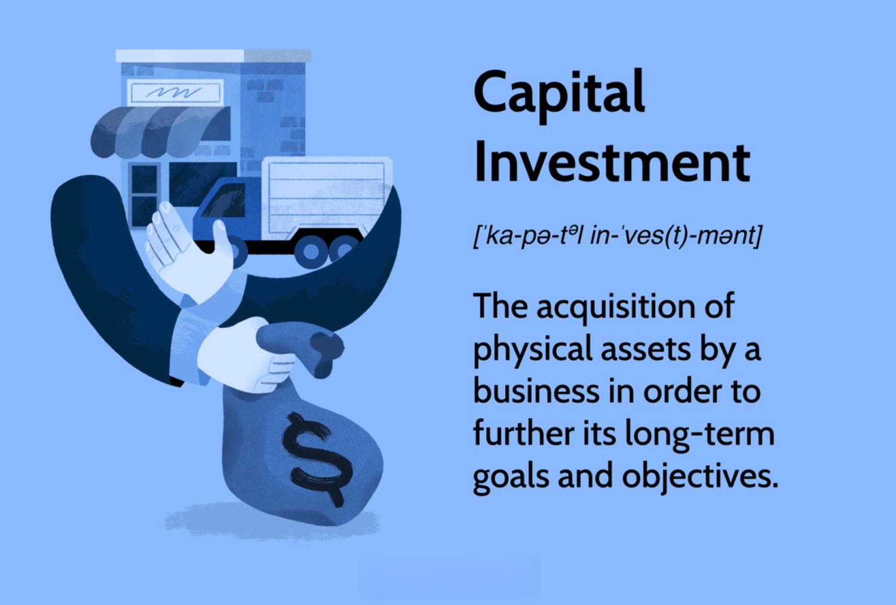

## Table of Contents

## What is capital investment?

Capital investment is when a business or a person spends money to buy things that will help them make more money in the future. These things can be big items like machines, buildings, or vehicles, or they can be smaller things like computers or tools. The idea is that by spending money now, the business will be able to grow and earn more money later on.

For example, if a company buys a new factory, it is making a capital investment. The factory will help the company make more products, which they can then sell to make more money. Over time, the money they earn from selling these products should be more than the cost of the factory. This is why businesses carefully think about capital investments and try to choose ones that will bring the most benefit in the long run.

## Why is capital investment important for businesses?

Capital investment is important for businesses because it helps them grow and make more money in the future. When a business buys new equipment or builds a new factory, it can produce more goods or offer new services. This means the business can sell more and earn more money. For example, if a bakery buys a bigger oven, it can bake more bread each day and sell more to customers.

Also, capital investments can help a business stay competitive. If other businesses in the same industry are using new technology or better equipment, a business needs to keep up. By making smart capital investments, a business can improve its products or services and attract more customers. This helps the business stay strong and successful in the market.

## What are the different types of capital investments?

Capital investments come in different forms, but they all help a business grow or improve. One type is tangible capital investments, which are physical things a business can touch and use. These include things like buildings, machines, vehicles, and tools. For example, a restaurant might buy new kitchen equipment to make food faster and better. These investments help a business make more products or offer better services.

Another type is intangible capital investments, which are things you can't touch but still help the business. These include things like patents, trademarks, and software. For example, a tech company might spend money to develop a new app. These investments help a business stand out from others and protect its ideas. Both tangible and intangible capital investments are important for a business to grow and succeed.

## How does capital investment affect a company's financial statements?

Capital investment shows up on a company's financial statements in a few ways. When a company buys something big like a machine or a building, it shows up on the balance sheet as an asset. This means the company owns something that it thinks will help it make money in the future. The cost of the investment is spread out over time, and this is called depreciation. Each year, a part of the cost is taken away from the value of the asset and shown as an expense on the income statement. This makes the company's profit look smaller, but it also shows how the investment is being used up over time.

Capital investment also affects the cash flow statement. When the company spends money to buy the new asset, it shows up as a cash outflow in the investing activities section. This means the company has less cash right now because it spent it on the investment. But if the investment helps the company make more money later, it can show up as more cash coming in on future cash flow statements. So, capital investment can make the company's cash go down at first, but it can help the company earn more cash in the long run.

## What is the difference between capital expenditure and operational expenditure?

Capital expenditure, or CapEx, is when a business spends money on things that will help it make more money in the future. These are big things like buildings, machines, or vehicles that the business will use for a long time. When a company buys these things, it spreads the cost over many years. This is called depreciation. For example, if a company buys a new truck, it might use that truck for ten years. Instead of counting the whole cost in one year, the company will count a little bit of the cost each year for ten years.

Operational expenditure, or OpEx, is when a business spends money on things it needs to keep running every day. These are things like rent, utilities, and employee salaries. Unlike CapEx, OpEx is counted as an expense right away in the year it is spent. For example, if a company pays for electricity, it counts that cost in the same month it gets the bill. OpEx helps keep the business going day to day, while CapEx helps the business grow and make more money in the future.

## How do businesses evaluate potential capital investments?

Businesses evaluate potential capital investments by looking at how much money the investment will make compared to how much it costs. They use tools like the Return on Investment (ROI) to see if the investment will be worth it. ROI is calculated by taking the profit from the investment and dividing it by the cost of the investment. If the ROI is high, it means the investment will likely make a lot of money for the business. Another tool they use is the Payback Period, which tells them how many years it will take to earn back the money they spent on the investment. If the payback period is short, the business might decide the investment is a good choice.

Businesses also think about other things like how the investment will affect their daily operations and if it will help them stay competitive. They might use something called Net Present Value (NPV) to see if the future money they will make from the investment is worth more than the money they spend now. NPV takes into account that money in the future is not as valuable as money right now. If the NPV is positive, it means the investment is a good idea. By looking at all these factors, businesses can make smart choices about which capital investments will help them grow and succeed.

## What are the common methods used to analyze the profitability of capital investments?

Businesses use several methods to figure out if a capital investment will make them more money. One common way is to calculate the Return on Investment (ROI). This is done by taking the profit the investment will make and dividing it by the cost of the investment. A high ROI means the investment will bring in a lot of money compared to what it costs. Another method is the Payback Period, which tells a business how many years it will take to earn back the money spent on the investment. If the payback period is short, the business might decide the investment is worth it because they will get their money back quickly.

Another important method is the Net Present Value (NPV). This helps businesses see if the money they will make in the future from the investment is worth more than the money they spend now. NPV takes into account that money in the future is not as valuable as money right now. If the NPV is positive, it means the investment is a good choice because the future earnings are worth more than the initial cost. By using these methods, businesses can make smart decisions about which capital investments will help them grow and succeed.

## Can you explain the concept of the time value of money in relation to capital investments?

The time value of money is an important idea when businesses think about capital investments. It means that money you have now is worth more than the same amount of money you will get in the future. This is because you can use the money you have now to invest and make more money over time. For example, if you have $100 today, you can put it in a bank and earn interest, so it will be worth more than $100 in a few years. When businesses look at capital investments, they need to think about this. They need to figure out if the money they will make in the future from the investment is worth more than the money they spend now.

One way businesses use the time value of money to evaluate capital investments is by calculating the Net Present Value (NPV). NPV helps them see if the future money they will make from the investment is worth more than the money they spend now, after taking into account that money in the future is less valuable. If the NPV is positive, it means the investment is a good choice because the future earnings are worth more than the initial cost. By understanding the time value of money, businesses can make smarter decisions about which capital investments will help them grow and succeed in the long run.

## What role does risk assessment play in capital investment decisions?

Risk assessment is really important when businesses decide on capital investments. It helps them figure out what could go wrong and how likely those problems are. For example, a business might worry that a new machine could break down a lot or that customers might not like a new product. By thinking about these risks, the business can decide if the investment is worth the chance they are taking. They might even find ways to make the investment safer, like buying insurance or doing more research.

Businesses use different tools to help with risk assessment. One common tool is a sensitivity analysis, which looks at how changes in things like costs or sales could affect the investment. If a small change in sales makes the investment unprofitable, it might be too risky. Another tool is scenario analysis, where the business imagines different futures and sees how the investment would do in each one. By understanding the risks, businesses can make smarter choices about capital investments and feel more confident that they will pay off in the end.

## How do macroeconomic factors influence capital investment strategies?

Macroeconomic factors like interest rates, inflation, and economic growth can really change how businesses think about capital investments. When interest rates are low, borrowing money is cheaper. This makes it easier for businesses to take out loans to buy big things like new machines or buildings. But if interest rates go up, borrowing becomes more expensive, and businesses might decide to wait or not invest at all. Inflation also matters because it changes the value of money over time. If inflation is high, the cost of everything goes up, and businesses might worry that their investments won't be worth as much in the future.

Economic growth is another big [factor](/wiki/factor-investing). When the economy is doing well, people have more money to spend, and businesses can feel more sure about making big investments. They might think that their new products or services will sell well. But if the economy is not doing well, businesses might be more careful. They might worry that people won't buy as much, so they might hold off on big investments until things get better. By keeping an eye on these macroeconomic factors, businesses can make smarter choices about when and where to invest their money.

## What are some advanced financial models used for capital investment analysis?

Businesses use advanced financial models to make smart choices about capital investments. One popular model is the Discounted Cash Flow (DCF) analysis. This model helps businesses figure out the present value of future cash flows from an investment. It takes into account the time value of money, which means that money today is worth more than the same amount of money in the future. By using DCF, businesses can see if the money they will make from the investment is worth more than what they spend now. This helps them decide if the investment is a good idea.

Another advanced model is the Internal Rate of Return (IRR). IRR is the [interest rate](/wiki/interest-rate-trading-strategies) that makes the net present value of all cash flows from a project equal to zero. It's like figuring out the break-even point for an investment. If the IRR is higher than the cost of capital, which is the rate the business pays to borrow money, the investment is usually a good choice. Businesses also use the Monte Carlo simulation to understand the risks of an investment. This model runs many different scenarios to see how changes in things like costs or sales could affect the investment's success. By using these advanced models, businesses can make better decisions about their capital investments.

## How do global companies manage capital investments across different countries with varying economic conditions?

Global companies have to think carefully about how they spend money on big things like buildings and machines in different countries. Each country has its own set of rules and economic conditions that can change how much it costs to invest and how much money the company can make. For example, in one country, the taxes might be high, which makes the investment more expensive. In another country, the economy might be growing fast, making it a good place to invest because people will buy more. Companies need to look at all these things and decide where their money will do the most good.

To manage this, global companies use special tools and plans. They might use something called a risk-adjusted return on capital (RAROC) to see how much money they can make after thinking about the risks in each country. They also keep a close eye on things like currency exchange rates, because if the value of one country's money goes down, it can make the investment less valuable. By using these tools and staying informed about what's happening in different countries, global companies can make smart choices about where to spend their money and grow their business around the world.

## References & Further Reading

[1]: Bergstra, J., Bardenet, R., Bengio, Y., & Kégl, B. (2011). ["Algorithms for Hyper-Parameter Optimization."](https://dl.acm.org/doi/10.5555/2986459.2986743) Advances in Neural Information Processing Systems 24.

[2]: ["Advances in Financial Machine Learning"](https://www.amazon.com/Advances-Financial-Machine-Learning-Marcos/dp/1119482089) by Marcos Lopez de Prado

[3]: ["Evidence-Based Technical Analysis: Applying the Scientific Method and Statistical Inference to Trading Signals"](https://www.amazon.com/Evidence-Based-Technical-Analysis-Scientific-Statistical/dp/0470008741) by David Aronson

[4]: ["Machine Learning for Algorithmic Trading"](https://github.com/stefan-jansen/machine-learning-for-trading) by Stefan Jansen

[5]: ["Quantitative Trading: How to Build Your Own Algorithmic Trading Business"](https://www.amazon.com/Quantitative-Trading-Build-Algorithmic-Business/dp/1119800064) by Ernest P. Chan