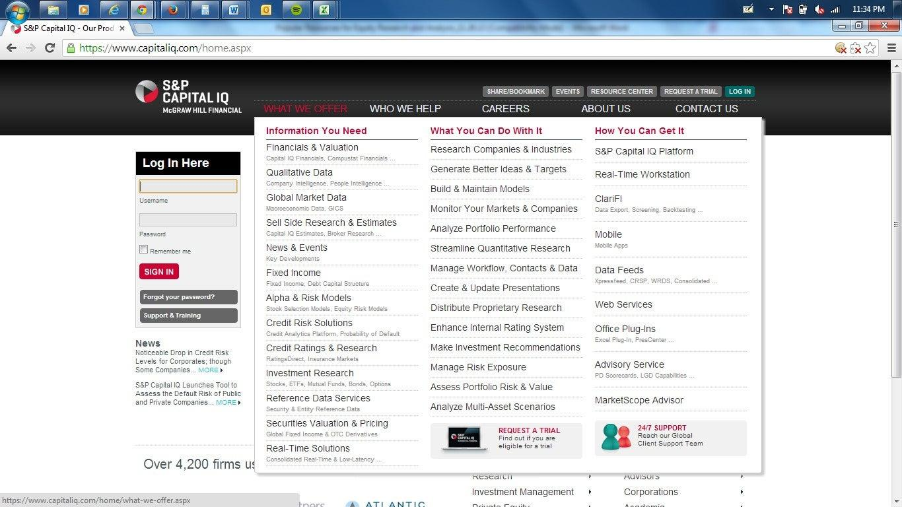

## Table of Contents

## What is Capital IQ?

Capital IQ is a financial data and research platform created by Standard & Poor's (S&P). It provides detailed information about companies, markets, and financial transactions to help professionals make informed decisions. Users can access data on stock prices, financial statements, and company news, which is useful for investment research, financial analysis, and business strategy planning.

The platform is popular among investment bankers, equity researchers, and business professionals because it offers a wide range of tools and data. These tools help users analyze trends, create financial models, and track market movements. Capital IQ also allows users to screen for companies based on specific criteria, making it easier to find potential investment opportunities or business partners.

## Who owns Capital IQ and how was it developed?

Capital IQ is owned by S&P Global, a big company that gives out financial information and data. S&P Global used to be called McGraw Hill Financial, and they bought Capital IQ in 2004. Capital IQ started when a company called Capital IQ Inc. was created in 1998. They wanted to make a place where people could get all the financial data they needed in one spot.

The team at Capital IQ worked hard to build a platform that would help people in finance do their jobs better. They added lots of data about companies, stock prices, and financial news. Over time, they kept making it better by adding new tools and more data. Now, Capital IQ is a very important tool for people like investment bankers and financial analysts who need to make smart decisions based on good information.

## What are the main features of Capital IQ?

Capital IQ has many important features that help people in finance. One big feature is the huge amount of data it has about companies, markets, and financial deals. Users can look at stock prices, financial statements, and news about companies. This helps them do research on investments, analyze finances, and plan business strategies. Another useful feature is the screening tool. It lets users search for companies that fit certain criteria, like size or industry, which makes it easier to find good investment opportunities or business partners.

Another key feature is the financial modeling tools. These tools help users build models to predict how a company might do in the future. This is really helpful for making smart investment choices. Capital IQ also has a feature called "Excel Add-In" that lets users pull data straight into Excel spreadsheets. This makes it easier to work with the data and create reports. Overall, Capital IQ is a powerful tool that gives financial professionals the information and tools they need to make informed decisions.

## How can Capital IQ be used for financial analysis?

Capital IQ is a great tool for financial analysis because it has a lot of data about companies and markets. People who work in finance can use this data to look at a company's financial statements, like its income statement, balance sheet, and cash flow statement. They can also see stock prices and news about the company. This helps them understand how well the company is doing and if it might be a good investment. For example, they can compare a company's financial ratios, like its price-to-earnings ratio, with other companies in the same industry to see if it's a good buy.

Another way Capital IQ helps with financial analysis is through its financial modeling tools. These tools let users create models to predict how a company might perform in the future. This is useful for making investment decisions because it helps analysts see what might happen if certain things change, like the company's sales or costs. Capital IQ also has an Excel Add-In feature, which makes it easy to pull data into spreadsheets. This means analysts can quickly build detailed reports and models without having to switch between different programs. Overall, Capital IQ gives financial professionals the data and tools they need to make smart, informed decisions.

## What types of data does Capital IQ provide?

Capital IQ gives a lot of different types of data about companies and markets. It has financial statements like income statements, balance sheets, and cash flow statements. It also shows stock prices, which helps people see how a company's stock is doing. Besides that, Capital IQ has news about companies, which can tell users about important events or changes that might affect the company's future. It also includes data about mergers and acquisitions, so users can see when companies buy or merge with other companies.

Another type of data Capital IQ provides is about the people who run the companies. It has information on executives and board members, which can help users understand who is making decisions at the company. Capital IQ also has data on private companies, not just public ones, which is useful for people looking at a wider range of investment opportunities. Overall, Capital IQ gives a complete picture of a company's financial health, its leadership, and its place in the market, all in one place.

## How does Capital IQ compare to other financial data platforms?

Capital IQ is one of many financial data platforms out there, but it's special because it has a lot of data about companies and markets all in one place. It's popular with people who work in finance, like investment bankers and analysts, because it has detailed financial statements, stock prices, and news about companies. It also has tools that help users build financial models and screen for companies that meet certain criteria. This makes it easier for users to find good investment opportunities and do their research. Compared to other platforms like Bloomberg Terminal or FactSet, Capital IQ is known for its wide range of data and user-friendly tools.

Other platforms like Bloomberg Terminal are also very popular and have a lot of data, but they can be more expensive and harder to use. Bloomberg is great for real-time data and trading, but it might not have as much detailed company data as Capital IQ. FactSet is another competitor that's known for its strong analytics and data management tools. It's good for people who need to do a lot of data analysis and reporting. But Capital IQ might be easier to use and has more data on private companies, which can be important for some users. In the end, the best platform depends on what a person needs, but Capital IQ is a strong choice for many in the finance world.

## What are the subscription options and costs for using Capital IQ?

Capital IQ has different subscription options that can fit what different people need. You can choose to subscribe for just yourself or for a whole team at your company. The cost can change based on how many people will use it and what kind of data and tools you want. Usually, a single user subscription might cost a few thousand dollars a year, but if you need more features or more users, the price can go up a lot. It's a good idea to talk to a sales person at Capital IQ to get the exact price because they can give you a plan that fits your needs.

The cost of Capital IQ can seem high, but it's worth it for many people in finance because it has so much data and helpful tools. Some other platforms, like Bloomberg Terminal, can cost even more, sometimes over $20,000 a year per user. But Capital IQ is often seen as a good value because it's easier to use and has a lot of information on both public and private companies. If you're thinking about getting a subscription, it's smart to try it out first to see if it really helps you with your work.

## How can one access and navigate the Capital IQ platform?

To access Capital IQ, you first need to sign up for a subscription. Once you have an account, you can log in through the Capital IQ website. The platform is designed to be user-friendly, so even if you're new to it, you can start using it easily. When you log in, you'll see a main dashboard that shows different sections like company data, financial statements, and market news. You can click on these sections to see more detailed information.

Navigating Capital IQ is pretty straightforward. On the left side of the screen, there's a menu with different options like "Screening," "Financials," and "Transactions." If you want to look at a specific company, you can type its name into the search bar at the top of the page. Once you find the company, you can see all kinds of data about it, like its stock price, financial statements, and news. If you need help, Capital IQ has tutorials and a help center to guide you through using the platform.

## What advanced tools and functionalities does Capital IQ offer for expert users?

Capital IQ has many advanced tools that help expert users do their work better. One of these tools is the Excel Add-In, which lets users pull data straight into Excel spreadsheets. This makes it easy to build detailed financial models and reports without having to switch between different programs. Another useful tool is the Screening feature, which lets users search for companies that fit certain criteria, like size, industry, or financial ratios. This helps experts find good investment opportunities or business partners quickly. Capital IQ also has a feature called "Data Feeds" that gives users real-time data, which is important for people who need up-to-date information for their analysis.

Another advanced functionality is the "Formula Builder" tool, which helps users create custom formulas for their financial models. This is great for experts who need to do complex calculations. Capital IQ also offers "Custom Templates" that let users save their own report formats, making it easier to create consistent reports. For those who work in teams, Capital IQ has "Collaboration Tools" that let users share data and work together on projects. These advanced tools make Capital IQ a powerful platform for expert users who need detailed and customized financial analysis.

## How can Capital IQ be integrated with other software and tools?

Capital IQ can be integrated with other software and tools to make it easier for users to do their work. One of the main ways it does this is through the Excel Add-In. This tool lets users pull data straight into Excel spreadsheets, so they can build financial models and reports without having to switch between different programs. This is really helpful for people who need to do a lot of number crunching and analysis. Capital IQ also has "Data Feeds" that give users real-time data, which can be used with other software that needs up-to-date information.

Another way Capital IQ can be integrated is through its API (Application Programming Interface). The API lets users connect Capital IQ's data to their own custom applications or other software they use. This means they can build their own tools that use Capital IQ's data in new ways. For example, someone might use the API to create a custom dashboard that shows the data they need in a way that's easy for them to understand. Overall, these integration options make Capital IQ a flexible tool that can work well with other software to help users do their jobs better.

## What are some case studies or examples of Capital IQ being used effectively in the financial industry?

A big investment bank used Capital IQ to find good companies to invest in. They used the screening tool to look for companies in the tech industry that were growing fast but were not too expensive. Once they found some good choices, they used Capital IQ's financial statements and stock price data to do more research. They built financial models with the Excel Add-In to predict how these companies might do in the future. Thanks to Capital IQ, the bank made smart investments that made a lot of money.

Another example is a private equity firm that used Capital IQ to look at private companies they might want to buy. They used the platform to see the financial health of these companies, like how much money they were making and how much debt they had. They also looked at news and data about the people running the companies to make sure they were good leaders. With all this information, the firm was able to pick the right companies to buy, and their investments did really well. Capital IQ helped them make better decisions and grow their business.

## What future developments or updates are expected for Capital IQ?

Capital IQ keeps getting better with new updates and features. One thing they might do is make their data even more real-time. This means users can see what's happening with companies and markets right away, which is really helpful for making quick decisions. They might also add more tools for building financial models. This would make it easier for users to predict how companies will do in the future and find good investments.

Another thing Capital IQ might work on is making their platform easier to use on phones and tablets. More people are using these devices for work, so having a good app would be a big help. They could also add more types of data, like information about new industries or more details about private companies. This would give users even more information to work with and help them make better choices.

## References & Further Reading

[1]: Bergstra, J., Bardenet, R., Bengio, Y., & Kégl, B. (2011). ["Algorithms for Hyper-Parameter Optimization."](https://papers.nips.cc/paper/4443-algorithms-for-hyper-parameter-optimization) Advances in Neural Information Processing Systems 24.

[2]: ["Advances in Financial Machine Learning"](https://www.amazon.com/Advances-Financial-Machine-Learning-Marcos/dp/1119482089) by Marcos Lopez de Prado

[3]: ["Evidence-Based Technical Analysis: Applying the Scientific Method and Statistical Inference to Trading Signals"](https://www.amazon.com/Evidence-Based-Technical-Analysis-Scientific-Statistical/dp/0470008741) by David Aronson

[4]: ["Machine Learning for Algorithmic Trading"](https://github.com/stefan-jansen/machine-learning-for-trading) by Stefan Jansen

[5]: ["Quantitative Trading: How to Build Your Own Algorithmic Trading Business"](https://www.amazon.com/Quantitative-Trading-Build-Algorithmic-Business/dp/1119800064) by Ernest P. Chan