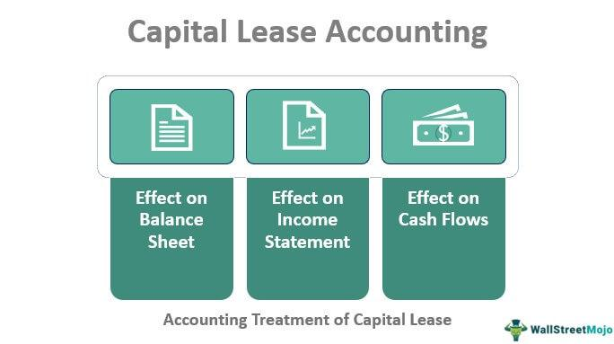

In today’s fast-paced financial world, understanding the nuances of lease classification, capital leases, and algorithmic trading is crucial for businesses and investors. This article examines the intricate details of capital leases, lease classification accounting, and the advent of algorithmic trading. Our goal is to provide a comprehensive guide on how these concepts interact and impact the broader financial landscape. 

Starting with the basics of lease classification, the article explores the distinction between capital leases and operating leases, highlighting the implications for financial statements and reporting. We will also consider the complexities of accounting standards that govern these classifications and their implications for businesses in terms of financial ratios and tax liabilities. 



Furthermore, the innovation of algorithmic trading is reshaping financial transactions by using complex algorithms to automate market activities. This advancement not only optimizes trading efficiency but also influences accounting processes such as lease classification, offering potential improvements in compliance and data accuracy.

Readers will gain a deeper insight into these key financial elements and appreciate how they are intertwined within the modern economic framework. Join us as we explore the multiple facets of these topics and their relevance in today's dynamic markets.

## Table of Contents

## What is a Capital Lease?

A capital lease, also termed a finance lease, is a type of lease classified under accounting principles as providing the lessee with significant rights and responsibilities akin to ownership. This differs from an operating lease where the lessee uses the asset without the attendant benefits and responsibilities of ownership. 

To be deemed a capital lease, specific criteria outlined by accounting standards must be fulfilled. According to the Financial Accounting Standards Board (FASB), an agreement should satisfy at least one of the following conditions:

1. **Transfer of Ownership**: Ownership of the asset is transferred to the lessee by the end of the lease term.
2. **Bargain Purchase Option**: The lease includes an option for the lessee to purchase the asset at a price significantly lower than the fair market value.
3. **Lease Term**: The duration of the lease covers the major part of the useful life of the asset.
4. **Present Value of Payments**: The present value of lease payments equates to or exceeds substantially all of the fair value of the leased asset.

From an accounting perspective, capital leases are recognized on the balance sheet of the lessee. This requires the lessee to record both an asset and a corresponding liability, reflecting the obligation to make future lease payments. The asset is subsequently depreciated over its useful life, typically recorded as:

$$
\text{Right-of-Use Asset} = \sum \frac{\text{Lease Payments}}{(1 + r)^t}
$$

where $r$ is the implicit interest rate in the lease, and $t$ is the period.

The recognition of capital leases as balance sheet items significantly impacts financial statements and key metrics such as return on assets (ROA) and debt-to-equity ratios. Additionally, the interest and depreciation expenses associated with capital leases influence tax calculations, as these are deductible expenses, thereby affecting the company's taxable income.

In contrast to operating leases, where payments are recognized as rental expenses on the income statement, capital leases reflect capital expenditure and debt financing activities. This distinction is crucial for analysts and investors assessing a company's long-term financial health and capital structure.

## Lease Classification Accounting

Lease classification is a pivotal aspect of accounting that determines whether a lease is considered a capital lease or an operating lease under generally accepted accounting principles (GAAP). This classification significantly affects how leases are represented in financial statements, which in turn influences financial ratios and overall business analysis.

Capital leases, also known as finance leases, are agreements where the lessee assumes most benefits and risks associated with ownership. Operating leases, on the other hand, are more akin to rental agreements where ownership risks and benefits remain with the lessor. The classification is not arbitrary; it relies on specific criteria established under accounting standards.

In 2016, the Financial Accounting Standards Board (FASB) introduced updated guidelines under ASC 842, which brought substantial changes to lease accounting. The revisions require lessees to recognize nearly all leases on the balance sheet, effectively reducing off-balance-sheet financing. This new standard mandates that lessees account for lease assets and liabilities for both operating and finance leases, thus enhancing transparency in financial reporting.

To accurately classify a lease, companies must consider several complex criteria. These include:

1. **Lease Term Length**: A key determinant in lease classification is whether the lease term is a major part of the economic life of the asset. If it is, the lease might be classified as a capital lease.

2. **Present Value of Lease Payments**: The criteria also involve evaluating the present value of lease payments, which should be compared against the asset's fair value. If the present value is substantially all of the asset's fair value, the lease is likely a finance lease. This can be calculated using the formula:
$$
   PV = \sum_{t=1}^{n} \frac{PMT}{(1 + r)^t}

$$

   where $PV$ is the present value, $PMT$ is the lease payment, $r$ is the discount rate, and $n$ is the number of periods.

3. **Potential Asset Purchase Options**: The presence of a bargain purchase option can influence classification. If it is reasonably certain that the lessee will exercise this option, the lease may be classified as a capital lease.

The appropriate classification of leases is crucial as it not only affects the balance sheet but also impacts key financial metrics such as debt-to-equity ratios, return on assets, and the perceived financial health of an organization. Companies must navigate these complexities to ensure compliance with accounting standards and provide clear, accurate financial information to investors and stakeholders.

## Accounting for Capital Leases

Accounting for capital leases requires detailed financial recording, emphasizing both assets and liabilities on the balance sheet. This approach acknowledges the lessee's right to use the asset while considering ownership characteristics. The present value of future lease payments is initially calculated and recorded as a capital lease liability. Simultaneously, the asset acquired through the lease is capitalized, meaning it is added to the fixed assets section of the balance sheet.

To reflect the allocation of cost over time, the asset is depreciated over its useful life, which may coincide with the lease term or extend beyond it, depending on ownership transfer conditions. Depreciation is typically straight-line, although other methods may apply depending on the asset's consumption pattern.

In financial statements, lease payments are split into principal and interest components. The principal portion reduces the lease liability, while the interest component is expensed, affecting the income statement as an interest expense. This treatment aligns with the effective interest method, ensuring that interest expense reflects the lease liability outstanding.

Consider a hypothetical scenario in which a company agrees to a capital lease with these terms:
- Asset fair value: $100,000
- Lease term: 5 years
- Interest rate: 5%

Here, the company calculates the present value of lease payments to determine the initial liability recorded. Assuming uniform payments, this could be calculated using Python as follows:

```python
import numpy as np

lease_payments = 100_000
interest_rate = 0.05
lease_term = 5

present_value = np.pv(interest_rate, lease_term, -lease_payments)
print(f"Present Value of Lease Payments: {present_value:.2f}")
```

The output provides the liability value recognized initially, dictating both balance sheet and subsequent depreciation calculations.

This accounting methodology significantly impacts a company's financial profile. Recognizing depreciation and interest downstream affects net income, potentially altering tax liabilities due to expense timing differences. Consequently, this can change a company's investment appeal, influencing metrics such as return on assets or equity. This highlights the importance of accurate lease classification and recording.

## Algo Trading and Its Intersection with Lease Accounting

Algorithmic trading, commonly referred to as algo trading, deploys advanced algorithms to execute trading activities at high speed and efficiency. This approach is predominantly used in financial investment strategies but exhibits significant potential in transforming accounting processes, including lease classification.

The core of [algorithmic trading](/wiki/algorithmic-trading) lies in its ability to parse large sets of data instantaneously and make decisions based on predefined criteria. This capability translates well into lease accounting, where data accuracy and compliance with accounting standards are crucial. The automation aspect of algo trading can be repurposed to streamline data analysis and ensure that lease classifications are precise, adhering strictly to established guidelines such as those set forth by generally accepted accounting principles (GAAP).

In the context of lease classification, algo trading systems can automate the identification and evaluation of critical criteria necessary for lease categorization. For instance, these systems can assess the present value of lease payments against the fair value of the asset, a key consideration in determining whether a lease qualifies as a capital lease. Python, with its robust data processing libraries such as Pandas and NumPy, is ideally suited for implementing such analytical tasks. Here is a simple illustration using Python to calculate the present value of lease payments:

```python
import numpy as np

def calculate_present_value(lease_payments, discount_rate):
    periods = np.arange(len(lease_payments))
    present_value = np.sum(lease_payments / (1 + discount_rate) ** periods)
    return present_value

lease_payments = np.array([1000, 1000, 1000])  # Example lease payments over three periods
discount_rate = 0.05  # Example discount rate
pv = calculate_present_value(lease_payments, discount_rate)
print(f"Present Value of Lease Payments: {pv}")
```

This script calculates the present value of future lease payments, a vital step in lease classification. By employing similar automated calculations, businesses can achieve enhanced accuracy and efficiency in their accounting operations.

Furthermore, as algorithmic trading integrates more deeply with various financial functions, its application in lease accounting provides a strategic advantage. By automating the classification process, businesses not only reduce the room for human error but also ensure swift compliance with evolving accounting standards. This is particularly advantageous in light of changes such as the Financial Accounting Standards Board (FASB) guidelines, which require more leases to be recognized on the balance sheet.

In summary, the intersection of algo trading with lease accounting presents promising prospects for businesses seeking efficiency and precision. By leveraging algorithmic methodologies, companies can navigate the complexities of lease classification with greater confidence and competence.

## FAQs

### FAQs

Q: What is the primary difference between a capital lease and an operating lease?  
A: The main difference lies in ownership transfer. A capital lease transfers most ownership benefits and liabilities to the lessee, whereas an operating lease does not. In a capital lease, the lessee records the asset as if it owns it, with the corresponding liability on the balance sheet. An operating lease, however, treats lease payments as operating expenses that do not appear on the balance sheet.

Q: How do accounting standards affect lease classification?  
A: Standards such as Generally Accepted Accounting Principles (GAAP) define the criteria for lease classification, directly affecting how leases are reported on financial statements. Under GAAP, leases are classified based on several factors, including the lease term, the present value of lease payments, and the transfer of ownership. This, in turn, affects balance sheet representation and tax reporting, as capital leases increase assets and liabilities, whereas operating leases do not.

Q: Can algo trading enhance lease accounting processes?  
A: Yes, by automating data analysis and compliance checks, algorithmic trading (algo trading) can improve the accuracy and efficiency of lease accounting. Automation technologies in algo trading can be adapted to process large datasets, reducing the likelihood of human error and ensuring timely adherence to accounting standards. Algorithm-based systems are also capable of real-time data processing, which can significantly streamline the decision-making processes for lease classification and compliance.

## The Bottom Line

Capital leases and lease classification play critical roles in shaping modern financial accounting practices. They impact how assets and liabilities are represented on company balance sheets and have profound implications for tax calculations. Specifically, capital leases require businesses to acknowledge an asset and corresponding liability, which can influence key financial ratios and investor perceptions. Proper classification under accounting standards such as GAAP is essential for ensuring transparency and compliance.

The emergence of algorithmic trading introduces transformative possibilities for these accounting processes through automation and enhanced precision. By integrating algo trading techniques, businesses can streamline and execute large volumes of data with increased accuracy. For instance, algorithmic systems can efficiently handle lease classification, ensuring compliance with complex accounting standards by analyzing large data sets quickly and accurately. Python, a popular language for developing such algorithms, can be utilized to automate these tasks. For example:

```python
def calculate_present_value(lease_payments, rate):
    present_value = sum(payment / (1 + rate)**n for n, payment in enumerate(lease_payments))
    return present_value
```

This function illustrates a basic calculation of present value from a list of lease payments, assuming a discount rate. Such automation not only improves efficiency but also reduces the likelihood of human error in financial reporting.

Incorporating these advancements is crucial for companies seeking to optimize their financial operations in a competitive environment. As the financial sector continues to evolve with technological and regulatory changes, staying informed on developments in lease accounting and trading technologies will be indispensable for businesses. Those who master these areas will be better positioned to make informed decisions, enhance operational efficiency, and achieve financial success in an ever-changing market landscape.

## References & Further Reading

[1]: ["ASC 842 - Leases"](https://asc.fasb.org/layoutComponents/getPdf?isSitesBucket=false&fileName=GUID-B634D7F7-44FF-49D9-ABC9-EE1D1A346D77.pdf) by Financial Accounting Standards Board (FASB)

[2]: ["Leasing — Accounting for the New Standard"](https://laniganryan.com/news-resources/the-new-lease-accounting-standard-asc-842-overview/) by Deloitte

[3]: ["Algorithmic Trading and DMA"](https://www.amazon.com/Algorithmic-Trading-DMA-introduction-strategies/dp/0956399207) by Barry Johnson

[4]: ["Fundamentals of Lease Accounting and Management"](https://viewpoint.pwc.com/dt/us/en/pwc/accounting_guides/leases/assets/pwcleasesguide0124.pdf) by Anil K. Sharma

[5]: ["Algo Bots and the Law: Technology, Financial Regulation, and Responsibility"](https://www.amazon.com/Algo-Bots-Law-Technology-Derivatives/dp/1316616533) by Gregory Scopino

[6]: ["Capital Leases vs. Operating Leases"](https://www.wallstreetprep.com/knowledge/capital-lease-vs-operating-lease/) on Investopedia