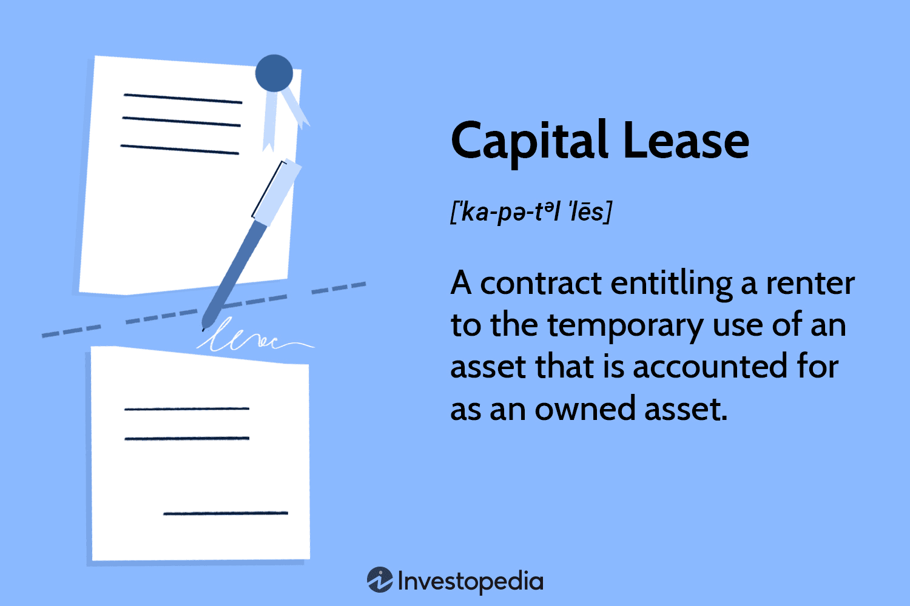

## Table of Contents

## What is a capital lease in accounting?

A capital lease, also known as a finance lease, is a type of lease agreement where the lessee (the person or business renting the asset) essentially treats the leased asset as if they own it. This means the lessee records the leased asset on their balance sheet as an asset and also records a corresponding liability for the lease payments they owe. This is different from an operating lease, where the lessee does not record the asset or liability on their balance sheet.

The reason a lease is classified as a capital lease is because it meets certain criteria set by accounting standards. These criteria can include the lease term being for the majority of the asset's useful life, the lease allowing the lessee to buy the asset at a price lower than its fair market value at the end of the lease, or the present value of the lease payments being close to the fair market value of the asset. By treating the lease as a capital lease, the lessee can spread the cost of the asset over its useful life, matching the expense with the revenue the asset helps generate.

## How does a capital lease differ from an operating lease?

A capital lease and an operating lease are two different ways to rent an asset, like a piece of equipment or a vehicle. With a capital lease, the person or business renting the asset treats it like they own it. They put the asset on their balance sheet as an asset and also list the money they owe for the lease as a liability. This means they can spread out the cost of the asset over time, matching it with the money the asset helps them make. Capital leases are used when the lease agreement meets certain rules, like if the lease lasts for most of the asset's life or if the total lease payments are close to what the asset is worth.

On the other hand, an operating lease is more like renting. The person or business using the asset doesn't list it on their balance sheet as an asset or a liability. They just pay for the use of the asset over time, and the payments are treated as an expense. Operating leases are used when the lease doesn't meet the rules for a capital lease, like if the lease is for a shorter time or the total payments are much less than the asset's value. This type of lease is simpler and doesn't add to the company's debt on paper, but it doesn't let them claim the asset as theirs either.

## What are the criteria for classifying a lease as a capital lease?

To classify a lease as a capital lease, it needs to meet certain rules set by accounting standards. One rule is that the lease must last for most of the asset's useful life. For example, if a machine is expected to last 10 years, the lease should be for at least 7 or 8 years to be a capital lease. Another rule is that the lease should let the person renting the asset buy it at the end of the lease for a price that's much lower than what the asset is worth. This makes it almost like the renter is buying the asset over time.

Another important rule is that the total amount of money to be paid for the lease should be close to the full value of the asset. If the present value of all the lease payments is 90% or more of the asset's fair market value, it's likely a capital lease. Lastly, if the lease transfers ownership of the asset to the renter by the end of the lease term, it's also considered a capital lease. These rules help decide if a lease should be treated like the renter owns the asset, which affects how it's shown on their financial statements.

## What are the accounting entries for a capital lease at inception?

When a company starts a capital lease, they need to record the leased asset on their balance sheet as an asset. They do this by making an entry called "leased asset" which shows the value of the thing they are leasing, like a piece of equipment or a vehicle. At the same time, they also need to show that they owe money for the lease, so they record a "lease liability" on their balance sheet. This entry shows how much they will need to pay over the lease term. The value of the leased asset and the lease liability are usually the same at the start of the lease, and it's based on the present value of all the lease payments.

In addition to recording the asset and liability, the company might also need to pay some money upfront when they start the lease. This is called a "lease payment" and it gets recorded as a reduction of the lease liability. If there's any part of this payment that's not for the lease itself, like a security deposit, it would be recorded separately. So, at the beginning of a capital lease, the company's balance sheet will show a new asset and a new liability, and their cash might go down if they made an upfront payment.

## How are capital leases recorded on the balance sheet?

When a company starts a capital lease, they put the leased item on their balance sheet as an asset. This means they treat the thing they're leasing, like a machine or a truck, as if they own it. They record it under "leased asset" and the value is based on how much all the lease payments will be worth now, not in the future. This is called the present value of the lease payments.

At the same time, they also show that they owe money for the lease. This is recorded as a "lease liability" on the balance sheet. The amount of the lease liability is the same as the value of the leased asset at the start. If the company pays some money upfront when they start the lease, this payment reduces the lease liability. So, the balance sheet will show a new asset and a new liability, and if there was an upfront payment, their cash will go down too.

## What is the impact of a capital lease on the income statement?

When a company has a capital lease, it affects their income statement in a few ways. Over the life of the lease, the company will record depreciation expense for the leased asset. This is because they treat the asset as if they own it, so they spread out its cost over time. The amount of depreciation expense depends on the asset's value and how long it's expected to last. This expense reduces the company's profit on the income statement.

The company also has to pay interest on the lease liability. This interest is the cost of borrowing the money to "buy" the asset through the lease. The interest expense is recorded on the income statement and it reduces the company's profit too. Over time, as the company makes lease payments, the interest part of the payment gets smaller and the part that reduces the lease liability gets bigger. So, the income statement shows both depreciation and interest expenses from a capital lease, which together lower the company's reported profit.

## How do you calculate the interest expense for a capital lease?

To calculate the interest expense for a capital lease, you start with the lease liability at the beginning of the period. This is the total amount you still owe on the lease. You then multiply this amount by the [interest rate](/wiki/interest-rate-trading-strategies) that's part of your lease agreement. This gives you the interest expense for that period. For example, if you owe $10,000 at the start of the period and the interest rate is 5%, your interest expense for that period would be $10,000 times 5%, which is $500.

As you make lease payments, the amount of interest expense changes. Each payment you make reduces the lease liability. So, the next time you calculate interest, you use the new, lower lease liability amount. If you paid $1,000 of the $10,000, your new lease liability would be $9,000. If the interest rate stays at 5%, your interest expense for the next period would be $9,000 times 5%, which is $450. This way, the interest expense gets smaller over time as you pay down the lease.

## What are the disclosure requirements for capital leases in financial statements?

When a company has a capital lease, they need to tell people about it in their financial statements. This is called disclosure. They have to write down details like how much they owe on the lease, how long the lease lasts, and what the interest rate is. They also need to say how much money they have to pay each year for the lease. This helps people who look at the financial statements understand the company's debts and future payments.

The company also has to explain how they figured out the value of the leased asset and the lease liability. They need to tell if they used any special rules or guesses to come up with these numbers. This is important because it shows how they decided to treat the lease like they own the asset. By giving all this information, the company makes sure that everyone can see the full picture of their financial situation and how the capital lease affects it.

## How do changes in lease accounting standards affect capital leases?

Changes in lease accounting standards have made a big difference for capital leases. Before, companies could choose between capital leases and operating leases, and capital leases were treated like the company owned the asset. But new rules, like the ones in the ASC 842 standard in the US, say that almost all leases have to be treated like capital leases. This means companies have to show the leased asset and the money they owe on their balance sheet, no matter what kind of lease it is. This change makes it easier for people looking at the financial statements to see all the company's debts and assets.

These new rules affect how companies plan their finances and report their numbers. Now, companies have to think more about how leases will show up on their balance sheets and affect their financial ratios. They might decide to buy assets instead of leasing them, or they might look for different kinds of leases that fit the new rules better. The change also means more work for accountants, who have to make sure all the leases are recorded the right way and that all the details are shared in the financial statements. This makes everything more clear but also more complicated.

## What are the tax implications of entering into a capital lease?

When a company enters into a capital lease, it can affect their taxes. With a capital lease, the company can claim depreciation on the leased asset as a tax deduction. This means they can reduce their taxable income by the amount the asset loses value over time. The company can also deduct the interest part of the lease payments. This is different from an operating lease, where the company can only deduct the lease payments as they make them, without separating out depreciation and interest.

These tax benefits can make capital leases attractive for companies looking to lower their tax bill. However, the rules for what counts as a capital lease for tax purposes might be different from accounting rules. So, a company needs to check with a tax professional to make sure they're following the right rules and getting the deductions they're allowed. Overall, understanding the tax implications can help a company make better decisions about whether to enter into a capital lease.

## How do you handle the amortization of a capital lease?

When a company has a capital lease, they need to handle the amortization of the lease. Amortization is like spreading out the cost of the lease over time. At the start of the lease, the company records the leased asset on their balance sheet and also records a lease liability for the amount they owe. As they make lease payments, they split each payment into two parts: one part pays down the lease liability, and the other part is interest expense. The part that pays down the lease liability is like paying off a loan, and it reduces the amount they owe.

Over time, the lease liability gets smaller as the company makes payments. The interest part of the payment is based on the remaining lease liability and the interest rate in the lease agreement. At the beginning, the interest part is bigger, and it gets smaller as the lease liability goes down. This way, the company slowly pays off the lease and reduces the amount they owe. By the end of the lease term, the lease liability should be zero, and the company has fully amortized the lease.

## What are the strategic considerations for choosing a capital lease over other financing options?

When a company decides to use a capital lease instead of other ways to get money, they think about a few important things. One big reason to choose a capital lease is that it lets the company use an asset without buying it right away. This can be good if the company doesn't want to spend a lot of money upfront. Also, with a capital lease, the company can claim tax benefits like depreciation and interest deductions, which can lower their taxes. But, they have to remember that capital leases show up on the balance sheet as both an asset and a liability, which might make their debt look bigger to people who look at their financial statements.

Another thing to think about is how the lease affects the company's money flow. With a capital lease, the payments are spread out over time, which can make it easier to manage cash. But, the company needs to make sure they can keep making these payments. They also need to think about what happens at the end of the lease. Some leases let the company buy the asset for a low price, which can be a good deal if they want to keep using it. But if the company doesn't need the asset anymore, they might not want a capital lease. So, choosing a capital lease depends on the company's plans for the asset, their tax situation, and how they want to handle their money.

## What is a Capital Lease?

A capital lease, also termed a finance lease, is a type of lease classified under accounting principles as providing the lessee with significant rights and responsibilities akin to ownership. This differs from an operating lease where the lessee uses the asset without the attendant benefits and responsibilities of ownership. 

To be deemed a capital lease, specific criteria outlined by accounting standards must be fulfilled. According to the Financial Accounting Standards Board (FASB), an agreement should satisfy at least one of the following conditions:

1. **Transfer of Ownership**: Ownership of the asset is transferred to the lessee by the end of the lease term.
2. **Bargain Purchase Option**: The lease includes an option for the lessee to purchase the asset at a price significantly lower than the fair market value.
3. **Lease Term**: The duration of the lease covers the major part of the useful life of the asset.
4. **Present Value of Payments**: The present value of lease payments equates to or exceeds substantially all of the fair value of the leased asset.

From an accounting perspective, capital leases are recognized on the balance sheet of the lessee. This requires the lessee to record both an asset and a corresponding liability, reflecting the obligation to make future lease payments. The asset is subsequently depreciated over its useful life, typically recorded as:

$$
\text{Right-of-Use Asset} = \sum \frac{\text{Lease Payments}}{(1 + r)^t}
$$

where $r$ is the implicit interest rate in the lease, and $t$ is the period.

The recognition of capital leases as balance sheet items significantly impacts financial statements and key metrics such as return on assets (ROA) and debt-to-equity ratios. Additionally, the interest and depreciation expenses associated with capital leases influence tax calculations, as these are deductible expenses, thereby affecting the company's taxable income.

In contrast to operating leases, where payments are recognized as rental expenses on the income statement, capital leases reflect capital expenditure and debt financing activities. This distinction is crucial for analysts and investors assessing a company's long-term financial health and capital structure.

## What is Lease Classification Accounting?

Lease classification is a pivotal aspect of accounting that determines whether a lease is considered a capital lease or an operating lease under generally accepted accounting principles (GAAP). This classification significantly affects how leases are represented in financial statements, which in turn influences financial ratios and overall business analysis.

Capital leases, also known as finance leases, are agreements where the lessee assumes most benefits and risks associated with ownership. Operating leases, on the other hand, are more akin to rental agreements where ownership risks and benefits remain with the lessor. The classification is not arbitrary; it relies on specific criteria established under accounting standards.

In 2016, the Financial Accounting Standards Board (FASB) introduced updated guidelines under ASC 842, which brought substantial changes to lease accounting. The revisions require lessees to recognize nearly all leases on the balance sheet, effectively reducing off-balance-sheet financing. This new standard mandates that lessees account for lease assets and liabilities for both operating and finance leases, thus enhancing transparency in financial reporting.

To accurately classify a lease, companies must consider several complex criteria. These include:

1. **Lease Term Length**: A key determinant in lease classification is whether the lease term is a major part of the economic life of the asset. If it is, the lease might be classified as a capital lease.

2. **Present Value of Lease Payments**: The criteria also involve evaluating the present value of lease payments, which should be compared against the asset's fair value. If the present value is substantially all of the asset's fair value, the lease is likely a finance lease. This can be calculated using the formula:
$$
   PV = \sum_{t=1}^{n} \frac{PMT}{(1 + r)^t}

$$

   where $PV$ is the present value, $PMT$ is the lease payment, $r$ is the discount rate, and $n$ is the number of periods.

3. **Potential Asset Purchase Options**: The presence of a bargain purchase option can influence classification. If it is reasonably certain that the lessee will exercise this option, the lease may be classified as a capital lease.

The appropriate classification of leases is crucial as it not only affects the balance sheet but also impacts key financial metrics such as debt-to-equity ratios, return on assets, and the perceived financial health of an organization. Companies must navigate these complexities to ensure compliance with accounting standards and provide clear, accurate financial information to investors and stakeholders.

## References & Further Reading

[1]: ["ASC 842 - Leases"](https://asc.fasb.org/layoutComponents/getPdf?isSitesBucket=false&fileName=GUID-B634D7F7-44FF-49D9-ABC9-EE1D1A346D77.pdf) by Financial Accounting Standards Board (FASB)

[2]: ["Leasing — Accounting for the New Standard"](https://laniganryan.com/news-resources/the-new-lease-accounting-standard-asc-842-overview/) by Deloitte

[3]: ["Algorithmic Trading and DMA"](https://www.amazon.com/Algorithmic-Trading-DMA-introduction-strategies/dp/0956399207) by Barry Johnson

[4]: ["Fundamentals of Lease Accounting and Management"](https://viewpoint.pwc.com/dt/us/en/pwc/accounting_guides/leases/assets/pwcleasesguide0124.pdf) by Anil K. Sharma

[5]: ["Algo Bots and the Law: Technology, Financial Regulation, and Responsibility"](https://www.amazon.com/Algo-Bots-Law-Technology-Derivatives/dp/1316616533) by Gregory Scopino

[6]: ["Capital Leases vs. Operating Leases"](https://www.wallstreetprep.com/knowledge/capital-lease-vs-operating-lease/) on Investopedia