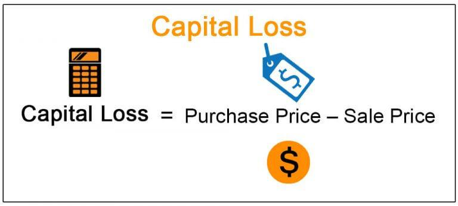

In today's financial market landscape, understanding capital gains and losses is crucial for every investor. These concepts not only affect the profitability of investments but also have significant tax implications. Capital gains refer to the profit realized when an asset is sold for more than its purchase price, whereas capital losses occur when an asset is sold for less than its purchase price. Investors must consider these components to strategically manage their portfolios and optimize their returns over time.

With the rapid advances in technology, the financial markets have seen a transformative shift toward algorithmic trading. This modern trading technique employs complex algorithms to optimize trading strategies, offering a myriad of opportunities to enhance efficiency and accuracy while reducing human error. Algorithmic trading has become a dominant force in the market, revolutionizing how traders and investors approach the buying and selling of assets.

This article seeks to provide a comprehensive guide for navigating the interconnected topics of capital gains, capital losses, investment losses, and algorithmic trading. By examining these elements, investors can make more informed decisions that align with their financial goals. Beyond understanding the basics, it is important to explore the intricacies of tax implications, examine various trading strategies, and appreciate the critical role technology plays in modern investment.

As the financial industry evolves, staying informed about emerging technologies and strategies will help investors maintain a competitive edge. By the end of this guide, investors will have a clearer understanding of how to harness the power of technology, carefully manage investment decisions, and ensure compliance with tax regulations, ultimately contributing to superior investment outcomes.

## Table of Contents

## Understanding Capital Gains and Losses

Capital gains are defined as the profit realized when an asset, such as stocks, bonds, or real estate, is sold for a higher price than its original purchase price. For example, if an investor buys shares at $50 each and later sells them for $70, the capital gain per share is $20. This gain is crucial for investors as it directly impacts their portfolio’s growth and tax liabilities.

Conversely, capital losses occur when an asset is sold for less than its purchase price. For instance, if the same shares initially purchased at $50 are sold for $40, the investor incurs a capital loss of $10 per share. Understanding these concepts is fundamental for tax reporting purposes since capital gains are typically subject to taxation, while capital losses can be used to offset gains, thereby reducing overall taxable income.

Recognizing capital gains and losses plays a pivotal role in strategies such as tax-loss harvesting. This involves selling securities at a loss to offset capital gains tax liabilities. For example, if an investor realizes a capital gain of $5,000 from one stock but a capital loss of $3,000 from another, the net taxable capital gain would be $2,000. Tax-loss harvesting can thus optimize tax outcomes and improve post-tax investment returns.

The effective management of capital gains and losses is significant for optimizing investment returns. Properly timed asset sales can balance portfolios and minimize tax burdens. This approach requires careful planning and often extensive knowledge of tax laws and investment strategies to ensure gains are maximized while losses are minimized.

Through detailed analysis and strategic planning, investors can better navigate the nuances of capital gains and losses. By employing strategies such as tax-loss harvesting and aligning investment decisions with tax implications, investors can enhance their overall financial outcomes, ensuring a more robust portfolio performance in the long term.

## Investment Losses: Types and Strategies

Investment losses are a critical aspect of the investment landscape, and understanding their nature and mitigation strategies is essential for investors aiming to optimize their portfolios. Investment losses can be categorized as realized or unrealized. Realized losses occur when an investor sells an asset for less than its purchase price, thereby locking in the loss. These losses are important for tax purposes, as they can be used to offset capital gains. Unrealized losses, on the other hand, represent a decrease in the value of an asset that has not yet been sold. While these losses do not directly affect taxable income, they impact the overall valuation of an investor's portfolio and the potential returns.

Mitigating investment losses requires a strategic approach. Diversification is a fundamental strategy that involves spreading investments across various asset classes, sectors, or geographical regions to reduce risk. By avoiding concentration in a single asset or market segment, investors can better withstand market [volatility](/wiki/volatility-trading-strategies). Risk management is equally crucial; it involves identifying potential risks and implementing measures such as stop-loss orders, which automatically sell a security when its price falls to a predetermined level, thus limiting losses.

The psychological impact of investment losses can significantly influence investor behavior, often leading to emotional decision-making and panic selling. It is essential for investors to maintain discipline and adhere to a well-defined investment plan. This mindset helps in avoiding rash decisions that could exacerbate losses.

Technology plays a pivotal role in modern investment management. Robo-advisors, driven by algorithms, offer automated financial planning services that can assist in minimizing investment losses. These platforms analyze market conditions and portfolio performance to provide data-driven investment advice. By leveraging such technology, investors can benefit from efficient portfolio management and timely rebalancing to mitigate potential downturns.

Recognizing and reacting to investment loss signals promptly can prevent substantial financial setbacks. Indicators such as moving averages, Relative Strength Index (RSI), and other technical analysis tools can help investors identify potential threats to their portfolios. Additionally, maintaining a regular review schedule of investment performance against predefined benchmarks can alert investors to necessary adjustments.

In conclusion, effectively navigating investment losses involves understanding their types, employing strategic mitigation techniques, and maintaining a disciplined, technology-aided approach. By integrating these practices, investors can better manage losses and achieve sustainable growth in their financial endeavors.

## Algorithmic Trading: The Future of Investment

Algorithmic trading is a method of executing orders using automated pre-programmed trading instructions that account for variables such as time, price, and [volume](/wiki/volume-trading-strategy). This technology is crucial in the contemporary financial markets, enabling high-frequency trading and other sophisticated strategies that surpass human capabilities.

The primary advantages of [algorithmic trading](/wiki/algorithmic-trading) include speed, accuracy, and the reduction of human error. Algorithms can process vast amounts of data at speeds unattainable by human traders, allowing for the swift execution of trades as market conditions fluctuate. With accuracy, algorithms can execute trades at optimal prices and timings, minimizing costs and slippage. The reduction of human error is particularly important as algorithms operate without the emotional biases and fatigue that can affect human traders.

AI and [machine learning](/wiki/machine-learning) are progressively integrated into algorithmic trading to enhance strategy development and execution. These technologies can analyze historical data to identify patterns and correlations that inform trading decisions, dynamically adjusting strategies as new data becomes available. Machine learning models can evolve in response to changing market conditions, continually refining their predictions and trading tactics for improved performance.

Algorithmic trading is also instrumental in managing capital gains and losses effectively. By using algorithms to identify and exploit market inefficiencies, traders can optimize the timing of asset sales to maximize gains and minimize losses. Additionally, algorithmic strategies can assist in tax-loss harvesting by strategically selling assets at a loss to offset taxable capital gains, thus improving overall portfolio tax efficiency.

Successful implementations of algorithmic trading provide insightful case studies on its impact. For instance, quantitative hedge funds have long used algorithm-based strategies to outperform traditional investment approaches, demonstrating both high returns and risk management competence. Companies like Renaissance Technologies have set benchmarks in the industry, utilizing advanced algorithms to consistently achieve market-beating results.

These examples underline the transformative role of algorithmic trading in modern financial markets, showcasing its potential for optimizing investment returns while efficiently managing capital gains and losses. As technology continues to advance, algorithmic trading is anticipated to become ever more prevalent, shaping the future of investment strategies significantly.

## Tax Implications of Capital Gains and Losses

The tax treatment of capital gains and losses varies across different jurisdictions, influencing investment strategies adopted by individuals and corporations. In many countries, capital gains are taxed at different rates depending on the holding period of the asset and the type of asset sold. For instance, in the United States, short-term capital gains on assets held for one year or less are taxed as ordinary income, while long-term capital gains on assets held longer than one year benefit from reduced tax rates. These rates can fluctuate based on legislative changes and political climates, impacting strategic investment planning.

Conversely, capital losses can be deducted to offset gains, reducing taxable income and potentially lowering tax liabilities. This strategy, known as tax-loss harvesting, involves selling securities at a loss to balance taxable gains realized elsewhere in a portfolio. This approach can be particularly beneficial in volatile markets, assisting investors in managing the timing of gains and losses to optimize tax outcomes. An example of tax-loss harvesting might involve an investor selling a stock that has declined in value to reduce the taxable income generated from profitable assets sold within the same fiscal year.

Failing to consider tax implications when managing investments might lead to unexpected financial burdens at tax time. Investors may face higher-than-expected tax bills if gains are not strategically offset by losses, or if opportunities for tax credits are ignored. Additionally, continuously executing trades without understanding their tax repercussions can inadvertently trigger wash sale rules, leading to disallowed deductions. For instance, if an investor repurchases a substantially identical security within 30 days of selling it at a loss, the IRS disallows the loss deduction.

Algorithmic trading presents opportunities for optimizing tax-efficient investing. Automated trading systems can be programmed to execute trades that maximize after-tax returns by incorporating tax-aware strategies. For example, algorithms can be designed to automatically sell off losing investments to harvest tax losses, closely monitor holding periods to capitalize on lower long-term capital gains tax rates, and systematically rebalance portfolios to adhere to tax efficiency.

Given the complex landscape of tax regulations, it is prudent for investors to consult with tax professionals to ensure compliance and optimize taxation of investment activities. Such experts can provide tailored advice, helping navigate local and international tax legislation, and can be invaluable when structuring transactions to align with individual financial goals. Moreover, as algorithmic trading and [artificial intelligence](/wiki/ai-artificial-intelligence) continue to evolve, tax professionals can work in concert with technology specialists to devise sophisticated strategies that marry computational efficiency with fiscal prudence.

## Conclusion: Leveraging Technology for Optimal Investment Outcomes

Understanding the intricacies of capital gains and losses, coupled with the strategic utilization of algorithmic trading, is essential for any investor aiming to achieve optimal investment outcomes. Key takeaways include recognizing the critical role that both capital gains and losses play in an investor's portfolio and understanding how algorithmic trading can facilitate precise execution and management of these financial elements.

Integrating technology into investment strategies is pivotal in mitigating risks and enhancing returns. Algorithmic trading, powered by advancements in artificial intelligence and machine learning, enables investors to execute trades with unparalleled speed and accuracy. This minimizes human error and allows for the sophisticated analysis of market conditions, ensuring timely and informed decisions.

Investors are encouraged to stay abreast of new tools and techniques in the dynamic trading environment. Continuous education and adaptation are crucial to leveraging the potential of emerging technologies effectively. This proactive approach prepares investors for the evolving landscape, ensuring resilience and competitiveness.

Looking ahead, trading is poised to undergo significant transformations driven by technological advancements. Technologies such as quantum computing and blockchain are expected to further refine trading strategies, offering more efficient, secure, and transparent transactions. Investors who embrace these innovations will likely find themselves at the forefront of the financial markets, equipped to navigate future challenges.

Strategic planning and disciplined execution remain the bedrock of achieving long-term financial goals. While technology can provide powerful tools and insights, the onus is on the investor to apply these tools effectively within a comprehensive investment plan. By doing so, investors can optimize their portfolios, safeguard their wealth, and steer towards sustained financial success.

## References & Further Reading

[1]: ["Advances in Financial Machine Learning"](https://www.amazon.com/Advances-Financial-Machine-Learning-Marcos/dp/1119482089) by Marcos Lopez de Prado

[2]: ["Evidence-Based Technical Analysis: Applying the Scientific Method and Statistical Inference to Trading Signals"](https://www.amazon.com/Evidence-Based-Technical-Analysis-Scientific-Statistical/dp/0470008741) by David Aronson

[3]: ["Machine Learning for Algorithmic Trading"](https://github.com/PacktPublishing/Machine-Learning-for-Algorithmic-Trading-Second-Edition) by Stefan Jansen

[4]: ["Quantitative Trading: How to Build Your Own Algorithmic Trading Business"](https://www.amazon.com/Quantitative-Trading-Build-Algorithmic-Business/dp/1119800064) by Ernest P. Chan

[5]: Pomeranets, Anna, and Daniel G. Weaver. [“Security Transaction Taxes and Market Quality.”](https://www.cambridge.org/core/journals/journal-of-financial-and-quantitative-analysis/article/abs/securities-transaction-taxes-and-market-quality/89771177879EA541D9388613ACDCC93C) Journal of Financial and Quantitative Analysis, vol. 43, no. 2, 2008, pp. 383–395.

[6]: Kissell, Robert. ["The Science of Algorithmic Trading and Portfolio Management."](https://www.sciencedirect.com/book/9780124016897/the-science-of-algorithmic-trading-and-portfolio-management) Academic Press, 2013.