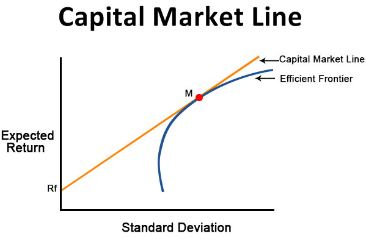

Understanding the intricacies of financial markets forms the backbone of effective investment strategies. In this complex landscape, the Capital Market Line (CML) emerges as a fundamental concept that seamlessly integrates risk and return in portfolio management. Rooted in Modern Portfolio Theory, the CML provides a graphical representation illustrating the highest expected returns investors can achieve for a defined level of risk. This article explores the essence of the CML, its calculation, and its significance, especially in the context of algorithmic trading.

The CML differentiates itself by considering both risk-free assets and risky market portfolios, offering a comprehensive approach to portfolio optimization. This integration allows investors to construct portfolios that lie on the CML, optimally balancing risk and return. Understanding the CML empowers investors to maximize their portfolio's performance while aligning with their risk tolerance and investment goals.



As financial markets become increasingly sophisticated, incorporating quantitative methods and algorithmic strategies, the relevance of concepts like the CML grows. By employing algorithms that utilize the CML, investors can dynamically adjust their portfolios to maintain optimal performance, ensuring they achieve superior risk-adjusted returns. Let's begin by examining the foundational aspects of the Capital Market Line and how they affect financial decision-making, providing the knowledge needed to navigate the complexities of modern investing.

## Table of Contents

## Understanding the Capital Market Line (CML)

The Capital Market Line (CML) is a foundational concept in modern portfolio theory, prominently used to illustrate the trade-off between risk and return for efficient portfolios. It serves as a benchmark for assessing the performance of risk-bearing portfolios, presenting a linear relationship between expected return and risk, measured by standard deviation.

The derivation of the CML stems from the Capital Asset Pricing Model (CAPM), which provides a framework for determining the expected return of an asset based on its inherent risk compared to the market. The CML extends this model by combining risk-free assets, such as treasury bills, with a market portfolio—itself composed of various risky assets. 

The CML is often considered superior to the Efficient Frontier, a concept introduced in the Markowitz Portfolio Theory, because it incorporates risk-free assets into the analysis. While the Efficient Frontier maps portfolios that maximize expected return for a given level of risk without citing a risk-free rate, the CML integrates both, establishing a tangent line from the risk-free rate to the Efficient Frontier. This line represents the set of portfolios offering the highest expected return for each level of risk, enabling investors to optimize their portfolios by adjusting their proportions of risk-free and risky assets.

Mathematically, any portfolio on the CML can be represented as a linear combination of the risk-free asset and the market portfolio. The expected return $E(R_p)$ of a portfolio on the CML is calculated using the equation:

$$
E(R_p) = R_f + \frac{\sigma_p}{\sigma_m} \times (E(R_m) - R_f)
$$

where:
- $E(R_p)$ is the expected return of the portfolio.
- $R_f$ is the risk-free rate.
- $\sigma_p$ is the standard deviation of the portfolio's returns.
- $\sigma_m$ is the standard deviation of market returns.
- $E(R_m)$ is the expected return of the market portfolio.

The significance of the CML lies in its ability to guide investors toward portfolios that are optimally balanced in terms of risk and return. Portfolios located on the CML are deemed efficient, meaning they capitalize on the highest attainable return for a specified level of risk. This characteristic allows investors to discern the best possible return scenarios while keeping within their desired risk parameters, ultimately leading to informed financial decision-making.

## Formula and Calculation of CML

The Capital Market Line (CML) is a fundamental concept in financial markets, providing a graphical representation of the relationship between risk and expected return for efficient portfolios. The formula for the CML is crucial for calculating the expected return of a portfolio based on its level of risk. It is expressed as:

$$
ER_p = R_f + \frac{\sigma_p}{\sigma_m} \times (ER_m - R_f)
$$

Where:
- $ER_p$ is the expected return of the portfolio.
- $R_f$ represents the risk-free rate.
- $\sigma_p$ denotes the standard deviation of the portfolio's returns, indicating its risk level.
- $ER_m$ signifies the expected return of the market portfolio.
- $\sigma_m$ is the standard deviation of the market portfolio's returns.

The components of this formula are vital as each plays a critical role in portfolio management:

1. **Risk-Free Rate ($R_f$)**: This is typically the return on government bonds, such as U.S. Treasury bills, which are considered free from default risk. The inclusion of the risk-free rate is essential as it serves as a baseline return, independent of market volatility.

2. **Market Return ($ER_m$)**: This represents the expected return from the market portfolio, theoretically containing all assets in the market. This value is usually estimated based on historical market data and reflects the performance of the market as a whole.

3. **Standard Deviations ($\sigma_p$ and $\sigma_m$)**: These metrics measure the volatility of the portfolio and market returns, respectively. The ratio $\frac{\sigma_p}{\sigma_m}$ indicates the relative risk of the portfolio compared to the market.

The CML formula assists investors in determining the expected return of a portfolio for a given level of risk. By plotting portfolios along the CML, investors can visualize and interpret their potential returns and efficiently manage risk. The position of a portfolio on or above the CML suggests that it is well-optimized with respect to risk and return trade-offs.

Utilizing programming tools like Python can facilitate the calculation and visualization of the CML. Below is a simple Python snippet illustrating how to calculate the expected return of a portfolio using the CML formula:

```python
def calculate_expected_return(risk_free_rate, market_return, portfolio_std_dev, market_std_dev):
    return risk_free_rate + (portfolio_std_dev / market_std_dev) * (market_return - risk_free_rate)

# Example usage
Rf = 0.02  # Risk-free rate
ERm = 0.08  # Market return
SDp = 0.15  # Portfolio standard deviation
SDm = 0.18  # Market standard deviation

expected_return = calculate_expected_return(Rf, ERm, SDp, SDm)
print(f"Expected Portfolio Return: {expected_return:.2%}")
```

This approach supports investors in quantitatively assessing portfolio choices, ensuring they align with their risk tolerance and investment goals.

## Why CML Matters in Financial Markets

The Capital Market Line (CML) plays a vital role in financial markets by helping investors determine the optimal balance between risk and return within a portfolio. As a visualization of portfolio efficiency, the CML represents the best possible combinations of risk-free assets and a diversified market portfolio, allowing investors to allocate their resources most effectively.

Portfolios positioned along the CML are considered optimal because they provide the highest expected return for a specified level of risk. This characteristic is especially important for investors aiming to achieve the ideal risk-return trade-off. By aligning portfolios with the CML, investors can ensure they are not taking on unnecessary risk in pursuit of additional returns. 

Understanding the CML is paramount for investors who seek to align their portfolios with their risk tolerance. The critical insight offered by the CML is that any portfolio not situated on or above this line is suboptimal, as it either carries excess risk or generates insufficient return for its level of risk. This understanding allows investors to optimize their performance while considering both their risk appetite and market conditions.

The slope of the CML is determined by the Sharpe Ratio, a key metric in assessing investment choices. The Sharpe Ratio is defined as:

$$
\text{Sharpe Ratio} = \frac{\text{ERm} - \text{Rf}}{\text{SDm}}
$$

where ERm denotes the expected return of the market portfolio, Rf represents the risk-free rate, and SDm is the standard deviation of the market returns. Higher Sharpe Ratios indicate more favorable risk-adjusted returns, serving as a crucial guide for investment decisions. Consequently, portfolio managers and investors use the Sharpe Ratio to evaluate the efficiency of various investment portfolios relative to the risk-free rate, thereby allowing for more informed decision-making aligned with the insights provided by the CML.

## CML in Algorithmic Trading

Algorithmic trading, which employs complex algorithms to make high-frequency trading decisions, benefits significantly from a deep understanding of the Capital Market Line (CML). By leveraging CML, these trading systems are capable of computing and adjusting portfolios to ensure they maintain optimal positioning in terms of risk and return.

### Role of CML in Algorithmic Trading

Algorithmic trading platforms utilize the principles of the CML to dynamically manage portfolios with a focus on efficiency and optimization. By positioning portfolios on or above the CML, traders strive to achieve maximum potential returns for a given level of risk, thereby ensuring adherence to the optimal risk-return profile.

This is achieved primarily through the evaluation of Sharpe Ratios, which measure the risk-adjusted return of an investment. The Sharpe Ratio is computed as:

$$
\text{Sharpe Ratio} = \frac{E[R_p] - R_f}{\sigma_p}
$$

where $E[R_p]$ is the expected return of the portfolio, $R_f$ is the risk-free rate, and $\sigma_p$ is the standard deviation of the portfolio's excess return. Algorithms can analyze these ratios to decide which securities to buy or sell based on their position relative to the CML.

### Implementation in Algorithmic Systems

In practice, algorithmic systems can be programmed to constantly evaluate the Sharpe Ratios of various portfolios, comparing these to the market's expected returns and risk parameters derived from the CML. Here's an example of a simple Python code snippet that can be part of such a system:

```python
def calculate_sharpe_ratio(expected_return, risk_free_rate, std_dev):
    return (expected_return - risk_free_rate) / std_dev

def adjust_portfolio(portfolios, risk_free_rate, market_return, market_std_dev):
    optimal_portfolios = []
    for portfolio in portfolios:
        sharpe_ratio = calculate_sharpe_ratio(portfolio.expected_return, risk_free_rate, portfolio.std_dev)
        if sharpe_ratio >= (market_return - risk_free_rate) / market_std_dev:
            optimal_portfolios.append(portfolio)
    return optimal_portfolios

portfolios = [{'expected_return': 0.1, 'std_dev': 0.15}, {'expected_return': 0.2, 'std_dev': 0.25}]
risk_free_rate = 0.02
market_return = 0.08
market_std_dev = 0.2

optimal = adjust_portfolio(portfolios, risk_free_rate, market_return, market_std_dev)
```

### Benefits and Considerations

By integrating the CML into algorithmic frameworks, traders can ensure that their strategies are aligned with theoretical models of market behavior, enhancing decision-making related to risk and return. However, it is crucial for these systems to continuously update parameters in response to market changes to sustain optimal performance.

In summary, the application of the Capital Market Line within [algorithmic trading](/wiki/algorithmic-trading) offers a structured approach to managing portfolios, facilitating decisions that optimize for the highest risk-adjusted returns while considering the dynamic nature of financial markets.

## CML vs. SML: Key Differences

The Capital Market Line (CML) and the Security Market Line (SML) are both integral components of modern portfolio theory, yet they serve distinct functions in the analysis of financial markets. Understanding these differences is crucial for investors aiming to optimize their investment strategies.

The CML is a representation of the portfolios that optimally balance risk and return by incorporating both risk-free assets and the market portfolio. It is derived using the Capital Asset Pricing Model (CAPM) and reflects total risk, which includes both systematic and unsystematic risk. The total risk is measured through standard deviation. The CML is expressed as:

$$
ER_p = R_f + \frac{SD_p}{SD_m} \times (ER_m - R_f)
$$

where $ER_p$ is the expected return on the portfolio, $R_f$ is the risk-free rate, $SD_p$ is the standard deviation of the portfolio’s returns, $SD_m$ is the standard deviation of the market returns, and $ER_m$ is the expected return of the market.

On the other hand, the SML is also derived from CAPM but focuses solely on systematic risk, which is the market risk inherent to all investments. This risk is measured using beta ($\beta$), which denotes a security’s sensitivity to movements in the overall market. The SML is a graphical representation of the expected return of an asset at different levels of systematic risk and is expressed by the equation:

$$
ER_i = R_f + \beta_i \times (ER_m - R_f)
$$

where $ER_i$ is the expected return of the asset and $\beta_i$ is the beta of the asset.

The primary distinction lies in the type of risk each line addresses: while the CML considers total risk, the SML exclusively accounts for systematic risk. This distinction enables the CML to assist with portfolio optimization by balancing all types of risk, whereas the SML aids in understanding the expected return for individual assets based only on their systematic risk exposure. Both lines provide valuable insights but are applied in different contexts within investment analysis.

## Conclusion

The Capital Market Line (CML) is an integral concept in modern portfolio theory, significantly influencing financial decision-making and operations in financial markets. By comprehending and employing the principles underlying the CML, investors and traders have the ability to optimize their portfolios for superior risk-adjusted returns. The CML facilitates these outcomes by providing a framework within which investors can evaluate the trade-off between risk and expected return, essentially allowing for portfolio optimization that aligns with individual risk tolerance and investment goals.

As the financial landscape continually evolves, especially with the integration of technologies like algorithmic trading, understanding the nuances of the CML remains crucial. Algorithmic trading systems can leverage the insights offered by the CML to construct and adjust portfolios that maximize efficiency and returns. The ability to dynamically adjust portfolios to ensure alignment with or superiority over the CML places investors at a distinct advantage, offering a strategic edge in performance.

Moreover, the competitive nature of financial markets necessitates a continuous learning approach, urging investors to deepen their understanding of CML strategies actively. Mastering these concepts not only aids in immediate portfolio optimization but also equips investors to adapt robustly to future market fluctuations and technological advancements. In conclusion, maintaining a strong grasp of the Capital Market Line and its applications will be essential for investors seeking to maintain competitiveness and achieve optimal financial outcomes in ever-evolving markets.

## References & Further Reading

[1]: Sharpe, W. F. (1966). ["Mutual Fund Performance."](https://www.scirp.org/reference/ReferencesPapers?ReferenceID=1451307) Journal of Business, 39(1).

[2]: Bodie, Z., Kane, A., & Marcus, A. J. (2013). ["Investments"](https://www.mheducation.com/highered/product/Investments-Bodie.html), McGraw-Hill Education.

[3]: Markowitz, H. (1952). ["Portfolio Selection."](https://onlinelibrary.wiley.com/doi/abs/10.1111/j.1540-6261.1952.tb01525.x) The Journal of Finance, 7(1), 77-91.

[4]: Malkiel, B. G. (2015). ["A Random Walk Down Wall Street: The Time-tested Strategy for Successful Investing."](https://www.academia.edu/10850809/A_Random_Walk_Down_Wall_Street_The_Time_Tested_Strategy_for_Successful_Investing)

[5]: Black, F., Jensen, M. C., & Scholes, M. S. (1972). ["The Capital Asset Pricing Model: Some Empirical Tests."](https://papers.ssrn.com/sol3/papers.cfm?abstract_id=908569) Praeger Publishers Inc.

[6]: Elton, E. J., Gruber, M. J., Brown, S. J., & Goetzmann, W. N. (2014). ["Modern Portfolio Theory and Investment Analysis."](https://books.google.com/books/about/Modern_Portfolio_Theory_and_Investment_A.html?id=181CEAAAQBAJ) Wiley.

[7]: Fabozzi, F. J., & Markowitz, H. M. (2002). ["The Theory and Practice of Investment Management."](https://onlinelibrary.wiley.com/doi/book/10.1002/9781118267028) Wiley.