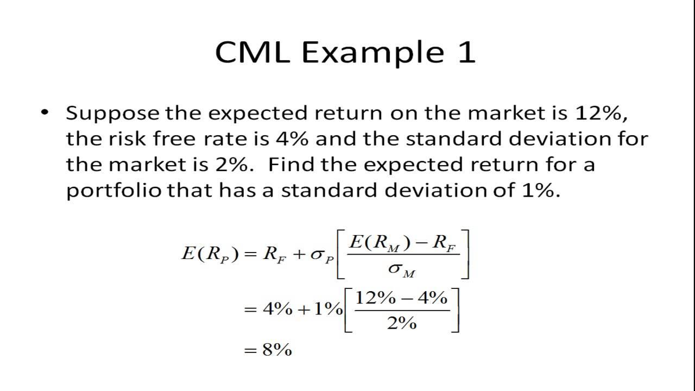

## Table of Contents

## What is the Capital Market Line (CML)?

The Capital Market Line (CML) is a line on a graph that shows the relationship between risk and return for efficient portfolios. It starts from the risk-free rate, which is the return you can get from an investment with no risk, like a government bond. The CML helps investors see how much extra return they can expect for taking on more risk by investing in a mix of risky assets and the risk-free asset.

The slope of the CML is called the Sharpe ratio, which measures how well an investment's returns compensate for the risk taken. A steeper slope means a better reward for the risk. Portfolios on the CML are considered efficient because they offer the highest possible return for a given level of risk. Investors use the CML to decide how to balance their investments between safe and risky assets to get the best return for their comfort level with risk.

## How does the Capital Market Line relate to the risk-free rate?

The Capital Market Line (CML) starts from the risk-free rate. The risk-free rate is like the safest place to put your money, where you know exactly what you'll get back, like with a government bond. When you draw the CML on a graph, it begins at this point, showing that if you want no risk, you get the risk-free rate.

From the risk-free rate, the CML goes up and to the right. This shows that if you're willing to take on more risk by mixing in risky investments, you can expect to earn more. The CML helps you see how much extra return you might get for each bit of risk you take on. It's a guide to help you decide how much risk you want to take for the potential reward.

## What role does the market portfolio play in the Capital Market Line?

The market portfolio is a key part of the Capital Market Line. It's like a big basket that holds all the risky investments out there, like stocks from all over the world. When you draw the CML on a graph, the market portfolio is the point where the line touches the highest part of the curve that shows all the possible risky investments. This point is special because it gives you the best mix of risk and return you can get from just risky investments.

The CML shows how you can mix the market portfolio with the risk-free rate to make different portfolios. If you want less risk, you can put more of your money in the risk-free asset and less in the market portfolio. If you want more return and are okay with more risk, you can put more money in the market portfolio. The CML helps you see all these different mixes and pick the one that's right for you.

## How is the Capital Market Line different from the Security Market Line (SML)?

The Capital Market Line (CML) and the Security Market Line (SML) both help investors understand the relationship between risk and return, but they do it in different ways. The CML shows how you can mix a risk-free asset, like a government bond, with a market portfolio, which is like a basket of all risky investments. It starts at the risk-free rate and goes up to show how much more return you can expect if you're willing to take on more risk. The CML is all about efficient portfolios, which means the best return you can get for the amount of risk you take.

On the other hand, the SML looks at individual investments, like stocks, and compares them to the market as a whole. It starts at the risk-free rate too, but it goes up based on something called beta, which measures how much riskier a stock is compared to the market. The SML helps you see if a stock is giving you a good enough return for the risk it has. If a stock is above the SML, it's doing better than expected, and if it's below, it's not doing as well.

So, the big difference is that the CML is about mixing a risk-free asset with the whole market to find the best portfolio, while the SML is about judging single investments against the market to see if they're worth it. Both lines start at the risk-free rate, but they help you in different ways when you're deciding where to put your money.

## What are the assumptions underlying the Capital Market Line?

The Capital Market Line is based on some key ideas that help make it work. One big idea is that all investors can borrow and lend money at the same risk-free rate. This means everyone can get the same safe return if they want, and they can also borrow money at that same rate if they want to take on more risk. Another idea is that all investors have the same expectations about how investments will do in the future. This means everyone agrees on what the market portfolio should look like and how risky it is.

Another important assumption is that investors can buy and sell as much of any investment as they want, without affecting the price. This means the market is perfect and there are no limits on what you can do. Finally, investors care only about how much risk they're taking and how much return they're getting. They don't worry about anything else, like how easy it is to sell their investments or if the company they're investing in is doing good things for the world. These assumptions help make the Capital Market Line a simple and useful tool for understanding risk and return.

## How do you calculate the slope of the Capital Market Line?

The slope of the Capital Market Line is called the Sharpe ratio. It tells you how much extra return you get for each bit of risk you take on. To calculate it, you need to know three things: the expected return of the market portfolio, the risk-free rate, and the standard deviation of the market portfolio's return. The standard deviation is a way to measure how much the market's return might go up and down.

You find the slope by taking the expected return of the market portfolio and subtracting the risk-free rate. Then, you divide that number by the standard deviation of the market portfolio's return. So, the formula is: Slope = (Expected Return of Market Portfolio - Risk-Free Rate) / Standard Deviation of Market Portfolio's Return. This slope shows how well the market portfolio rewards you for the risk you're taking.

## What is the formula for plotting the Capital Market Line?

The Capital Market Line helps you see how much return you can expect for the risk you take. To plot it, you start at the risk-free rate on a graph. The risk-free rate is what you get from the safest investments, like government bonds. From there, you draw a straight line that goes up and to the right. This line shows how much more return you can get if you mix the risk-free asset with the market portfolio, which is like a basket of all risky investments.

The slope of this line is important because it tells you how much extra return you get for each bit of risk. You find the slope by taking the expected return of the market portfolio and subtracting the risk-free rate. Then, you divide that number by the standard deviation of the market portfolio's return. The standard deviation is a way to measure how much the market's return might go up and down. So, the formula for the slope is: Slope = (Expected Return of Market Portfolio - Risk-Free Rate) / Standard Deviation of Market Portfolio's Return. With this slope, you can draw the Capital Market Line on your graph, starting from the risk-free rate and going up at that angle.

## How can investors use the Capital Market Line to optimize their portfolios?

Investors can use the Capital Market Line to figure out the best way to mix safe and risky investments in their portfolio. The CML shows them how much extra return they can expect for taking on more risk. By looking at the line, investors can see where their current portfolio sits compared to the line. If their portfolio is below the CML, it means they're not getting enough return for the risk they're taking. They might want to change their investments to move up to the line, where they can get a better reward for the same amount of risk.

To optimize their portfolio, investors can decide how much risk they're comfortable with and then use the CML to find the right mix of the risk-free asset and the market portfolio. If they want less risk, they can put more money in the risk-free asset, like government bonds, and less in the market portfolio. If they're okay with more risk and want a higher return, they can put more money in the market portfolio. The CML helps them see all the possible mixes and pick the one that fits their goals and how much risk they're willing to take.

## What impact does changing the risk-free rate have on the Capital Market Line?

When the risk-free rate changes, it shifts the whole Capital Market Line. If the risk-free rate goes up, the starting point of the CML moves up too. This means that for the same amount of risk, you can now get a higher return because the safe part of your investment is [earning](/wiki/earning-announcement) more. On the other hand, if the risk-free rate goes down, the starting point of the CML moves down. This means you'll get a lower return for the same level of risk because the safe part of your investment is earning less.

The slope of the CML, which is the Sharpe ratio, also changes when the risk-free rate changes. If the risk-free rate goes up and the expected return of the market portfolio stays the same, the slope of the CML gets smaller. This means you get less extra return for each bit of risk you take on. If the risk-free rate goes down and the expected return of the market portfolio stays the same, the slope gets steeper. This means you get more extra return for each bit of risk. So, changes in the risk-free rate can really affect how investors decide to mix safe and risky investments in their portfolios.

## How does the Capital Market Line adjust for different levels of market risk?

The Capital Market Line (CML) helps investors see how much return they can expect for different levels of risk. The CML is a straight line that starts at the risk-free rate, which is the return you get from super safe investments like government bonds. As you move along the line to the right, you take on more risk by adding more of the market portfolio, which is like a basket of all risky investments. The further you go along the line, the more risk you take, but you also expect to get a higher return.

When the level of market risk changes, the CML changes too. If the market becomes riskier, the standard deviation of the market portfolio's return goes up. This makes the slope of the CML less steep because you're not getting as much extra return for the extra risk you're taking on. On the other hand, if the market becomes less risky, the standard deviation goes down, making the slope of the CML steeper. This means you get more return for the same amount of risk. So, the CML adjusts to show investors how different levels of market risk affect the balance between risk and return in their portfolios.

## What are the limitations of using the Capital Market Line in investment decisions?

The Capital Market Line is a useful tool, but it has some limits when you use it to make investment choices. One big limit is that it assumes all investors can borrow and lend money at the same risk-free rate. In real life, this isn't true. Some people might have to pay more to borrow money, and this can change how they invest. The CML also assumes that everyone agrees on what the market will do in the future. But in reality, people have different ideas about how investments will perform, which can make it hard to use the CML to plan their portfolios.

Another limitation is that the CML assumes the market is perfect. This means you can buy and sell as much of any investment as you want without changing the price. But in the real world, buying or selling a lot of something can move the price, and there are also limits on how much you can buy or sell. The CML also focuses only on risk and return, ignoring other things investors might care about, like how easy it is to sell their investments or if the company they're investing in is doing good things for the world. So, while the CML can be a helpful guide, it's important to remember these limits when making investment decisions.

## How can advanced statistical methods improve the accuracy of the Capital Market Line calculations?

Advanced statistical methods can help make the Capital Market Line more accurate by giving us better ways to guess how much risk and return we'll get from the market. For example, instead of just using simple averages to predict the market's return, we can use something called regression analysis. This method looks at how different things, like the economy or company news, affect the market. By using regression, we can make smarter guesses about what the market will do, which makes the CML more useful for deciding how to invest.

Also, we can use something called Monte Carlo simulation to see how different situations might affect the CML. This method runs a lot of different scenarios to see how the market might change and how that would move the CML. It helps us understand how different levels of risk and return could play out, so we can be more ready for what might happen. By using these advanced methods, we can make the CML a better tool for planning our investments, even though it still has some limits.

## What is the Capital Market Line (CML) and how can it be understood?

The Capital Market Line (CML) is a foundational concept in modern portfolio theory, prominently used to illustrate the trade-off between risk and return for efficient portfolios. It serves as a benchmark for assessing the performance of risk-bearing portfolios, presenting a linear relationship between expected return and risk, measured by standard deviation.

The derivation of the CML stems from the Capital Asset Pricing Model (CAPM), which provides a framework for determining the expected return of an asset based on its inherent risk compared to the market. The CML extends this model by combining risk-free assets, such as treasury bills, with a market portfolio—itself composed of various risky assets. 

The CML is often considered superior to the Efficient Frontier, a concept introduced in the Markowitz Portfolio Theory, because it incorporates risk-free assets into the analysis. While the Efficient Frontier maps portfolios that maximize expected return for a given level of risk without citing a risk-free rate, the CML integrates both, establishing a tangent line from the risk-free rate to the Efficient Frontier. This line represents the set of portfolios offering the highest expected return for each level of risk, enabling investors to optimize their portfolios by adjusting their proportions of risk-free and risky assets.

Mathematically, any portfolio on the CML can be represented as a linear combination of the risk-free asset and the market portfolio. The expected return $E(R_p)$ of a portfolio on the CML is calculated using the equation:

$$
E(R_p) = R_f + \frac{\sigma_p}{\sigma_m} \times (E(R_m) - R_f)
$$

where:
- $E(R_p)$ is the expected return of the portfolio.
- $R_f$ is the risk-free rate.
- $\sigma_p$ is the standard deviation of the portfolio's returns.
- $\sigma_m$ is the standard deviation of market returns.
- $E(R_m)$ is the expected return of the market portfolio.

The significance of the CML lies in its ability to guide investors toward portfolios that are optimally balanced in terms of risk and return. Portfolios located on the CML are deemed efficient, meaning they capitalize on the highest attainable return for a specified level of risk. This characteristic allows investors to discern the best possible return scenarios while keeping within their desired risk parameters, ultimately leading to informed financial decision-making.

## What is the Formula and Calculation of CML?

The Capital Market Line (CML) is a fundamental concept in financial markets, providing a graphical representation of the relationship between risk and expected return for efficient portfolios. The formula for the CML is crucial for calculating the expected return of a portfolio based on its level of risk. It is expressed as:

$$
ER_p = R_f + \frac{\sigma_p}{\sigma_m} \times (ER_m - R_f)
$$

Where:
- $ER_p$ is the expected return of the portfolio.
- $R_f$ represents the risk-free rate.
- $\sigma_p$ denotes the standard deviation of the portfolio's returns, indicating its risk level.
- $ER_m$ signifies the expected return of the market portfolio.
- $\sigma_m$ is the standard deviation of the market portfolio's returns.

The components of this formula are vital as each plays a critical role in portfolio management:

1. **Risk-Free Rate ($R_f$)**: This is typically the return on government bonds, such as U.S. Treasury bills, which are considered free from default risk. The inclusion of the risk-free rate is essential as it serves as a baseline return, independent of market volatility.

2. **Market Return ($ER_m$)**: This represents the expected return from the market portfolio, theoretically containing all assets in the market. This value is usually estimated based on historical market data and reflects the performance of the market as a whole.

3. **Standard Deviations ($\sigma_p$ and $\sigma_m$)**: These metrics measure the volatility of the portfolio and market returns, respectively. The ratio $\frac{\sigma_p}{\sigma_m}$ indicates the relative risk of the portfolio compared to the market.

The CML formula assists investors in determining the expected return of a portfolio for a given level of risk. By plotting portfolios along the CML, investors can visualize and interpret their potential returns and efficiently manage risk. The position of a portfolio on or above the CML suggests that it is well-optimized with respect to risk and return trade-offs.

Utilizing programming tools like Python can facilitate the calculation and visualization of the CML. Below is a simple Python snippet illustrating how to calculate the expected return of a portfolio using the CML formula:

```python
def calculate_expected_return(risk_free_rate, market_return, portfolio_std_dev, market_std_dev):
    return risk_free_rate + (portfolio_std_dev / market_std_dev) * (market_return - risk_free_rate)

# Example usage
Rf = 0.02  # Risk-free rate
ERm = 0.08  # Market return
SDp = 0.15  # Portfolio standard deviation
SDm = 0.18  # Market standard deviation

expected_return = calculate_expected_return(Rf, ERm, SDp, SDm)
print(f"Expected Portfolio Return: {expected_return:.2%}")
```

This approach supports investors in quantitatively assessing portfolio choices, ensuring they align with their risk tolerance and investment goals.

## Why does CML matter in financial markets?

The Capital Market Line (CML) plays a vital role in financial markets by helping investors determine the optimal balance between risk and return within a portfolio. As a visualization of portfolio efficiency, the CML represents the best possible combinations of risk-free assets and a diversified market portfolio, allowing investors to allocate their resources most effectively.

Portfolios positioned along the CML are considered optimal because they provide the highest expected return for a specified level of risk. This characteristic is especially important for investors aiming to achieve the ideal risk-return trade-off. By aligning portfolios with the CML, investors can ensure they are not taking on unnecessary risk in pursuit of additional returns. 

Understanding the CML is paramount for investors who seek to align their portfolios with their risk tolerance. The critical insight offered by the CML is that any portfolio not situated on or above this line is suboptimal, as it either carries excess risk or generates insufficient return for its level of risk. This understanding allows investors to optimize their performance while considering both their risk appetite and market conditions.

The slope of the CML is determined by the Sharpe Ratio, a key metric in assessing investment choices. The Sharpe Ratio is defined as:

$$
\text{Sharpe Ratio} = \frac{\text{ERm} - \text{Rf}}{\text{SDm}}
$$

where ERm denotes the expected return of the market portfolio, Rf represents the risk-free rate, and SDm is the standard deviation of the market returns. Higher Sharpe Ratios indicate more favorable risk-adjusted returns, serving as a crucial guide for investment decisions. Consequently, portfolio managers and investors use the Sharpe Ratio to evaluate the efficiency of various investment portfolios relative to the risk-free rate, thereby allowing for more informed decision-making aligned with the insights provided by the CML.

## What is the role of CML in Algorithmic Trading?

Algorithmic trading, which employs complex algorithms to make high-frequency trading decisions, benefits significantly from a deep understanding of the Capital Market Line (CML). By leveraging CML, these trading systems are capable of computing and adjusting portfolios to ensure they maintain optimal positioning in terms of risk and return.

### Role of CML in Algorithmic Trading

Algorithmic trading platforms utilize the principles of the CML to dynamically manage portfolios with a focus on efficiency and optimization. By positioning portfolios on or above the CML, traders strive to achieve maximum potential returns for a given level of risk, thereby ensuring adherence to the optimal risk-return profile.

This is achieved primarily through the evaluation of Sharpe Ratios, which measure the risk-adjusted return of an investment. The Sharpe Ratio is computed as:

$$
\text{Sharpe Ratio} = \frac{E[R_p] - R_f}{\sigma_p}
$$

where $E[R_p]$ is the expected return of the portfolio, $R_f$ is the risk-free rate, and $\sigma_p$ is the standard deviation of the portfolio's excess return. Algorithms can analyze these ratios to decide which securities to buy or sell based on their position relative to the CML.

### Implementation in Algorithmic Systems

In practice, algorithmic systems can be programmed to constantly evaluate the Sharpe Ratios of various portfolios, comparing these to the market's expected returns and risk parameters derived from the CML. Here's an example of a simple Python code snippet that can be part of such a system:

```python
def calculate_sharpe_ratio(expected_return, risk_free_rate, std_dev):
    return (expected_return - risk_free_rate) / std_dev

def adjust_portfolio(portfolios, risk_free_rate, market_return, market_std_dev):
    optimal_portfolios = []
    for portfolio in portfolios:
        sharpe_ratio = calculate_sharpe_ratio(portfolio.expected_return, risk_free_rate, portfolio.std_dev)
        if sharpe_ratio >= (market_return - risk_free_rate) / market_std_dev:
            optimal_portfolios.append(portfolio)
    return optimal_portfolios

portfolios = [{'expected_return': 0.1, 'std_dev': 0.15}, {'expected_return': 0.2, 'std_dev': 0.25}]
risk_free_rate = 0.02
market_return = 0.08
market_std_dev = 0.2

optimal = adjust_portfolio(portfolios, risk_free_rate, market_return, market_std_dev)
```

### Benefits and Considerations

By integrating the CML into algorithmic frameworks, traders can ensure that their strategies are aligned with theoretical models of market behavior, enhancing decision-making related to risk and return. However, it is crucial for these systems to continuously update parameters in response to market changes to sustain optimal performance.

In summary, the application of the Capital Market Line within [algorithmic trading](/wiki/algorithmic-trading) offers a structured approach to managing portfolios, facilitating decisions that optimize for the highest risk-adjusted returns while considering the dynamic nature of financial markets.

## What are the key differences between CML and SML?

The Capital Market Line (CML) and the Security Market Line (SML) are both integral components of modern portfolio theory, yet they serve distinct functions in the analysis of financial markets. Understanding these differences is crucial for investors aiming to optimize their investment strategies.

The CML is a representation of the portfolios that optimally balance risk and return by incorporating both risk-free assets and the market portfolio. It is derived using the Capital Asset Pricing Model (CAPM) and reflects total risk, which includes both systematic and unsystematic risk. The total risk is measured through standard deviation. The CML is expressed as:

$$
ER_p = R_f + \frac{SD_p}{SD_m} \times (ER_m - R_f)
$$

where $ER_p$ is the expected return on the portfolio, $R_f$ is the risk-free rate, $SD_p$ is the standard deviation of the portfolio’s returns, $SD_m$ is the standard deviation of the market returns, and $ER_m$ is the expected return of the market.

On the other hand, the SML is also derived from CAPM but focuses solely on systematic risk, which is the market risk inherent to all investments. This risk is measured using beta ($\beta$), which denotes a security’s sensitivity to movements in the overall market. The SML is a graphical representation of the expected return of an asset at different levels of systematic risk and is expressed by the equation:

$$
ER_i = R_f + \beta_i \times (ER_m - R_f)
$$

where $ER_i$ is the expected return of the asset and $\beta_i$ is the beta of the asset.

The primary distinction lies in the type of risk each line addresses: while the CML considers total risk, the SML exclusively accounts for systematic risk. This distinction enables the CML to assist with portfolio optimization by balancing all types of risk, whereas the SML aids in understanding the expected return for individual assets based only on their systematic risk exposure. Both lines provide valuable insights but are applied in different contexts within investment analysis.

## References & Further Reading

[1]: Sharpe, W. F. (1966). ["Mutual Fund Performance."](https://www.scirp.org/reference/ReferencesPapers?ReferenceID=1451307) Journal of Business, 39(1).

[2]: Bodie, Z., Kane, A., & Marcus, A. J. (2013). ["Investments"](https://www.mheducation.com/highered/product/Investments-Bodie.html), McGraw-Hill Education.

[3]: Markowitz, H. (1952). ["Portfolio Selection."](https://onlinelibrary.wiley.com/doi/abs/10.1111/j.1540-6261.1952.tb01525.x) The Journal of Finance, 7(1), 77-91.

[4]: Malkiel, B. G. (2015). ["A Random Walk Down Wall Street: The Time-tested Strategy for Successful Investing."](https://www.academia.edu/10850809/A_Random_Walk_Down_Wall_Street_The_Time_Tested_Strategy_for_Successful_Investing)

[5]: Black, F., Jensen, M. C., & Scholes, M. S. (1972). ["The Capital Asset Pricing Model: Some Empirical Tests."](https://papers.ssrn.com/sol3/papers.cfm?abstract_id=908569) Praeger Publishers Inc.

[6]: Elton, E. J., Gruber, M. J., Brown, S. J., & Goetzmann, W. N. (2014). ["Modern Portfolio Theory and Investment Analysis."](https://books.google.com/books/about/Modern_Portfolio_Theory_and_Investment_A.html?id=181CEAAAQBAJ) Wiley.

[7]: Fabozzi, F. J., & Markowitz, H. M. (2002). ["The Theory and Practice of Investment Management."](https://onlinelibrary.wiley.com/doi/book/10.1002/9781118267028) Wiley.