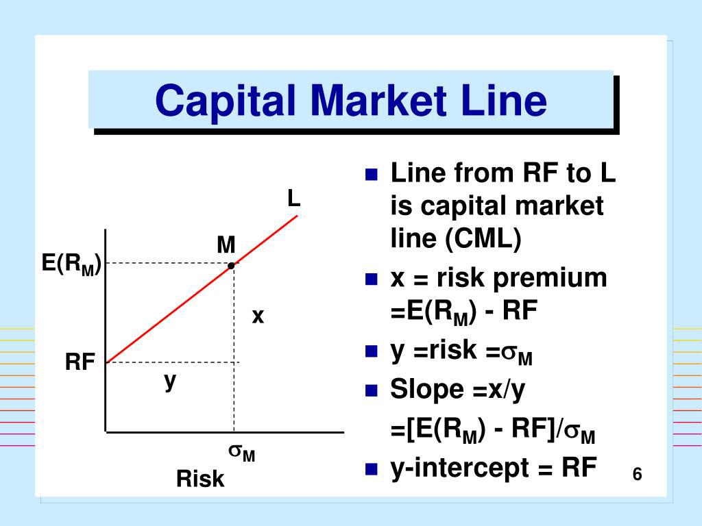

The Capital Market Line (CML) represents a cornerstone concept in financial markets, embodying the optimal relationship between expected return and risk. It is an integral part of Modern Portfolio Theory (MPT), introduced by Harry Markowitz, which provides a framework for assembling a portfolio of assets in such a way that it optimizes expected return for a given level of market risk. The CML specifically offers insights into the optimal risk-return tradeoff by connecting the risk-free rate of return with the expected return of the market portfolio through a straight line.

Mathematically, the CML is expressed as:



$$
E(R_p) = R_f + \left(\frac{\sigma_p}{\sigma_m}\right) \cdot (E(R_m) - R_f)
$$

where $E(R_p)$ represents the expected return of the portfolio, $R_f$ is the risk-free rate, $\sigma_p$ and $\sigma_m$ denote the standard deviations of the portfolio and the market, respectively, and $E(R_m)$ is the expected return of the market. This equation underscores the notion that the expected return of a portfolio is proportional to its total risk, as represented by its standard deviation, considering both the risk-free rate and the market's excess return over that rate.

The CML holds significant relevance in assessing the efficiencies of investment portfolios, guiding investors toward combining risk-free assets with the market portfolio to achieve the best possible expected returns for perceived risk levels. This approach allows investors to identify portfolios that ideally situate along the CML line, maximizing return per unit of risk.

Furthermore, the advent of algorithmic trading has substantially impacted the utilization of the CML. Algorithmic systems now employ complex models and computations to optimize portfolios dynamically, adhering to CML principles by evaluating the risk-return tradeoff continuously. By leveraging high-frequency data and sophisticated algorithms, market participants can exploit small inefficiencies, providing a cutting-edge advantage in aligning investments with the objectives outlined by the CML. This makes understanding the CML not just theoretically significant, but also practically crucial in today's fast-paced trading environments.

## Table of Contents

## Understanding the Capital Market Line (CML)

The Capital Market Line (CML) is a fundamental concept in Modern Portfolio Theory (MPT), which provides a visual representation of the risk-return tradeoff for efficient portfolios. The CML is a graphical depiction that shows the relationship between expected return and risk (standard deviation) for portfolios that optimally combine a risk-free asset and a portfolio of risky assets. It is defined by the following formula:

$$
E(R_p) = R_f + \left( \frac{\sigma_p}{\sigma_m} \right) \times (E(R_m) - R_f)
$$

where $E(R_p)$ represents the expected return of the portfolio, $R_f$ is the risk-free rate of return, $\sigma_p$ is the standard deviation of the portfolio, $\sigma_m$ is the standard deviation of the market portfolio, and $E(R_m)$ is the expected return of the market portfolio.

In the context of MPT, the CML illustrates the optimal tradeoff between risk and expected return for fully diversified portfolios. By incorporating a risk-free rate, it allows investors to determine the best possible return for any given level of risk. The slope of the CML is the market price of risk, demonstrating the additional return an investor can expect by taking on incremental risk. 

The CML serves as a crucial benchmark for evaluating portfolio performance because it delineates the efficient frontier of investment opportunities. When a portfolio lies on the CML, it is considered efficient, meaning that it provides the maximum expected return for a given level of risk or the lowest possible risk for a given return. Portfolios that lie above the CML are unattainable because they imply higher returns without assuming additional risk, while portfolios below the line are inefficient, as they do not make optimal use of the risk-free asset to enhance returns or reduce risk.

Investors and fund managers use the CML to assess whether a portfolio is efficient and to make strategic decisions about asset allocation. The CML underscores the importance of diversification and the benefits of combining diverse asset classes to achieve desired investment outcomes while managing risk effectively. Understanding the CML is fundamental for both retail and institutional investors aiming to optimize their portfolios in accordance with the principles of modern portfolio theory.

## Formula and Calculation of CML

The Capital Market Line (CML) is represented by the formula $E(R_p) = R_f + \left(\frac{\sigma_p}{\sigma_m}\right) \times (E(R_m) - R_f)$, which defines the expected return of a portfolio ($E(R_p)$) as a function of its risk relative to the market. The components of this formula are crucial for understanding and applying it effectively.

The risk-free rate ($R_f$) represents the return on an investment with zero risk, commonly associated with government bonds such as U.S. Treasury bills. The market return ($E(R_m)$) is the expected return from a market portfolio, which includes all available risky assets in optimal proportions. The standard deviation of the portfolio ($\sigma_p$) signifies the total risk of the portfolio, while the standard deviation of the market ($\sigma_m$) indicates the risk of the market portfolio.

Applying the CML involves calculating the expected return based on these components. Below is a Python example that demonstrates how to calculate the expected return of a portfolio using the CML formula:

```python
# Define the components of the CML formula
risk_free_rate = 0.02  # Risk-free rate, e.g., 2%
market_return = 0.08   # Market return, e.g., 8%
portfolio_std_dev = 0.15  # Portfolio standard deviation, e.g., 15%
market_std_dev = 0.2  # Market standard deviation, e.g., 20%

# Calculate the expected return of the portfolio using the CML formula
expected_portfolio_return = risk_free_rate + (portfolio_std_dev / market_std_dev) * (market_return - risk_free_rate)

# Display the result
print(f"Expected Portfolio Return: {expected_portfolio_return:.2%}")
```

This snippet effectively calculates the expected return, offering investors insight into the risk-return tradeoff of their portfolio relative to the market. Understanding these components enables investors to assess whether their portfolio is achieving a return that is commensurate with its level of risk, as benchmarked against the market.

## Why CML Matters in Financial Markets

The Capital Market Line (CML) serves as a crucial tool in financial markets for investors seeking to identify efficient portfolios. In the context of Modern Portfolio Theory (MPT), the CML offers a graphical representation that illustrates the optimal combination of risk and return across diverse portfolios. This line is derived from the risk-free rate and the market portfolio, effectively acting as a benchmark for assessing all portfolios. 

Central to the CML is its role in optimizing the risk-return tradeoff. By plotting expected portfolio returns against their standard deviations (a measure of risk), the CML helps investors pinpoint portfolios that yield the highest expected return for a given level of risk. This optimization is vital for ensuring that investors reap maximum benefits while balancing potential risks, aligning closely with the core objectives of MPT.

The significance of the Sharpe Ratio is accentuated when discussing the CML. The Sharpe Ratio measures the risk-adjusted return of an investment, calculated as the difference between the portfolio return and the risk-free rate, divided by the portfolio's standard deviation. Mathematically, it is expressed as:

$$
\text{Sharpe Ratio} = \frac{E(R_p) - R_f}{\sigma_p}
$$

Where:
- $E(R_p)$ is the expected portfolio return,
- $R_f$ represents the risk-free rate, and
- $\sigma_p$ is the standard deviation of the portfolio's return.

Portfolios that lie on the CML have the highest Sharpe Ratio attainable, indicating they are optimally configured to achieve the best possible return per unit of risk. As such, the CML serves not only as a tool for performance evaluation but also as a guide for constructing portfolios that are efficiently diversified. By maximizing the Sharpe Ratio, investors can ensure that their portfolios are aligned with the CML and thus optimized for risk-adjusted performance.

This theoretical foundation makes the CML an indispensable component in the analysis and construction of investment portfolios, playing a critical role in strategic asset allocation and providing investors with a framework for decision-making that is both robust and rooted in financial theory.

## CML in Algorithmic Trading

Algorithmic trading utilizes the Capital Market Line (CML) principles to optimize portfolios by identifying the ideal combinations of risk-free assets and the market portfolio that achieve the highest expected returns for any given level of risk. The CML assists algorithmic systems in outlining strategies where portfolios lie on this line, representing an efficient frontier of risk-return trade-offs. 

One of the fundamental tools employed within [algorithmic trading](/wiki/algorithmic-trading) is the Sharpe Ratio, which measures the risk-adjusted returns of different portfolios. By determining how much excess return is generated per unit of risk, algorithmic traders can gauge portfolio performance and strive for allocations that maximize this ratio. The Sharpe Ratio is particularly relevant when employing CML principles, as it underscores the balance between expected returns and associated risks, aiding in crafting portfolios that optimally align with investor risk preferences.

Here is an example of implementing CML strategies in algorithmic trading using Python:

```python
import numpy as np

# Define the risk-free rate and market return
risk_free_rate = 0.02
market_return = 0.08
market_std_dev = 0.15

# Define the risk (standard deviation) of the portfolio
portfolio_std_dev = 0.10

# Calculate the expected return of the portfolio using the CML formula
expected_portfolio_return = risk_free_rate + (portfolio_std_dev / market_std_dev) * (market_return - risk_free_rate)

# Calculate the Sharpe Ratio of the portfolio
sharpe_ratio = (expected_portfolio_return - risk_free_rate) / portfolio_std_dev

print(f'Expected Portfolio Return: {expected_portfolio_return:.2%}')
print(f'Sharpe Ratio: {sharpe_ratio:.2f}')
```

This Python script illustrates the application of the CML formula to calculate the expected return of a portfolio given its standard deviation, alongside computing its Sharpe Ratio. Algorithmic traders utilize such computations to determine the efficiency of portfolio options and to adjust strategies dynamically in response to market conditions. Employing CML in this manner empowers algorithmic systems to make informed, strategic decisions on asset allocations that are consistent with the desired risk-return profile.

## CML vs. SML: Key Differences

The Capital Market Line (CML) and the Security Market Line (SML) are fundamental concepts within modern portfolio theory, both serving to illustrate distinct aspects of investment risk and returns. The CML represents the relationship between total risk and expected return for efficient portfolios, while the SML delineates the relationship between systematic risk and expected return for individual assets.

The Capital Market Line is derived from the Efficient Frontier concept in modern portfolio theory. It is a line that passes through the risk-free rate and is tangent to the Efficient Frontier. The CML is expressed by the formula:

$$
E(R_p) = R_f + \frac{\sigma_p}{\sigma_m} \times (E(R_m) - R_f)
$$

where $E(R_p)$ is the expected return of the portfolio, $R_f$ is the risk-free rate, $\sigma_p$ is the standard deviation of the portfolio's return, $\sigma_m$ is the standard deviation of the market portfolio, and $E(R_m)$ is the expected return of the market. The CML indicates the optimal risk-return trade-off for an investor, combining the risk-free asset with the market portfolio to achieve the best possible expected return for a given level of total risk, which includes both systematic and unsystematic risk.

In contrast, the Security Market Line is a graphical representation of the Capital Asset Pricing Model (CAPM). It focuses solely on systematic risk, which is the inherent market risk that cannot be diversified away. The formula for the SML is:

$$
E(R_i) = R_f + \beta_i \times (E(R_m) - R_f)
$$

where $E(R_i)$ is the expected return of the individual asset, $R_f$ is again the risk-free rate, $E(R_m)$ is the expected market return, and $\beta_i$ is the beta of the asset, measuring its sensitivity to market movements. The SML is crucial for assessing the performance of individual assets, providing insights into whether an asset is fairly priced given its systematic risk.

A significant implication of the differences between CML and SML is their application in portfolio and asset analysis. The CML serves as a benchmark for constructing efficient portfolios, guiding investors on how to blend the risk-free asset and market portfolio for optimal total risk-adjusted returns. Conversely, the SML is essential for evaluating individual asset pricing, aiding in the identification of undervalued or overvalued assets by comparing the asset's expected return to its systematic risk as indicated by its beta.

By understanding these distinctions, investors and financial analysts can better gauge risk management strategies, optimize asset selection, and enhance overall investment performance through a comprehensive evaluation of both total and systematic risk in asset pricing.

## Conclusion

The Capital Market Line (CML) plays an integral role in modern portfolio theory (MPT) by providing investors with a tool for optimizing their portfolio's risk-return balance. As a critical concept within MPT, the CML delineates the optimal trade-off between risk, measured as standard deviation, and expected returns. This offers a guideline for investors to achieve the highest returns for a given risk level, or conversely, the lowest risk for a given level of expected return by determining the composition of risk-free assets and market portfolios.

The integration of CML principles into algorithmic trading demonstrates a strategic advantage for investors seeking optimal risk-adjusted returns. Algorithmic systems leverage CML to dynamically adjust portfolios, ensuring that the risk-return tradeoff remains efficient despite market [volatility](/wiki/volatility-trading-strategies). The CML's emphasis on maximizing the Sharpe Ratio—a measure of risk-adjusted return—makes it a crucial element in developing algorithmic strategies that adapt to ever-changing market conditions.

For investors operating in dynamic financial markets, understanding the CML is increasingly important. This understanding not only aid in constructing efficient portfolios but also assists in discerning how market adjustments impact risk and return. Mastery of CML concepts equips investors with the analytical tools necessary to evaluate market strategies and optimize returns in a systematic and informed manner. As algorithmic trading becomes more pervasive, the strategic application of CML principles becomes indispensable for achieving superior financial outcomes in a competitive market landscape.

## References & Further Reading

1. **Markowitz, H. (1952). "Portfolio Selection."** Journal of Finance. This foundational paper introduced the concept of Modern Portfolio Theory (MPT), laying the groundwork for the development of the Capital Market Line (CML) by discussing efficient portfolios and the risk-return tradeoff.

2. **Sharpe, W. F. (1964). "Capital Asset Prices: A Theory of Market Equilibrium under Conditions of Risk."** Journal of Finance. This paper presents the Capital Asset Pricing Model (CAPM), which closely relates to the CML by explaining the relationship between risk and expected return.

3. **Lintner, J. (1965). "The Valuation of Risk Assets and the Selection of Risky Investments in Stock Portfolios and Capital Budgets."** Review of Economics and Statistics. Lintner's work complements CAPM and further elaborates on theories connected to the CML.

4. **Merton, R. C. (1972). "An Analytic Derivation of the Efficient Portfolio Frontier."** Journal of Financial and Quantitative Analysis. Merton extended the theoretical frameworks of MPT and included developments leading to the practical use of the CML.

5. **Jensen, M. C. (1968). "The Performance of Mutual Funds in the Period 1945–1964."** Journal of Finance. This study provides insights into portfolio performance evaluation, reinforcing the utility of benchmark tools like the CML.

6. **Treynor, J. L. (1961). "Market Value, Time, and Risk."** Unpublished Manuscript. This work offers additional understanding of risk adjustment, contributing indirectly to the understanding necessary for CML application.

7. **Hull, J. C. (2009). "Options, Futures, and Other Derivatives."** Prentice-Hall, Inc. While primarily focusing on derivatives, this textbook also covers topics related to CML and portfolio management techniques.\

8. **Chincarini, L. B., & Kim, D. (2006). "Quantitative Equity Portfolio Management: An Active Approach to Portfolio Construction and Management."** McGraw-Hill. This book discusses active management strategies, including algorithmic trading, highlighting practical applications of the CML.

9. **Fabozzi, F. J., Kolm, P. N., Pachamanova, D. A., & Focardi, S. M. (2007). "Robust Portfolio Optimization and Management."** Wiley. This resource explores advanced portfolio management strategies linked with CML principles.

10. **Pardo, R. (2008). "The Evaluation and Optimization of Trading Strategies."** Wiley. This text provides insights into algorithmic trading, offering methodologies that employ CML for optimizing risk-return profiles.

11. **Lo, A. W. (2010). "Adaptive Markets: Financial Evolution at the Speed of Thought."** Princeton University Press. Lo's work offers an evolutionary perspective on financial markets, contextualizing the CML within the adaptive market hypothesis.

12. **Python Libraries Documentation: NumPy, Pandas, and Scipy** – For practical implementations, the documentation of these Python libraries provides essential tools for calculations involving CML-related strategies in algorithmic trading.

These resources will provide a comprehensive foundation for understanding the theoretical underpinnings and practical applications of the Capital Market Line, Capital Asset Pricing Model, and their intersections with modern computational finance practices like algorithmic trading.