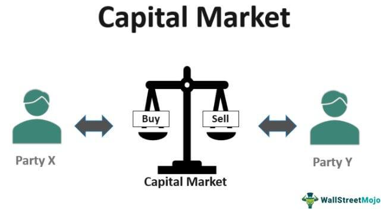

In today's fast-paced financial landscape, a thorough understanding of the factors driving market activities is fundamental. The financial environment is comprised of financial systems, investment capital markets, and algorithmic trading, each playing a vital role in shaping economic outcomes. By evaluating these components, we provide valuable insights into their significance, operation, and influence on the global economic stage.

Financial systems form the framework within which economic activities are channeled, facilitating the efficient allocation of resources. These systems involve various institutions, instruments, markets, and services designed to manage funds between entities with capital and those in need of it. A well-functioning financial system is crucial for effective risk management, liquidity provision, and innovation, ultimately contributing to economic development and stability.



Investment capital markets function as critical channels where investment inflows and outflows occur between savers, investors, and those requiring financial backing, such as corporations and governments. These markets are essential for generating liquidity and enabling investments through the trading of equity and debt securities. They are generally divided into primary markets, where new financial instruments are issued, and secondary markets, where existing instruments are exchanged, nurturing economic expansion and investment prospects.

The advent of algorithmic trading has further influenced financial markets by applying sophisticated algorithms to make trading decisions without human intervention. The speed and accuracy, cost efficiency, and reduction of human emotions in trading facilitated by algorithmic approaches offer distinct advantages. However, the rise of algorithmic trading also introduces challenges such as heightened market volatility and systemic failure risks, necessitating a deep understanding of these dynamics by contemporary market participants.

Understanding the interactions between financial systems, capital markets, and algorithmic trading is essential for investors, academics, and finance professionals aiming to navigate the complex layers of modern finance. The interplay of these elements is a major force behind market dynamics, presenting both significant opportunities and challenges.

## Table of Contents

## Understanding Financial Systems

Financial systems serve as the backbone of global economic activity by facilitating the seamless flow of funds between investors and entities seeking capital. At their core, these systems comprise various components, including financial institutions, markets, instruments, and services, all working in concert to enable efficient capital allocation.

Financial institutions encompass banks, insurance companies, pension funds, and investment firms, among others. These entities play a crucial role in channeling money from savers to borrowers, thus supporting entrepreneurship and economic growth. Financial markets, on the other hand, provide a platform for buying and selling financial securities, ensuring [liquidity](/wiki/liquidity-risk-premium) and transparency in the valuation of assets. Key markets include the stock market, bond market, and derivatives market.

Financial instruments, such as stocks, bonds, and derivatives, are the tradable assets that populate these markets. They serve as vehicles for investment, risk management, and speculation, offering various options for investors to meet their financial goals. Additionally, financial services, including advisory, brokerage, and asset management services, support market participants in executing transactions and making informed decisions.

Beyond simply matching savers with borrowers, financial systems also take on the crucial functions of risk management, liquidity provision, and fostering innovation. Risk management is achieved through diversification, insurance, and the use of derivative products, which help mitigate financial uncertainties. Liquidity provision ensures that market participants can readily buy and sell assets, thereby facilitating smooth market operations and avoiding disruptions.

Innovation within financial systems is crucial for adapting to changes and advancements in technology and market dynamics. Financial innovation can lead to the development of new financial products, services, and processes that enhance efficiency and offer fresh opportunities for growth.

Moreover, a robust financial system is instrumental in promoting economic development, stability, and growth. By mobilizing and allocating resources efficiently, financial systems ensure that capital is directed towards its most productive uses. This enables economies to achieve a higher rate of development and maintain stability in the face of economic fluctuations.

In conclusion, understanding the components and roles of financial systems is essential for grasping their impact on global economic activity. Through effective capital allocation, risk management, and innovation, these systems underpin economic growth and stability, highlighting their indispensable role in modern economies.

## Investment Capital Markets Explained

Capital markets facilitate the efficient transfer of funds between entities that have surplus capital and those that are in need of additional funding. This critical function supports economic growth by providing a platform for raising capital, investing savings, and enabling price discovery through the trading of various financial instruments.

Capital markets are divided into two primary types: primary markets and secondary markets. In primary markets, new securities are issued and sold for the first time. This process is vital for entities such as corporations and governments looking to raise new capital to finance projects or operations. In primary markets, entities may issue stocks, bonds, or other securities directly to investors. An Initial Public Offering (IPO) is a common example where a company issues shares to the public for the first time.

Secondary markets, on the other hand, deal with the trading of existing securities. Here, investors buy and sell securities that have already been issued, providing liquidity to the market. This liquidity is crucial as it allows investors to easily enter and [exit](/wiki/exit-strategy) positions, thereby encouraging further investment. Stock exchanges, like the New York Stock Exchange (NYSE) and NASDAQ, are typical venues for secondary market transactions.

Capital markets play an integral role in the financial ecosystem by enhancing liquidity and making capital available for different sectors of the economy. By enabling the trade of stocks, bonds, and other securities, they support a wide range of investment opportunities. This function is essential for promoting economic expansion, as it allows both institutional and individual investors to diversify their portfolios, manage risk, and potentially earn returns on their investments.

Furthermore, capital markets contribute to the transparent and fair pricing of securities through the mechanisms of supply and demand. They also serve as a barometer for economic health by reflecting investors' perceptions of current economic conditions and future growth prospects. Effective regulation and oversight are crucial to maintaining the stability and integrity of these markets, ensuring that they operate efficiently and fairly for all participants.

In summary, capital markets are foundational components of the financial system, driving economic growth and development by facilitating the efficient allocation of resources. Their ability to provide liquidity, investment, and opportunities for risk management makes them indispensable in today's global economy.

## The Role of Algorithmic Trading

Algorithmic trading fundamentally alters the architecture of modern financial markets through the integration of computational algorithms that facilitate trading decisions. This transformation hinges on the core advantages of speed, efficiency, and precision, which are unattainable through traditional human-based trading methods. By utilizing pre-programmed instructions that analyze variables such as price, timing, and [volume](/wiki/volume-trading-strategy), [algorithmic trading](/wiki/algorithmic-trading) systems can execute orders at speeds and frequencies far surpassing human capabilities.

One of the primary benefits of algorithmic trading is the acceleration of trading speed, resulting in reduced latency and the advantage of quick market decision-making. This enhances trade execution efficiency, providing traders with a critical competitive edge. Additionally, algorithmic systems drastically lower transaction costs by minimizing the need for manual intervention, streamlining operations, and optimizing order execution.

From a psychological standpoint, these algorithms mitigate the influence of human emotions such as fear and greed, which often lead to erratic decision-making and market inefficiencies. By adhering strictly to algorithmic logic, the trading process becomes more disciplined and consistent, reducing the likelihood of impulsive or emotion-driven trades.

Nevertheless, the widespread adoption of algorithmic trading is not without challenges. A significant concern is the potential for heightened market [volatility](/wiki/volatility-trading-strategies). Algorithms operate based on specific patterns and events, and in rapidly changing or unanticipated market conditions, they might execute trades that exacerbate price fluctuations. Another substantial risk is the possibility of systemic failures, where erroneous algorithms or technical glitches could lead to market distortions or crashes, as evidenced by events such as the "Flash Crash" of 2010.

Understanding these dynamics is vital for market participants who wish to remain competitive and effectively mitigate associated risks. A comprehensive grasp of algorithmic trading principles can be developed via scrutinizing system designs, learning from historical market events, and integrating robust risk management practices. Moreover, innovation in areas such as [machine learning](/wiki/machine-learning) and [artificial intelligence](/wiki/ai-artificial-intelligence) continues to evolve algorithmic trading, refining strategies and risk assessments to ensure sustainable integration into the complex financial ecosystem.

## Integration of Financial Systems with Algo Trading

The integration of financial systems with algorithmic trading is fundamentally altering market dynamics and participant behavior. This synthesis harnesses computational algorithms to process extensive datasets and execute trades with heightened precision and speed, thereby revolutionizing traditional financial operations.

One of the primary benefits of integrating advanced algorithms into financial systems is the enhancement of real-time data processing and execution accuracy. Algorithms meticulously analyze market data, identify patterns, and execute trades based on real-time information, which reduces latency and maximizes the potential for profitable transactions. For example, consider a Python snippet that uses historical price data to predict future trends using a linear regression model:

```python
import numpy as np
from sklearn.linear_model import LinearRegression

# Sample dataset (historical price data)
prices = np.array([100, 102, 101, 105, 110]).reshape(-1, 1)
days = np.array([1, 2, 3, 4, 5]).reshape(-1, 1)

# Linear regression model
model = LinearRegression()
model.fit(days, prices)

# Predict future price
future_day = np.array([[6]])
predicted_price = model.predict(future_day)
```

The integration of such algorithms is also pivotal in optimizing asset allocation, risk management, and achieving strategic financial goals. These systems can evaluate multiple scenarios to determine the most efficient asset distribution, thereby maximizing returns and minimizing risk. Algorithms can simulate complex financial models to gauge potential risks and outcomes, enabling more informed decision-making.

Moreover, investors and institutions are leveraging these advanced technologies to gain competitive advantages in the marketplace. The systems enable traders to respond swiftly to market fluctuations and execute large volumes of trades with minimal impact on market prices. This competitive edge is further bolstered by machine learning algorithms that continuously refine strategies based on new data inputs.

In conclusion, the convergence of financial systems and algorithmic trading is drastically optimizing traditional economic functions, providing a robust platform for enhanced economic strategies and performance. As financial institutions increasingly adopt these technologies, we can expect continual improvements in efficiency, accuracy, and market competitiveness.

## The Future of Capital Markets and Algo Trading

As technology progresses, significant transformations are anticipated in capital markets and algorithmic trading. One of the most notable trends involves the integration of artificial intelligence (AI) and machine learning (ML) into trading systems. These technologies have the potential to enhance trading strategies by improving decision-making speed and precision, allowing for real-time data analysis and pattern recognition. Machine learning algorithms can process vast datasets to identify market trends, predict asset price movements, and optimize trading strategies.

For instance, consider a scenario where a machine learning algorithm analyzes historical market data to predict the future price of a security. The algorithm might use linear regression or more complex models like neural networks to find relationships between different market variables. In Python, such a model could be implemented as follows:

```python
from sklearn.linear_model import LinearRegression
import numpy as np

# Example dataset
X = np.array([[1], [2], [3], [4], [5]])  # Time or some feature
y = np.array([2, 4, 6, 8, 10])  # Predicted price

# Model training
model = LinearRegression()
model.fit(X, y)

# Prediction
future_time = np.array([[6]])
predicted_price = model.predict(future_time)
print(f"The predicted price is {predicted_price[0]}")
```

This simple example highlights how algorithms can predict trends and assist traders in making informed decisions.

As algorithmic trading grows, regulatory frameworks are being adjusted to ensure market stability and integrity. Increasingly automated trading and new technologies pose unique challenges, including issues related to market manipulation, transparency, and the significant risk of rapid systemic failures. Regulators worldwide are working towards developing comprehensive frameworks that balance innovation with the protection of market participants.

For example, regulations may necessitate the disclosure of the use of certain trading algorithms or require firms to have robust risk management and compliance frameworks in place. This evolution in regulatory oversight aims to mitigate risks that could disrupt financial systems and safeguard fair market conditions.

To thrive in this rapidly changing environment, market participants must be proactive and adapt to technological advancements and evolving regulations. Staying informed is vital for leveraging new opportunities and mitigating emerging risks. Institutions that invest in developing and integrating technologies such as AI and ML into their trading processes can achieve a significant competitive advantage. Keeping abreast of regulatory updates ensures that market players operate within legal frameworks while also protecting their interests and those of their clients.

As technology continues to reshape capital markets and algorithmic trading, the potential for improved efficiency, enhanced market liquidity, and innovative trading solutions increases, offering exciting prospects for future developments.

## Conclusion

The convergence of financial systems, capital markets, and algorithmic trading is reshaping global economies by enhancing the efficiency and integration of financial activities. These components, while distinct, interact to create a dynamic financial environment characterized by both challenges and opportunities. Understanding their complexities is essential for anyone involved in or impacted by these markets.

The interplay between these systems offers potential benefits, such as improved accuracy in capital allocation and streamlined trading processes. Algorithmic trading, for instance, assists in executing trades at speeds and scales unimaginable in past decades, reducing transaction costs, and mitigating human bias. This optimization can lead to greater market liquidity and efficiency, facilitating economic growth and innovation.

However, the integration of sophisticated technologies and globalized markets poses significant challenges. The rapid pace of technological advancement and the intricacies of algorithmic trading can introduce vulnerabilities, including increased market volatility and systemic risks. Regulatory frameworks are critical to mitigating these risks and ensuring market stability and integrity. 

In this rapidly developing landscape, staying informed and adaptable is imperative for investors and financial institutions. Continuous education and awareness of technological trends—such as the growing influence of artificial intelligence and machine learning—will empower market participants to seize new opportunities and navigate emerging challenges. Thus, the ongoing evolution of financial systems, capital markets, and algorithmic trading promises not just efficiency and growth but also demands vigilance and adaptability for sustainable success.

## References & Further Reading

[1]: Bergstra, J., Bardenet, R., Bengio, Y., & Kégl, B. (2011). ["Algorithms for Hyper-Parameter Optimization."](https://papers.nips.cc/paper/4443-algorithms-for-hyper-parameter-optimization) Advances in Neural Information Processing Systems 24.

[2]: ["Advances in Financial Machine Learning"](https://www.amazon.com/Advances-Financial-Machine-Learning-Marcos/dp/1119482089) by Marcos Lopez de Prado

[3]: ["Evidence-Based Technical Analysis: Applying the Scientific Method and Statistical Inference to Trading Signals"](https://www.amazon.com/Evidence-Based-Technical-Analysis-Scientific-Statistical/dp/0470008741) by David Aronson

[4]: ["Machine Learning for Algorithmic Trading"](https://github.com/PacktPublishing/Machine-Learning-for-Algorithmic-Trading-Second-Edition) by Stefan Jansen

[5]: ["Quantitative Trading: How to Build Your Own Algorithmic Trading Business"](https://www.amazon.com/Quantitative-Trading-Build-Algorithmic-Business/dp/1119800064) by Ernest P. Chan