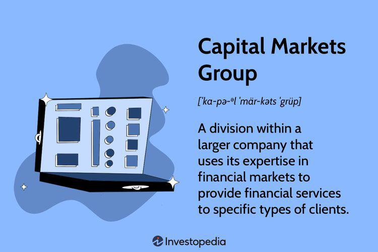

In today's fast-paced financial world, investment groups significantly influence the dynamics of capital markets. These organizations, encompassing a variety of entities such as investment banks, private equity firms, and hedge funds, play essential roles by facilitating transactions, providing liquidity, and offering strategic financial services. Through their activities, investment groups help companies raise capital, structure complex deals, and manage financial risks, thereby promoting economic growth and market stability.

This article examines the financial services provided by investment groups, focusing explicitly on capital markets and algorithmic trading. Capital markets serve as platforms where savings and investments are channeled between suppliers and those in need, including corporations and governmental entities seeking to fund new projects or expansions. Understanding the operations of capital markets groups within these platforms is essential for investors aiming to navigate modern finance complexities. These groups specialize in equity offerings, debt management, and investment banking services, acting as intermediaries to match companies requiring financing with investors looking for returns.

In parallel, algorithmic trading has emerged as a transformative force within trading activities. Using computer programs based on predefined strategies, algorithmic trading has introduced new levels of speed, precision, and efficiency. This technological advancement is crucial for executing large volumes of transactions quickly, reducing costs, and optimizing trading operations—a necessity in competitive markets.

By exploring the roles and examples of capital markets groups and the rise of algorithmic trading, investors and financial professionals can gain a comprehensive understanding of these pivotal components, ultimately equipping themselves to adeptly manage the intricacies of the modern financial landscape. This article aims to provide this insight, highlighting both traditional financial services and innovative trading methodologies.

## Table of Contents

## What is a Capital Markets Group?

Capital markets groups are integral components within larger financial institutions, tasked with facilitating a range of financial services essential for both corporate and individual clients. These divisions specialize in various functions within the financial markets, primarily focusing on equity offerings, debt management, and investment banking services.

One of the key roles of capital markets groups is to aid in equity offerings. This includes the process of underwriting and distributing new stock issues, thereby helping companies raise capital for expansion, research, and other business activities. By effectively determining the pricing of stock issues and ensuring compliance with regulatory requirements, these groups help companies navigate the complexities of public financing.

Debt management is another crucial function of capital markets groups. This involves structuring and issuing debt securities, such as bonds, to raise funds for clients. By leveraging their expertise in market conditions and [interest rate](/wiki/interest-rate-trading-strategies) trends, these groups strategically manage debt issuance to optimize funding costs and meet the capital needs of their clients.

Investment banking services constitute a significant portion of the offerings by capital markets groups. They provide advisory services for mergers and acquisitions, assist in the restructuring of financial assets, and offer strategic financial planning to optimize client outcomes. Through these activities, capital markets groups act as pivotal intermediaries in the financial ecosystem.

In essence, capital markets groups serve as a crucial bridge between companies seeking capital and investors looking for high-return opportunities. By facilitating the flow of capital through meticulously structured financial instruments and transactions, they contribute significantly to the [liquidity](/wiki/liquidity-risk-premium) and efficiency of financial markets, thereby supporting economic growth and development.

## Services Offered by Capital Markets Groups

Capital markets groups provide a wide array of services crucial to the financial ecosystem, primarily focusing on investment banking, mergers and acquisitions (M&A), and debt and equity capital management. These groups serve as essential intermediaries in capital markets, facilitating the flow of capital and providing strategic support to companies and investors alike.

**Investment Banking Services**

Investment banking is a cornerstone service provided by capital markets groups. These services are instrumental for companies seeking to raise capital, expand operations, or restructure their businesses. Investment banks assist in underwriting new securities issues, helping organizations sell equity (stocks) or debt (bonds) to investors. This service is invaluable, particularly when a company launches an Initial Public Offering (IPO), where precise execution and market insight are imperative for success. Investment banks also play a vital advisory role, providing expert guidance on ideal timing, pricing strategies, and regulatory compliance.

**Mergers and Acquisitions (M&A)**

Mergers and acquisitions represent another critical function of capital markets groups. These activities involve complex transactions where companies are bought, sold, or combined. M&A specialists in capital markets groups offer strategic advice to ensure that businesses make informed decisions, maximizing shareholder value. They conduct thorough due diligence, financial valuations, and negotiations to facilitate smooth transitions and successful integrations of corporate entities. With global markets evolving rapidly, M&A transactions have become increasingly intricate, underscoring the importance of expert advisory services.

**Debt and Equity Capital Management**

Effective management of debt and equity capital is a pivotal service offered by capital markets groups. These groups work to optimize a company’s capital structure, balancing debt and equity to minimize costs and maximize returns. They provide comprehensive support in issuing various financial instruments, such as bonds and preferred stocks, tailoring solutions to meet specific corporate objectives. For businesses aiming to refinance existing debts, capitalize on growth opportunities, or manage financial risk, capital markets groups offer tailored financial solutions aligned with strategic goals.

In summary, capital markets groups are indispensable within financial markets, offering specialized services that empower companies to navigate complex financial landscapes. Their expertise is especially critical for businesses planning significant transitions, such as expansions, refinancing, or restructuring, ensuring strategic execution and sustainable growth.

## The Role of Algorithmic Trading in Capital Markets

Algorithmic trading, commonly known as algo trading, uses computer algorithms to execute trades based on predetermined rules and strategies. This approach leverages complex mathematical models and high-speed data analysis, significantly altering the trading dynamics in capital markets. One of the primary benefits of [algorithmic trading](/wiki/algorithmic-trading) is its ability to process large volumes of data quickly, allowing traders to assess numerous market variables simultaneously and make informed decisions at speeds unattainable by human traders.

The advent of algo trading has introduced unparalleled speed, precision, and efficiency into trading operations. Programs can execute thousands of trades in fractions of a second, minimizing reaction time to market fluctuations. For example, executing a market order manually may take several seconds, during which the price of a security might change. In contrast, an algorithm can complete the same transaction almost instantaneously, ensuring the order is executed at the optimal price.

Moreover, algorithmic trading systems reduce costs by minimizing the market impact and transaction fees associated with human trading activities. By efficiently splitting trades across time or different venues, algo trading reduces the chance of creating significant price movements, which is particularly useful for large orders. The algorithms also optimize order routing, seeking the best price and least cost path to market access, further trimming expenses.

In addition to cost savings, high-frequency trading ([HFT](/wiki/high-frequency-trading-strategies)), a subset of algorithmic trading, offers a compelling competitive advantage. HFT capitalizes on small price discrepancies by executing rapid, high-[volume](/wiki/volume-trading-strategy) trades, profiting from minimal movements in asset prices. This form of trading relies on advanced technology infrastructure and continuous data feeds, emphasizing the critical role of speed in maintaining competitiveness in modern markets.

Overall, algorithmic trading has transformed capital markets by enhancing transaction speeds and precision, offering significant cost benefits, and enabling more sophisticated strategies in financial markets. These attributes are vital for participants aiming to remain competitive, making algo trading an indispensable tool in the investment landscape.

## Benefits of Algorithmic Trading

Algorithmic trading, often referred to as algo trading, provides numerous advantages that have revolutionized the financial markets. One of the primary benefits is its ability to reduce human error. By using pre-defined rules and executing trades automatically, algo trading minimizes the potential for mistakes that typically arise from human emotions and cognitive biases.

Additionally, algorithmic trading optimizes trade execution by allowing for rapid, precise, and efficient transactions. This speed is crucial in the financial markets where even milliseconds can impact the profitability of a trade. Algorithms can monitor multiple markets and securities simultaneously, ensuring trades occur at optimal times and prices.

Algo trading also ensures liquidity—one of the vital components of a well-functioning market. By providing a constant flow of buy and sell orders, algorithmic trading helps maintain market stability and allows for efficient price discovery. This continuous flow not only aids liquidity but also assists in narrowing bid-ask spreads, benefitting all market participants.

Furthermore, the use of algorithms enables traders to analyze vast datasets quickly. Algorithms can sift through historical and real-time data to identify patterns and trends, which would be exceedingly time-consuming for human traders. This capability allows for the development and implementation of sophisticated trading strategies that were previously unattainable due to the limitations of manual trading.

The facilitation of complex strategies is another significant benefit of algorithmic trading. For instance, statistical [arbitrage](/wiki/arbitrage) strategies rely heavily on the ability to process large volumes of data to detect minute pricing discrepancies between securities. This process requires a level of precision and speed that algo trading is uniquely equipped to provide.

Moreover, algorithms can participate in high-frequency trading (HFT), where success relies on executing a large number of trades in fractions of a second. This approach requires not only advanced technological infrastructure but also the ability to distribute trading actions efficiently, something only algorithmic trading can accomplish.

In summary, algorithmic trading has transformed modern financial markets by reducing errors, optimizing executions, ensuring liquidity, and enabling the adoption of complex trading strategies. It continues to create opportunities for traders and investors, pushing the boundaries of what is achievable within financial markets.

## Investment Groups and Algo Trading Partnerships

Many investment groups are increasingly incorporating advanced algorithmic trading techniques into their services to stay competitive and offer enhanced value to their clients. These partnerships between investment firms and technology-focused entities are designed to boost trading efficiency, improve risk management, and provide clients with deeper market insights.

Algorithmic trading relies on computer programs that follow pre-defined strategies for making trading decisions and executing trades. This method allows for the rapid processing of enormous data volumes and swift execution of complex trades that would be impossible for human traders to manage alone. The integration of algorithmic tools into investment group offerings enables these firms to leverage the strengths of both human expertise and algorithmic precision.

One key benefit of these collaborations is the enhancement of trading efficiency. Algorithms are capable of analyzing market conditions and executing trades in fractions of a second, which significantly reduces transaction times and costs. This speed is crucial in markets where prices can fluctuate rapidly. Moreover, algorithms can operate around the clock, seizing opportunities in global markets regardless of time zones.

Risk management is another area where algorithmic trading partnerships prove beneficial. Algorithms can be programmed to follow strict risk parameters, thereby minimizing the exposure to potential market downturns. By continuously monitoring market trends and adjusting strategies accordingly, these programs can help in maintaining a balanced portfolio and achieving desired risk levels.

The fusion of human insights with algorithmic analysis also enables investment groups to generate superior market insights for their clients. Algorithms can parse through vast amounts of historical data, identify patterns, and predict future trends with greater accuracy. When combined with human expertise in market dynamics and strategic decision-making, clients receive a comprehensive analysis that can guide more informed investment decisions.

The collaboration between investment groups and algorithmic trading specialists marks a transformative phase in investment strategies. As markets continue to evolve, these partnerships will likely play an integral role in shaping the future of finance by offering sophisticated solutions that blend technological innovation with traditional investment acumen.

## Challenges and Risks in Algo Trading

Algorithmic trading presents a sophisticated approach to executing trades, but it is not without its challenges and risks. One significant risk is system failures, which can arise from technical glitches or hardware malfunctions. Such failures can lead to substantial financial losses if trades are executed incorrectly or not at all. The precision and reliance on technology make algorithmic systems vulnerable to these unexpected disruptions.

Market [volatility](/wiki/volatility-trading-strategies) also poses a substantial risk to algorithmic trading strategies. Algorithms are often designed based on historical data and predefined market conditions. Sudden market shifts or unprecedented events can render these algorithms ineffective or lead to unintended trading outcomes. For instance, during periods of high volatility, price swings can trigger rapid algorithmic responses, potentially exacerbating market instability.

Another risk [factor](/wiki/factor-investing) is the insufficient understanding of complex algorithms by the traders and firms deploying them. Algorithms can be intricate, incorporating elements such as [machine learning](/wiki/machine-learning) and predictive analytics, which require specialized knowledge to develop and maintain. A lack of comprehensive understanding can lead to misconfigurations or improper adjustments in response to market changes.

To manage these risks, investment groups must constantly update and monitor their algorithms. This involves regular testing and validation to ensure that the algorithms perform as expected under various market conditions. Continuous monitoring helps detect anomalies or errors promptly, allowing for timely interventions.

Regulatory oversight plays a critical role in mitigating adverse impacts associated with algorithmic trading. Regulators impose rules to ensure transparency, stability, and fairness in the markets. Compliance with these rules is essential to prevent manipulative practices and systemic risks. Additionally, robust risk management strategies help safeguard against potential losses. These strategies include implementing controls such as kill switches, which automatically halt trading activities during abnormal conditions, and setting predefined limits to manage exposure and leverage.

In summary, while algorithmic trading offers numerous advantages, the associated risks necessitate vigilant oversight and ongoing refinement of systems to ensure their safe and effective operation in the financial markets.

## Conclusion

Investment groups play a crucial role in the capital markets by offering essential financial services that enable businesses and individual investors to access and effectively utilize capital. They serve as an indispensable bridge, connecting those with capital to invest with companies seeking funds for growth, expansion, or restructuring. With their broad array of services, including investment banking, mergers and acquisitions, and capital management, investment groups significantly influence market operations and investment strategies.

A formidable component of their modern strategies is algorithmic trading, which represents a significant shift in how trading is conducted across capital markets. This technology-driven method leverages computer algorithms to execute trades at speeds and efficiencies unmatchable by human traders. As technology progresses, the capacity to analyze vast quantities of data rapidly and execute precise trades becomes even more refined, ensuring algorithmic trading remains a pivotal aspect of financial markets.

For investors, staying abreast of these technological trends and integrating them into their strategies is vital for maintaining a competitive edge. By embracing algorithmic trading innovations, investment groups can offer clients enhanced market insights, reduced transaction costs, and improved risk management. This not only fortifies their role in the current financial ecosystem but also ensures their adaptability to future market evolutions.

In conclusion, as financial markets continue to evolve, understanding and adopting advanced technologies such as algorithmic trading are imperative for investors and investment groups alike. These advancements not only facilitate more efficient market operations but also position investors to capitalize on new opportunities in the dynamic financial landscape.

## References & Further Reading

[1]: Bergstra, J., Bardenet, R., Bengio, Y., & Kégl, B. (2011). ["Algorithms for Hyper-Parameter Optimization."](https://dl.acm.org/doi/10.5555/2986459.2986743) Advances in Neural Information Processing Systems 24.

[2]: ["Advances in Financial Machine Learning"](https://www.amazon.com/Advances-Financial-Machine-Learning-Marcos/dp/1119482089) by Marcos Lopez de Prado

[3]: ["Evidence-Based Technical Analysis: Applying the Scientific Method and Statistical Inference to Trading Signals"](https://www.amazon.com/Evidence-Based-Technical-Analysis-Scientific-Statistical/dp/0470008741) by David Aronson

[4]: ["Machine Learning for Algorithmic Trading"](https://github.com/stefan-jansen/machine-learning-for-trading) by Stefan Jansen

[5]: ["Quantitative Trading: How to Build Your Own Algorithmic Trading Business"](https://github.com/LucindaYa/quant-resources/blob/master/Quantitative%20Trading%20How%20to%20Build%20Your%20Own%20Algorithmic%20Trading%20Business.pdf) by Ernest P. Chan