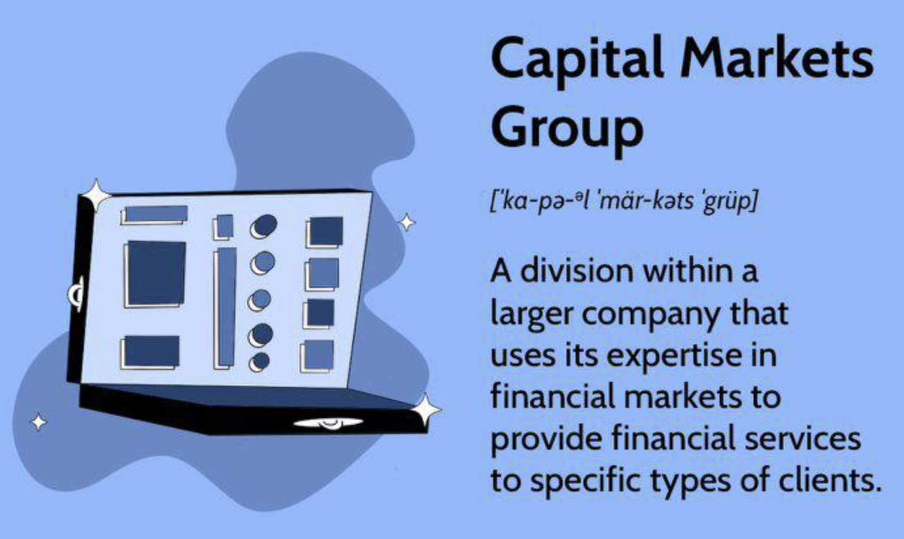

## Table of Contents

## What is a Capital Markets Group?

A Capital Markets Group is a part of a financial institution or investment bank that focuses on helping companies and governments raise money by issuing stocks and bonds. They work with clients to decide the best way to raise funds, whether through an initial public offering (IPO) for stocks or by issuing bonds. The group also helps in trading these securities once they are issued, making sure they are bought and sold smoothly in the market.

These groups also provide advice on mergers and acquisitions, helping companies buy or merge with other companies. They use their knowledge of the market to give the best advice on pricing and timing for these financial moves. By doing all these things, Capital Markets Groups play a big role in helping the economy grow by making it easier for businesses and governments to get the money they need.

## What are the main functions of a Capital Markets Group?

A Capital Markets Group helps companies and governments get money by selling stocks and bonds. They work with their clients to figure out the best way to raise funds. This could mean helping a company go public with an initial public offering (IPO) for stocks, or helping to issue bonds. They make sure everything is set up right so that the stocks and bonds can be sold to investors.

Once the stocks and bonds are out there, the Capital Markets Group helps with trading them. They make sure that these securities can be bought and sold easily in the market. This helps keep the market running smoothly and helps investors feel confident.

The group also gives advice on big financial moves like mergers and acquisitions. They help companies decide if it's a good idea to buy or merge with another company. They use their knowledge of the market to suggest the best times and prices for these actions. By doing all these things, Capital Markets Groups help the economy grow by making it easier for businesses and governments to raise money.

## How does a Capital Markets Group differ from other financial institutions?

A Capital Markets Group is a special part of a bigger financial institution or investment bank. It focuses on helping companies and governments raise money by selling stocks and bonds. They work closely with their clients to choose the best way to get funds, like setting up an initial public offering (IPO) for stocks or issuing bonds. Once these stocks and bonds are sold, the Capital Markets Group also helps with trading them, making sure they can be bought and sold easily in the market. This helps keep the market running smoothly and keeps investors happy.

Other financial institutions, like banks or credit unions, might focus more on different things. For example, a regular bank might be more about giving loans to people and businesses or helping them save money. They might not have a special team just for helping with stocks and bonds. Investment banks, on the other hand, are more like the ones that have Capital Markets Groups, but they might also do other things like managing big investments or advising on company takeovers. So, while Capital Markets Groups are focused on helping with stocks and bonds and keeping the market smooth, other financial institutions might have different main jobs.

## What types of services does a Capital Markets Group typically offer?

A Capital Markets Group helps companies and governments get money by selling stocks and bonds. They work with their clients to figure out the best way to raise funds. This might mean helping a company go public with an initial public offering (IPO) for stocks, or helping to issue bonds. They make sure everything is set up right so that the stocks and bonds can be sold to investors. They also give advice on how much to sell the stocks or bonds for, and when is the best time to do it.

Once the stocks and bonds are out there, the Capital Markets Group helps with trading them. They make sure that these securities can be bought and sold easily in the market. This helps keep the market running smoothly and helps investors feel confident. The group also gives advice on big financial moves like mergers and acquisitions. They help companies decide if it's a good idea to buy or merge with another company. They use their knowledge of the market to suggest the best times and prices for these actions. By doing all these things, Capital Markets Groups help the economy grow by making it easier for businesses and governments to raise money.

## How do Capital Markets Groups facilitate transactions between buyers and sellers?

Capital Markets Groups help buyers and sellers by making it easier for them to trade stocks and bonds. They do this by setting up systems and rules that make sure trading happens smoothly. For example, when a company wants to sell stocks or bonds, the Capital Markets Group helps them figure out the best price and time to do it. They also make sure that all the information about the stocks or bonds is clear and easy to understand for buyers.

Once the stocks or bonds are sold, the Capital Markets Group keeps the market running well. They help match buyers with sellers, making sure that trades happen quickly and fairly. This helps keep everyone happy and confident in the market. By doing all this, Capital Markets Groups make it easier for money to move around and help the economy grow.

## What role do Capital Markets Groups play in the economy?

Capital Markets Groups help the economy grow by helping companies and governments get money. They do this by helping these groups sell stocks and bonds. When a company wants to go public and sell stocks, or when a government wants to issue bonds, the Capital Markets Group helps them figure out the best way to do it. They decide on the right price and the best time to sell, making sure everything is set up properly so that investors want to buy.

Once the stocks and bonds are sold, Capital Markets Groups keep the market running smoothly. They help buyers and sellers trade easily by matching them up and making sure trades happen quickly and fairly. This helps keep everyone happy and confident in the market. By making it easier for money to move around, Capital Markets Groups play a big part in helping the economy grow and stay strong.

## What are the regulatory requirements for Capital Markets Groups?

Capital Markets Groups have to follow a lot of rules to make sure they do things the right way. These rules come from government agencies like the Securities and Exchange Commission (SEC) in the United States. The rules say that Capital Markets Groups need to be honest and clear about the information they give to people who might want to buy stocks or bonds. They also have to follow rules about how they handle money and keep records of what they do. This helps make sure that everyone in the market is treated fairly and that the market works smoothly.

There are also rules about how Capital Markets Groups can help companies sell stocks or bonds. For example, they have to make sure that all the information they give to investors is correct and not misleading. They also have to follow rules about how they can advertise or talk about the stocks and bonds they are helping to sell. These rules are important because they help protect investors and keep the market safe and trustworthy. By following these rules, Capital Markets Groups help make sure that the economy stays strong and that people can trust the market.

## How do Capital Markets Groups manage risk?

Capital Markets Groups manage risk by carefully watching the market and using different tools and strategies. They look at things like how much stocks and bonds are worth, how the economy is doing, and what might happen in the future. They use this information to decide how to help companies and governments sell stocks and bonds safely. They might also use things like insurance or special agreements to protect against big losses. By doing all this, they try to make sure that the money they help raise stays safe and that investors feel good about buying the stocks and bonds.

Another way Capital Markets Groups manage risk is by spreading it out. They might help a company sell different kinds of stocks or bonds instead of just one kind. This way, if one type doesn't do well, the others might still be okay. They also work with lots of different companies and governments, so if something goes wrong with one, it doesn't hurt everything they do. By spreading out the risk, they help make the market more stable and protect the money that's being raised.

## What are some common strategies used by Capital Markets Groups to maximize returns?

Capital Markets Groups use different strategies to help their clients get the most money back from selling stocks and bonds. One way they do this is by [picking](/wiki/asset-class-picking) the best time to sell. They look at the market and try to sell when prices are high, so the company or government gets more money. They also help set the right price for the stocks or bonds. If the price is too high, people might not want to buy, but if it's too low, the company might not get as much money as they could. By getting the timing and pricing right, they help their clients make more money.

Another strategy is to spread out the risk. Capital Markets Groups might suggest selling different kinds of stocks or bonds, so if one doesn't do well, the others might still be okay. They also work with lots of different companies and governments, so if something goes wrong with one, it doesn't hurt everything they do. By spreading out the risk, they help make sure that the money raised stays safe and that investors are happy. This way, the clients can get more money back in the long run.

## How has technology impacted the operations of Capital Markets Groups?

Technology has changed a lot about how Capital Markets Groups work. They use computers and special software to help them do their jobs faster and better. For example, they can use technology to look at a lot of information about the market quickly. This helps them decide the best time and price to help companies sell stocks or bonds. They can also use technology to talk to investors all over the world easily, which helps them sell more stocks and bonds.

Another way technology helps is by making trading easier and safer. Capital Markets Groups use special systems to match buyers and sellers quickly and fairly. These systems also help keep track of all the trades, so everything is clear and easy to check. This makes investors feel more confident because they know the market is running smoothly. By using technology, Capital Markets Groups can help their clients get more money and make the market work better.

## What are the emerging trends in the Capital Markets Group industry?

One big trend in the Capital Markets Group industry is the use of new technology. They are using things like [artificial intelligence](/wiki/ai-artificial-intelligence) and big data to help them make better decisions. This means they can look at a lot of information quickly to figure out the best time and price to help companies sell stocks or bonds. They are also using technology to make trading faster and safer. This helps them match buyers and sellers quickly and keeps everything clear and easy to check.

Another trend is more focus on environmental, social, and governance ([ESG](/wiki/esg-investing)) issues. Companies and investors are paying more attention to how businesses affect the world. Capital Markets Groups are helping companies sell stocks and bonds that focus on these issues. For example, they might help a company sell green bonds, which are used to fund projects that are good for the environment. This is becoming more important because investors want to put their money into companies that do good things for the world.

A third trend is the growing importance of digital currencies and blockchain technology. Capital Markets Groups are starting to help companies and governments with these new types of money. They are also using blockchain to make trading safer and more transparent. This can help make the market work better and give investors more confidence. As these technologies grow, Capital Markets Groups will need to keep up with them to stay ahead in the industry.

## How can one evaluate the performance of a Capital Markets Group?

To evaluate the performance of a Capital Markets Group, you can look at how much money they help their clients raise. This means checking how successful they are at helping companies and governments sell stocks and bonds. If they can get good prices and sell at the right time, they are doing a good job. Another thing to look at is how happy their clients are. If the companies and governments they work with are happy and keep coming back, that's a good sign. Also, you can see if the stocks and bonds they help sell are doing well in the market. If investors are buying them and they are going up in value, that shows the Capital Markets Group is doing well.

Another way to evaluate a Capital Markets Group is by looking at how they manage risk. They should be good at spreading out the risk so that if something goes wrong with one stock or bond, it doesn't hurt everything they do. You can also check if they are using new technology and keeping up with trends like environmental, social, and governance (ESG) issues. If they are using AI and big data to make better decisions, and helping with green bonds, that's a good sign. Finally, you can look at how they handle regulations. If they follow all the rules and keep everything clear and fair, that shows they are doing a good job.

## References & Further Reading

[1]: Bergstra, J., Bardenet, R., Bengio, Y., & Kégl, B. (2011). ["Algorithms for Hyper-Parameter Optimization."](https://dl.acm.org/doi/10.5555/2986459.2986743) Advances in Neural Information Processing Systems 24.

[2]: ["Advances in Financial Machine Learning"](https://www.amazon.com/Advances-Financial-Machine-Learning-Marcos/dp/1119482089) by Marcos Lopez de Prado

[3]: ["Evidence-Based Technical Analysis: Applying the Scientific Method and Statistical Inference to Trading Signals"](https://www.amazon.com/Evidence-Based-Technical-Analysis-Scientific-Statistical/dp/0470008741) by David Aronson

[4]: ["Machine Learning for Algorithmic Trading"](https://github.com/stefan-jansen/machine-learning-for-trading) by Stefan Jansen

[5]: ["Quantitative Trading: How to Build Your Own Algorithmic Trading Business"](https://github.com/LucindaYa/quant-resources/blob/master/Quantitative%20Trading%20How%20to%20Build%20Your%20Own%20Algorithmic%20Trading%20Business.pdf) by Ernest P. Chan