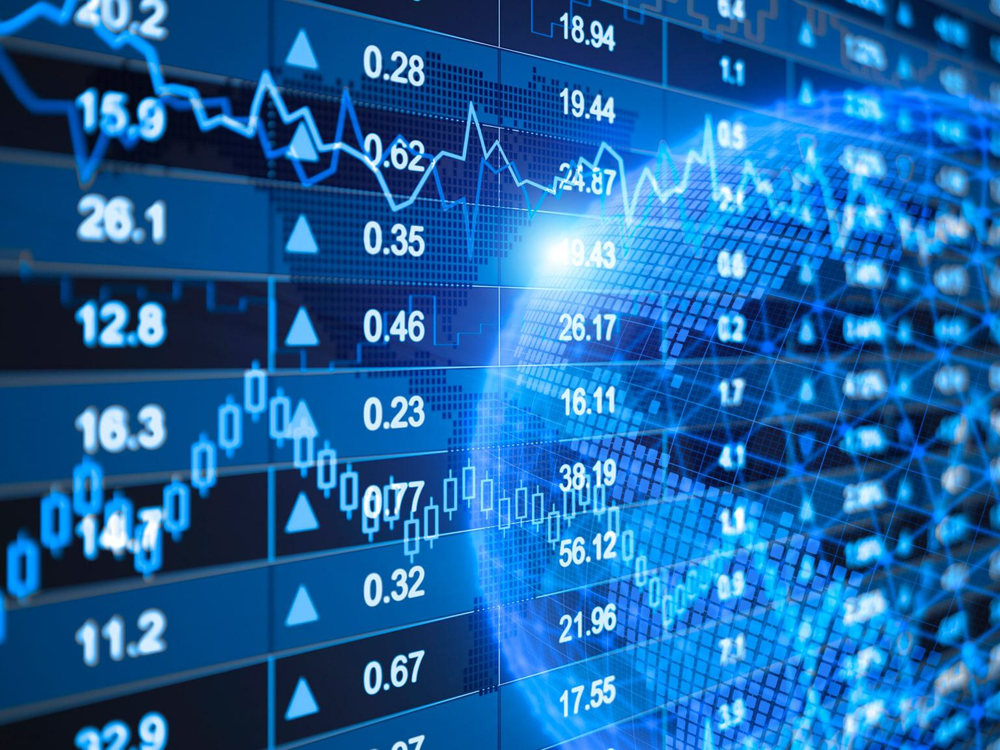

In the rapidly evolving world of finance, capital markets trading is experiencing a significant transformation with the integration of algorithmic trading. Algorithmic trading, commonly known as 'algo trading', involves the use of sophisticated computer algorithms to execute trading orders at speeds and frequencies far beyond the capability of human traders. This technological advancement allows for the processing of vast amounts of financial data in real-time, facilitating the rapid execution of trades and the optimization of investment strategies.

The concept of algorithmic trading centers on the automation of trading decisions through pre-defined rules and mathematical models. These algorithms analyze market conditions, identify trading opportunities, and execute buy or sell orders based on the programmed criteria. This process not only enhances trading efficiency but also aims to achieve better pricing, minimize transaction costs, and reduce the psychological biases often associated with manual trading.



As algo trading becomes increasingly prevalent in capital markets, it offers a myriad of strategies that cater to different trading objectives. From execution algorithms designed to handle large orders with minimal market impact to profit-seeking algorithms that exploit market inefficiencies, the scope of algorithmic trading is vast and continually expanding. The benefits of algo trading are clear: enhanced speed, improved precision, and reduced human error. However, it also introduces challenges, such as the complexity of developing effective algorithms, the risk of overfitting strategies to historical data, and the need for robust technological infrastructure.

This article will explore the various aspects of algorithmic trading within capital markets, including its types, benefits, strategies, and challenges. By examining these elements, we seek to provide a comprehensive understanding of how algorithmic trading is reshaping the financial landscape and what the future holds for this innovative approach.

## Table of Contents

## What is Capital Markets Trading?

Capital markets are essential components of the financial system, where a variety of long-term debt and equity-backed securities are traded. They serve as fundamental mechanisms for capital allocation, enabling companies to raise funds from investors. This process involves the issuance and trading of financial instruments, such as stocks, bonds, and derivatives, providing both issuers and investors with opportunities for growth and income.

Capital markets primarily consist of two main segments: the primary market and the secondary market. In the primary market, new securities are created and sold for the first time. This is where companies directly receive funds, typically through an Initial Public Offering (IPO) for equities or a new bond issuance. The funds collected are employed by the issuing entity for purposes such as expansion, research and development, or other capital-intensive projects.

The secondary market, on the other hand, facilitates the trading of previously issued securities. Here, investors buy and sell securities among themselves, which provides [liquidity](/wiki/liquidity-risk-premium) and prices reflective of the market's assessment of a company's value and future performance. This segment is crucial as it provides the original investors with the opportunity to sell their shares and realize their investment returns.

The effective functioning of capital markets relies on a variety of participants, including individual investors, institutional investors, brokers, dealers, and regulators. These participants work within a framework of regulated exchanges, both physical and electronic. Trading activities are also supported by over-the-counter (OTC) markets, where transactions are executed directly between parties, often for derivatives and other complex instruments not listed on traditional exchanges.

Instruments traded in capital markets include stocks, which represent ownership in a company; bonds, which are debt securities promising repayment of the principal along with interest; and derivatives, such as options and futures, which derive their value from underlying assets. Each instrument serves different purposes for both issuers and investors, offering a range of risk and return profiles.

Overall, capital markets are crucial for economic development, offering a venue for [capital raising](/wiki/hedge-fund-capital-raising), risk management, and wealth creation. The efficient allocation of resources facilitated by these markets supports innovation and infrastructure development, contributing to broader economic growth.

## Understanding Algorithmic Trading

Algorithmic trading is a method of executing trades using automated and pre-programmed trading instructions. These instructions can take into consideration variables such as time, price, and [volume](/wiki/volume-trading-strategy). The core of [algorithmic trading](/wiki/algorithmic-trading) lies in its ability to leverage mathematical models and computational techniques to analyze extensive datasets, thus making precise decisions at speeds far surpassing human capabilities.

The employment of algorithms in trading strives to achieve optimal trading outcomes by executing trades at the best possible prices. This involves minimizing both explicit and implicit costs associated with trading, such as transaction fees and the price impact of large orders on the market. By automating these processes through algorithms, traders can greatly reduce the emotional and psychological biases that typically influence decision-making in financial markets.

Mathematically, algorithmic trading systems can be represented by a set of rules $R$, where each rule $r_i \in R$ defines conditions such as trade execution criteria, risk management guidelines, and capitalization limits. An example of a rule for exiting a position might be:

$$
\text{If } P_t \leq P_{\text{stop\_loss}} \text{, then execute sell order}
$$

where $P_t$ is the current price and $P_{\text{stop\_loss}}$ is a predetermined level at which to exit the position to prevent further losses.

In practice, algorithmic trading can involve various strategies including but not limited to [market making](/wiki/market-making), [arbitrage](/wiki/arbitrage), and [trend following](/wiki/trend-following), each of which can be encoded through different sets of rules and algorithms. Python, in particular, offers libraries like NumPy for numerical calculations and Pandas for data manipulation, which can be used to develop algorithmic trading strategies. A simple example using Python's Pandas library to calculate a moving average might look like this:

```python
import pandas as pd

# Sample price data
data = {'Price': [105, 108, 110, 107, 105, 103, 102, 99, 101, 104]}
df = pd.DataFrame(data)

# Calculate 3-day moving average
df['Moving_Average'] = df['Price'].rolling(window=3).mean()

print(df)
```

The primary advantage of algorithmic trading is its ability to process a huge volume of data and perform hundreds of trades in a fraction of a second, thereby exploiting market opportunities that might be missed by human traders. However, the successful implementation of such systems requires sophisticated infrastructure and constant monitoring to ensure optimal performance across various market conditions.

## Types of Algorithmic Trading

Algorithmic trading encompasses a variety of approaches and methodologies, each tailored to specific trading goals and market conditions. These algorithms are systematically designed to execute financial transactions in a manner that maximizes efficiency and precision. Here's an overview of the major types of algorithmic trading:

**Execution Algorithms**

Execution algorithms like VWAP (Volume Weighted Average Price) and TWAP (Time Weighted Average Price) are primarily used to execute large orders with minimal market disruption. These algorithms break down a large order into smaller, strategically timed trades to avoid large market impacts that could otherwise alter asset prices unfavorably.

- **VWAP**: This method calculates the average price of a security, weighted against its volume. The goal is to execute orders at, or near, this average to ensure that trades reflect market liquidity without causing price spikes. Mathematically, VWAP is expressed as:
$$
  \text{VWAP} = \frac{\sum (\text{Price}_i \times \text{Volume}_i)}{\sum \text{Volume}_i}

$$

- **TWAP**: By spreading the order evenly over a specific timeframe, TWAP aims to achieve the average price. This is particularly useful in markets where liquidity is a concern. It is straightforward and essentially divides the total quantity by the number of time intervals.

**Profit-seeking Algorithms**

Profit-seeking algorithms are designed to find and exploit inefficiencies or patterns within financial markets. These algorithms often leverage statistical models to gain insights into price movements and make real-time decisions to capitalize on arbitrage opportunities or trend imbalances.

These algorithms focus on identifying brief price swings or anomalies that can be quickly profited from. For instance, if the price of a stock is momentarily lower on one exchange than another, the algorithm can buy on the cheaper exchange and sell on the more expensive one, realizing a profit from the difference.

**Black-box Algorithms**

Black-box algorithms are proprietary strategies that leverage complex statistical models, often incorporating [machine learning](/wiki/machine-learning) techniques. The specifics of these algorithms are closely guarded secrets within trading firms, designed to provide competitive advantages. The logic and decision-making processes within black-box systems are not disclosed, even to the users, making them opaque.

These algorithms require rigorous [backtesting](/wiki/backtesting) and validation processes due to their high stakes and the need for reliability under varying market conditions. Firms may integrate layers of data analytics to enhance predictive accuracy and algorithm performance.

**Open-source Algorithms**

In contrast, open-source algorithms are publicly accessible, allowing traders to modify, use, and enhance these tools according to individual needs or strategies. The open nature of these algorithms fosters collaboration and sharing within the trading community, often leading to innovative improvements and adaptations that individuals can incorporate into their own trading operations.

Open-source platforms often provide a diverse range of pre-built algorithms that traders can customize. Python, with libraries such as `pandas` and `NumPy`, is frequently used to develop and test such algorithms. This openness allows traders to align their processes with the latest advances and ensures transparency in how decisions are made.

Algorithmic trading techniques continue to evolve, driven by advancements in technology and data availability. Each type of algorithm serves a distinct role in navigating the complexities of financial markets, contributing to the diverse toolbox available to today’s traders.

## Advantages of Algorithmic Trading

Algorithmic trading offers significant advantages in capital markets by enhancing speed and efficiency, ensuring consistency and precision, and reducing errors in trade execution. The integration of computerized systems in trading allows market participants to leverage these benefits effectively.

**Speed and Efficiency**: Algorithmic trading systems are capable of processing vast quantities of market data and executing trades at velocities that surpass human capabilities. The use of sophisticated algorithms enables the analysis of real-time market conditions and the rapid execution of trading strategies, often in milliseconds. This speed is particularly advantageous in volatile markets where the timing of transactions can significantly impact profitability. For instance, high-frequency trading (HFT), a subset of algorithmic trading, relies on speed to exploit minute price discrepancies for profit. By utilizing advanced computational power, these systems can continuously scan multiple markets and execute trades before other market participants can respond, thus capitalizing on arbitrage opportunities.

**Consistency and Precision**: Automated trading systems operate based on predefined criteria and rules, which ensures that trades are executed systematically, devoid of emotional bias. This consistency in execution is crucial in maintaining the integrity of trading strategies, particularly those that rely on technical indicators or statistical models. The removal of emotional factors such as fear and greed from the trading process allows for objective decision-making. Algorithms are able to adhere strictly to the chosen trading strategy, ensuring that buy and sell decisions are made with precision and in alignment with the intended plan. This level of precision is difficult to achieve with manual trading, where human judgment can sometimes falter under stress or pressure.

**Reduced Errors**: The potential for human error in order execution is minimized through algorithmic trading. Manual trading processes can be susceptible to mistakes such as entering incorrect order quantities or prices, which can lead to significant financial losses. Automated systems, on the other hand, follow set parameters consistently, ensuring that trades are executed as per the strategy's specifications. Additionally, algorithms can be programmed to manage various scenarios, such as market volatility or liquidity changes, thereby reducing the likelihood of execution errors. By eliminating human intervention, the risk of operational errors is significantly diminished, contributing to more reliable and effective trading operations.

Overall, the adoption of algorithmic trading in capital markets presents a multitude of advantages that enhance the trading process. The speed and efficiency of algorithms allow for rapid response to market changes, while their consistency and precision ensure the faithful execution of strategies. Finally, by reducing the incidence of human error, algorithmic trading contributes to more accurate and reliable outcomes in financial markets.

## Challenges in Algorithmic Trading

Algorithmic trading, while offering numerous advantages, comes with its set of challenges that must be addressed for successful implementation. One of the primary challenges is the complexity of financial markets. These markets are influenced by a myriad of factors, including economic indicators, geopolitical events, and investor behavior, which can introduce substantial [volatility](/wiki/volatility-trading-strategies) and unpredictability. Designing algorithms capable of consistently yielding profits in such an environment requires robust models capable of adapting to changing market conditions. 

Another significant challenge is overfitting, a common pitfall in model development. Overfitting occurs when an algorithm is excessively tailored to historical data, demonstrating impressive backtest results but underperforming in live markets. This issue typically arises when a model captures noise rather than the underlying market signals. A well-fitted model should generalize effectively, balancing complexity and simplicity to avoid overfitting. Techniques such as cross-validation and out-of-sample testing are crucial for verifying a model's robustness.

Furthermore, the technological demands of algorithmic trading are substantial. An effective algorithmic trading system requires a reliable and high-capacity infrastructure, including robust hardware and software capable of processing and executing trades in real time. Access to high-quality, timely data feeds is also essential; delays or inaccuracies in data can lead to suboptimal trading decisions and financial losses. Moreover, ensuring the security and integrity of these systems is paramount to protect against cyber threats and data breaches.

In summary, successfully navigating the challenges of algorithmic trading necessitates a deep understanding of market dynamics, rigorous testing to avoid overfitting, and investment in advanced technological infrastructure. Each element is crucial in maintaining the efficacy and reliability of algorithmic trading strategies within the complex landscape of financial markets.

## Algorithmic Trading Strategies

Algorithmic trading strategies are systematic approaches designed to automate trading decisions and execution. These strategies leverage mathematical models and computational algorithms to identify and capitalize on market opportunities. Here are some of the key strategies used in algorithmic trading:

1. **Trend Following**

Trend following is a strategy that seeks to capitalize on long, medium, or short-term price movements within financial markets. This approach relies on identifying and confirming trends using technical indicators such as moving averages, [momentum](/wiki/momentum) indicators, or channel breakouts. Traders typically use moving averages like the simple moving average (SMA) or the exponential moving average (EMA) to smooth price data and identify the direction of the trend. The strategy assumes that once a trend is established, it is likely to continue, thereby allowing traders to enter positions in the direction of the trend.

For instance, a common trend-following method involves using the crossover of a shorter-term moving average above a longer-term moving average as a signal to buy, and vice versa for a sell signal. In Python, such a strategy can be coded as follows:

```python
import pandas as pd

def moving_average_crossover_strategy(prices, short_window=40, long_window=100):
    short_mavg = prices.rolling(window=short_window).mean()
    long_mavg = prices.rolling(window=long_window).mean()
    signals = pd.DataFrame(index=prices.index)
    signals['price'] = prices
    signals['signal'] = 0.0
    signals['signal'][short_window:] = \
        np.where(short_mavg[short_window:] > long_mavg[short_window:], 1.0, 0.0)   
    signals['positions'] = signals['signal'].diff()
    return signals
```

2. **Mean Reversion**

Mean reversion is based on the theory that asset prices will revert to their mean or average level over time. This strategy involves identifying temporary price deviations from the mean and taking opposite positions to profit from the correction. Traders often use indicators like Bollinger Bands, which measure volatility and provide a relative definition of high and low prices, to set entry and [exit](/wiki/exit-strategy) points.

For example, a security's price moving outside the Bollinger Bands might suggest being overbought or oversold, indicating potential reversion to the mean. The implementation in Python could use libraries like `pandas` to calculate these statistical measures and act upon them.

3. **Statistical Arbitrage**

Statistical arbitrage is a highly quantitative approach that exploits price discrepancies between correlated securities based on statistical models. It commonly includes pairs trading, where two historically correlated securities that diverge in price are traded simultaneously—going long on the undervalued security and short on the overvalued one—seeking to profit when the prices return to their historical correlation.

The process typically involves cointegration tests to determine if a stable long-term relationship exists between two asset prices. Once identified, the strategy continuously monitors these relationships, ready to act when discrepancies occur.

4. **Market Making**

Market making involves providing liquidity to the markets by continuously quoting both bid and ask prices for financial instruments, seeking to profit from the spread. Market makers earn the bid-ask spread by buying at the bid price and selling at the ask price. Successful market making requires a robust infrastructure to manage inventory levels, hedge positions, and quickly adapt to market changes.

Market makers often use sophisticated algorithms to maintain competitiveness, ensuring they optimize trade execution and manage associated risks.

These strategies each offer different opportunities and require various risk management techniques. Algorithmic traders often combine multiple strategies to diversify their trading activities and adjust them according to changing market conditions.

## Getting Started with Algo Trading

To begin with algorithmic trading, it's essential to build a robust foundational understanding of financial markets and trading principles. This entails familiarizing oneself with how markets operate, the types of securities traded, and the factors influencing market movements. A solid grasp of concepts like supply and demand, market volatility, liquidity, and order types is crucial.

### Choose Programming Languages

Selecting an appropriate programming language is a critical step in setting up algorithmic trading. Python is a widely favored language in the trading community due to its simplicity, readability, and the extensive array of libraries and frameworks that support quantitative analysis and algorithm development. Libraries such as `NumPy` and `Pandas` are instrumental for data manipulation and analysis, while `Matplotlib` and `Seaborn` aid in visualizing data patterns and trends. Additionally, frameworks like `TA-Lib` provide technical indicators that are vital for crafting trading strategies.

Here is a basic example of calculating a moving average in Python, a common technical indicator used in trend following strategies:

```python
import pandas as pd

# Example DataFrame with price data
data = {'Price': [100, 102, 104, 103, 105, 107, 110]}
df = pd.DataFrame(data)

# Calculate 3-period moving average
df['Moving_Average'] = df['Price'].rolling(window=3).mean()
print(df)
```

### Develop and Backtest Strategies

Once a programming language is selected, the next step involves designing, developing, and rigorously backtesting trading strategies. Backtesting is the process of testing a trading strategy on historical data to assess its potential effectiveness. It allows traders to evaluate the strategy's performance without risking actual capital.

Platforms like MetaTrader and backtesting libraries such as `Backtrader` or `PyAlgoTrade` offer environments to construct and test trading strategies. These tools allow traders to simulate trades using historical data and generate performance reports that can highlight potential returns, drawdowns, and risk metrics.

Here is an example of a simple backtesting setup using the `Backtrader` library in Python:

```python
import backtrader as bt

class TestStrategy(bt.Strategy):
    def __init__(self):
        self.dataclose = self.datas[0].close

    def next(self):
        if self.dataclose[0] < self.dataclose[-1]:
            self.buy(size=100)  # Example order for buying
        elif self.dataclose[0] > self.dataclose[-1]:
            self.sell(size=100)  # Example order for selling

# Initialize Cerebro engine
cerebro = bt.Cerebro()
cerebro.addstrategy(TestStrategy)

# Example data feed
data = bt.feeds.YahooFinanceData(dataname='AAPL', fromdate=datetime(2020, 1, 1), todate=datetime(2021, 1, 1))
cerebro.adddata(data)

# Run the backtest
cerebro.run()
cerebro.plot()
```

By extensively backtesting a strategy, one can identify its strengths and weaknesses, making necessary adjustments before deploying it in live trading. This step is crucial in ensuring that the strategy not only performs well in historical scenarios but also adapts to current market conditions.

## Future of Algorithmic Trading

Technological advancements are set to redefine the landscape of algorithmic trading, offering new tools and methodologies to refine trading strategies. Artificial intelligence (AI) is at the forefront of this revolution. Machine learning algorithms are increasingly being employed to predict market trends by identifying patterns that are not immediately evident to human analysts. These algorithms can analyze unprecedented volumes of data at remarkable speeds, thereby improving decision-making processes and enhancing prediction accuracy.

Big data is another transformative force. Traders now have access to massive datasets that encompass not just traditional financial data but also [alternative data](/wiki/best-alternative-data) sources, which provide broader insights into market dynamics. For example, social media sentiment analysis and web traffic [statistics](/wiki/bayesian-statistics) can offer real-time indications of investor mood and potential market movements.

The emergence of quantum computing represents a potential paradigm shift for algorithmic trading. Quantum computers can perform complex calculations much faster than classical computers, allowing the rapid analysis of large datasets and the execution of intricate trading strategies. However, the practical implementation of quantum technologies in trading is still in its nascent stages and poses numerous technical challenges.

Integration of alternative data is becoming increasingly popular as traders seek to gain an edge over competitors. Non-traditional data sources, such as satellite imagery and geolocation data, provide unique insights that can significantly affect trading decisions. For instance, satellite images of retail parking lots can give investors information about store foot traffic, providing a novel metric for consumer behavior.

Decentralized finance (DeFi) is reshaping the trading arena through the growth of blockchain-based platforms. These platforms eliminate intermediaries, reducing transaction costs and increasing transparency. The decentralized nature of these systems allows for secure and efficient trading, paving the way for the development of new financial instruments and strategies. Blockchain's inherent transparency and security also promise to alleviate some of the trust issues that pervade traditional financial systems.

As these technological and data innovations converge, they promise to usher in a new era in algorithmic trading that is characterized by heightened efficiency, accuracy, and strategic flexibility. However, along with these opportunities come challenges, such as ensuring data integrity, managing computational costs, and addressing cybersecurity risks. Continuous developments in technology and methodology will be crucial for maintaining a competitive advantage in this evolving field.

## Conclusion

Algorithmic trading has significantly transformed capital markets by enhancing the efficiency and accuracy of trade executions, while also enabling strategic innovation. Through the use of sophisticated algorithms, traders can now process vast amounts of data and execute orders at speeds unattainable by humans. This automation leads to more consistent trading outcomes and reduces the emotional biases that can affect manual trading decisions.

However, the rapidly evolving landscape of algorithmic trading presents several challenges. Continuous learning and technological adaptation are vital for traders to stay competitive. The development of robust algorithms requires a strong foundation in both market knowledge and programming skills. Traders must remain informed about the latest technological advancements and be prepared to integrate new tools and data sources into their strategies.

Aspiring algorithmic traders should focus on acquiring comprehensive programming skills, with Python being a popular choice due to its simplicity and extensive libraries. Understanding market dynamics and developing effective trading strategies are crucial steps toward success. By focusing on these areas, traders can not only navigate the complexities of algorithmic trading but also leverage its potential to capitalize on market opportunities.


## References & Further Reading

[1]: Narang, R. K. (2013). ["Inside the Black Box: A Simple Guide to Quantitative and High-Frequency Trading"](https://onlinelibrary.wiley.com/doi/book/10.1002/9781118662717). Wiley. 

[2]: Kissell, R. (2013). ["The Science of Algorithmic Trading and Portfolio Management"](https://www.sciencedirect.com/book/9780124016897/the-science-of-algorithmic-trading-and-portfolio-management). Academic Press.

[3]: Lopez de Prado, M. (2018). ["Advances in Financial Machine Learning"](https://www.amazon.com/Advances-Financial-Machine-Learning-Marcos/dp/1119482089). Wiley.

[4]: Chan, E. P. (2008). ["Quantitative Trading: How to Build Your Own Algorithmic Trading Business"](https://github.com/ftvision/quant_trading_echan_book). Wiley.

[5]: Jansen, S. (2020). ["Machine Learning for Algorithmic Trading, Second Edition: Predictive models to extract signals from market and alternative data for systematic trading strategies with Python"](https://www.oreilly.com/library/view/machine-learning-for/9781839217715/Text/Front_Matter.xhtml). Packt Publishing.

[6]: Aldridge, I. (2013). ["High-Frequency Trading: A Practical Guide to Algorithmic Strategies and Trading Systems"](https://onlinelibrary.wiley.com/doi/pdf/10.1002/9781119203803.fmatter). Wiley.

[7]: Kissell, R., & Glantz, M. (2002). ["Optimal Trading Strategies: Quantitative Approaches for Managing Market Impact and Trading Risk"](https://archive.org/details/optimaltradingst0000kiss). AMACOM.