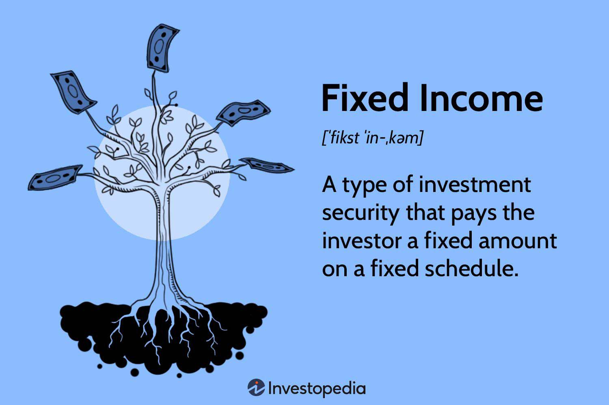

The financial world is vast and complex, encompassing an array of markets and securities that demand a sophisticated understanding to navigate effectively. Within this extensive landscape, fixed income trading stands out for its unique characteristics and the specific challenges it presents to traders and investors. Fixed income trading focuses on debt securities—primarily bonds—that provide returns through regular interest payments, known as coupon payments. These securities are integral to the portfolios of both individual and institutional investors due to their potential for providing steady income and diversifying investment risk.

Among the various instruments in fixed income markets, capital notes hold a significant place. These are unsecured short-term debt instruments typically issued by companies to address immediate funding needs. Capital notes are considered higher-risk investments compared to secured debt due to the absence of collateral backing them, but they offer higher interest rates as compensation for this increased risk. The fixed interest payments and eventual return of principal make them a compelling, yet complex, option for certain investors.



The role of algorithmic trading cannot be understated in modern fixed income markets. This technological approach to trading enables the execution of large volumes of trades with minimal human intervention, structured around pre-defined criteria. Algorithmic trading utilizes sophisticated algorithms capable of parsing vast datasets to identify profitable trading opportunities and engage in precise, rapid execution of trades. These capabilities are enhanced by advancements in artificial intelligence (AI) and machine learning, which allow for continuous improvement and adaptability in dynamic market conditions.

This article aims to explore the intricacies of financial instruments such as capital notes and the role of algorithmic trading within fixed income markets. By delving into these critical components, investors can better understand and navigate the complexities inherent in this sector. Grasping the nuances of fixed income trading, supported by technological advancements, equips investors with the knowledge required to make informed decisions and optimize their investment strategies in a continually evolving financial environment.

## Table of Contents

## Understanding Capital Notes

A capital note is a form of unsecured, short-term debt typically issued by companies to address their short-term liabilities. These financial instruments offer higher interest rates compared to secured debt instruments due to their unsecured nature, which inherently presents greater risk to investors. Unlike callable bonds, capital notes are not callable, making them attractive for investors who prioritize consistent interest payments until maturity.

Credit ratings play a vital role in evaluating the risk associated with capital notes. Agencies such as Moody's or Standard & Poor’s assess the creditworthiness of the issuer and assign a rating that affects both the interest rates offered and investor decisions. Higher credit ratings generally result in lower interest rates, reflecting a lower perceived risk.

In the context of fixed income trading, capital notes are significant as they demand meticulous risk management and strategic investment decisions. Investors must carefully assess the issuer's creditworthiness and market conditions before engaging in capital note investments to balance the potential higher returns against the associated risks. This requires a keen understanding of economic indicators and market trends to optimize investment outcomes in fixed income markets.

## The Role of Fixed Income Trading Platforms

Fixed income trading platforms have become indispensable in the modern financial landscape, providing traders with comprehensive access to markets and a variety of [liquidity](/wiki/liquidity-risk-premium) providers. These platforms offer real-time market data, which is crucial for traders aiming to make informed decisions that reflect the latest market conditions. Timely access to such data allows traders to analyze market trends and spot potential opportunities or risks as they arise.

The integration of trading algorithms with these platforms has revolutionized how trades are conducted, facilitating automated trading strategies that enhance efficiency and execution speed. As markets become increasingly dynamic, the ability to execute trades rapidly and with minimal human intervention can be a significant advantage. Automated systems require an upfront investment in technology and expertise but can lead to improved execution quality and reduced transaction costs over time.

Global platforms such as Bloomberg and Tradeweb exemplify the advantages of these systems, connecting users to both domestic and international markets. This connectivity enables traders to diversify their investment strategies by accessing a range of fixed income securities across various market geographies and segments.

Risk management and compliance are integral features of fixed income trading platforms, ensuring that trading activities adhere to regulatory requirements. These built-in features help mitigate risks associated with trading, such as market [volatility](/wiki/volatility-trading-strategies) and counterparty default. Tools specifically designed to monitor compliance with regulations, such as the Dodd-Frank Act or MiFID II, are often included, aiding in preventing legal infractions and ensuring the integrity of trading activities.

Overall, the development and sophistication of fixed income trading platforms continue to propel the industry forward, offering traders critical tools to remain competitive in an ever-evolving market environment.

## Algorithmic Trading in Fixed Income Markets

Algorithmic trading utilizes sophisticated technology to execute trades on the basis of pre-established criteria, significantly reducing the need for human intervention in decision-making processes. In the context of fixed income markets, these algorithmic strategies are pivotal for efficiently managing large volumes of trades, thereby optimizing both execution speed and minimizing market impact. The nature of fixed income securities, characterized by volatility and liquidity fluctuations, demands precision in order execution, a requirement effectively met by complex algorithms capable of analyzing extensive datasets to identify optimal trading opportunities.

Advancements in [artificial intelligence](/wiki/ai-artificial-intelligence) (AI) and [machine learning](/wiki/machine-learning) have significantly propelled the evolution of [algorithmic trading](/wiki/algorithmic-trading), enhancing the ability of trading systems to make decisions in real-time. These technologies offer the capacity to process and analyze high-frequency data streams, leveraging patterns and anomalies that would remain imperceptible to human traders. This capability facilitates strategic responses to market changes, often within milliseconds, ensuring that trades are executed at the most favorable prices and conditions.

Despite the advantages offered by algorithmic trading, such as speed and efficiency, it's crucial to note the inherent risks associated with its deployment. Systemic errors, arising from flawed algorithms or technological failures, present significant risks, including potential financial losses and market disruptions. Consequently, a robust framework for vigilant monitoring and continuous testing is indispensable for mitigating such risks. This includes the implementation of fail-safes and real-time oversight mechanisms to adjust for any deviations from expected trade outcomes.

The sophisticated interplay between technology and market dynamics in algorithmic trading accentuates the need for rigorous risk management strategies. Traders and institutions must remain agile, continuously adapting to technological innovations and refining algorithms to maintain competitive advantages in the ever-evolving landscape of fixed income markets.

## Comparing Proprietary and Third-Party Trading Platforms

Financial institutions involved in fixed income trading are presented with the critical decision of choosing between proprietary and third-party trading platforms. Each option comes with its set of advantages and limitations, influencing the strategic decisions of market participants.

Proprietary platforms are developed in-house and offer tailored solutions that seamlessly integrate with a firm’s existing infrastructure. This integration supports specialized trading strategies and allows for customization according to specific business needs. Such platforms can be advantageous for institutions that require high levels of security, control, and customization. The internal development process ensures that the platform can efficiently cater to the unique requirements of the firm's trading operations. However, the cost associated with developing and maintaining proprietary platforms can be significant, representing a considerable investment in technology and personnel.

On the other hand, third-party trading platforms offer a more generic solution that provides broad market connectivity. These platforms typically operate on subscription models, making them more cost-effective for many institutions, particularly those with budget constraints. The extensive market access provided by third-party platforms allows institutions to engage in diverse trading strategies across domestic and international markets. Furthermore, third-party platforms benefit from ongoing support and regular updates, which may include enhancements based on community feedback and industry innovations.

The decision between proprietary and third-party platforms is influenced by several factors, including the level of customization desired, budgetary limitations, and specific market access requirements. Financial institutions must balance these considerations, weighing the benefits of tailored solutions against the cost-efficiency and support offered by third-party platforms. Additionally, factors such as technology stack compatibility and long-term strategic goals also play a role in determining the most suitable platform choice.

Ultimately, the selection of a trading platform involves evaluating how well the option aligns with the institution's current trading needs and future growth plans. Institutions often find themselves navigating between the unique advantages presented by proprietary platforms and the accessibility and support provided by third-party solutions. Successful adoption and utilization of these platforms require a strategic approach that understands the institution's specific needs and broader industry trends.

## Integration and Innovation in Fixed Income Trading Technology

The integration of market data and analysis tools into trading platforms significantly enhances traders' decision-making capabilities, offering a strategic advantage in the fast-paced world of fixed income trading. Advanced platforms are equipped with features such as real-time analytics and scenario simulations, which are essential for navigating the complexities of the market. These capabilities allow traders to respond swiftly to changes and make informed decisions based on comprehensive, up-to-date information.

The incorporation of artificial intelligence (AI) and machine learning (ML) into trading systems plays a pivotal role in predicting market movements, offering traders a technological edge. AI algorithms can process vast amounts of data to identify patterns and trends, enabling predictive analytics that forecasts potential market shifts. Machine learning models continually improve with new data, refining their predictive accuracy over time. For example, a machine learning model can be trained to predict bond price movements based on historical data, current economic indicators, and market sentiment analysis.

The following Python code snippet illustrates a simple machine learning model using a linear regression algorithm to predict bond prices:

```python
from sklearn.model_selection import train_test_split
from sklearn.linear_model import LinearRegression
import pandas as pd

# Sample dataset with features and target 'bond_price'
data = pd.read_csv('bond_data.csv')

# Splitting the dataset into train and test sets
X = data[['feature1', 'feature2', 'feature3']]  # Example features
y = data['bond_price']
X_train, X_test, y_train, y_test = train_test_split(X, y, test_size=0.2, random_state=42)

# Linear regression model
model = LinearRegression()
model.fit(X_train, y_train)

# Predicting bond prices
predictions = model.predict(X_test)
```

Continual innovation in trading technology drives efficiency and transparency, reshaping the landscape of fixed income trading. Tools that provide deep insights through enhanced visualization, like heatmaps and interactive charts, contribute to better understanding and monitoring of market behavior. Additionally, platforms are increasingly integrating blockchain technology to improve transaction transparency and security, fostering trust among market participants.

These advancements necessitate ongoing adaptation by market participants to effectively leverage opportunities and manage risks in evolving markets. Traders and institutions must stay abreast of technological advancements, continually upgrading their systems and strategies to maintain competitiveness. As these technologies advance, their potential to offer nuanced and complex trading strategies also grows, making mastery of these tools paramount for sustainable success in fixed income markets.

## Conclusion

Fixed income trading encompasses a variety of financial instruments, including capital notes, and leverages algorithmic trading to both seize opportunities and confront challenges. Navigating this domain requires a deep understanding of trading platforms, evolving technologies, and strategic market approaches, empowering investors to make well-informed decisions.

Staying updated with technological advancements and regulatory shifts is crucial as the fixed income market evolves. It's important for investors and institutions to effectively utilize advanced tools and data analysis, optimizing their trading strategies in this fast-paced environment.

Moreover, the fusion of technology and strategy is set to redefine the fixed income market. Algorithmic trading and sophisticated trading platforms enhance decision-making processes, increase execution speed, and improve risk management capabilities. This technological integration paves the way for future innovations, ensuring a competitive edge in the marketplace.

In summary, mastering both the technological and strategic facets of fixed income trading is essential. This approach not only mitigates risks but also unlocks new potential, setting the stage for a dynamic and innovative future in financial markets.

## References & Further Reading

[1]: [Bodie, Z., Kane, A., & Marcus, A. J. (2014). "Investments." McGraw-Hill Education.](https://www.mheducation.com/highered/product/Investments-Bodie.html) - A comprehensive textbook on investment offerings, including insights into fixed income securities.

[2]: [Lopez de Prado, M. (2018). "Advances in Financial Machine Learning." Wiley.](https://www.amazon.com/Advances-Financial-Machine-Learning-Marcos/dp/1119482089) - Focuses on the use of machine learning in financial markets, pertinent to algorithmic trading.

[3]: [Jansen, S. (2020). "Machine Learning for Algorithmic Trading: Predictive Models to Extract Signals from Market and Alternative Data for Systematic Trading Strategies with Python." Packt Publishing.](https://github.com/stefan-jansen/machine-learning-for-trading) - Provides practical insights into employing machine learning for trading strategies.

[4]: [Chan, E. P. (2008). "Quantitative Trading: How to Build Your Own Algorithmic Trading Business." Wiley.](https://github.com/ftvision/quant_trading_echan_book) - Discusses the construction and operation of an algorithmic trading business.

[5]: [Aronson, D. R. (2007). "Evidence-Based Technical Analysis: Applying the Scientific Method and Statistical Inference to Trading Signals." Wiley.](https://www.amazon.com/Evidence-Based-Technical-Analysis-Scientific-Statistical/dp/0470008741) - Merges technical analysis and a scientific approach to trading signals.