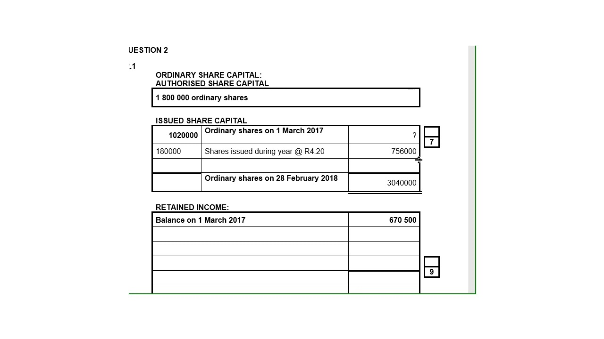

## Table of Contents

## What is a capital note in the context of fixed income trading?

A capital note is a type of debt security that companies or governments issue to raise money. It's like a loan where the issuer promises to pay back the money with interest over time. Capital notes are often used by banks and financial institutions to strengthen their financial position. They are considered higher risk than regular bonds because they might not get paid back if the issuer runs into financial trouble.

These notes usually have a long-term maturity, meaning they might take many years to be paid back. They can also have special features, like being convertible into stocks or having the interest payments change based on certain conditions. Because of these features, capital notes can be more complex than regular bonds, and investors need to understand the risks involved before buying them.

## How does a capital note differ from other fixed income securities?

A capital note is different from other fixed income securities like regular bonds because it usually comes with more risk. While a regular bond is a promise to pay back the money with interest, a capital note might not get paid back if the company issuing it runs into financial trouble. This makes capital notes riskier, and because of that, they often offer higher interest rates to attract investors. Also, capital notes are often used by banks and financial institutions to improve their financial stability, which is not always the case with other fixed income securities.

Another way capital notes differ is that they can have special features that regular bonds might not have. For example, some capital notes can be converted into the company's stock, or the [interest rate](/wiki/interest-rate-trading-strategies) might change based on certain conditions. These features make capital notes more complex and can make them harder to understand than simpler fixed income securities. Because of these differences, investors need to be careful and understand the risks before investing in capital notes.

## What are the typical features of a capital note?

Capital notes have some special features that make them different from other types of loans or bonds. One common feature is that they can be converted into the company's stock. This means that instead of getting your money back with interest, you might get shares in the company instead. Another feature is that the interest rate on capital notes can change. It might go up or down based on how well the company is doing or other conditions set when the note is issued.

Another important feature of capital notes is that they are often used by banks and financial institutions to make their finances stronger. This is because capital notes are considered a type of capital that helps the bank stay stable. However, they are riskier than regular bonds because if the bank runs into trouble, the people who bought the capital notes might not get their money back. This means that capital notes usually offer higher interest rates to attract investors who are willing to take on more risk.

Capital notes also have long-term maturity dates, which means they might take many years to be paid back. This long-term nature adds to their complexity because investors need to think about how the company will do over many years. Because of all these features, capital notes can be harder to understand than simpler fixed income securities, and investors need to be careful and know the risks before buying them.

## Who are the primary issuers and investors of capital notes?

The main issuers of capital notes are usually banks and financial institutions. They use capital notes to make their finances stronger and meet certain rules set by regulators. These rules help make sure banks are safe and can handle financial problems. By issuing capital notes, banks can get money they need without having to borrow in other ways that might be more expensive or risky.

The primary investors in capital notes are often big investors like insurance companies, pension funds, and other financial institutions. These investors are looking for ways to make more money and are willing to take on more risk. They understand that capital notes can be riskier than regular bonds, but they also know that the higher interest rates can make them a good choice if they believe the bank will do well. Sometimes, regular people might invest in capital notes too, but they need to be careful and understand the risks involved.

## How is the interest on a capital note calculated and paid?

The interest on a capital note is calculated based on the interest rate that was set when the note was issued. This rate can be fixed, which means it stays the same the whole time, or it can be variable, which means it can change based on certain conditions like how well the bank is doing or changes in the economy. The interest is usually paid out regularly, like every year or every six months, depending on what was agreed upon when the note was issued.

Sometimes, the interest on a capital note might not be paid in cash. Instead, it could be added to the amount of the note, which is called "capitalizing" the interest. This means the total amount you get back at the end will be bigger, but you won't get any money until the note matures. If the note can be converted into stock, the interest might also be paid in the form of more shares instead of cash.

## What are the risks associated with investing in capital notes?

Investing in capital notes comes with several risks. One big risk is that you might not get your money back. Capital notes are often issued by banks and financial institutions, and if these companies run into financial trouble, they might not be able to pay back the money they owe. This makes capital notes riskier than regular bonds, where the chances of not getting paid back are usually lower.

Another risk is that the interest rate on capital notes can change. If the rate goes down, you might not earn as much money as you expected. Also, some capital notes let the issuer skip interest payments if they are in trouble, which means you might not get the interest you were counting on. This can be a problem if you were planning to use that money for something important.

Lastly, capital notes can be complex and hard to understand. They might have special features, like being convertible into stock or having the interest added to the note instead of paid out. If you don't fully understand these features, you might make a bad investment decision. It's important to do your homework and maybe talk to a financial advisor before investing in capital notes.

## How do capital notes fit into a broader investment strategy?

Capital notes can be a part of a bigger investment plan if you understand the risks and rewards. They are often used by people who want to make more money than they would with regular bonds. Since capital notes are riskier, they usually offer higher interest rates. This means they can help you earn more if you're willing to take on the chance that you might not get your money back. Big investors like insurance companies and pension funds sometimes use capital notes to make their money grow, but they know the risks and have plans to handle them.

When thinking about adding capital notes to your investment strategy, it's important to think about how they fit with your other investments. If you already have a lot of safe investments, adding some capital notes might help balance things out by giving you a chance to earn more. But if most of your money is in risky investments, adding capital notes could make your plan too risky. Talking to a financial advisor can help you figure out if capital notes are right for you and how much you should invest in them.

## What role do capital notes play in a company's capital structure?

Capital notes are a part of a company's capital structure, especially for banks and financial institutions. They help the company get money to use for their business. Capital notes are like a special type of loan that the company promises to pay back with interest. They are different from regular loans because they are riskier for the people who buy them. If the company runs into money problems, the people who bought the capital notes might not get their money back. This risk makes capital notes a good way for the company to get money without having to borrow in other ways that might be more expensive.

In the company's capital structure, capital notes can help make the company's finances stronger. Regulators, who make rules for banks, often say that banks need to have enough money to be safe. Capital notes count as part of this money, which helps the bank meet these rules. By using capital notes, the company can show that it has enough money to handle problems, which makes it look more stable and trustworthy to investors and customers.

## How are capital notes rated by credit rating agencies?

Credit rating agencies look at capital notes to see how risky they are. They give them a rating, like a grade in school, to help investors know if the notes are safe to buy. The rating depends on how likely the company is to pay back the money and the interest. If the company is doing well and has a good chance of paying back, the capital note might get a high rating, like AAA or AA. But if the company is not doing so well, the note might get a lower rating, like BB or even lower.

The rating can change over time. If the company starts doing better or worse, the rating agency might change the rating. This is important because it tells investors if the capital note is getting safer or riskier. Investors need to keep an eye on these ratings because they can affect how much money they might make or lose. If a capital note gets a lower rating, it might be harder to sell it or the price might go down.

## What are the tax implications of investing in capital notes?

When you invest in capital notes, you need to think about taxes. The interest you earn from capital notes is usually considered income, so you have to pay taxes on it. The tax rate depends on where you live and how much money you make. Sometimes, if the capital note is from a foreign company, there might be other taxes or rules you need to follow. It's a good idea to talk to a tax advisor to make sure you understand all the tax rules.

If you sell your capital note before it matures, you might have to pay capital gains tax. This tax is on the profit you make from selling the note. If you sell it for more than you paid, you owe taxes on the difference. But if you sell it for less, you might be able to use that loss to lower your taxes on other investments. Again, because tax laws can be complicated, it's smart to get advice from a tax professional to make sure you're doing everything right.

## How do market conditions affect the pricing and yield of capital notes?

Market conditions can change how much capital notes are worth and how much they pay in interest. If the economy is doing well and people feel confident, they might want to buy more capital notes. This demand can make the price of the notes go up. But if the economy is not doing so well, people might be scared to invest in risky things like capital notes. This can make the price go down. Also, if interest rates in the market go up, new capital notes might offer higher interest to attract buyers, which can make older notes with lower interest rates less valuable.

The yield, or the amount of interest you earn compared to what you paid for the note, also changes with market conditions. If the price of a capital note goes down, the yield goes up because you're [earning](/wiki/earning-announcement) the same amount of interest on a smaller investment. But if the price goes up, the yield goes down. So, when the market is shaky, the yield on capital notes can go up because people are worried and the price drops. But when things are calm and stable, the yield might be lower because people are willing to pay more for the notes.

## What advanced strategies can be used to trade capital notes effectively?

Trading capital notes effectively involves understanding the market and using strategies that can help you make the most money while managing risk. One strategy is to keep an eye on interest rates. When interest rates go up, the price of existing capital notes usually goes down because new notes will offer higher interest. So, you might want to sell your notes before the rates go up too much. Another strategy is to look at the credit ratings of the notes. If a note's rating goes down, its price might drop, giving you a chance to buy it at a lower price if you think the company will get better. But if the rating goes up, you might want to sell it to make a profit.

Another important strategy is to use diversification. This means not putting all your money into one type of investment. By spreading your money across different capital notes from different companies, you can lower your risk. If one company runs into trouble, you won't lose all your money. Also, you can use stop-loss orders to protect yourself. A stop-loss order is like a safety net that tells your broker to sell the note if its price drops to a certain level. This can help you limit your losses if the market turns against you.

Lastly, staying informed about the companies that issue the capital notes is key. If you know a lot about a company's financial health and future plans, you can make better decisions about when to buy or sell their notes. Sometimes, news about a company can change the price of its notes quickly. For example, if a bank announces good earnings, the price of its capital notes might go up. By keeping up with this news, you can trade more effectively and make smarter choices.

## References & Further Reading

[1]: [Bodie, Z., Kane, A., & Marcus, A. J. (2014). "Investments." McGraw-Hill Education.](https://www.mheducation.com/highered/product/Investments-Bodie.html) - A comprehensive textbook on investment offerings, including insights into fixed income securities.

[2]: [Lopez de Prado, M. (2018). "Advances in Financial Machine Learning." Wiley.](https://www.amazon.com/Advances-Financial-Machine-Learning-Marcos/dp/1119482089) - Focuses on the use of machine learning in financial markets, pertinent to algorithmic trading.

[3]: [Jansen, S. (2020). "Machine Learning for Algorithmic Trading: Predictive Models to Extract Signals from Market and Alternative Data for Systematic Trading Strategies with Python." Packt Publishing.](https://github.com/stefan-jansen/machine-learning-for-trading) - Provides practical insights into employing machine learning for trading strategies.

[4]: [Chan, E. P. (2008). "Quantitative Trading: How to Build Your Own Algorithmic Trading Business." Wiley.](https://github.com/ftvision/quant_trading_echan_book) - Discusses the construction and operation of an algorithmic trading business.

[5]: [Aronson, D. R. (2007). "Evidence-Based Technical Analysis: Applying the Scientific Method and Statistical Inference to Trading Signals." Wiley.](https://www.amazon.com/Evidence-Based-Technical-Analysis-Scientific-Statistical/dp/0470008741) - Merges technical analysis and a scientific approach to trading signals.