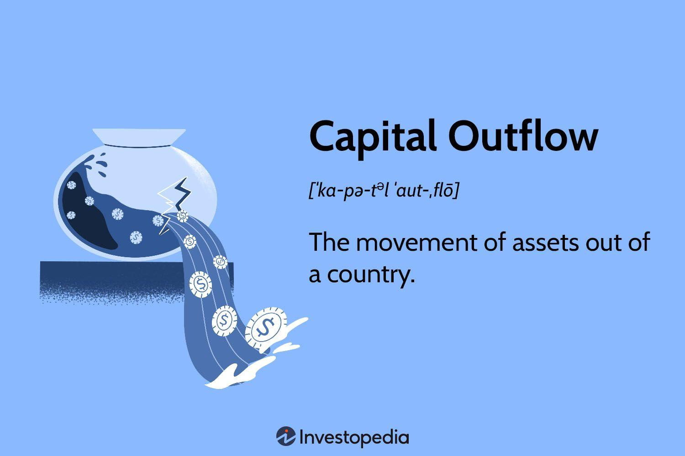

## Table of Contents

## What is capital outflow?

Capital outflow is when money leaves a country to be invested or spent in another country. This can happen when people or businesses move their money to other countries because they think they can get a better return on their investment or because they want to keep their money safe.

Sometimes, capital outflow can be a problem for a country. If too much money leaves, it can make the country's currency weaker and make it harder for the government to manage the economy. But it's not always bad. Sometimes, it's just people or businesses making normal decisions about where to put their money.

## Why does capital outflow occur?

Capital outflow happens when people or businesses decide to move their money out of their home country to another country. They might do this because they think they can make more money by investing in another country. For example, if another country has a booming stock market or offers higher interest rates on savings, people might want to put their money there instead of keeping it at home.

Another reason for capital outflow is when people want to keep their money safe. If they think their home country's economy is not doing well or might have problems in the future, they might move their money to a more stable country. This can happen during times of political uncertainty or when there are fears of economic crises. So, capital outflow can be about seeking better opportunities or trying to protect what they already have.

## What are the common reasons for capital outflow from a country?

Capital outflow happens when people or businesses take their money out of their country to invest or spend it in another country. One common reason for this is to find better investment opportunities. If another country has a strong economy, high interest rates, or a booming stock market, people might think they can make more money by putting their money there instead of keeping it at home.

Another reason for capital outflow is to keep money safe. If people feel that their home country's economy is not doing well or might have problems in the future, they might move their money to a more stable country. This often happens during times of political uncertainty, economic crises, or when there is a risk of currency losing value. By moving their money to a safer place, people hope to protect their savings and investments.

Sometimes, capital outflow can also be influenced by government policies. If a country has strict rules on how much money can be taken out or if taxes on investments are high, people might look for ways to get around these rules by moving their money to countries with fewer restrictions or lower taxes. This can lead to a significant amount of capital leaving the country, which can impact the local economy.

## How does capital outflow affect a country's economy?

When a lot of money leaves a country, it can affect the economy in several ways. One big effect is that the country's currency might become weaker. This happens because when people take their money out, there's less demand for the country's currency. A weaker currency can make things more expensive to buy from other countries, which can lead to higher prices for goods and services at home. This can make life harder for people and businesses in the country because they have to spend more money to get the same things.

Another effect of capital outflow is that it can make it harder for the government to manage the economy. When money leaves, there's less money available for the government to borrow, which can make it more expensive for them to get loans. This can slow down the economy because the government might have to cut back on spending on things like schools, hospitals, and roads. Also, if businesses see that money is leaving the country, they might feel less confident about investing at home, which can lead to fewer jobs and slower growth.

Overall, capital outflow can create a cycle where the economy gets weaker, causing more people to want to move their money out, which makes the economy even weaker. But it's not always bad. Sometimes, capital outflow is just people and businesses making normal decisions about where to put their money to get the best return or to keep it safe. The key is to keep an eye on how much money is leaving and why, so the government can take steps to manage the situation and keep the economy stable.

## Can you provide examples of capital outflow?

One example of capital outflow happened in Greece during its financial crisis in the early 2010s. Many people in Greece were worried about their country's economy and the possibility of losing their savings. So, they started moving their money to banks in other countries like Germany and Switzerland, where they thought their money would be safer. This big movement of money out of Greece made it harder for the Greek government to manage its economy and led to a lot of economic problems.

Another example is from China in the mid-2010s. Many Chinese people and businesses were looking for better investment opportunities and ways to protect their money from the ups and downs of the Chinese economy. They started investing in real estate, stocks, and other assets in countries like the United States, Canada, and Australia. This flow of money out of China made the Chinese government worry about losing control over its economy and led them to try to put new rules in place to stop so much money from leaving.

These examples show how capital outflow can happen for different reasons, like seeking safety or better investment opportunities. In both cases, the movement of money out of the country had a big impact on the local economy and made it harder for the governments to manage things at home.

## What is the difference between capital outflow and capital flight?

Capital outflow and capital flight both mean money is leaving a country, but they happen for different reasons. Capital outflow is when people or businesses move their money to another country because they think they can get a better return on their investment or they want to keep their money safe. It can happen in normal times and is not always a bad thing. For example, someone might invest in a foreign stock market because they think it will do better than their home market.

Capital flight, on the other hand, usually happens during times of trouble. It's when a lot of money leaves a country quickly because people are really worried about the economy or the government. They might be scared that their money will lose value or that they won't be able to get it back. This kind of sudden and large-scale movement of money can be very bad for a country's economy because it can lead to a lot of problems, like a weaker currency and less money for the government to use.

In short, capital outflow is a normal part of the global economy and can happen for many reasons, while capital flight is more urgent and happens when people are trying to protect their money from a crisis. Both can affect a country's economy, but capital flight often leads to more immediate and serious problems.

## How do governments attempt to control or manage capital outflow?

Governments try to manage capital outflow by putting rules in place to stop too much money from leaving the country. They might set limits on how much money people or businesses can take out, or they might make it harder to move money by adding more paperwork or taxes. For example, they could say you can only take out a certain amount of money each year or that you have to pay a special tax if you want to move your money to another country. These rules are meant to keep more money inside the country and help the economy stay strong.

Sometimes, instead of making strict rules, governments try to make their own country a better place to keep money. They might work on making the economy stronger, keeping the currency stable, or making it easier for people to invest at home. If people feel that their money is safe and they can make good investments in their own country, they might be less likely to move it somewhere else. This way, the government can encourage people to keep their money at home without having to use strict controls.

## What are the long-term effects of sustained capital outflow on a country?

If a country keeps losing money over a long time, it can really hurt its economy. When money keeps flowing out, the country's currency can get weaker and weaker. This makes things from other countries more expensive, which can lead to higher prices at home. People and businesses might find it harder to buy things they need, and this can slow down the economy. Also, if the government can't borrow money easily because there's less money around, they might have to cut back on important things like schools and hospitals. This can make life harder for everyone living in the country.

Over time, sustained capital outflow can also make businesses less confident about investing at home. If they see that money is always leaving the country, they might think it's not a good place to put their money. This can lead to fewer jobs and slower growth. The government might try to fix these problems by making strict rules to keep money in the country, but these rules can sometimes make things worse if they scare off investors even more. It's a tricky situation, and the long-term effects can make it hard for a country to keep its economy strong and growing.

## How does capital outflow relate to foreign direct investment (FDI)?

Capital outflow and foreign direct investment (FDI) are connected but they mean different things. Capital outflow happens when money leaves a country to be invested or spent somewhere else. This can be for many reasons, like looking for better investment opportunities or keeping money safe. On the other hand, foreign direct investment is when a business from one country puts money into a business in another country. So, capital outflow can include FDI, but it also includes other types of money movement like buying foreign stocks or putting money in foreign banks.

When a country has a lot of capital outflow, it can affect the amount of FDI it gets. If businesses see that a lot of money is leaving a country, they might think it's not a good place to invest. This can lead to less FDI coming into the country, which can make it harder for the economy to grow. On the flip side, if a country can attract a lot of FDI, it might help to balance out the capital outflow. More FDI means more money coming into the country, which can make the economy stronger and might encourage people to keep their money at home instead of moving it out.

## What role do multinational corporations play in capital outflow?

Multinational corporations can play a big role in capital outflow because they often move money from one country to another. When a company from one country sets up a business or invests in another country, it can lead to money leaving the home country. For example, if a company in the United States decides to build a factory in Mexico, the money they use to build that factory counts as capital outflow from the United States. These companies might also move money to other countries to take advantage of lower taxes or better investment opportunities, which can lead to even more capital outflow.

Sometimes, multinational corporations use strategies to move money around the world in ways that can affect capital outflow. They might use something called "transfer pricing," where they set prices for goods and services between different parts of their company in different countries. This can help them move profits to countries with lower taxes, which means money leaves the country where the profit was made. This kind of movement of money can make it harder for the home country to manage its economy because it loses out on the money that could have stayed and been used at home.

## How can data on capital outflow be used to predict economic trends?

Data on capital outflow can help people guess what might happen to a country's economy in the future. If a lot of money is leaving a country, it might mean that people are worried about the economy or think they can make more money somewhere else. This can be a sign that the economy might get weaker. For example, if data shows a big increase in capital outflow, it could mean that the country's currency might get weaker soon, and prices might go up. By looking at this data, experts can try to predict these changes and help the government or businesses plan for them.

On the other hand, if capital outflow is steady or going down, it might mean that people feel good about the economy and are happy to keep their money at home. This can be a good sign that the economy might stay strong or get even better. For example, if data shows that less money is leaving the country, it could mean that more people will invest at home, which can lead to more jobs and growth. By keeping an eye on capital outflow data, people can get a better idea of where the economy might be headed and make smarter decisions.

## What are some advanced economic models used to analyze capital outflow?

One advanced economic model used to analyze capital outflow is the Portfolio Balance Model. This model looks at how people and businesses decide where to put their money. It says that people think about things like how safe their money is, how much they can earn, and how easy it is to move money around. If a country's economy seems risky or if there are better opportunities somewhere else, more money might leave the country. By using this model, economists can understand why capital outflow happens and guess what might happen next to the economy.

Another model is the Capital Asset Pricing Model (CAPM). This model helps to figure out how much risk people are willing to take when they invest their money. If a country's economy is seen as risky, people might move their money to a safer place, causing capital outflow. The CAPM can help economists see how changes in risk and expected returns affect where people choose to invest their money. By looking at these factors, experts can predict how much money might leave a country and plan for the economic effects.

## What are the policy responses and recommendations?

Effective economic policies play a crucial role in stabilizing capital flows and ensuring economic resilience. These policies must strike a balance between applying restrictive measures and maintaining an environment conducive to investment. Key policy interventions include adjusting interest rates, implementing capital controls, and enhancing regulatory oversight, each of which significantly impacts capital flow dynamics and economic stability.

Adjusting interest rates is a primary tool used by central banks to influence capital movements. By increasing interest rates, a country can attract foreign investment due to higher returns compared to other markets. Conversely, lowering interest rates can encourage domestic spending and investment by making borrowing cheaper. For instance, during periods of economic downturn, central banks might reduce interest rates to stimulate economic activity. The formula for the [interest rate](/wiki/interest-rate-trading-strategies) spread, which impacts capital flow, can be expressed as:

$$
\text{Interest Rate Spread} = \text{Domestic Interest Rate} - \text{Foreign Interest Rate}
$$

This spread guides investors in deciding whether to move capital into or out of a particular nation.

Capital controls are another measure that can be enacted to manage the flow of foreign and domestic capital. These controls might include transaction taxes, limits on foreign ownership, or restrictions on the repatriation of profits. While these measures can prevent abrupt capital flight, which destabilizes economies, they must be carefully calibrated to avoid discouraging foreign investment. Historical examples, such as Malaysia's response during the Asian Financial Crisis, demonstrate the potential effectiveness of capital controls in stabilizing economies without compromising long-term growth prospects.

Enhancing regulatory oversight is vital to ensuring transparency and stability in financial markets. Robust regulatory frameworks help monitor cross-border financial transactions, reducing the risk of volatile capital movements and ensuring compliance with international standards. Regulations related to financial reporting, anti-money laundering, and investment transparency are pivotal in promoting investor confidence and securing stable capital flows.

Balancing these measures requires a nuanced approach, where governments must weigh short-term stability against long-term economic growth. Policies that are too restrictive can deter investment and stifle economic progress, while overly lax measures can lead to unchecked capital movements, increasing vulnerability to financial crises. Understanding and dynamically adjusting these policy tools is essential for governments aiming to create a resilient economic environment capable of withstanding global financial pressures.

## References & Further Reading

[1]: Eichengreen, B. (2002). ["Capital Flows and Crises"](https://direct.mit.edu/books/monograph/2497/Capital-Flows-and-Crises). MIT Press.

[2]: Bernanke, B. (2000). ["Essays on the Great Depression"](https://archive.org/details/essaysongreatdep0000bern). Princeton University Press.

[3]: Kaminsky, G.L., & Reinhart, C.M. (1999). ["The Twin Crises: The Causes of Banking and Balance-of-Payments Problems."](https://www.aeaweb.org/articles?id=10.1257/aer.89.3.473) American Economic Review, 89(3), 473-500.

[4]: Aitken, M., Almeida, N., & Harris, F. (2007). ["High Frequency Trading in Financial Markets: The Role of Regulation"](https://onlinelibrary.wiley.com/doi/full/10.1111/j.1467-629X.2007.00235.x). Financial Review, 42(2), 345-368.

[5]: Chan, E. (2009). ["Quantitative Trading: How to Build Your Own Algorithmic Trading Business"](https://github.com/ftvision/quant_trading_echan_book). John Wiley & Sons.

[6]: Lopez de Prado, M. (2018). ["Advances in Financial Machine Learning"](https://www.amazon.com/Advances-Financial-Machine-Learning-Marcos/dp/1119482089). John Wiley & Sons.

[7]: Radelet, S., & Sachs, J.D. (1998). ["The Onset of the East Asian Financial Crisis."](https://www.nber.org/papers/w6680) Brookings Papers on Economic Activity, 1998(2), 1-74.

[8]: Tsang, S.K. (2010). ["The Role of China in Global Capital Flows"](https://www.jstor.org/stable/pdf/29780225.pdf?addFooter=false). The China Quarterly, 203, 45-66.

[9]: Wieland, V. (2009). ["Monetary Policy and the Distribution of Capital Flows in an Open Economy."](https://www.journals.uchicago.edu/doi/full/10.1086/596001) European Central Bank Working Paper No. 806.