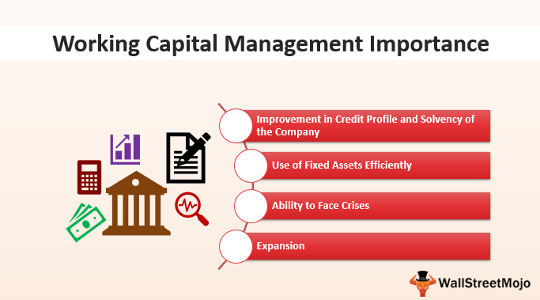

The world of finance offers a myriad of pathways for companies seeking to go public and raise capital. Among these, the Capital Pool Company (CPC) model stands out as a distinctly Canadian approach tailored to facilitate initial public offerings (IPOs) for emerging businesses. This innovative mechanism enables firms to access public markets, notably on the TSX Venture Exchange, without necessitating traditional venture capital backing. 

CPCs are particularly beneficial for companies lacking the conventional financial endorsements often required to enter public markets. They provide an alternative route, offering a structured solution that reduces the complexities and costs typically associated with IPOs. This approach is especially pertinent given the challenges many emerging businesses face in navigating the demanding landscape of public market entry.

This article examines the relationship between the CPC program, venture capital investments, and algorithmic trading, focusing on how these components collectively enhance capital market operations. The synergy between CPCs, venture capital, and algorithmic trading not only fosters growth in financial markets but also paves the way for innovation and efficiency. By leveraging the CPC structure, companies in the algorithmic trading sector can access necessary capital resources to amplify their ventures, while also attracting venture capital interest through established pathways that potentially expedite the public listing process.

Understanding these intricate connections provides valuable insights into the dynamic and evolving nature of Canada's financial markets. Through the lens of the CPC model, one can appreciate the unique opportunities and strategic advantages available within this landscape, highlighting Canada's role as a hub for financial innovation and growth.

## Table of Contents

## Understanding Capital Pool Companies (CPCs)

A Capital Pool Company (CPC) is an innovative financial mechanism crafted to assist private companies in gaining access to public capital markets within Canada, streamlining the complexities traditionally associated with initial public offerings (IPOs). 

CPCs are initially established as shell companies without any commercial operations. These entities are formed by seasoned directors and industry professionals who pool their resources and expertise to list the CPC on the TSX Venture Exchange. The primary goal of a CPC is to identify and then acquire a promising private business. Through this acquisition, the private entity is effectively transformed into a public company, benefitting from increased financial resources and the substantial market experience of the CPC founders. This transformation involves not just capital infusion but also strategic guidance to ensure the private company's successful transition to a publicly traded entity.

The inception of the CPC model was largely driven by the distinct landscape of venture capital opportunities in Canada, which historically lagged behind those available in the United States. This disparity prompted the creation of a structured alternative that offers private companies a viable path to public financing without relying solely on traditional venture capital backing. By mitigating some of the geographic and systemic limitations within Canada's venture capital ecosystem, CPCs provide a compelling platform for emerging businesses to accelerate their growth in the public domain.

## The CPC Process Explained

The CPC process comprises two main phases: the initial creation of the Capital Pool Company and the subsequent execution of a qualifying transaction. During the initial phase, experienced investors and industry professionals collaborate to pool their financial resources. This collective effort aims to meet the regulatory prerequisites necessary to list the CPC on the TSX Venture Exchange. The listing process involves compliance with stringent regulations to ensure transparency and accountability, laying the groundwork for future operations.

The second phase focuses on the CPC's transition from a shell company to an operational entity. This is achieved through the identification and acquisition of a suitable target company. The acquisition process is critical as it essentially transforms the CPC into a fully functioning public company. This transformation often results in significant value creation for both the original investors and new shareholders, as the acquired company's business operations are integrated into the public market structure.

A well-executed qualifying transaction requires meticulous planning and execution to ensure that the emerging public entity adheres to market standards. These standards typically include a solid public capital structure, characterized by a diversified shareholder base, and the presence of an experienced management team capable of steering the company towards growth and stability. This dual-phase process not only facilitates access to public capital but also ensures that the resulting company is well-positioned to compete and succeed in the public domain.

## CPCs and Venture Capital

Venture capital (VC) is integral in fostering the growth and development of companies by providing them with early-stage funding and strategic guidance. This type of financing supports innovation by offering businesses the resources and networks necessary to scale their operations. In Canada, Capital Pool Companies (CPCs) have become a valuable mechanism to attract VC interest due to their ability to streamline the transition of companies to public markets.

CPCs present an efficient route for VC-backed entities to enter public markets, thus enabling a faster progression compared to the conventional IPO process. By functioning as shell companies on the TSX Venture Exchange, CPCs identify and acquire promising private businesses. This acquisition acts as a qualifying transaction that effectively transitions the entity to a public-facing company. For venture capitalists, this process offers a defined and reliable path for investment and potential [exit](/wiki/exit-strategy) strategies, which reduces the uncertainties typically associated with public offerings.

Moreover, the synergy between CPCs and venture capital provides startups with a structured approach towards market entry. When startups leverage CPC support in combination with VC backing, they benefit from an amalgamation of financial and advisory resources. This integration results in comprehensive growth strategies, employing both the stability and market access provided by CPCs and the funding and strategic input from venture capital. For startups, the dual support system can manifest in enhanced business plans, expanded market presence, and increased shareholder value.

By merging these financial frameworks, CPCs and venture capitalists together foster an ecosystem where innovation thrives, and companies are better positioned to achieve their full potential in the competitive landscape of public markets.

## Algorithmic Trading and CPC Ventures

Algorithmic trading represents a transformative force in financial markets, leveraging sophisticated technology and data analytics to execute trades at speeds and frequencies human traders cannot achieve. This form of trading employs algorithms—step-by-step computational procedures—to automate trading decisions, often based on a range of quantitative signals or patterns detected in large datasets.

The Capital Pool Company (CPC) model presents unique opportunities for [algorithmic trading](/wiki/algorithmic-trading) ventures. For emerging companies specializing in trading technologies, CPCs provide a streamlined path to access capital markets, enabling rapid scaling and development. The fundamental appeal of using a CPC structure lies in its ability to leverage public financing while minimizing the risks traditionally associated with initial public offerings (IPOs).

By employing CPCs, algorithmic trading firms can secure both the capital and operational infrastructure required to develop and refine their trading strategies. This is critical in a domain where continuous improvement of algorithms, [machine learning](/wiki/machine-learning) models, and data integration processes directly influences competitiveness and profitability. The public market access facilitated by CPCs empowers these firms to invest in advanced computational resources, expand their research teams, and optimize their trading strategies more effectively.

This fusion between CPCs and algorithmic trading ventures underscores a significant shift in modern trading environments. By providing a viable capital-raising alternative, CPCs can aid trading technology startups in overcoming the conventional financial barriers to entry. Emerging firms can utilize the funds and visibility offered by public markets to accelerate their innovation cycles, experimenting with new models and technologies to generate higher returns.

The operational model of CPCs offers several advantages, including increased [liquidity](/wiki/liquidity-risk-premium), a broadened investor base, and heightened corporate governance standards. These benefits collectively enhance the credibility and strategic positioning of the firms within competitive markets. As algorithmic trading continues to redefine financial services, the support from CPCs ensures that innovation is not stifled by capital constraints, allowing companies to push the boundaries of what technology can achieve in trading.

Through this dynamic interplay of CPC capital and algorithmic innovation, the financial services industry can expect enhanced efficiency, new trading paradigms, and a sustained trajectory of growth and modernization. The synergy between CPCs and algorithmic trading enterprises marks a pivotal evolution in capital market operations, fostering an environment ripe for advancement and success.

## Conclusion

The Capital Pool Company (CPC) program serves as an essential mechanism for enabling [capital raising](/wiki/hedge-fund-capital-raising) and facilitating market entry for emerging businesses within Canada's financial ecosystem. By interacting synergistically with venture capital and algorithmic trading, CPCs create substantial opportunities for innovation and growth across various financial sectors. Venture capitalists, attracted by the structured and less risky approach to going public, find CPCs as efficient bridges connecting early-stage ventures to public markets. Simultaneously, algorithmic trading firms can leverage CPC structures to secure the necessary capital and operational frameworks that accelerate their technological advancements and market reach.

Understanding the interaction between CPCs, venture capital, and algorithmic trading provides valuable insights into the mechanisms of efficient market practices and highlights the evolving nature of global capital markets. This tripartite relationship facilitates smoother transitions for private companies into the public space, minimizing traditional IPO uncertainties and providing a comprehensive growth path. It underlines the role of CPCs as adaptable tools, aligning with current market demands and technological advancements, to help companies achieve their strategic goals.

As public market entry strategies continue to evolve, CPCs distinguish themselves by offering businesses the essential resources to realize their full potential. The adaptability and structured approach of CPCs make them particularly suited for the contemporary financial landscape, presenting a robust platform for aspiring companies aiming for sustainable growth and market competitiveness.

## References & Further Reading

[1]: ["Capital Pool Company (CPC) program"](https://www.tsx.com/en/listings/listing-with-us/listing-guides/ways-to-list/capital-pool-company-cpc-program) by TSX Venture Exchange.

[2]: ["Going Public with a Capital Pool Company"](https://www.fasken.com/-/media/0a047c3c2d814aadaed7de9c9afe1308.pdf) by WeirFoulds LLP

[3]: Letourneau, R. (2020). ["The CPC Process and its benefits for Canadian private companies."](https://journals.sagepub.com/doi/full/10.1177/0021886319892685)

[4]: Lopez de Prado, M. (2018). ["Advances in Financial Machine Learning"](https://www.amazon.com/Advances-Financial-Machine-Learning-Marcos/dp/1119482089). John Wiley & Sons. 

[5]: Chan, E. P. (2009). ["Quantitative Trading: How to Build Your Own Algorithmic Trading Business"](https://github.com/ftvision/quant_trading_echan_book). John Wiley & Sons.