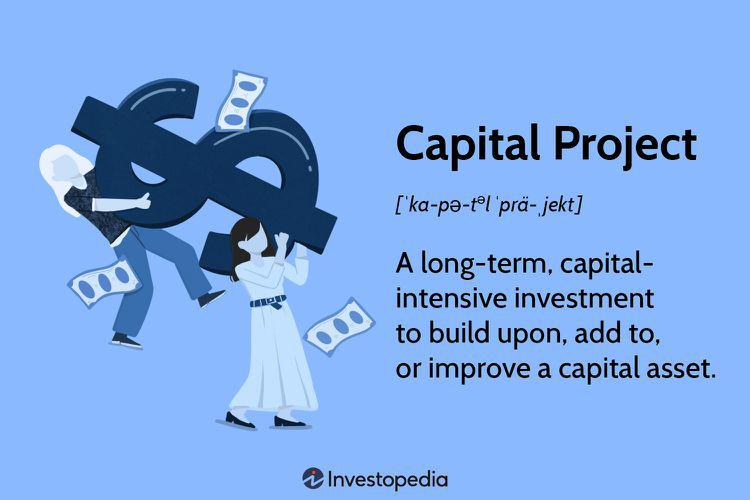

Capital projects represent significant, long-term investments typically aimed at creating, maintaining, or improving a capital asset. Whether constructing a new transportation infrastructure, enhancing a manufacturing facility, or investing in large-scale technology development, these projects require meticulous planning, substantial funding, and precise execution. Algorithmic trading, which employs automated systems for executing trades in financial markets, introduces an innovative frontier for managing these capital investments efficiently. Integrating advanced algorithms enables dynamic decision-making and optimization of investment strategies, potentially amplifying the financial performance of capital projects. 

This article examines various elements fundamental to the effective management, funding, and execution of capital projects. By understanding these key drivers, both industry professionals and investors can gain valuable insights. Real-world examples will illustrate how successful capital initiatives are undertaken, while an exploration of funding mechanisms will shed light on the diverse sources facilitating such ventures. Additionally, by examining the role of algorithmic trading in these projects, the article seeks to uncover how automated systems can optimize financial strategies and elevate the efficacy of capital allocations. The interplay between capital projects and algorithmic trading marks an evolutionary step in financial management, promising transformative impacts on both sectors.

## Table of Contents

## Understanding Capital Projects

Capital projects are substantial, long-term investments aimed at improving or expanding capital assets, which can include infrastructure, industrial facilities, or technological systems. These projects are characterized by their large scale, significant cost, and intricate planning processes, all of which contribute to their complexity and importance in driving economic growth and development.

**Definition and Components**

Capital projects typically involve the creation, acquisition, or enhancement of fixed assets, such as buildings, machinery, or transportation systems, meant to provide value over an extended period. The primary components that define these projects include scale, cost, and planning.

1. **Scale**: Capital projects often involve substantial undertakings that may span across various geographical regions and industries. Whether it's the construction of a power plant, a railway line, or a new corporate headquarters, the scale can vary significantly, but the impact is invariably considerable due to the resources and coordination required.

2. **Cost**: Due to their extensive nature, capital projects necessitate large investments, often reaching millions or even billions of dollars. The financial planning involves sourcing funds from various avenues like investments, loans, or grants. Detailed cost estimation and budgeting are crucial to avoid overruns that could jeopardize the project's viability.

3. **Planning**: Thorough planning is essential for the successful execution of capital projects. This includes feasibility studies, risk assessments, scheduling, resource allocation, and setting clear milestones. Effective planning helps in foreseeing potential setbacks and preparing mitigation strategies, ensuring adherence to timelines and budget constraints.

**Importance of Successful Execution**

The successful execution of capital projects is vital as they significantly influence economic infrastructure and operational capabilities. A project that is well-executed can lead to increased productivity, improved service delivery, and a boost in economic activity. Conversely, mismanagement can result in cost overruns, delayed timelines, and suboptimal outcomes, ultimately impacting financial returns and stakeholder trust.

By understanding the intricacies of capital projects, stakeholders can better manage these complex investments to enhance capital assets efficiently, thereby driving strategic growth and innovation.

## Examples of Capital Projects

Capital projects are substantial investments designed to improve or expand infrastructure and organizational capabilities. Infrastructure projects such as railways, roads, and dams are prime examples of capital projects due to their significant scale and large budgets. These undertakings often aim to enhance connectivity, facilitate trade, and improve overall societal well-being. For instance, the construction of high-speed rail networks is a transformative project that promises to reduce travel times and economic disparities between regions.

Examples of such infrastructure projects include the Channel Tunnel between the United Kingdom and France, which exemplifies the integration of advanced engineering with substantial capital investment, and the Three Gorges Dam in China, which effectively addresses energy production and flood control. These projects highlight the complex logistics and strategic planning required to ensure successful completion.

Corporate investments in equipment and facilities also fall under capital projects. Companies frequently invest in advanced machinery and expanded manufacturing plants to increase production capacity and enhance product quality. A notable example is Tesla's Gigafactory, where large-scale investment in production facilities seeks to revolutionize battery manufacturing and electric vehicles. Such projects not only advance technological progress but also represent a critical commitment to sustainability.

Case studies of well-known capital projects reveal the diverse nature of such investments.

1. **The Crossrail Project**: In London, the Crossrail Project, also known as the Elizabeth Line, represents one of Europe's largest infrastructure investments, undertaken to improve the city's transport network. Initiated in 2009, the project exemplifies how massive investment and meticulous planning can modernize urban transportation, significantly impacting economic growth and urban development.

2. **Amazon's Fulfillment Centers**: On the corporate front, Amazon's expansion of its fulfillment centers globally underscores strategic investment in logistics and supply chain efficiency. These facilities utilize automation and artificial intelligence to optimize the e-commerce giant's delivery capabilities, highlighting how corporate capital projects can enhance operational efficiency and customer service.

3. **The Beijing Daxing International Airport**: This prominent capital project aimed at expanding China's aviation infrastructure seeks to accommodate the growing demand for air travel. Completed in 2019, the airport’s innovative design and advanced technology aim to facilitate a seamless travel experience, demonstrating substantial investment in transportation infrastructure to spur economic activity.

These examples underscore the multifaceted nature of capital projects, involving multi-tiered funding, risk management, and innovative execution strategies to achieve long-term benefits. Successful capital projects typically require not only financial prowess but also strategic foresight to adapt to technological advancements and evolving market conditions.

## Funding Capital Projects

Capital projects, inherently capital-intensive and long-term in nature, require substantial funding. These projects depend on diverse funding sources to meet their financial requirements, which typically include bonds, grants, and equity financing. This diversified funding strategy helps in mitigating risks and aligns financial resources with project timelines.

**Bonds** are one of the most common instruments used to fund capital projects, particularly for government or municipal undertakings. These are essentially loans made by investors to the project entity, which, in return, offers regular interest payments and the principal at maturity. Bonds are favored due to their ability to raise significant capital quickly and efficiently. Infrastructure projects, such as highway constructions or public transportation systems, frequently utilize bond issues to secure necessary financial backing. 

**Grants** provide another vital funding avenue, especially for public capital projects. Offered by government bodies, non-profit organizations, or international agencies, grants do not require repayment, making them an attractive funding option. They often target projects with significant social or environmental benefits, such as renewable energy installations or educational infrastructure improvements.

**Equity financing** involves raising funds through the sale of ownership stakes in the project. This can attract investors seeking higher returns and willing to accept the associated risks. Equity financing is commonplace in projects where entrepreneurial risk-taking is rewarded by potential high returns, as in the case of new technology developments or resource extraction initiatives.

The role of the **government** in funding public capital projects is multifaceted. Governments can act as direct investors, providing financial resources through budget allocations for public works. Public-private partnerships (PPPs) serve as a lucrative scheme where government involvement is intertwined with private sector participation, sharing both the risks and rewards of significant infrastructure developments. Government support through subsidies and tax incentives also encourages private investment in public projects.

**Financial risks and rewards** are inherent in capital project financing. Risks can originate from various sources, including construction delays, cost overruns, changes in regulatory landscapes, or shifts in market demand. Effective risk management strategies are crucial for minimizing potential negative impacts on project viability. Conversely, successful completion of capital projects can lead to substantial rewards—enhanced infrastructure, community benefits, and significant financial returns. Therefore, strategic funding and careful risk assessment play crucial roles in ensuring both project success and investor satisfaction.

By leveraging these various funding mechanisms, capital projects can secure the significant resources required for their execution while balancing the risks and rewards inherent in such undertakings.

## Algorithmic Trading in Capital Projects

Algorithmic trading represents a significant innovation in the financial management of capital projects. At its core, [algorithmic trading](/wiki/algorithmic-trading) involves using computer algorithms to execute trades based on predetermined criteria and complex mathematical models. This approach is particularly valuable for managing the financial aspects of capital projects due to its speed, efficiency, and ability to process large volumes of data.

In the context of capital projects, algorithmic trading optimizes investment strategies by effectively balancing risk and return. Algorithms can assess real-time market conditions and historical data to forecast future trends, enabling more informed investment decisions. For instance, they can determine the optimal timing for acquiring financial instruments like bonds or equities, thereby reducing exposure to market [volatility](/wiki/volatility-trading-strategies).

To illustrate the application of algorithmic trading in capital project investments, consider the following example. A large infrastructure project, such as the construction of a new transportation system, requires significant funding, typically sourced through bonds or equity. An algorithmic trading system can analyze current market conditions and historical data to identify the most advantageous time to issue bonds, aiming to secure the lowest borrowing costs. Additionally, the algorithm can monitor [interest rate](/wiki/interest-rate-trading-strategies) fluctuations and adjust the issuance strategy accordingly, ensuring cost-effective funding for the project.

Furthermore, algorithmic trading facilitates the efficient management of portfolios associated with capital projects. For instance, if a corporation is investing in new facilities, algorithms can help optimize the mix of assets in their investment portfolio, balancing equities, and bonds to align with the company's risk tolerance and return expectations. By automating this process, the corporation can achieve more precise control over its investment mix, potentially enhancing returns while mitigating risks.

Overall, algorithmic trading offers advanced tools for optimizing the financial strategies underpinning capital projects, improving both the decision-making process and financial outcomes. This integration of technology into capital investment management not only increases efficiency but also empowers investors to make better-informed decisions, crucial for the successful execution of these large-scale undertakings.

## Future Trends and Innovations

Emerging trends in capital project funding and execution are increasingly influenced by technological innovations and evolving financial strategies. Traditional funding mechanisms for capital projects, such as bonds, equities, and government grants, are being complemented by innovative approaches like public-private partnerships and crowd-funding platforms. Public-private partnerships offer a collaborative model where the public sector engages with private enterprises to fund and execute large-scale projects, allowing for risk-sharing and pooling of resources. Crowd-funding platforms enable smaller investors to contribute to capital projects, democratizing access to investment opportunities.

The ongoing evolution of algorithmic trading within capital markets is playing a transformative role in how investments related to capital projects are managed. Algorithmic trading utilizes complex mathematical models and [artificial intelligence](/wiki/ai-artificial-intelligence) to execute trades at high speed and [volume](/wiki/volume-trading-strategy), optimizing investment strategies by analyzing vast datasets in real-time. This capability allows for precise risk assessment and market prediction, which can be particularly advantageous for managing the financial components of capital projects. By employing algorithmic trading, investors can improve [liquidity](/wiki/liquidity-risk-premium) and hedge against market volatility, ensuring more stable project funding.

Advancements in technology are significantly enhancing capital project efficiency. Innovations such as Building Information Modeling (BIM), the Internet of Things (IoT), and blockchain are revolutionizing project planning and execution processes. BIM provides a digital representation of physical and functional characteristics of facilities, enabling better visualization, collaboration, and decision-making. IoT devices offer real-time monitoring and data collection, which optimize resource allocation and improve maintenance schedules. Blockchain technology enhances transparency and security in transactions, particularly useful in complex projects involving numerous stakeholders.

In conclusion, the integration of advanced technologies and evolved financial strategies is reshaping the landscape of capital project funding and execution. Algorithmic trading and digital innovations are not only optimizing financial management but also driving efficiency and sustainability in capital projects. As these trends continue to develop, stakeholders across the industry will need to adapt and leverage these tools to stay competitive.

## Conclusion

Capital projects and algorithmic trading together represent a powerful symbiosis in modern financial and industrial landscapes. These projects, which involve substantial investments to enhance long-term capital assets, require efficient strategic planning and execution. The complexity inherent in such large-scale undertakings demands meticulous funding strategies, often encompassing diverse sources like bonds, grants, and equity financing. Each method comes with its own set of risks and rewards, underscoring the necessity for astute financial oversight.

Algorithmic trading can significantly enhance the management of capital projects by optimizing investment strategies and refining decision-making processes. Through sophisticated algorithms, trades can be executed at speeds and accuracies beyond human capabilities, allowing for more effective handling of the financial aspects of these projects. The integration of algorithmic trading not only assists in managing risks but also in maximizing returns.

As both capital projects and algorithmic trading continue to evolve, staying attuned to emerging trends and innovations becomes crucial. The advancements in technology are promising enhanced efficiency in capital project execution and deeper integration of algorithmic trading within capital markets. This integration facilitates more dynamic financial strategies, potentially increasing the success rates of capital projects.

Investors and industry professionals are encouraged to consider incorporating algorithmic trading techniques into their investment planning processes. Employing these technologies offers a competitive edge, ensuring that capital projects are both strategically funded and executed with precision. Achieving this optimal blend could be pivotal in navigating the complexities of modern capital markets, leading to improved outcomes in industrial development and economic growth.

## References & Further Reading

[1]: Chan, E. P. (2008). ["Quantitative Trading: How to Build Your Own Algorithmic Trading Business"](https://github.com/ftvision/quant_trading_echan_book). John Wiley & Sons.

[2]: Goodfellow, I., Bengio, Y., & Courville, A. (2016). ["Deep Learning"](https://link.springer.com/article/10.1007/s10710-017-9314-z). MIT Press.

[3]: Lopez de Prado, M. (2018). ["Advances in Financial Machine Learning"](https://www.amazon.com/Advances-Financial-Machine-Learning-Marcos/dp/1119482089). Wiley.

[4]: Aronson, D. R. (2006). ["Evidence-Based Technical Analysis: Applying the Scientific Method and Statistical Inference to Trading Signals"](https://onlinelibrary.wiley.com/doi/book/10.1002/9781118268315). Wiley.

[5]: Jansen, S. (2018). ["Machine Learning for Algorithmic Trading"](https://github.com/stefan-jansen/machine-learning-for-trading). Packt Publishing.

[6]: Bergstra, J., Bardenet, R., Bengio, Y., & Kégl, B. (2011). ["Algorithms for Hyper-Parameter Optimization."](https://dl.acm.org/doi/10.5555/2986459.2986743) Advances in Neural Information Processing Systems 24.