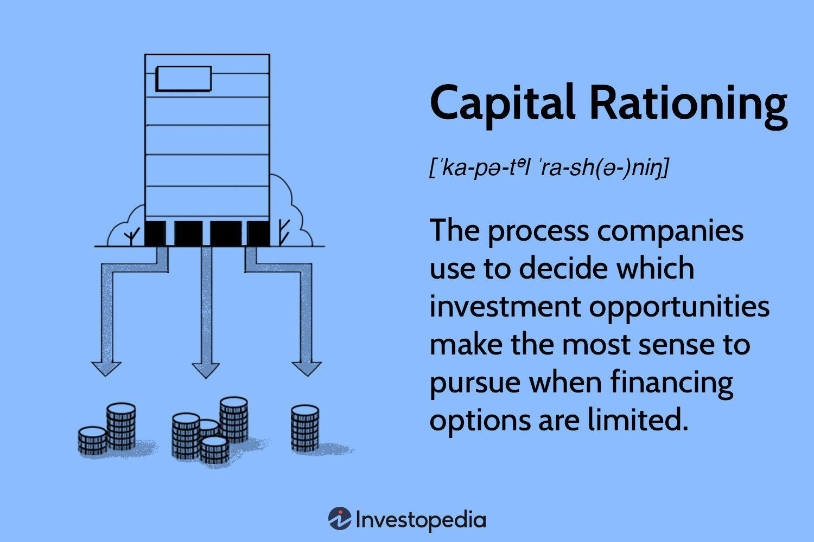

In today's dynamic financial landscape, businesses face numerous investment opportunities, each promising potential growth and returns. However, the reality of limited resources necessitates strategic decisions on capital allocation to ensure maximum return and sustainable business progress. This constraint poses a significant challenge for financial managers seeking to optimize investment strategies while navigating budget limitations.

This article examines the capital rationing investment strategy, a crucial methodology in financial management that helps prioritize and select projects under fiscal constraints. Additionally, it investigates the emergence of algorithmic trading, a transformative force in modern finance which utilizes complex mathematical models and algorithms for trading decisions, enhancing the efficiency and precision of investment strategies.



By integrating capital rationing with algorithmic trading, financial decision-makers can significantly enhance their ability to make informed, strategic investment choices. This synergy between a disciplined investment selection process and advanced trading techniques offers a pathway to improved financial outcomes and growth.

Understanding capital rationing, along with the application of algorithmic trading, equips financial managers with the tools necessary for optimizing investment strategies. This approach ensures that despite limited resources, optimal investment decisions are made, ultimately driving long-term growth and profitability.

## Table of Contents

## Understanding Capital Rationing

Capital rationing is a fundamental concept in financial management used to determine the most profitable allocation of limited resources among various investment opportunities. Its purpose is to maximize returns when capital availability is constrained, ensuring that only the most promising projects receive funding. 

Capital rationing can be categorized into two types: hard capital rationing and soft capital rationing. Hard capital rationing arises from external constraints, such as a limited ability to raise funds due to market conditions or company-specific factors like creditworthiness. When a company faces difficulties accessing capital markets or obtaining loans, it must prioritize projects based on potential returns under these externally imposed financial limitations.

On the other hand, soft capital rationing is driven by internal policies and management decisions. Companies may impose artificial constraints on capital spending to control investment risks, maintain financial flexibility, or adhere to strategic priorities. This type of rationing can be due to internal budgetary policies or managerial caution. By setting a ceiling on capital expenditure, the company ensures that resources are allocated to projects that align best with its strategic goals and yield the highest returns.

Capital rationing is not merely a reactive measure to financial constraints but also a proactive strategic tool. It requires a comprehensive evaluation of potential projects to determine which will offer the highest profitability. The decision-making process often involves intricate calculations, such as projecting cash flows, assessing project risk, and applying financial metrics like Net Present Value (NPV) and Internal Rate of Return (IRR). By analyzing these metrics, financial managers can rank projects and allocate funds to maximize the overall return on investment.

In summary, capital rationing is a critical strategy in financial management that ensures optimal allocation of limited capital resources by distinguishing between hard and soft rationing constraints. By carefully analyzing potential investment opportunities and prioritizing projects that offer the greatest returns, businesses can strategically manage their financial resources to achieve higher profitability and long-term success.

## The Role of Capital Rationing in Investment Decisions

Capital rationing plays a pivotal role in corporate finance by enabling businesses to prioritize investment projects when faced with limited capital resources. This strategic financial approach ensures that available funds are directed towards the most lucrative opportunities, thereby maximizing a company's potential returns.

The primary methods used in capital rationing include Net Present Value (NPV) and Internal Rate of Return (IRR). These techniques are adapted under budgetary constraints to help financial managers make informed decisions. Net Present Value, calculated as:

$$
NPV = \sum \frac{C_t}{(1 + r)^t} - C_0
$$

where $C_t$ represents net cash inflows during the period, $r$ is the discount rate, and $C_0$ is the initial investment, allows the evaluation of a project's profitability over time. Projects with a positive NPV are typically prioritized as they are expected to generate more value than their cost.

Internal Rate of Return, on the other hand, is the discount rate that makes the net present value of all cash flows from a particular project equal to zero. It is commonly used to estimate the profitability of potential investments. The higher the IRR, the more desirable the project. However, under capital rationing scenarios, companies often need to choose projects with not just high IRR but also those that fit within the budget constraints and complement the overall project portfolio.

The overarching goal of capital rationing is to maximize the total NPV of the selected portfolio of projects, ensuring an effective allocation of the limited financial resources available to the company. This involves a careful assessment of each project's cash flow projections and risks, weighted against their potential returns. Additionally, consideration of external factors such as market conditions and strategic alignment with the company’s long-term vision is crucial for making judicious investment decisions.

Implementing robust capital rationing strategies enables firms to maintain financial discipline, reduce risk, and enhance their economic performance over the long term. By focusing on maximizing the return on limited capital, businesses can ensure stronger financial health and sustainable growth.

## Techniques and Calculations Used in Capital Rationing

Capital rationing techniques involve precise methods to select and prioritize investment projects when funds are limited. One primary method used is linear programming, which provides a mathematical approach to decide the optimal allocation of limited resources. This technique models a set of equations to represent constraints and objectives, maximizing the total Net Present Value (NPV) of the projects selected. The decision variables typically represent project selections, and the objective function quantifies the cumulative return or benefit from these investments, subject to budgetary and other constraints. 

Linear programming can be particularly useful when dealing with complex scenarios involving multiple projects and constraints. For example, it looks to solve an optimization problem defined by:

$$

\text{Maximize } Z = \sum_{i=1}^{n} c_i x_i
$$

Subject to:

$$
\sum_{i=1}^{n} a_{ij} x_i \leq b_j \quad \text{for all } j
$$

$$
x_i \in \{0, 1\} \quad \text{for all } i
$$

Here, $x_i$ are binary decision variables indicating whether a project is selected, $c_i$ represents the expected cash inflow of each project, $a_{ij}$ represents the resource consumption of project $i$ on constraint $j$, and $b_j$ indicates the available amount of resource $j$.

Another pivotal calculation in capital rationing is the Profitability Index (PI), which aids in ranking investments based on their expected returns relative to their initial investment. The PI is calculated as follows:

$$
PI = \frac{\text{Present Value of Future Cash Flows}}{\text{Initial Investment}}
$$

The PI provides a ratio that indicates the value created per unit of investment. A PI greater than 1 suggests that the project generates more value than its cost, and thus, projects with the highest PIs are prioritized under constraints. Profitability Index is especially useful when projects are not mutually exclusive and there is a need to select a combination of projects to maximize returns while adhering to capital limits.

By using these techniques, it becomes possible for firms to not only prioritize high-return projects but also systematically navigate through financial constraints, ensuring an efficient allocation of capital that supports strategic growth objectives. Utilizing exact mathematical methods distinguishes capital rationing techniques as robust tools for informed corporate finance decision-making.

## Algorithmic Trading: Enhancing Investment Strategy

Algorithmic trading, a cornerstone of modern financial markets, employs mathematical models and computational algorithms to execute trading decisions. This method enhances investment strategies by providing systematized approaches to buying and selling financial instruments.

One of the primary advantages of [algorithmic trading](/wiki/algorithmic-trading) is its speed. Algorithms can process market data and execute trades orders of magnitude faster than a human trader. This speed allows traders to capitalize on fleeting market opportunities that are imperceptible in manual trading environments.

Precision is another critical advantage. Algorithmic trading minimizes human error and enhances the accuracy of executing trades at desired prices. This precision is crucial in managing assets and risks effectively, leading to optimized portfolio performance.

The ability to analyze vast amounts of data is perhaps the most compelling advantage of algorithmic trading. With the exponential growth in financial data, algorithms are uniquely positioned to sift through large datasets, identify patterns, and predict future price movements. This capability supports various sophisticated trading strategies.

For long-term investors, algorithmic trading facilitates strategies such as mean reversion, [trend following](/wiki/trend-following), and dynamic rebalancing:

- **Mean Reversion**: This strategy is based on the assumption that asset prices will tend to revert to their historical averages over time. Algorithms can monitor price deviations and execute trades accordingly, thus exploiting this tendency for profit. 

- **Trend Following**: Algorithms can identify and capitalize on trends in asset prices by analyzing moving averages and other trend indicators. By systematically entering and exiting trades based on predefined criteria, these algorithms can generate consistent returns in trending markets.

- **Dynamic Rebalancing**: This involves continuously adjusting the composition of a portfolio to maintain a desired level of risk or asset allocation. Algorithms can automatically rebalance a portfolio in response to market movements, thus ensuring that the investor's strategic objectives are consistently met.

In summary, algorithmic trading significantly enhances investment strategy by offering speed, accuracy, and data-driven insights. It enables investors to implement sophisticated trading strategies efficiently, thus maximizing potential returns and managing risks effectively.

## Integrating Capital Rationing and Algorithmic Trading

Integrating capital rationing with algorithmic trading leverages complementary strengths to improve investment efficiency. Capital rationing, by nature, requires rigorous decision-making processes to select the most promising investment opportunities under budget constraints. This approach can be significantly enhanced through algorithmic trading technologies, which provide advanced tools to quantify and prioritize these opportunities using real-time data and sophisticated mathematical models.

Algorithmic trading employs algorithms that analyze vast datasets much faster than human capability, identifying profitable market opportunities and optimizing the timing of investment decisions. For instance, these algorithms can utilize techniques such as mean reversion, trend following, and [machine learning](/wiki/machine-learning) models to enhance investment decisions. By implementing algorithms that automatically adjust variables based on market conditions, firms can simulate various capital allocation scenarios and anticipate financial outcomes more accurately.

Combining these tools with capital rationing principles can transform how investment decisions are made. For example, algorithms can be programmed to calculate the Profitability Index (PI) or adjust the Net Present Value (NPV) of potential projects, providing a detailed, data-driven ranking of investment opportunities. This quantification allows financial managers to make decisions that are both swift and aligned with strategic objectives. 

Additionally, integrating real-time data processing capabilities ensures that companies respond promptly to market changes, optimizing project selections in response to updated financial health indicators or emerging market trends. Algorithmic trading tools also enable continuous portfolio rebalancing, ensuring an optimal mix of assets that adhere to capital budgeting constraints while aiming for maximized returns.

In practice, a Python-based application could be developed to automate these processes. The snippet below demonstrates a simple structure for selecting high PI projects from a given set of investment opportunities:

```python
import numpy as np

# Sample data: projects with investment (in millions) and expected cash flows
projects = [
    {"name": "Project A", "investment": 5, "cash_flows": [2, 3, 3]},
    {"name": "Project B", "investment": 3, "cash_flows": [1, 2, 2]},
    {"name": "Project C", "investment": 2, "cash_flows": [0.5, 0.7, 0.8]}
]

discount_rate = 0.1

def profitability_index(investment, cash_flows, rate):
    npv = sum(cf / (1 + rate)**t for t, cf in enumerate(cash_flows, start=1))
    return npv / investment

# Rank projects based on PI
ranked_projects = sorted(projects, key=lambda p: -profitability_index(p["investment"], p["cash_flows"], discount_rate))

for project in ranked_projects:
    pi = profitability_index(project["investment"], project["cash_flows"], discount_rate)
    print(f"{project['name']} - Profitability Index: {pi:.2f}")
```

This script calculates and ranks projects by their Profitability Index, aiding in capital rationing decisions by highlighting the most efficient investments. By integrating such algorithmic tools into financial strategies, businesses can achieve more effective capital allocation, facilitating long-term growth and sustainable financial management.

## Capital Rationing as a Strategic Educational Tool

Capital rationing plays a crucial role in financial education, equipping students and professionals with the knowledge to strategically allocate limited capital in business settings. This process encompasses evaluating and ranking potential projects or investments based on expected returns under budget constraints, leading to more informed financial decisions.

Educational programs focusing on capital rationing typically emphasize ranking systems and disciplined budgeting processes. These systems often involve methods like Net Present Value (NPV) and Internal Rate of Return (IRR), which are adapted to ensure that capital is allocated to projects with the highest potential for return. By understanding these techniques, learners can prioritize projects that maximize value, a critical skill for financial management.

The use of a Profitability Index (PI) is often highlighted as a ranking tool. The formula for PI is:

$$
\text{Profitability Index (PI)} = \frac{\text{Present Value of Future Cash Flows}}{\text{Initial Investment}}
$$

A PI greater than 1 indicates that the project's NPV is positive, making it a favorable candidate for investment. Such formulae enable individuals to easily compare projects, fostering a disciplined approach to budget management.

Incorporating capital rationing into educational curricula also prepares students for real-world challenges, such as managing finite resources and evaluating alternative financing methods. By simulating budget scenarios and investment decisions, learners gain practical experience that can be directly applied to business sustainability.

Moreover, by integrating case studies and software tools that simulate investment scenarios, such programs enhance understanding and application of these concepts. For instance, linear programming and other optimization tools are often introduced to solve complex allocation issues, allowing learners to experiment with various investment strategies.

Overall, capital rationing as a strategic educational tool nurtures essential skills for financial resilience and growth, preparing future financial managers to navigate the complexities of investment decision-making effectively.

## Potential Challenges and Solutions

In a financial environment where resources are finite, companies often encounter several challenges that impact their ability to fund projects effectively. One primary challenge is limited funding, which requires firms to carefully evaluate and prioritize their investments. Additionally, external constraints, such as economic conditions and regulatory requirements, may restrict access to capital. These hurdles necessitate the development of innovative solutions to optimize capital utilization and enhance investment outcomes.

One common method to overcome limited funding is alternative financing. This involves exploring non-traditional sources of capital, such as crowdfunding, venture capital, or peer-to-peer lending. Alternative financing provides businesses with more flexibility and access to funds that may not be available through conventional channels. By diversifying funding sources, companies can mitigate the risk associated with over-reliance on a single avenue, thereby ensuring a steady flow of capital for significant projects.

Project segmentation offers another strategic solution to funding constraints. By breaking down larger projects into smaller, more manageable segments, companies can allocate resources incrementally. This approach allows for phased investments, reducing initial capital requirements, and providing opportunities to reassess and reallocate funds as necessary. Such segmentation ensures effective budget management and reduces the financial burden on the organization.

Strategic partnerships are also a viable solution to financial limitations. Collaborating with other businesses or institutions can provide access to shared resources, including funding, technology, and expertise. Partnerships allow firms to pool resources, reduce costs, and distribute risks, thereby enhancing their capability to undertake larger, more capital-intensive projects. By leveraging the strengths and resources of partners, companies can maximize their investment potential and achieve mutual growth.

Advanced algorithms play a crucial role in mitigating resource constraints and improving capital utilization. Algorithmic tools enable businesses to analyze vast datasets and identify optimal investment strategies with precision. These algorithms can process complex financial models and simulations to forecast potential outcomes and suggest the most efficient allocation of resources. For instance, machine learning models can predict market trends and inform dynamic asset allocation, enhancing strategic decision-making processes.

Consider a basic example where a company uses a Python-based algorithm to allocate investment across multiple projects with different expected returns and risk profiles. The code snippet below demonstrates a simple approach to optimize project selection:

```python
import numpy as np
from scipy.optimize import linprog

c = [-20, -50, -80]  # Costs (negative for maximization) of projects
A = [[1, 2, 1], [0, 0, 1]]  # Constraints matrix (e.g., resource limits)
b = [3, 1]  # Right-hand side of constraints

# Solving the linear programming problem
res = linprog(c, A_ub=A, b_ub=b, bounds=(0, 1), method='highs')
print(f"Optimal allocation: {res.x}, Maximum returns: {-res.fun}")
```

In this example, the company aims to maximize returns across three projects by allocating limited resources. The algorithm evaluates different configurations and provides an optimal allocation strategy under specified constraints.

In conclusion, addressing challenges like limited funding and external constraints requires multifaceted strategies. Through alternative financing, project segmentation, strategic partnerships, and advanced algorithmic solutions, companies can enhance their ability to utilize capital effectively and strategically invest in opportunities that drive long-term growth and success.

## Conclusion

Capital rationing combined with algorithmic trading significantly enhances strategic financial management, particularly in environments defined by financial constraints. This synthesis aligns investment strategies with the realities of limited capital, promoting judicious decision-making that prioritizes high-return projects and efficient capital utilization. 

Adapting to financial constraints involves leveraging algorithmic tools to analyze vast datasets and apply quantitative models that identify optimal investment opportunities. Algorithmic trading enhances the ability to process real-time data, enabling financial managers to make timely and precise investment decisions. These informed choices are vital for driving company growth, as they ensure resources are allocated to initiatives with the highest potential for returns.

By implementing capital rationing in conjunction with algorithmic trading, businesses can improve their financial health and enhance long-term profitability. This strategy not only maximizes the potential of constrained budgets but also fortifies a company's ability to respond swiftly to market shifts. An integrated approach leads to more sustainable growth, as it supports continuous refinement of investment decision processes in response to dynamic financial landscapes. This confluence of strategic methodologies equips businesses to thrive even when operating under budgetary limitations, ensuring they capitalize on promising opportunities and bolster their competitive position.

## FAQs

### FAQs

**What is capital rationing, and why is it important?**

Capital rationing is the strategic process where businesses prioritize and allocate their limited financial resources to the most profitable projects. It arises from the need to manage investment opportunities efficiently when there are constraints, either internally (soft capital rationing) or externally (hard capital rationing). This approach is vital because it ensures that resources are directed towards projects that yield the highest potential returns, maximizing the overall value of the company. By doing so, businesses can optimize decision-making and maintain financial stability, even when faced with limited capital availability.

**How does algorithmic trading influence long-term investments?**

Algorithmic trading employs advanced mathematical models and computer programs to make precise, data-driven trading decisions. For long-term investments, this method offers significant advantages. Firstly, it provides heightened speed and accuracy, far beyond human capabilities, allowing investors to quickly adapt to market changes. Algorithms can also analyze vast data sets in real-time, identifying trends and patterns that might not be immediately apparent. Additionally, algorithmic trading supports various strategies, such as mean reversion and trend following, thus enhancing the ability to achieve favorable outcomes in long-term investment portfolios by systematically managing risk and optimizing returns.

**What are the benefits of integrating capital rationing with algorithmic trading?**

Integrating capital rationing with algorithmic trading harnesses the strengths of both methodologies to improve investment strategies. This combination allows businesses to utilize algorithmic tools for real-time data analysis and decision-making, effectively quantifying and prioritizing investment opportunities. By aligning these tools with capital rationing principles, companies can enhance their financial management processes, ensuring that high-return projects are prioritized even under budget constraints. This integrated approach not only boosts efficiency and precision in capital allocation but also supports strategic planning and sustainable growth, fostering improved financial health and long-term profitability for the business.

## References & Further Reading

[1]: Bergstra, J., Bardenet, R., Bengio, Y., & Kégl, B. (2011). ["Algorithms for Hyper-Parameter Optimization."](https://papers.nips.cc/paper/4443-algorithms-for-hyper-parameter-optimization) Advances in Neural Information Processing Systems 24.

[2]: ["Advances in Financial Machine Learning"](https://www.amazon.com/Advances-Financial-Machine-Learning-Marcos/dp/1119482089) by Marcos Lopez de Prado

[3]: ["Evidence-Based Technical Analysis: Applying the Scientific Method and Statistical Inference to Trading Signals"](https://www.amazon.com/Evidence-Based-Technical-Analysis-Scientific-Statistical/dp/0470008741) by David Aronson

[4]: ["Machine Learning for Algorithmic Trading"](https://github.com/stefan-jansen/machine-learning-for-trading) by Stefan Jansen

[5]: ["Quantitative Trading: How to Build Your Own Algorithmic Trading Business"](https://www.amazon.com/Quantitative-Trading-Build-Algorithmic-Business/dp/1119800064) by Ernest P. Chan