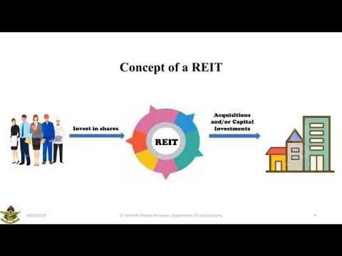

Real Estate Investment Trusts (REITs) have become a prominent vehicle for investors aiming to gain exposure to the real estate market without the complexities of direct property ownership. By pooling capital from numerous investors, REITs acquire and manage a portfolio of properties or real estate-related assets, providing an avenue for income generation and portfolio diversification. Their structure, often mandated by law to distribute a significant portion of income as dividends, offers consistent income streams, appealing to income-focused investors.

In recent years, the infusion of technology, particularly algorithmic trading, has transformed investment strategies across various asset classes, including REITs. Algorithmic trading employs complex algorithms and data analytics to execute trades based on predefined criteria, allowing investors to optimize decision-making processes swiftly and efficiently. This automated approach can identify market trends, execute trades at optimal prices, and mitigate human biases, enhancing the overall investment strategy for REITs.



This article offers a comprehensive guide to navigating REIT investments, focusing on understanding their structure and benefits, examining various REIT types, and exploring how algorithmic trading can be employed to enhance investment outcomes. The goal is to equip investors with the knowledge and tools to effectively incorporate REITs into their investment portfolios, while considering economic and tax implications and staying abreast of future market and technological trends.

## Table of Contents

## Understanding Real Estate Investment Trusts (REITs)

Real Estate Investment Trusts (REITs) are a cornerstone of real estate investment, acting as vehicles that allow individual investors to access income-generating real estate assets without the need to purchase or manage physical properties directly. Established in the United States in 1960, REITs democratize real estate investment by enabling small and large investors alike to own a share in income-producing real estate portfolios.

### Structure and Operation of REITs

REITs are structured as publicly traded entities that must adhere to specific regulatory guidelines to maintain their tax-advantaged status. A defining characteristic is their obligation to distribute at least 90% of their taxable income to shareholders as dividends, thus enabling investors to earn a share of the income generated through rent payments, property sales, or interest on mortgages. This mandatory distribution is stipulated by the Internal Revenue Code to ensure REITs operate primarily as income-generating entities.

REITs typically fall into three principal categories based on their operational focus:

1. **Equity REITs:** These own and operate income-generating real estate. Revenue primarily derives from leasing space and collecting rents on the properties they own, which can include commercial properties, retail centers, residential complexes, and more.

2. **Mortgage REITs:** These provide financing for income-producing real estate by purchasing or originating mortgages and mortgage-backed securities. Their profits come from the interest earned on these mortgage loans.

3. **Hybrid REITs:** Combining elements of both equity and mortgage REITs, hybrids diversify their strategies between owning properties and originating or purchasing mortgages.

The operational mechanics of REITs involve acquiring real estate, generating revenue through rentals or loans, and efficiently managing these assets to maximize returns for investors. Given that REITs are listed on major stock exchanges, they offer [liquidity](/wiki/liquidity-risk-premium) similar to equities, enabling ease of purchase and sale via brokerage platforms.

### Benefits and Appeal of REITs

REITs offer several advantages that enhance their appeal as investment vehicles. Primarily, they provide diversification benefits to investors. Real estate typically exhibits lower correlation with other asset classes like stocks and bonds, allowing REITs to reduce portfolio [volatility](/wiki/volatility-trading-strategies) and hedge against specific economic downturns.

Income generation is another critical benefit. With their high dividend payouts, REITs provide a steady income stream, which is particularly attractive in low-interest environments where traditional income investments, such as bonds, may offer meager returns.

Furthermore, REITs possess inherent inflation-hedging properties. Real estate income often rises with inflation, as rental income can be adjusted periodically, ensuring investors' earnings keep pace with rising prices.

In conclusion, understanding the structure and operational dynamics of REITs reveals their significant role in broadening investment opportunities within the real estate sector. By combining the liquidity of publicly traded stocks with the income potential of real estate, REITs stand as a strategic investment tool for diversifying asset portfolios and achieving stable, inflation-adjusted returns.

## Types of REITs and Their Characteristics

Real Estate Investment Trusts (REITs) are classified into three primary categories based on their operational focus: Equity REITs, Mortgage REITs, and Hybrid REITs. Each type addresses different investor preferences, offering distinct income-generating mechanisms and varying risk profiles.

**Equity REITs** are the most prevalent form of REITs. They primarily derive income from owning and managing income-producing real estate, such as shopping malls, office buildings, industrial parks, and residential complexes. The income for Equity REITs is largely generated through the collection of rent from tenants leasing these properties. This operational model offers investors a tangible link to the underlying assets and exposes them to potential capital appreciation as property values increase. However, market volatility and changes in property value can introduce significant risks. The cyclical nature of real estate markets and economic conditions can affect rental income and, consequently, the returns for investors in Equity REITs.

**Mortgage REITs (mREITs)** focus on providing financing for income-producing real estate by purchasing or originating mortgages and mortgage-backed securities. The profit model for mREITs involves earning a spread between the interest they pay on borrowed funds and the interest income they earn from their mortgage holdings. As such, mREITs are particularly sensitive to changes in interest rates, which can significantly impact their income. While they offer the potential for higher dividend yields compared to Equity REITs, mREITs also pose higher risks due to potential interest rate fluctuations and credit defaults on the underlying mortgages.

**Hybrid REITs** combine the strategies of both Equity and Mortgage REITs. They invest in both real properties and mortgages, aiming to balance the income-generating characteristics of physical assets and the financial instruments linked to real estate loans. Hybrid REITs offer a diversified revenue stream, allowing investors to benefit from rental income and interest from mortgages. This diversification can mitigate risks compared to purely Equity or Mortgage REITs. Nevertheless, the complexity of managing both physical properties and financial assets demands robust management expertise, which if not adequately implemented, can pose operational challenges.

In conclusion, understanding the characteristics and operational focus of different REIT types is crucial for aligning investments with specific financial goals and risk tolerances. Equity REITs provide a direct link to real asset ownership, Mortgage REITs offer high-yield exposure to real estate securities, and Hybrid REITs pursue a balance of both strategies. Investors must consider not only the potential returns but also the inherent risks associated with each REIT type when constructing a diversified investment portfolio.

## How to Analyze REITs: Key Metrics and Techniques

Analyzing Real Estate Investment Trusts (REITs) involves a comprehensive evaluation of various financial metrics that highlight the performance and potential of these investment vehicles. Among these metrics, Funds From Operations (FFO) and Adjusted Funds From Operations (AFFO) are particularly critical.

**Funds From Operations (FFO) and Adjusted Funds From Operations (AFFO):**

FFO is considered a key indicator of a REIT's performance as it provides insight into the cash generated from operations. FFO is calculated by adding depreciation and amortization to earnings, and then subtracting gains on the sale of properties. The formula is as follows:

$$
\text{FFO} = \text{Net Income} + \text{Depreciation} + \text{Amortization} - \text{Gains on Property Sales}
$$

The Adjusted Funds From Operations (AFFO) takes FFO a step further by accounting for capital expenditures and maintenance costs that are essential to maintaining the property portfolio. AFFO is considered a closer estimate of the REIT's cash available for distribution. The formula is:

$$
\text{AFFO} = \text{FFO} - \text{Capital Expenditures} - \text{Straight-Line Rents}
$$

Understanding FFO and AFFO is crucial for evaluating the operating performance and cash flow potential of REITs, providing investors with a better perspective on the REIT's ability to sustain dividend payouts.

**Net Asset Value (NAV):**

The Net Asset Value (NAV) is another vital metric used to compare a REIT's market value. It represents the total value of a REIT's assets minus its liabilities, providing a snapshot of the REIT's underlying worth. It is often expressed on a per-share basis to facilitate easy comparison with the REIT's current market price. The calculation of NAV is:

$$
\text{NAV} = \frac{\text{Total Assets} - \text{Total Liabilities}}{\text{Shares Outstanding}}
$$

Investors utilize NAV to identify overvalued or undervalued REITs based on their current trading price relative to this intrinsic value.

**Analytical Approaches:**

Examining REITs involves both top-down and bottom-up analytical strategies. A top-down approach begins with macroeconomic factors influencing the real estate sector, such as interest rates, economic growth, and inflation, which can all impact REITs' operational environment.

On the other hand, a bottom-up approach focuses on the financial statements and specific attributes of individual REITs. This involves assessing property portfolio characteristics, occupancy rates, lease agreements, and management effectiveness. Additionally, analyzing external factors like location, market demand, and competition can provide insights into potential risks and opportunities.

Both approaches complement each other, offering a holistic view of the REIT's performance and potential, aiding investors in making informed investment decisions. Through combining these strategies and understanding key metrics such as FFO, AFFO, and NAV, investors are better equipped to evaluate REIT opportunities effectively.

## Algorithmic Trading Applied to REITs

Algorithmic trading leverages computational power and advanced algorithms to automate trading decisions, potentially leading to improved efficiency in Real Estate Investment Trusts (REITs) investment strategies. By systematically analyzing large datasets, [algorithmic trading](/wiki/algorithmic-trading) systems can uncover patterns or opportunities that might be missed by traditional analysis methods.

One of the primary advantages of algorithmic trading in the context of REITs is its ability to process real-time data rapidly, facilitating faster decision-making. Automated systems can execute trades at optimal price points by reacting instantly to market movements and breaking news. For example, an algorithm might track [interest rate](/wiki/interest-rate-trading-strategies) announcements or housing market data to adjust REIT portfolios in anticipation of potential impacts on property values and yields.

Furthermore, algorithmic strategies employ quantitative models to predict price movements and identify [arbitrage](/wiki/arbitrage) opportunities. These models often utilize key financial metrics of REITs such as the Net Asset Value (NAV), Funds From Operations (FFO), and Adjusted Funds From Operations (AFFO), comparing them to historical averages or peer benchmarks. Additionally, algorithms can integrate external factors, such as economic indicators and market sentiment, enhancing predictive capabilities.

Despite its potential advantages, deploying algorithmic trading for REITs is not without challenges and risks. One significant technical challenge lies in data quality. Algorithms rely on robust and accurate data; erroneous or delayed data can lead to suboptimal trades. Moreover, developing and maintaining sophisticated algorithms requires specialized knowledge in both financial markets and coding, often necessitating a team of skilled quants and programmers.

The implementation of these algorithms also poses considerable risk. Over-reliance on automated systems can result in substantial financial losses if the algorithms contain logic errors or fail to adapt to unforeseen market conditions. Moreover, high-frequency trading can introduce market volatility, and regulatory agencies closely scrutinize its usage to prevent manipulative practices.

In conclusion, while algorithmic trading offers enhanced efficiency and strategic advantages in REIT investments, it requires careful consideration of the inherent technical challenges and market risks. Success in algorithmic trading within REITs involves continuous improvement of algorithms, real-time data monitoring, and a deep understanding of both the technology and market dynamics.

## Economic Considerations and Tax Implications

Real Estate Investment Trusts (REITs) are particularly sensitive to economic factors such as interest rates and inflation. Both these variables can significantly influence the performance and attractiveness of REIT investments. 

### Impact of Interest Rates and Inflation

Interest rates and inflation are critical in determining the cost of capital and the return on investment for REITs. Generally, higher interest rates increase borrowing costs for REITs, which can lead to reduced profitability as the cost of new debt issuance rises. This can also result in lower dividend payouts to investors. On the other hand, during periods of low-interest rates, REITs can benefit from cheaper capital which may facilitate property acquisitions or improvements, boosting income streams.

Inflation impacts REITs by affecting the value of properties and rental income. While inflation can erode purchasing power, it can also lead to increased rental income as lease agreements may include inflation escalation clauses. Moreover, the intrinsic value of real estate properties tends to appreciate during inflationary periods, potentially enhancing overall REIT value.

### Tax Treatment of REIT Dividends

REITs are required by tax law to distribute at least 90% of their taxable income as dividends to shareholders, which makes their dividend yields attractive. However, REIT dividends are not taxed as qualified dividends. Instead, they are typically taxed as ordinary income at an investor's marginal tax rate. This can lead to a higher tax liability compared to other equity securities.

To optimize after-tax returns from REIT investments, investors can consider several strategies. One approach is allocating REIT investments to tax-advantaged accounts such as Individual Retirement Accounts (IRAs) or 401(k) plans, where dividends can grow tax-free (Roth accounts) or tax-deferred (Traditional accounts). This can mitigate the higher tax burden associated with ordinary income status.

### Utilizing Tax-Advantaged Accounts

Investors can leverage accounts like Roth IRAs or Traditional IRAs to enhance the tax efficiency of REIT earnings. In a Roth IRA, contributions are made with after-tax dollars, allowing for tax-free growth and withdrawals, providing substantial future tax benefits. Conversely, Traditional IRAs offer tax-deferred growth, permitting current-year tax deductions on contributions, with taxes paid upon withdrawal.

Using a tax code example in Python, one might simulate the tax savings from placing REIT investments within tax-advantaged accounts:

```python
def tax_savings(ordinary_income_rate, reit_dividends, tax_advantaged_rate=0):
    ordinary_tax = reit_dividends * ordinary_income_rate
    tax_advantaged_tax = reit_dividends * tax_advantaged_rate
    savings = ordinary_tax - tax_advantaged_tax
    return savings

reit_dividends = 1000  # Example dividend income
ordinary_income_rate = 0.32  # Example 32% tax rate
savings = tax_savings(ordinary_income_rate, reit_dividends)

print(f"Tax savings by using a tax-advantaged account: ${savings:.2f}")
```

By choosing appropriate allocation strategies and leveraging tax-advantaged accounts, investors can significantly mitigate the tax impact on their REIT investments, thereby optimizing their overall financial outcome.

## Conclusion and Future Trends

Incorporating Real Estate Investment Trusts (REITs) into a diversified investment portfolio offers distinct strategic advantages, primarily due to their potential for income generation and diversification. REITs enable investors to gain exposure to real estate markets without the requirement of direct property ownership, thereby mitigating some of the risks associated with physical real estate investments. The mandatory dividend distribution feature of REITs ensures a steady income stream, which can be particularly attractive in low-interest-rate environments.

As the financial landscape continues to evolve with rapid technological advancements, staying informed about these innovations is crucial for optimizing investment strategies. The integration of algorithmic trading and sophisticated data analytics into REIT investment strategies provides an opportunity to enhance decision-making processes. By utilizing algorithms, investors can process large datasets efficiently, enabling the identification of optimal entry and [exit](/wiki/exit-strategy) points, the assessment of market trends, and the potential prediction of REIT performance. These tools are instrumental in capturing market inefficiencies and maximizing returns.

Furthermore, an awareness of market trends and economic indicators, such as interest rates and inflation, is essential for effective REIT investment planning. These factors significantly impact REIT valuations and income potential. Investors should also consider the regulatory environment, as changes in legislation can affect REIT operations and profitability. Vigilance in monitoring economic forecasts and regulatory updates can help mitigate risks and capitalize on investment opportunities.

Looking ahead, the integration of environmental, social, and governance ([ESG](/wiki/esg-investing)) criteria is expected to play a more prominent role in REIT investment decisions. As sustainability becomes increasingly important, REITs that adopt ESG practices may benefit from greater market attractiveness and investor demand.

In conclusion, the inclusion of REITs in an investment portfolio provides compelling benefits, such as income generation and diversification. The future of REIT investment lies in the ability to adapt to technological advancements, stay abreast of market and regulatory changes, and respond proactively to economic forecasts. By doing so, investors can better position themselves to navigate the complexities of the real estate investment landscape.

## References & Further Reading

1. **Books and Academic Papers:**
   - "The Intelligent REIT Investor" by Stephanie Krewson-Kelly and Glenn Mueller: This book provides a detailed guide to understanding and valuing REITs, offering strategic insights into investment portfolios.
   - "Real Estate Investment Trusts: Structure, Performance, and Investment Opportunities" by Su Han Chan, John Erickson, and Ko Wang: An in-depth exploration of REIT structures, market performance, and strategic investment opportunities.
   - Geltner, D., Miller, N.G., Clayton, J., & Eichholtz, P. (2013). *Commercial Real Estate Analysis and Investments*. This text provides advanced methodologies in real estate analysis relevant to REITs.
   - "Algorithmic Trading and DMA: An Introduction to Direct Access Trading Strategies" by Barry Johnson: A comprehensive book discussing the implementation of algorithmic trading, including strategies relevant for trading REITs.

2. **Articles:**
   - "A Comprehensive REIT Valuation Model" by David M. Ling and Milena Petrova, published in *The Journal of Real Estate Research*: This article offers insights into valuation models specific to REITs.
   - "The Effectiveness of Real Estate Investment Trusts in Efficiently Allocating Capital" by Jonathan C. Hartzell et al., published in *The Journal of Portfolio Management*: An article analyzing the capital allocation efficiency of REITs.

3. **Online Resources:**
   - **Investopedia and NAREIT**: Both platforms offer numerous articles and educational resources that cover the basics and advanced concepts of REITs and their management.
   - **Quantitative Finance Tutorials** on sites like *Medium* and *Towards Data Science*: These platforms host numerous articles and tutorials specifically on algorithmic trading strategies that can be applied to REIT investments.

4. **Resource on Economic Considerations:**
   - "Interest Rate Risk and REITs: Managing Economic Exposure" by Joshua M. Barthelme, available from financial scholarly journals, discusses the impact of interest rate fluctuations on REIT investments.

5. **Online Courses and Workshops:**
   - **Coursera and Udemy**: Offer courses on both real estate investments and algorithmic trading, combining theoretical and practical knowledge suitable for both novice and advanced investors.
   - "Real Estate Financial Modeling & Valuation" on platforms like *edX* provides key insights into financial metrics and modeling techniques for valuing REITs.

These resources offer a breadth of knowledge for those interested in expanding their understanding of REIT investing and algorithmic trading, catering to a range of expertise levels from beginner to advanced.

