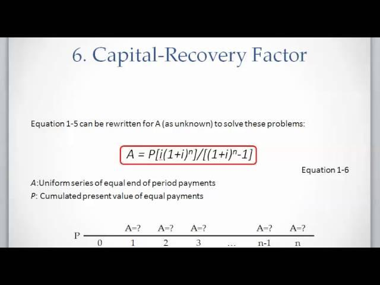

## Table of Contents

## What is capital recovery?

Capital recovery is a way to get back the money you spent on buying something big, like a machine or a building. It's important for businesses because they need to know how long it will take to earn back the money they invested. They do this by figuring out how much money the thing they bought will make over time, and then they can plan how to pay back the cost of buying it.

There are different ways to calculate capital recovery. One common way is to use something called the capital recovery factor. This is a formula that helps figure out how much money needs to be earned each year to pay back the initial cost, plus any interest. This helps businesses make smart choices about what to buy and when, so they can keep their money flowing well.

## Why is capital recovery important for businesses?

Capital recovery is important for businesses because it helps them understand how long it will take to get back the money they spent on big purchases, like equipment or buildings. Knowing this helps businesses plan better. They can figure out if it's a good idea to buy something new or if they should wait. This is crucial for keeping the business running smoothly and making sure they don't run out of money.

If a business knows how quickly they can recover their capital, they can make smarter choices about their investments. For example, if a machine costs a lot but will help the business make more money quickly, it might be a good buy. But if it takes too long to recover the cost, the business might decide to look for a cheaper option or wait until they have more money. This helps the business stay healthy and grow over time.

## How does capital recovery differ from depreciation?

Capital recovery and depreciation are two different but related ideas that businesses use to manage their money. Capital recovery is about getting back the money a business spent on buying something big, like a machine or a building. It helps businesses figure out how long it will take to earn back what they spent, and it's important for planning and making smart decisions about what to buy.

Depreciation, on the other hand, is about how the value of something goes down over time. When a business buys something that will last for years, like a truck, they can't count all the money spent on it as a cost right away. Instead, they spread the cost over the years they use it. This helps businesses show a more accurate picture of their money each year and can also help with taxes.

While capital recovery focuses on earning back the money spent, depreciation is about how the value of what was bought decreases. Both are important for managing a business's money, but they look at different sides of the same coin. Capital recovery helps with planning future purchases, while depreciation helps with understanding current financial health and tax planning.

## What are the common methods used for calculating capital recovery?

One common method for calculating capital recovery is the Capital Recovery Factor (CRF). This method uses a formula to figure out how much money needs to be earned each year to pay back the cost of the big purchase, plus any interest. The formula takes into account the initial cost, the interest rate, and how many years the business plans to use the item. By using the CRF, businesses can see how quickly they can get their money back and plan their finances better.

Another method is the Payback Period. This method is simpler and looks at how many years it will take to earn back the money spent on the purchase. It doesn't consider the time value of money or interest, so it's easier to calculate but less detailed. Businesses add up the money they make each year from using the item until it equals the initial cost. This helps them understand how long they need to wait to recover their investment.

A third method is the Net Present Value (NPV) approach. This method is more complex and takes into account the time value of money. It calculates the present value of all the money the business expects to make from the purchase, then subtracts the initial cost. If the NPV is positive, it means the business will recover its capital and make more money. This method helps businesses see if a big purchase is worth it over time, considering both capital recovery and future earnings.

## Can you explain the concept of capital recovery factor?

The capital recovery factor (CRF) is a tool that helps businesses figure out how much money they need to earn each year to pay back the cost of something they bought, like a machine or a building. It takes into account the initial cost of the item, the interest rate, and how many years the business plans to use it. By using the CRF, businesses can plan better because they know how quickly they can get their money back. This helps them decide if buying something new is a good idea or if they should wait until they have more money.

The formula for the capital recovery factor is simple but important. It looks like this: CRF = [i(1 + i)^n] / [(1 + i)^n - 1], where 'i' is the interest rate and 'n' is the number of years the business plans to use the item. For example, if a business buys a machine for $10,000 and they use a 5% interest rate over 5 years, the CRF helps them find out how much money they need to make each year to cover the cost of the machine and the interest. This way, they can see if the machine will help them make enough money to be worth the investment.

## How does the time value of money affect capital recovery?

The time value of money is the idea that money today is worth more than the same amount of money in the future. This is because you can use money now to invest or earn interest. When businesses think about capital recovery, they need to consider the time value of money because it affects how long it will take to get back the money they spent on big purchases. If they don't account for this, they might think they'll recover their money faster than they really will, which can lead to bad decisions.

To deal with the time value of money in capital recovery, businesses often use methods like the Net Present Value (NPV). This method helps them see how much the money they expect to earn in the future is worth today. By using NPV, they can make sure they're getting a good return on their investment and that they'll really be able to recover their capital in a way that makes sense over time. This helps them plan better and make smarter choices about what to buy and when.

## What role does capital recovery play in investment decisions?

Capital recovery is really important when businesses make choices about big investments, like buying new machines or buildings. It helps them figure out how long it will take to get back the money they spent. If it takes too long, the business might decide to wait or look for something cheaper. By knowing how quickly they can recover their money, businesses can make better plans and choose investments that will help them grow without running out of cash.

Understanding capital recovery also helps businesses see if an investment is worth it over time. They use tools like the Capital Recovery Factor or Net Present Value to figure this out. These tools take into account things like interest rates and the time value of money, which means they consider that money today is worth more than the same amount in the future. By using these methods, businesses can make smart choices about what to buy and when, making sure they'll get their money back in a way that helps them stay healthy and grow.

## How can capital recovery be optimized in project management?

In project management, optimizing capital recovery means finding ways to get back the money spent on a project faster and more efficiently. One way to do this is by choosing the right tools and methods to track and manage costs. By using the Capital Recovery Factor or Net Present Value, project managers can see how long it will take to earn back the money they spent. They can then make smart choices about how to spend money during the project to make sure they get their money back as quickly as possible.

Another way to optimize capital recovery is by planning the project carefully. This means thinking about how to use resources in a way that saves money and makes the project profitable sooner. For example, if a project needs a big machine, the manager can look at different options to see which one will help the business make money back faster. By planning well and keeping a close eye on costs, project managers can make sure the project not only finishes on time but also helps the business recover its money quickly.

## What are the tax implications of capital recovery?

Capital recovery can affect how much a business pays in taxes. When a business buys something big, like a machine, they can't count all the money spent on it as a cost right away. Instead, they spread the cost over the years they use it, which is called depreciation. Depreciation helps lower the business's taxable income each year, so they pay less in taxes. But when the business starts to recover the money they spent on the big purchase, it can change how much they pay in taxes. If they make a lot of money from the purchase, their taxable income might go up, meaning they could pay more in taxes.

Knowing how capital recovery works can help businesses plan their taxes better. If a business can recover their money quickly, they might have to pay more taxes sooner. But if they take longer to recover their money, they might be able to spread out their tax payments over more years. This is why businesses often talk to tax experts to make sure they're making the best choices about when to buy big things and how to handle the money they make from them. By planning well, businesses can manage their taxes in a way that helps them keep more of their money.

## How do different industries approach capital recovery?

Different industries have their own ways of dealing with capital recovery because they all have different needs and ways of making money. In manufacturing, where big machines are often used, companies try to get their money back by making sure these machines help them make products faster and cheaper. They use tools like the Capital Recovery Factor to figure out how long it will take to earn back the money they spent on the machines. This helps them decide if buying new machines is a good idea or if they should keep using the old ones.

In the real estate industry, capital recovery is about getting back the money spent on buying or building properties. Real estate companies often use rental income to recover their costs over time. They might use the Payback Period method to see how many years it will take to earn back what they spent on a building. By understanding this, they can decide if a property is a good investment or if they should look for something else. Both industries need to think carefully about how to get their money back, but they do it in ways that fit their specific business needs.

## What are the challenges faced in implementing effective capital recovery strategies?

One big challenge in making good capital recovery plans is guessing how much money something will make over time. It's hard to know for sure how much a new machine or building will help a business earn. Things like changes in what customers want, new laws, or even big world events can mess up these guesses. If a business gets these numbers wrong, they might think they'll get their money back faster than they really will. This can lead to bad choices about what to buy and when.

Another challenge is figuring out how to pay for the big purchase while also trying to get the money back. Businesses need to balance spending money on new things with keeping enough cash to run the business every day. If they spend too much on something new without a clear plan to recover the money, they might run out of cash. This is why businesses need to plan carefully and keep a close eye on their money. By doing this, they can make sure they're not just spending money, but also making smart choices that help them grow.

## How can advanced financial modeling enhance capital recovery analysis?

Advanced financial modeling can really help businesses understand capital recovery better. It uses special computer programs to make detailed plans and predictions about money. These models can look at many different things at once, like how much money a business might make, how long it will take to get their money back, and even how changes in the world might affect their plans. By using these models, businesses can see if their ideas for getting their money back will really work. This helps them make better choices about what to buy and when, so they can be sure they'll get their money back in a way that helps them grow.

These models also help businesses see what might go wrong and plan for it. For example, if something unexpected happens, like a new law or a change in what customers want, the model can show how it might affect the business's plans to recover their money. By thinking about these things ahead of time, businesses can come up with ways to handle them. This makes their plans for getting their money back stronger and more likely to work. In the end, using advanced financial modeling helps businesses make smarter choices and feel more sure about their big purchases.

## What is Understanding Capital Recovery Investment?

Capital recovery investment refers to the strategies that businesses or investors implement to regain their initial investment outlays while seeking to maximize profits. The core objective of capital recovery is to ensure that all capital expenditures are recovered within a specified timeframe. This financial consideration is vital for an organization's sustainable financial management and growth.

To understand capital recovery investments, one must consider the various methods used to achieve this objective. These methods form the backbone of investment management as they guide investors in making informed decisions that align with financial sustainability.

One of the primary methods of capital recovery is the discounted cash flow (DCF) analysis. This approach evaluates the value of an investment based on its expected future cash flows, which are adjusted for time value. The formula for DCF is given by:

$$

DCF = \sum_{t=1}^{n} \frac{CF_t}{(1 + r)^t}
$$

where $CF_t$ is the cash flow in time period $t$, $r$ is the discount rate, and $n$ is the number of periods.

Another important capital recovery method is the Net Present Value (NPV) analysis. NPV determines the difference between the present value of cash inflows and outflows over a period. It is a critical tool for assessing the profitability of an investment, calculated as:

$$

NPV = \sum_{t=1}^{n} \frac{CF_t}{(1 + r)^t} - C_0
$$

where $C_0$ is the initial investment cost.

These financial tools are significant because they allow investors to evaluate whether an investment will cover its initial costs and generate additional profits. By aligning investment objectives with capital recovery strategies, investors can achieve financial sustainability. For instance, if an investment's NPV is positive, it typically means the investment should generate more revenue than the costs, thereby qualifying as a sound financial decision.

Implementing these strategies requires a detailed analysis of projected cash flows, market conditions, and potential risks. Moreover, investors and businesses must consider the timeframe for capital recovery to ensure it aligns with their financial goals and [liquidity](/wiki/liquidity-risk-premium) needs.

Through the application of capital recovery methods like DCF and NPV analysis, investors gain insights into the viability of investment opportunities. These strategies form the basis of effective financial planning and investment management, providing the necessary framework for informed decision-making.

## What is the Role of Financial Analysis in Capital Recovery?

Financial analysis plays a crucial role in evaluating investment opportunities and creating effective capital recovery plans. It utilizes quantitative assessments to provide investors with a detailed understanding of an investment's financial health. Key indicators in financial analysis include return on investment (ROI), payback period, and cash flow projections, all of which are essential for assessing the viability of potential investments.

Return on investment (ROI) is a widely used performance measure that evaluates the efficiency of an investment. It is calculated using the formula:

$$
\text{ROI} = \frac{\text{Net Profit}}{\text{Initial Investment}} \times 100
$$

This metric allows investors to compare the profitability of different investments and prioritize those that offer the best returns relative to their costs.

The payback period is another critical metric that indicates how long it will take to recover an initial investment. It is particularly useful for assessing project risk and liquidity and is calculated by dividing the initial investment cost by the annual net cash inflow. A shorter payback period is often preferable as it implies faster recovery of the invested capital.

Cash flow projections are integral to financial analysis, forecasting the inflows and outflows of cash within an investment over a specific period. These projections help investors understand the timing and amount of cash available, which is vital for meeting obligations, planning reinvestments, and ensuring adequate liquidity.

In addition to these metrics, financial analysis supports the identification of viable investments that meet specific capital recovery objectives. By considering the expected cash flows and related risks, investors can align their choices with their overall financial goals.

Effective financial analysis can also prevent overinvestment, ensuring that capital is allocated efficiently without exceeding the investment limit. By providing comprehensive insights into financial performance and potential returns, financial analysis aids strategic decision-making, minimizing risks and enhancing the likelihood of achieving desired financial outcomes. 

Ultimately, financial analysis equips investors and financial managers with the tools needed to navigate the complexities of investment decisions, paving the way for successful capital recovery strategies.

## References & Further Reading

[1]: Bergstra, J., Bardenet, R., Bengio, Y., & Kégl, B. (2011). ["Algorithms for Hyper-Parameter Optimization."](https://papers.nips.cc/paper/4443-algorithms-for-hyper-parameter-optimization) Advances in Neural Information Processing Systems 24.

[2]: ["Advances in Financial Machine Learning"](https://www.amazon.com/Advances-Financial-Machine-Learning-Marcos/dp/1119482089) by Marcos Lopez de Prado

[3]: ["Evidence-Based Technical Analysis: Applying the Scientific Method and Statistical Inference to Trading Signals"](https://www.amazon.com/Evidence-Based-Technical-Analysis-Scientific-Statistical/dp/0470008741) by David Aronson

[4]: ["Machine Learning for Algorithmic Trading"](https://github.com/stefan-jansen/machine-learning-for-trading) by Stefan Jansen

[5]: ["Quantitative Trading: How to Build Your Own Algorithmic Trading Business"](https://www.amazon.com/Quantitative-Trading-Build-Algorithmic-Business/dp/1119800064) by Ernest P. Chan