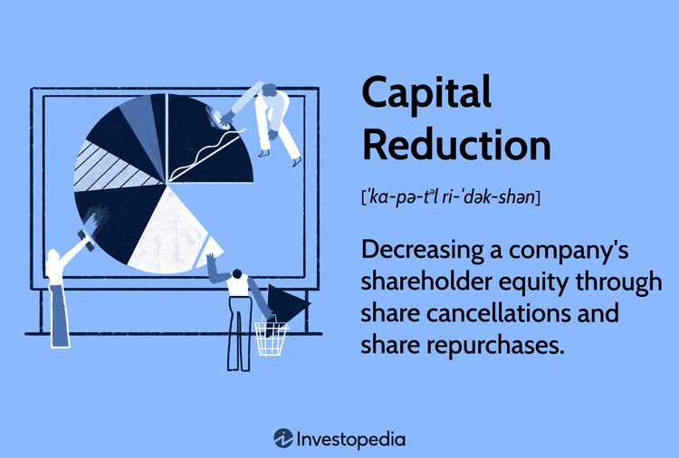

## Table of Contents

## What is capital reduction?

Capital reduction is when a company decides to lower the amount of its share capital. This can happen for many reasons, like if the company wants to pay back money to its shareholders or if it needs to fix its financial situation. When a company reduces its capital, it might buy back its own shares or cancel some of them. This can make the value of the remaining shares go up because there are fewer shares overall.

There are different ways to reduce capital. One way is by paying money back to shareholders, which is called a repayment. Another way is by canceling shares that haven't been fully paid for yet. Companies need to follow certain rules and get approval from shareholders and sometimes from a court before they can reduce their capital. This is to make sure everything is done fairly and legally.

## Why would a company consider reducing its capital?

A company might think about reducing its capital for a few reasons. One big reason is to give money back to its shareholders. When a company has more money than it needs for its business, it might decide to return some of that money to the people who own its shares. This can make shareholders happy because they get extra money. Another reason is to make the company's finances look better. If a company has lost a lot of money and its share capital is much higher than its actual worth, reducing the capital can make its financial statements look more accurate and healthier.

Also, reducing capital can be a way to get rid of shares that haven't been fully paid for. Sometimes, shareholders might not have paid the full amount for their shares, and the company can cancel these shares to clean up its [books](/wiki/algo-trading-books). This can help the company focus on its core business without worrying about these unpaid shares. Before a company can reduce its capital, it needs to follow certain rules and get approval from its shareholders, and sometimes from a court, to make sure everything is done the right way.

## What are the different methods of capital reduction?

One way to reduce capital is by paying money back to shareholders. This is called a capital repayment. When a company has extra money it doesn't need for its business, it can give some of it back to the people who own its shares. This makes shareholders happy because they get more money. To do this, the company might buy back its own shares and then cancel them. This means there are fewer shares overall, which can make the value of the remaining shares go up.

Another method is by canceling shares that haven't been fully paid for. Sometimes, shareholders might not have paid the full amount for their shares. The company can decide to cancel these shares to clean up its financial records. This helps the company focus on its main business without worrying about these unpaid shares. Both methods need to follow certain rules and get approval from shareholders, and sometimes from a court, to make sure everything is done fairly and legally.

A third way is by writing off losses. If a company has lost a lot of money and its share capital is much higher than its actual worth, it can reduce its capital to make its financial statements look more accurate. This can make the company's financial situation look healthier. Like the other methods, this also needs to follow specific rules and get the right approvals before it can be done.

## How does capital reduction affect shareholders?

When a company reduces its capital, it can affect shareholders in different ways. If the company decides to pay money back to shareholders, this is good for them because they get extra money. This happens when the company buys back its own shares and cancels them. Because there are fewer shares overall, the value of the remaining shares might go up. This can make each share worth more, which is good for shareholders who keep their shares.

On the other hand, if the company cancels shares that haven't been fully paid for, it might not be good for the shareholders who own those shares. They could lose the money they already paid for those shares. Also, if the company reduces its capital to write off losses, it might make the company's financial situation look better, but it doesn't directly give money to shareholders. Shareholders need to understand how the capital reduction is done because it can change the value of their investment in the company.

## What are the legal requirements for capital reduction in different jurisdictions?

In the United States, the legal requirements for capital reduction can vary from state to state, but generally, companies need to follow the rules set by the state where they are incorporated. Most states require that a company's board of directors approve the capital reduction plan first. Then, the shareholders need to vote on it, usually with a majority or supermajority approval. Some states also require the company to notify creditors and give them a chance to object to the reduction. This is to protect the creditors' interests and make sure the company can still pay its debts after reducing its capital.

In the United Kingdom, the process of capital reduction is governed by the Companies Act 2006. A company needs to get approval from its shareholders through a special resolution, which means at least 75% of the votes must be in favor. After that, the company usually needs to apply to the court for confirmation of the reduction. The court will check if the reduction is fair and if it protects the interests of the company's creditors. Once the court approves, the company can go ahead with the reduction. This process ensures that all steps are taken to maintain fairness and legality.

In Australia, the Corporations Act 2001 sets out the rules for capital reduction. A company must get approval from its shareholders by a special resolution, which requires at least 75% of the votes. The company also needs to send a notice to its creditors and the Australian Securities and Investments Commission (ASIC). If any creditor objects, the company might need to go to court to get approval for the reduction. This process helps to make sure that the company's financial health is maintained and that creditors are protected.

## Can you explain the process of capital reduction step-by-step?

When a company wants to reduce its capital, the first step is usually for the company's board of directors to come up with a plan. They need to decide how they want to reduce the capital, whether it's by paying money back to shareholders, canceling shares that haven't been fully paid for, or writing off losses. Once they have a plan, they need to get it approved by the shareholders. This often requires a special meeting where shareholders vote on the plan. Depending on the country, a certain percentage of shareholders, like 75%, need to agree for the plan to move forward.

After the shareholders approve the plan, the company might need to take more steps, depending on where it is located. In some places, like the United Kingdom and Australia, the company needs to go to court to get the reduction approved. The court will check if the reduction is fair and if it protects the interests of the company's creditors. The company might also need to notify its creditors about the plan and give them a chance to object. If everything is approved, the company can then [carry](/wiki/carry-trading) out the capital reduction. This means they can pay back money to shareholders, cancel shares, or adjust their financial statements to reflect the reduced capital.

In the United States, the process can vary by state, but generally, after the board and shareholders approve the plan, the company might need to notify its creditors. This gives creditors a chance to object if they think the reduction could harm their interests. If there are no objections, or if any objections are resolved, the company can go ahead with the reduction. This process helps ensure that the company's financial health is maintained and that everyone involved is treated fairly.

## What are the financial implications of reducing capital for a company?

When a company reduces its capital, it can have different financial effects. One big effect is that it can make the company's financial statements look better. If the company has lost a lot of money and its share capital is much higher than its actual worth, reducing the capital can make the financial statements more accurate. This can make the company look healthier to investors and creditors. Also, if the company pays money back to shareholders, it can make shareholders happy because they get extra money. But the company needs to be careful because it will have less money to use for its business after the reduction.

Another financial implication is that reducing capital can change the value of the company's shares. If the company buys back and cancels its own shares, there will be fewer shares overall. This can make the value of the remaining shares go up because each share represents a bigger piece of the company. This is good for shareholders who keep their shares. However, if the company cancels shares that haven't been fully paid for, it might not be good for the shareholders who own those shares. They could lose the money they already paid for those shares. So, the way the company reduces its capital can have different effects on its shareholders and its overall financial health.

## How does capital reduction impact a company's balance sheet?

When a company reduces its capital, it directly affects the equity section of its balance sheet. The equity section shows how much money the company has from its shareholders. If the company decides to pay money back to shareholders or cancel shares, the total amount of equity will go down. This is because the company is giving money back or reducing the number of shares, which means less money is coming from shareholders. On the balance sheet, this reduction will show up as a decrease in the share capital and possibly in the retained earnings if the company uses those to pay shareholders.

The change in the equity section can also affect other parts of the balance sheet. If the company uses cash to pay back shareholders, the cash on the asset side of the balance sheet will go down too. This means the company will have less money to use for its business. If the company reduces capital to write off losses, it can make the balance sheet look more accurate by matching the equity more closely to the company's actual worth. This can make the company's financial situation look healthier to investors and creditors, even though the total equity is lower.

## What are some real-world examples of companies that have undergone capital reduction?

One real-world example of a company that reduced its capital is Nokia. A few years ago, Nokia decided to buy back and cancel some of its shares. They did this to give money back to their shareholders and to make their financial statements look better. By reducing the number of shares, Nokia made each remaining share worth more. This was good for the shareholders who kept their shares because their investment became more valuable.

Another example is Ford Motor Company. Ford went through a capital reduction to write off losses and make its balance sheet more accurate. They had lost a lot of money, and their share capital was much higher than their actual worth. By reducing their capital, Ford made their financial situation look healthier. This helped them show investors and creditors a clearer picture of the company's true financial health.

## How does capital reduction relate to corporate restructuring?

Capital reduction is often part of a bigger plan called corporate restructuring. This is when a company makes big changes to how it works or how it is organized. One reason a company might do this is if it wants to focus on different parts of its business or if it needs to fix its finances. Reducing capital can be a way to clean up the company's books and make its financial situation look better. This can be important if the company is trying to sell off parts of its business or if it is getting ready to merge with another company.

When a company decides to restructure, it might use capital reduction to pay back money to shareholders or to cancel shares that haven't been fully paid for. This can make shareholders happy because they get extra money, or it can help the company focus on its main business without worrying about these unpaid shares. By doing this, the company can make its financial statements more accurate and show investors and creditors a clearer picture of its financial health. This can make the company look more attractive to potential buyers or partners during the restructuring process.

## What are the tax considerations involved in capital reduction?

When a company reduces its capital, it needs to think about taxes. If the company pays money back to shareholders, this can be seen as a capital gain or a dividend, depending on the tax laws where the company is located. A capital gain happens when shareholders get more money than they paid for their shares. They might have to pay tax on this gain. A dividend is when shareholders get a part of the company's profits. Dividends can also be taxed, but the tax rate might be different from the rate for capital gains. The company needs to know these rules to help shareholders understand how much tax they might have to pay.

Also, the way the company reduces its capital can affect its own taxes. If the company cancels shares that haven't been fully paid for, it might be able to write off the unpaid amounts as a loss. This can lower the company's taxable income. But, the company needs to follow the tax laws carefully because doing it the wrong way can lead to problems with the tax authorities. It's a good idea for the company to talk to a tax expert to make sure they are doing everything right and to understand all the tax implications of reducing their capital.

## What are the potential risks and challenges associated with capital reduction?

When a company decides to reduce its capital, it faces some risks and challenges. One big risk is that the company might not have enough money left to run its business well. If the company pays money back to shareholders, it will have less cash to use for things like paying employees, buying supplies, or investing in new projects. This can make it hard for the company to grow or even to keep going if it runs into financial trouble. Another challenge is that shareholders might not like the way the capital is reduced. If the company cancels shares that haven't been fully paid for, some shareholders could lose money they already paid. This can make them unhappy and might lead them to sell their shares, which can lower the value of the company's stock.

Another risk is that reducing capital can make it harder for the company to get loans or credit. If the company's financial statements show less equity, banks and other lenders might think the company is riskier. They might charge higher interest rates or even refuse to lend money at all. This can be a big problem if the company needs money to keep running or to grow. Also, the process of reducing capital can be complicated and take a lot of time. The company needs to get approval from shareholders and sometimes from a court. This can be hard to do, especially if some shareholders or creditors object to the plan. It's important for the company to think carefully about these risks and challenges before deciding to reduce its capital.

## References & Further Reading

[1]: ["Advances in Financial Machine Learning"](https://www.amazon.com/Advances-Financial-Machine-Learning-Marcos/dp/1119482089) by Marcos Lopez de Prado

[2]: Bergstra, J., Bardenet, R., Bengio, Y., & Kégl, B. (2011). ["Algorithms for Hyper-Parameter Optimization."](https://dl.acm.org/doi/10.5555/2986459.2986743) Advances in Neural Information Processing Systems 24.

[3]: ["Evidence-Based Technical Analysis: Applying the Scientific Method and Statistical Inference to Trading Signals"](https://www.amazon.com/Evidence-Based-Technical-Analysis-Scientific-Statistical/dp/0470008741) by David Aronson

[4]: ["Apple Inc. Financial Statements"](https://investor.apple.com/financials.cfm) (Accessed from SEC Filings and Annual Reports).

[5]: ["Machine Learning for Algorithmic Trading"](https://github.com/stefan-jansen/machine-learning-for-trading) by Stefan Jansen

[6]: ["Quantitative Trading: How to Build Your Own Algorithmic Trading Business"](https://www.amazon.com/Quantitative-Trading-Build-Algorithmic-Business/dp/1119800064) by Ernest P. Chan