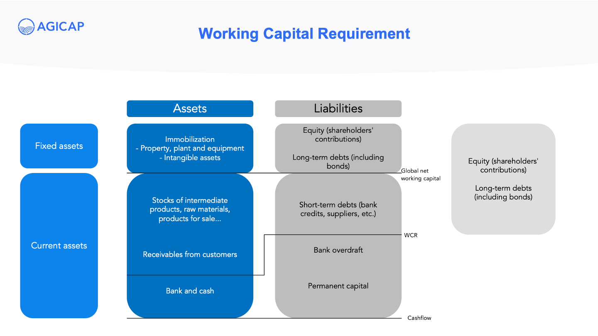

## Table of Contents

## What are capital requirements in finance?

Capital requirements in finance refer to the minimum amount of capital that banks and other financial institutions must hold to operate safely and effectively. This is set by financial regulators to ensure that these institutions can absorb potential losses and continue to function, even during tough economic times. Think of it like a safety net that helps prevent banks from failing and causing problems for the economy.

The amount of capital required can vary based on the size and type of the financial institution, as well as the risks they take on. For example, a big bank that deals with a lot of risky investments might need to hold more capital than a smaller bank with fewer risks. Regulators use different rules and calculations to figure out the right amount of capital needed, aiming to keep the financial system stable and protect customers' money.

## Why are capital requirements important for financial institutions?

Capital requirements are important for financial institutions because they act like a safety cushion. They make sure that banks and other financial places have enough money set aside to handle losses if things go wrong. This is really important because if a bank loses too much money and doesn't have enough capital, it might have to close down. That could be bad for everyone who has money in the bank and could even hurt the whole economy.

These requirements also help keep the financial system stable. When banks know they need to keep a certain amount of capital, they are more careful about the risks they take. This helps prevent big financial problems from happening. Regulators keep an eye on these capital levels to make sure banks are following the rules and staying safe. This way, people can trust that their money is in good hands and the economy stays strong.

## How do capital requirements help in maintaining financial stability?

Capital requirements help keep the financial system stable by making sure banks have enough money to cover losses. If a bank loses money, having enough capital means it can still pay back people who have put their money in the bank. This stops the bank from going out of business and causing bigger problems. When banks know they need to keep a certain amount of capital, they are more careful about the risks they take. This helps prevent big financial problems from happening.

Regulators keep an eye on these capital levels to make sure banks are following the rules and staying safe. By doing this, they help make sure that the whole financial system stays strong. When people know that banks are being watched and have enough money to cover losses, they feel more confident about putting their money in banks. This trust is really important for keeping the economy running smoothly.

## What is the difference between Tier 1 and Tier 2 capital?

Tier 1 and Tier 2 capital are two types of capital that banks need to keep. Tier 1 capital is like the strongest part of a bank's money. It includes things like common stock and some kinds of preferred stock. These are really safe because they can take a lot of losses and still keep the bank going. Tier 1 capital is the most important because it shows how strong and safe the bank is.

Tier 2 capital is like a backup. It includes things like certain types of loans and some other kinds of preferred stock. Tier 2 capital is less strong than Tier 1 capital because it might not be able to take as many losses. But it still helps the bank by adding an extra layer of safety. Together, Tier 1 and Tier 2 capital make sure the bank has enough money to keep running even if things go wrong.

## How are capital requirements calculated for banks?

Capital requirements for banks are figured out using rules set by financial regulators, like the Basel Committee on Banking Supervision. These rules look at how much risk a bank is taking and how much money it needs to keep to be safe. The main way they do this is by using something called the risk-weighted assets (RWA) approach. This means they look at all the loans and investments a bank has and give each one a risk score. The higher the risk, the more capital the bank needs to keep for it. The total capital requirement is then calculated as a percentage of these risk-weighted assets.

Regulators also use different types of capital to make sure banks are safe. They split capital into Tier 1 and Tier 2. Tier 1 capital is the strongest and includes things like common stock, which can take a lot of losses. Tier 2 capital is a bit weaker but still important, and includes things like some kinds of loans. Banks need to have a certain amount of both types of capital. The exact amount can change based on the size of the bank and the risks it takes. This way, regulators make sure banks have enough money to handle tough times and keep the financial system stable.

## What are the Basel Accords and their impact on capital requirements?

The Basel Accords are a set of rules made by the Basel Committee on Banking Supervision to make sure banks around the world are safe and stable. They started with Basel I in 1988, which set the first rules on how much capital banks need to keep based on their risks. Then came Basel II in 2004, which added more detailed rules about how to measure risks and how much capital banks need for different types of risks. The latest one, Basel III, was introduced after the big financial crisis in 2008 to make banks even safer. It added new rules on how much capital banks should keep and also set limits on how much they can borrow.

These accords have a big impact on how banks manage their money. They make banks keep more capital to cover losses, which helps prevent them from failing. This means banks have to be more careful about the risks they take and have a stronger safety net. By following these rules, banks help keep the whole financial system more stable, which is good for everyone who uses banks and for the economy. The Basel Accords make sure that banks around the world are playing by the same rules, which helps keep things fair and safe.

## How do capital requirements vary across different types of financial institutions?

Capital requirements can be different for different types of financial institutions because each type has its own risks and ways of doing business. Big banks, for example, might need to keep more capital because they handle a lot of money and take on more risks. They have to follow strict rules from regulators like the Basel Accords, which set high standards for how much capital they need to have. Smaller banks, on the other hand, might not need as much capital because they take fewer risks and deal with less money. These smaller banks might have simpler rules to follow, but they still need to keep enough money to stay safe.

Other types of financial institutions, like credit unions and investment firms, also have different capital requirements. Credit unions, which are often smaller and focus on serving their members, might have less strict rules than big banks. They might need to keep a certain amount of capital based on the money they have from their members. Investment firms, which deal with buying and selling investments, might need to keep capital based on the risks of the investments they handle. Regulators look at the specific risks and business models of each type of institution to decide how much capital they need to keep, making sure everyone can handle losses and stay strong.

## What are the consequences of not meeting capital requirements?

If a bank or financial institution does not meet its capital requirements, it can face serious problems. Regulators might step in and tell the bank to fix the issue right away. This could mean the bank has to raise more money quickly, maybe by selling shares or getting loans. If the bank can't fix the problem, regulators might take over the bank to protect people's money and stop the bank from causing bigger problems in the economy.

Not meeting capital requirements can also hurt the bank's reputation. People and businesses might lose trust in the bank and take their money out, which can make the bank's situation even worse. This can lead to a "bank run," where everyone wants their money back at the same time, and the bank might not have enough cash to give it to everyone. If things get really bad, the bank might have to close down, which can be bad for the whole economy.

## How have capital requirements evolved over time?

Capital requirements have changed a lot over time to make banks safer. In the beginning, there weren't many rules about how much money banks needed to keep. But after some big banks had problems, people realized that banks needed to have a safety net. So, in 1988, the Basel Committee made the first set of rules called Basel I. These rules said that banks had to keep at least 8% of their risky loans as capital. This was a big step because it made banks around the world follow the same basic rules.

As time went on, the rules got more detailed. In 2004, Basel II came out and added more ways to measure risks and set capital requirements. It looked at different types of risks and made banks keep more capital for riskier things. After the big financial crisis in 2008, people saw that even these rules weren't enough. So, Basel III was introduced to make banks even safer. It made banks keep more capital and also set new limits on how much they could borrow. These changes have made the financial system stronger and more stable over time.

## What are the current global standards for capital requirements?

The current global standards for capital requirements are set by the Basel Committee on Banking Supervision through Basel III. These rules make sure banks around the world keep enough money to handle losses and stay safe. Basel III says that banks need to have a certain amount of Tier 1 capital, which is the strongest kind of money, and a bit of Tier 2 capital, which is a backup. The rules also look at how much risk a bank is taking and make them keep more money if they are doing riskier things. This helps keep the whole financial system stable and protects people's money.

Basel III also added new rules after the big financial crisis in 2008. It made banks keep even more capital than before and set limits on how much they can borrow. These limits are called leverage ratios, and they stop banks from getting too much debt. The rules also make banks hold enough cash and easy-to-sell assets, so they can handle tough times without running out of money. By following these standards, banks help keep the economy strong and make sure they can keep going even if things go wrong.

## How do regulatory bodies enforce capital requirements?

Regulatory bodies enforce capital requirements by keeping a close eye on banks and making sure they follow the rules. They do this by checking the banks' reports and doing regular checks to see how much capital the banks have. If a bank doesn't have enough capital, the regulators can step in and tell the bank to fix the problem quickly. They might ask the bank to raise more money by selling shares or getting loans. If the bank still can't meet the requirements, the regulators might take over the bank to protect people's money and stop bigger problems from happening.

Regulators also have the power to punish banks that don't follow the rules. They can fine the bank or even take away its license to do business. By doing these things, regulators make sure that banks take capital requirements seriously. This helps keep the whole financial system safe and stable, so people can trust that their money is in good hands. When banks know they are being watched and have to follow strict rules, they are more careful about the risks they take, which is good for everyone.

## What are the challenges and criticisms associated with capital requirements?

Capital requirements can be tough for banks because they have to keep a lot of money that they can't use for other things. This can make it harder for banks to make money and grow their business. Sometimes, banks might not want to lend as much money to people and businesses because they need to keep more capital. This can slow down the economy because people and businesses need loans to buy things and start new projects. Also, figuring out how much capital a bank needs can be complicated. Banks have to guess how risky their loans and investments are, and sometimes they might get it wrong. This can lead to problems if they don't have enough money when things go bad.

Some people also criticize capital requirements because they think the rules are too strict or not strict enough. Some say the rules make banks too safe and stop them from taking risks that could help the economy grow. Others worry that the rules might not be strong enough to stop big problems from happening again, like the financial crisis in 2008. There's also a problem with different countries having different rules. This can make it hard for banks that work in many countries to follow all the rules and can lead to unfair competition. So, while capital requirements are important for keeping banks safe, they come with challenges and criticisms that people are still trying to solve.

## References & Further Reading

[1]: Basel Committee on Banking Supervision. (2011). ["Basel III: A Global Regulatory Framework for More Resilient Banks and Banking Systems."](https://www.bis.org/publ/bcbs189.htm) Bank for International Settlements.

[2]: Thakor, A. V. (2014). ["Bank Capital and Financial Stability: An Economic Tradeoff or a Faustian Bargain?"](http://apps.olin.wustl.edu/faculty/thakor/Website%20Papers/BankCapitalFinancialStability__annurev-financial-110613-034531.pdf) Annual Review of Financial Economics, 6(1), 185-223.

[3]: Kearns, M., Kulesza, A., & Nevmyvaka, Y. (2010). ["Empirical Limitations on High Frequency Trading Profitability."](https://arxiv.org/abs/1007.2593)

[4]: ["Markets in Financial Instruments Directive II (MiFID II)"](https://eur-lex.europa.eu/legal-content/EN/TXT/?uri=celex%3A32014L0065) European Commission.

[5]: Zohar, A., & Vigderhous, G. (2016). ["High-Frequency Trading and Its Regulation: A Cautionary Note."](https://link.springer.com/article/10.1007/s10551-021-04901-5) Oxford Review of Economic Policy, 32(4), 608-627.

[6]: U.S. Securities and Exchange Commission (SEC). (2010). ["Concept Release on Equity Market Structure"](https://www.sec.gov/rules-regulations/2010/01/concept-release-equity-market-structure)

[7]: Van Liebergen, B., Saroyan, E., & Vigier, A. (2017). ["The Future of Financial Infrastructure: The Impact of DLT on Securities Post-Trade."](http://www3.weforum.org/docs/WEF_The_future_of_financial_infrastructure.pdf) World Economic Forum.