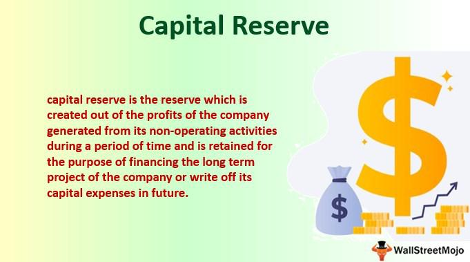

The financial industry is increasingly intricate, with a diverse array of terms and concepts that can pose challenges for both novices and seasoned professionals. To navigate this complexity, it is essential to familiarize oneself with key concepts such as capital reserve, business finances, specific financial terms, and algorithmic trading. A solid understanding of these elements not only enhances one's ability to manage business finances but also fosters more informed decision-making and strategic planning.

Capital reserves, for instance, play a crucial role in maintaining a company's financial stability, offering a buffer against unexpected expenses and potential losses. On the other hand, business finances encompass a broad spectrum of activities, including budgeting, forecasting, and financial analysis, all vital for aligning an organization's short-term operations with its long-term objectives.



The grasp of financial terminology, such as equity, assets, liabilities, and liquidity, is fundamental to interpreting financial statements and engaging effectively with stakeholders. Meanwhile, algorithmic trading represents a technological advancement that has revolutionized market operations by using computer algorithms to execute trades with unprecedented speed and precision.

This article aims to clarify these core concepts, highlighting their applications and significance in contemporary financial management. By breaking down these ideas into their component parts, we intend to provide a clearer roadmap for enhancing both individual and organizational financial acumen.

## Table of Contents

## Understanding Capital Reserve

A capital reserve is a portion of a company's equity that emerges from capital profits rather than operational activities. These profits accumulate from transactions such as selling fixed assets or issuing shares at a premium. Unlike revenue reserves, which emerge from a company's regular business operations and can be distributed as dividends, capital reserves are generally retained in the business for strategic financial management purposes.

The role of capital reserves is predominantly to cushion a business against unforeseen financial strains or to absorb substantial blows to earnings. Companies may encounter unusual expenses or sudden financial downturns, and a well-maintained capital reserve allows them to navigate these challenges without immediate financial instability. Essentially, they serve as a financial buffer ensuring the company's core operations are not compromised in times of adversity.

Businesses primarily derive capital reserves from the capital surplus, which is the excess received over the nominal or face value of shares when they are first issued. For example, if shares are issued at a price higher than their nominal value, the excess constitutes a premium and is channeled into the capital reserve. Additionally, profits from the revaluation of assets contribute to capital reserves, as these do not arise from normal business activities but from changes in asset valuations.

Proper management of capital reserves is paramount for financial stability. When reserves are precisely calculated and adequately maintained, they offer critical support for strategic financial planning. For instance, during downturns or in scenarios demanding quick financial maneuvering, having a capital reserve can make the difference between maintaining operations and financial disarray.

Moreover, while maintaining a robust capital reserve is advantageous, it requires careful reflection between retaining sufficient reserves and investing back into business growth opportunities. Balancing these considerations demands astute financial stewardship and informs strategic decisions, ensuring businesses remain resilient while positioning themselves for sustained growth.

## Importance of Business Finances

Business finances are a critical aspect of company management, encompassing various elements such as budgeting, forecasting, and financial analysis. These components are foundational to ensuring that businesses can not only sustain their daily operations but also plan and achieve their long-term strategic goals.

Budgeting is the process by which a company creates a financial plan for a specific period. This involves estimating revenue and expenses to allocate resources effectively. By maintaining a well-organized budget, a company can monitor its financial performance and make informed adjustments as necessary. Effective budgeting also provides a framework for financial discipline, which is key to maintaining stable cash flow and minimizing unnecessary expenditures.

Forecasting is another vital element, involving the projection of future financial performance based on historical data, economic indicators, and industry trends. Through accurate forecasting, businesses can anticipate potential financial challenges and opportunities. This enables them to adjust their strategies proactively, ensuring they are well-positioned to capitalize on favorable market conditions or mitigate risks.

Financial analysis involves the examination of a company’s financial statements to understand its financial health and performance. Core financial metrics such as profit margins, return on investment (ROI), and [liquidity](/wiki/liquidity-risk-premium) ratios are evaluated to assess how well the business is operating relative to its goals. For instance, liquidity ratios like the current ratio (current assets divided by current liabilities) help in assessing a company's ability to meet its short-term obligations.

Effectively managing business finances requires a comprehensive understanding of various financial terms and principles. This encompasses a firm grasp of core concepts such as equity, debt, cash flow, and working capital. Mastery of these concepts enables businesses to communicate effectively with stakeholders and financial institutions, ensuring nuanced and informed decision-making processes.

In addition, adept financial management plays an essential role in strategic planning and decision-making. It provides clarity on where to allocate resources for investments, identifies cost-saving opportunities, and enhances the ability to pivot strategies based on dynamic market conditions. A well-planned financial strategy is integral to sustaining competitive advantage, facilitating growth, and mitigating risks in an ever-evolving financial landscape.

Ultimately, the importance of business finances lies in their capacity to empower businesses with the knowledge and tools necessary for achieving operational excellence and strategic foresight. By leveraging well-structured financial frameworks, companies can navigate the complexities of the market and secure their financial stability and growth.

## Key Financial Terms Explained

Understanding financial terms is crucial for interpreting financial statements and making informed business decisions. Some of the core terms that are foundational to business finance include equity, debt, assets, liabilities, and liquidity.

**Equity** refers to the ownership interest in a company, represented by funds contributed by the owners plus any retained earnings. It is calculated using the formula:

$$
\text{Equity} = \text{Assets} - \text{Liabilities}
$$

This concept is essential because it indicates the net value of a company and its ability to finance new investments without incurring additional debt.

**Debt** is the amount of money borrowed by a company that needs to be repaid, often with interest. It is a liability and part of the company's capital structure. Understanding debt is crucial for assessing a company's financial leverage and risk.

**Assets** are resources owned by a company that have economic value and can be converted into cash. They are divided into current assets (e.g., cash, inventory) and non-current assets (e.g., property, equipment). Accurate asset valuation is vital for financial health assessments and investment decisions.

**Liabilities** are the financial obligations of a company, including debts and other commitments such as accounts payable. Knowing the level of liabilities is important for evaluating a company’s financial obligations relative to its assets.

**Liquidity** measures the ease with which a company can convert its assets into cash to meet short-term obligations. Liquidity is often assessed using ratios, such as the current ratio:

$$
\text{Current Ratio} = \frac{\text{Current Assets}}{\text{Current Liabilities}}
$$

Such ratios provide insight into a company's ability to cover its immediate liabilities and are fundamental in financial analysis.

Possessing a robust vocabulary and understanding of these financial terms enables effective communication with stakeholders and financial institutions. Regularly updating this knowledge is important as financial instruments and markets evolve. This ongoing education allows individuals and businesses to adapt to new financial realities and maintain their competitive edge in the dynamic financial landscape.

## Algorithmic Trading: Revolutionizing Markets

Algorithmic trading refers to the use of sophisticated mathematical models and computer algorithms to facilitate the execution of trades with high speed and precision. This technique has gained significant traction in the financial markets, particularly among institutional investors. High-frequency trading ([HFT](/wiki/high-frequency-trading-strategies)), a subset of [algorithmic trading](/wiki/algorithmic-trading), allows for the execution of thousands of trades in fractions of a second, offering advantages in terms of efficiency, speed, and reduced transaction costs.

The core appeal of algorithmic trading lies in its ability to minimize human intervention, thus reducing errors associated with emotional or irrational decision-making. By leveraging complex algorithms, traders can analyze vast datasets, identify market patterns, and execute trades that align with strategic goals. A typical algorithmic trading system comprises several components, including data management, trading signal generation, risk management, and execution.

Consider the use of Python for implementing a basic algorithmic trading strategy. One might use the `pandas` library to handle data, `NumPy` for numerical operations, and `scikit-learn` for predictive models. The following snippet outlines a simplified trading strategy based on moving average crossover:

```python
import pandas as pd

# Load market data
data = pd.read_csv('market_data.csv', index_col='Date', parse_dates=True)

# Calculate moving averages
short_window = 40
long_window = 100

data['short_mavg'] = data['Close'].rolling(window=short_window, min_periods=1, center=False).mean()
data['long_mavg'] = data['Close'].rolling(window=long_window, min_periods=1, center=False).mean()

# Generate trading signals
data['signal'] = 0
data['signal'][short_window:] = np.where(data['short_mavg'][short_window:] > data['long_mavg'][short_window:], 1, 0)

# Generate trading orders
data['positions'] = data['signal'].diff()

print(data[['Close', 'short_mavg', 'long_mavg', 'signal', 'positions']])
```

This simple strategy involves calculating two moving averages: a short-term and a long-term average. A buy signal is generated when the short-term average crosses above the long-term average, indicating an upward [momentum](/wiki/momentum). Conversely, a sell signal is generated when the short-term average falls below the long-term average.

Despite its advantages, algorithmic trading is not without risks. High-speed trading can exacerbate market [volatility](/wiki/volatility-trading-strategies) and contribute to systemic risks, as was evident in events like the 2010 Flash Crash. Consequently, implementing effective risk management strategies is crucial. Traders must ensure that their algorithms are thoroughly tested and include safeguards such as circuit breakers and real-time monitoring to manage potential anomalies.

In summary, while algorithmic trading offers substantial benefits in terms of efficiency and cost-effectiveness, it requires careful consideration of associated risks and implementation of robust risk management practices to ensure market stability.

## Interconnecting Capital Reserve and Algorithmic Trading

The interconnection between capital reserves and algorithmic trading presents a unique interplay within the financial ecosystem, highlighting essential elements like risk management and strategic asset allocation. Capital reserves act as a financial buffer for businesses, ensuring stability by covering unforeseen expenses and mitigating potential losses. In contrast, algorithmic trading employs sophisticated computer algorithms to enhance trading efficiency, offering benefits such as speed and reduced transaction costs. This dual focus underscores their significance in comprehensive financial management.

Incorporating algorithmic trading into the management of capital reserves requires a cautious approach. The inherent risks associated with algorithmic trading, including market volatility and systemic risks, can impact financial stability. Algorithms can swiftly execute trades based on predefined criteria, but this speed can exacerbate market fluctuations if not properly regulated. Thus, businesses must implement robust risk management strategies to safeguard their reserves while leveraging the advantages of algorithmic trading. 

Striking an optimal balance between safeguarding capital reserves and capitalizing on market opportunities is crucial. Businesses need to carefully assess their risk tolerance and market conditions before engaging in algorithmic trading using their reserves. By adopting a strategic asset allocation approach, companies can protect their financial interests and pursue growth opportunities, ensuring that their involvement in algorithmic trading serves to complement and strengthen their overall financial strategy rather than introduce unnecessary risks.

## Conclusion

A comprehensive understanding of capital reserves, business finance, and algorithmic trading is essential for modern businesses. These concepts each play a pivotal role in ensuring a firm's continued growth and robustness in a rapidly evolving financial environment.

Capital reserves act as a financial safety net, providing companies with the capability to weather unexpected expenses or economic downturns without jeopardizing their financial standing. This reserve, which springs from capital profits such as the sale of fixed assets or share premiums, must be managed judiciously to optimize its benefits. The stability it provides is invaluable, as it not only safeguards current operations but also furnishes the groundwork for future growth and investments.

Mastering business finances involves a thorough understanding of concepts like budgeting, forecasting, and financial analysis. These components ensure that a business can meet both its immediate operational needs and its strategic, long-term objectives. An in-depth grasp of financial terminology and the principles underpinning financial statements allows for effective communication with stakeholders and enhances strategic decision-making processes. In an environment where financial intricacies continue to evolve, businesses that actively educate themselves regarding financial terms and practices retain a competitive edge.

Algorithmic trading represents a transformative force within market ecosystems. By leveraging computer algorithms, businesses can execute trades with unprecedented speed and precision, optimizing market operations and potentially reducing transaction costs. Nonetheless, embracing algorithmic trading requires robust risk management strategies to mitigate associated risks such as market volatility and systemic challenges.

By integrating the knowledge and practices associated with capital reserves, business finances, and algorithmic trading, businesses can achieve improved financial stability and operational efficiency. It is crucial for organizations to continually update and expand their understanding of these concepts to not only sustain but enhance their competitive advantage within a dynamic financial landscape. Continued education and adaptation to new financial strategies and technologies will be key in navigating the complexities of modern business finance effectively.

## References & Further Reading

[1]: ["Advances in Financial Machine Learning"](https://www.amazon.com/Advances-Financial-Machine-Learning-Marcos/dp/1119482089) by Marcos Lopez de Prado

[2]: ["Quantitative Trading: How to Build Your Own Algorithmic Trading Business"](https://books.google.com/books/about/Quantitative_Trading.html?id=j70yEAAAQBAJ) by Ernest P. Chan

[3]: ["Evidence-Based Technical Analysis: Applying the Scientific Method and Statistical Inference to Trading Signals"](https://www.amazon.com/Evidence-Based-Technical-Analysis-Scientific-Statistical/dp/0470008741) by David Aronson

[4]: ["Machine Learning for Algorithmic Trading"](https://github.com/PacktPublishing/Machine-Learning-for-Algorithmic-Trading-Second-Edition) by Stefan Jansen

[5]: Bergstra, J., Bardenet, R., Bengio, Y., & Kégl, B. (2011). ["Algorithms for Hyper-Parameter Optimization."](https://dl.acm.org/doi/10.5555/2986459.2986743) Advances in Neural Information Processing Systems 24.