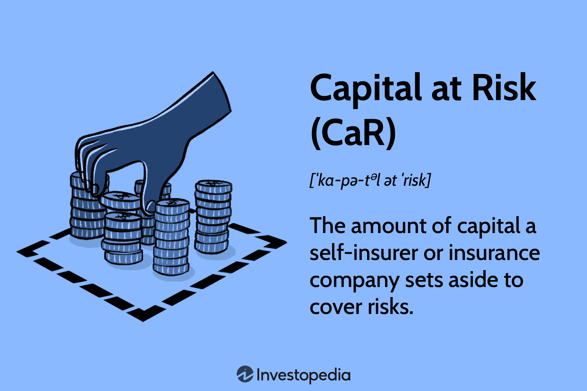

## Table of Contents

## What is capital risk in the context of investment?

Capital risk in the context of investment means the chance that you might lose the money you put into an investment. When you invest in something like stocks, bonds, or a business, there's always a possibility that the value of your investment could go down. If this happens, you could end up with less money than you started with, or in the worst case, you could lose all of your investment.

Understanding capital risk is important because it helps you make smarter choices about where to put your money. Different investments have different levels of risk. For example, putting money in a savings account is usually safer than investing in a new startup company. By knowing the risks, you can decide if you're comfortable with the possibility of losing some or all of your money, and choose investments that match how much risk you're willing to take.

## How does capital risk differ from other types of investment risks?

Capital risk is the risk of losing the money you invest, which means you could get back less than you put in, or nothing at all. It's different from other investment risks because it focuses directly on the loss of your initial investment. For example, if you buy a stock and its value drops to zero, that's capital risk in action – you've lost the money you used to buy the stock.

Other types of investment risks include market risk, which is the risk that the whole market could go down, affecting all investments; [liquidity](/wiki/liquidity-risk-premium) risk, which is the risk that you might not be able to sell your investment quickly enough or at a fair price; and inflation risk, which is the risk that the value of your money will decrease over time due to rising prices. While these risks can also affect your investment's value, they don't necessarily mean you'll lose your entire investment like capital risk does. Understanding these different risks helps you make better choices about where to put your money and how much risk you're willing to take.

## What are the common sources of capital risk for investors?

Capital risk comes from many places when you invest. One big source is the ups and downs of the market. If you put your money into stocks, for example, the price can go up and down a lot. If the price drops a lot and stays low, you could lose some or all of your money. Another source of capital risk is the business or company you invest in. If the company does poorly, goes bankrupt, or has other problems, the value of your investment can go down a lot.

Another common source of capital risk is [interest rate](/wiki/interest-rate-trading-strategies) changes. If interest rates go up, the value of bonds and other fixed-income investments can drop, which means you could lose money. Currency risk is also a [factor](/wiki/factor-investing), especially if you invest in things from other countries. If the value of that country's money goes down compared to your own, your investment could be worth less when you convert it back. Understanding these sources of risk can help you decide how to invest your money more safely.

## How can an investor assess the level of capital risk in a potential investment?

To assess the level of capital risk in a potential investment, an investor should start by looking at the history of the investment. This means checking how much the price of the investment has gone up and down in the past. For example, if you're thinking about buying a stock, you can look at how much its price has changed over time. Big ups and downs mean the investment could be riskier. It's also important to learn about the company or the thing you're investing in. If the company has a lot of debt or is in a risky business, it might be more likely to lose value, which increases your capital risk.

Another way to assess capital risk is by comparing the investment to others. Some types of investments, like government bonds, are usually safer and have less capital risk. Others, like stocks in new tech companies, can be much riskier. You can also use tools like risk ratings from financial experts or look at how much the investment might pay you back compared to the risk you're taking. By understanding these things, you can get a better idea of how likely you are to lose money and decide if the investment is right for you.

## What are some strategies to mitigate capital risk in a portfolio?

One way to lower capital risk in your investment portfolio is by spreading your money across different types of investments. This is called diversification. Instead of putting all your money into one stock or one type of investment, you can invest in a mix of stocks, bonds, and maybe even real estate or commodities. By doing this, if one investment loses value, the others might still do well, which can help protect your overall investment from big losses.

Another strategy is to invest in things that are less risky. For example, government bonds or high-quality corporate bonds usually have less capital risk than stocks. You can also look at funds that are managed to be less risky, like index funds or ETFs that follow a broad market. These types of investments might not grow as fast as riskier ones, but they can help keep your money safer.

Lastly, you can use a strategy called asset allocation, which means deciding how much of your money to put into different types of investments based on how much risk you're willing to take. As you get closer to needing your money, like for retirement, you might want to move more of your investments into safer options. Regularly checking and adjusting your portfolio can help you manage capital risk over time.

## How does diversification help in managing capital risk?

Diversification helps manage capital risk by spreading your investments across different things. Instead of putting all your money into one stock or one type of investment, you spread it out. This way, if one investment loses value, the others might still do well. It's like not putting all your eggs in one basket. If one egg breaks, you still have others that are safe. By having a mix of stocks, bonds, and maybe even real estate or commodities, you can lower the chance of losing all your money at once.

Think of it this way: if you only invest in one company and that company does badly, you could lose a lot of money. But if you invest in many different companies across different industries, the risk is spread out. Some companies might go down, but others might go up. This balance can help protect your overall investment from big losses. Diversification doesn't get rid of all risk, but it can make it less likely that you'll lose everything.

## What role does asset allocation play in controlling capital risk?

Asset allocation is like deciding how to divide your money among different types of investments, like stocks, bonds, and cash. It's important for controlling capital risk because it helps you balance the risk and reward of your investments. If you put all your money into stocks, which can be risky, you might lose a lot if the stock market goes down. But if you also invest in bonds, which are usually safer, you can lower the chance of losing everything. By choosing how much to invest in each type of investment, you can control how much risk you're taking.

For example, if you're young and won't need your money for a long time, you might decide to put more money into stocks because you can handle more risk. But as you get closer to needing the money, like for retirement, you might want to move more of your money into bonds and cash, which are safer. This way, you can adjust your investments over time to match how much risk you're comfortable with. Asset allocation is a key part of managing capital risk because it lets you spread out your investments in a way that fits your goals and how much risk you can handle.

## Can you explain the relationship between capital risk and potential returns?

Capital risk and potential returns are like two sides of the same coin. When you invest, the more risk you take, the higher the potential returns could be. Imagine you're at a fair and you can choose between two games. One game is safe and you might win a small prize, but the other game is riskier and you could win a big prize or lose your money. Investing in something like a new startup company is like playing the risky game – you might make a lot of money if the company does well, but you could also lose it all if the company fails.

On the other hand, if you want to keep your money safer, you might choose investments with lower capital risk, like government bonds. These investments usually don't offer big returns, but they're less likely to lose value. It's like choosing the safe game at the fair where you know you'll win a small prize. So, when you're thinking about where to put your money, you need to decide how much risk you're willing to take based on how much return you're hoping to get.

## How do different investment vehicles (stocks, bonds, real estate) vary in terms of capital risk?

Different investment vehicles like stocks, bonds, and real estate have different levels of capital risk. Stocks are usually the riskiest of the three. When you buy a stock, you're buying a small part of a company. If the company does well, the value of your stock can go up a lot. But if the company does badly or goes bankrupt, you could lose all your money. This makes stocks a high-risk, high-reward investment. The stock market can be very unpredictable, so there's always a chance you might lose some or all of your investment.

Bonds are generally safer than stocks. When you buy a bond, you're lending money to a government or a company. In return, they promise to pay you back with interest. Government bonds, especially from stable countries, are very safe because the government is less likely to go bankrupt. Corporate bonds can be riskier, depending on the company's financial health, but they're still usually less risky than stocks. If the bond issuer can't pay you back, you might lose money, but the risk is lower compared to stocks.

Real estate can also be a good investment, but it comes with its own set of risks. When you invest in property, you might see good returns if the property value goes up or if you can rent it out for a profit. But real estate can be hard to sell quickly, and if the market goes down, you could lose money. Also, owning property means dealing with costs like repairs and taxes, which can eat into your profits. So, while real estate can be less risky than stocks, it's not as safe as bonds and has its own unique challenges.

## What advanced tools or models are used to quantify and manage capital risk?

To help investors understand and manage capital risk, they use advanced tools like Value at Risk (VaR) and stress testing. VaR is a way to guess how much money you might lose from an investment over a certain time, like a day or a week. It looks at how much the price of the investment has moved in the past to figure out the worst-case scenario for the future. Stress testing is another tool that tries to see what would happen to your investment if something really bad happened, like a big drop in the stock market or a sudden change in interest rates. By using these tools, investors can get a better idea of the risks they're taking and make smarter choices about their investments.

Another important model for managing capital risk is the Capital Asset Pricing Model (CAPM). CAPM helps investors figure out how much extra return they should expect for taking on more risk. It compares the risk of a specific investment to the overall market risk. If an investment is riskier than the market, it should offer a higher return to make up for that risk. By understanding this, investors can decide if the potential rewards are worth the risks they're taking. These advanced tools and models help investors keep their money safer by giving them a clearer picture of the risks involved in their investments.

## How has the perception and management of capital risk evolved with financial technology?

Financial technology, or fintech, has changed how people think about and handle capital risk. Before, managing risk meant looking at past data and making guesses about the future. But now, with fintech, investors can use fancy computer programs and lots of data to make better predictions. These programs can look at tons of information quickly, like stock prices, news, and even social media, to figure out how risky an investment might be. This helps investors understand the risks better and make smarter choices about where to put their money.

Also, fintech has made it easier for regular people to manage their investments and risks. There are apps and online tools that let you see all your investments in one place and help you spread your money out to lower risk. These tools can also give you advice on what to do next based on your goals and how much risk you're okay with. So, with fintech, managing capital risk isn't just for experts anymore – anyone can do it with the right tools.

## What are the regulatory considerations concerning capital risk for institutional investors?

Institutional investors, like big banks or pension funds, have to follow strict rules when it comes to managing capital risk. These rules are set by governments and financial watchdogs to make sure that these big investors don't take too many risks with other people's money. For example, they might have to keep a certain amount of safe investments, like government bonds, to balance out riskier ones. They also have to report how they're managing risk and show that they're doing it the right way. This helps keep the financial system stable and protects people who have money in these big funds.

Regulators also make sure that institutional investors use good methods to measure and control capital risk. They might need to use tools like Value at Risk (VaR) or stress testing to figure out how much they could lose in bad situations. If these investors don't follow the rules, they could get in trouble or have to pay fines. So, it's really important for them to stay on top of their risk management and keep up with any changes in the rules. This helps make sure that they're being careful with the money they're managing.

## What is the role of capital risk in investments?

Capital risk is a fundamental consideration in investment because it refers to the potential for an investor to lose all or part of the original investment amount. This risk emerges from various factors that can lead to depreciation or total loss of the invested capital. Understanding and managing capital risk is essential for investors looking to preserve their financial health and achieve long-term growth.

### Definition and Examples of Capital Risk

Capital risk is the possibility that an investor may not fully recover the initial amount invested due to market fluctuations, economic downturns, or poor company performance. For instance, investing in equities carries capital risk if the company's stock price declines, while bondholders face capital risk if the issuer defaults. Real estate investments are not immune to capital risk, as property values may fall due to changes in the market or adverse economic conditions.

### How Capital Risk Affects Different Types of Investments

1. **Stocks**: The value of shares can fluctuate significantly due to factors like corporate performance, market sentiment, and economic cycles. Investors face the risk of losing capital if the market price drops below the purchase price.

2. **Bonds**: Although considered safer than stocks, bonds have capital risk, especially in cases where the issuer defaults or if interest rates rise, making existing bonds less attractive, consequently reducing their market value.

3. **Real Estate**: Property investments carry capital risk via depreciation due to market volatility, natural disasters, or financial crises, affecting resale value.

4. **Mutual Funds/ETFs**: These investment vehicles, while diversified, still face capital risk subject to the performance of underlying assets and broader market trends.

### Assessing Capital Risk Before Committing to an Investment

Evaluating capital risk involves analyzing both quantitative and qualitative factors. Quantitative measures include the evaluation of historical price [volatility](/wiki/volatility-trading-strategies), financial ratios, and economic indicators. For instance, the **Value at Risk (VaR)** method can help quantify potential losses within a certain confidence interval over a specified period:

$$
VaR = \sigma \times Z \times \sqrt{t}
$$

Where:
- $\sigma$ is the standard deviation of the investment's returns
- $Z$ is the Z-score corresponding to the desired confidence level
- $t$ is the time period under consideration

Qualitative assessment considers factors such as the stability and reputation of the investment entity, management quality, and industry prospects.

### Strategies for Managing and Mitigating Capital Risk

1. **Diversification**: Reducing capital risk by spreading investments across different asset classes, industries, and geographic regions minimizes exposure to any single investment's downturn.

2. **Stop-Loss Orders**: These are automatic sale orders set at a predetermined price point to limit potential losses on specific investments.

3. **Hedging**: Implementing strategies like options and futures contracts to offset potential losses, especially useful in volatile markets.

4. **Thorough Due Diligence**: Comprehensive analysis of investment opportunities, understanding underlying business models, and evaluating market conditions reduce the likelihood of capital loss.

5. **Building a Margin of Safety**: Investing with a cushion by purchasing assets below their intrinsic value can protect against market volatility.

6. **Constant Reassessment**: Regular monitoring and evaluation of investments ensure alignment with financial goals and adjustment in strategies based on evolving market conditions.

Investors must adequately assess capital risk and employ sound strategies to safeguard their investments. By doing so, they enhance their potential to achieve sustainable returns while mitigating potential losses.

## What are the forms of investment risk?

Investment risk refers to the potential for losses or inadequate returns relative to expectations when investing capital in various financial instruments. Several forms of investment risk affect the performance of investment portfolios, including market risk, credit risk, and liquidity risk. Understanding these risks is crucial for constructing effective investment strategies and achieving desirable financial outcomes.

### Overview of Investment Risk and Various Types

#### Market Risk

Market risk involves the possibility of losses due to fluctuations in financial markets. These fluctuations can be triggered by various factors, including economic changes, political instability, or natural disasters. Market risk can be broken down into:

- **Equity Risk:** The risk of loss arising from changes in stock prices.
- **Interest Rate Risk:** The risk associated with changes in interest rates, which can affect the value of fixed-income investments.
- **Currency Risk:** The risk that currency exchange rate changes will negatively impact the value of investments.

#### Credit Risk

Credit risk is the likelihood that a borrower will default on a financial obligation. This form of risk is particularly relevant in bond investing, where the issuer might fail to make interest or principal payments. Credit risk assessment involves analyzing the creditworthiness of the issuer, often determined by credit ratings provided by agencies like Moody's or Standard & Poor's.

#### Liquidity Risk

Liquidity risk arises when an investor cannot easily convert an asset into cash without a significant price concession. Assets with high liquidity risk might include real estate, privately held businesses, or certain infrequently traded stocks.

### Identifying and Evaluating Different Forms of Investment Risk

Identifying and evaluating investment risk involves both qualitative and quantitative analysis. For market risk, statistical measures such as beta, Value at Risk (VaR), and standard deviation are commonly used. Credit risk assessment might involve examining financial statements, bond covenants, and external credit ratings. Liquidity risk, on the other hand, can be evaluated by observing market activity, such as bid-ask spreads and trading volumes.

### The Role of Diversification in Managing Investment Risk

Diversification is a strategy used to reduce investment risk by allocating capital across different assets, industries, or geographical regions. By investing in a variety of asset classes, investors can mitigate the impact of poor performance in a single investment. The underlying principle is that not all investments will move in the same direction at the same time. Formally, diversification can be expressed through the modern portfolio theory:

$$
\text{Portfolio Risk} = \sqrt{\sum_{i=1}^n w_i^2 \sigma_i^2 + \sum_{i=1}^n \sum_{j \neq i} w_i w_j \text{Cov}(i, j)}
$$

where $w_i$ is the weight of the $i^{th}$ asset, $\sigma_i$ is the standard deviation of the $i^{th}$ asset, and $\text{Cov}(i, j)$ is the covariance between assets $i$ and $j$.

### Tools and Techniques for Assessing Investment Risk

Several tools and techniques exist for assessing investment risk:

- **Value at Risk (VaR):** A statistical measure that estimates the potential loss of an investment portfolio over a specified period for a given confidence interval.
- **Stress Testing:** Simulating various adverse scenarios to evaluate potential investment losses.
- **Monte Carlo Simulations:** A computational technique used to model the probability of different outcomes in a process that cannot easily be predicted due to the intervention of random variables.

Understanding these various forms of investment risk and employing diversification and other strategies effectively allow investors to construct portfolios that align with their risk tolerance and investment goals.

## References & Further Reading

[1]: Graham, B. (1949). ["The Intelligent Investor"](https://en.wikipedia.org/wiki/The_Intelligent_Investor). Harper Business.

[2]: Malkiel, B. G. (2015). ["A Random Walk Down Wall Street"](https://www.amazon.com/Random-Walk-Down-Wall-Street/dp/0393358380). W. W. Norton & Company.

[3]: Bell, S. (2016). ["Quantitative Finance For Dummies"](https://www.amazon.com/Quantitative-Finance-Dummies-Steve-DPhil/dp/1118769465). For Dummies.

[4]: Chan, E. P. (2008). ["Algorithmic Trading: Winning Strategies and Their Rationale"](https://github.com/ftvision/quant_trading_echan_book). Wiley.

[5]: Jorion, P. (2010). ["Financial Risk Manager Handbook"](https://books.google.com/books/about/Financial_Risk_Manager_Handbook.html?id=gi9jujL8UW4C). Wiley.

[6]: Lo, A. W. (2011). ["The Impact of Algorithms on Market Efficiency"](https://papers.ssrn.com/sol3/papers.cfm?abstract_id=602222). The Quarterly Journal of Economics.

[7]: Taleb, N. N. (2007). ["The Black Swan: The Impact of the Highly Improbable"](https://www.jstor.org/stable/23045073). Random House Trade Paperbacks.

[8]: Federal Reserve Bank of Atlanta. ["Risk Management and Financial Derivatives: An Overview"](https://www.atlantafed.org/research/publications/economic-review/2007/q4/vol92no4_credit-derivatives-and-risk-management). Economic Review. 

[9]: Coursera Course: ["Financial Markets"](https://www.coursera.org/learn/financial-markets-global) by Yale University, taught by Robert Shiller.

[10]: Investopedia. ["Guide to Risk Management"](https://www.investopedia.com/terms/r/riskmanagement.asp).