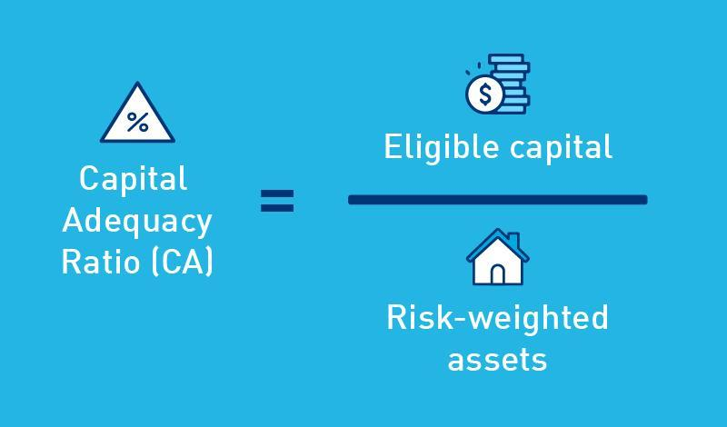

## Table of Contents

## What is the Capital-To-Risk Weighted Assets Ratio (CRAR) in banking?

The Capital-To-Risk Weighted Assets Ratio (CRAR) is a measure used by banks to show how much capital they have compared to the risks they take. It helps to make sure that banks have enough money to cover potential losses from their loans and investments. The ratio is calculated by dividing the bank's capital by its risk-weighted assets. A higher CRAR means the bank is safer because it has more capital to handle losses.

Regulators set minimum CRAR levels to ensure that banks can absorb losses and remain stable. For example, under the Basel III framework, banks are required to maintain a CRAR of at least 8%. If a bank's CRAR falls below this level, it might need to raise more capital or reduce its risky activities. This helps protect the bank and its customers, as well as the overall financial system.

## Why is the Capital-To-Risk Weighted Assets Ratio important for banks?

The Capital-To-Risk Weighted Assets Ratio (CRAR) is important for banks because it shows how safe they are. It tells us if a bank has enough money to cover losses from loans and investments that might go bad. If a bank has a high CRAR, it means they have more money set aside, which makes them safer. This is good for the bank and for the people who put their money in the bank.

Regulators use the CRAR to make sure banks are not taking too many risks. They set rules, like saying a bank needs to have a CRAR of at least 8%. If a bank's CRAR is too low, it might have to get more money or stop doing risky things. This helps keep the bank strong and protects everyone who depends on the bank, including customers and the whole financial system.

## How is the Capital-To-Risk Weighted Assets Ratio calculated?

The Capital-To-Risk Weighted Assets Ratio (CRAR) is calculated by dividing a bank's capital by its risk-weighted assets. Capital includes money the bank has from its owners and any profits it has kept. Risk-weighted assets are the bank's loans and investments, but each one is given a number based on how risky it is. A loan that is very likely to be paid back might get a low number, while a loan that is more likely to go bad gets a higher number.

To find the CRAR, you add up all the capital the bank has. Then, you add up all the risk-weighted assets. You divide the total capital by the total risk-weighted assets and multiply by 100 to get a percentage. For example, if a bank has $10 million in capital and $100 million in risk-weighted assets, the CRAR would be ($10 million / $100 million) * 100 = 10%. This percentage shows how much capital the bank has for every dollar of risk it takes.

## What are the minimum CRAR requirements set by regulatory bodies like the Basel Committee?

The Basel Committee on Banking Supervision sets rules to make sure banks around the world are safe. One of these rules is the minimum Capital-To-Risk Weighted Assets Ratio (CRAR). Under the Basel III framework, which is the latest set of rules, banks need to have a CRAR of at least 8%. This means that for every $100 of risk-weighted assets, a bank should have at least $8 in capital. This helps banks stay strong and able to handle losses if things go wrong.

However, the Basel Committee also says that banks should have extra capital on top of the 8% minimum. This extra amount is called a "capital conservation buffer" and it's set at 2.5%. So, when you add the minimum CRAR and the capital conservation buffer together, banks should aim for a total CRAR of 10.5%. This extra buffer helps banks be even safer and ready for tough times. Different countries might have their own rules too, but these Basel standards are a common guide for many banks worldwide.

## How does the CRAR help in assessing the financial stability of a bank?

The Capital-To-Risk Weighted Assets Ratio (CRAR) helps assess a bank's financial stability by showing how much money the bank has to cover potential losses from its loans and investments. If a bank has a high CRAR, it means it has more capital compared to the risks it takes, which makes the bank safer. A high CRAR suggests that the bank can handle losses without running into trouble, which is good for everyone who relies on the bank, including its customers and the financial system.

Regulators use the CRAR to make sure banks are not taking too many risks. They set a minimum CRAR, like the 8% set by the Basel Committee, to make sure banks have enough money to be stable. If a bank's CRAR is below this minimum, it might need to raise more capital or cut back on risky activities. This helps prevent banks from failing and causing problems for the economy. By keeping an eye on the CRAR, regulators help make sure that banks stay strong and able to handle tough times.

## What are the components of capital considered in the CRAR?

The capital in the Capital-To-Risk Weighted Assets Ratio (CRAR) includes money from the bank's owners, called equity, and any profits the bank has kept, known as retained earnings. Banks also count other types of capital like money they get from selling bonds that can be converted into stock if the bank needs more money. All these parts together make up what is called Tier 1 and Tier 2 capital. Tier 1 capital is the most important because it is the strongest kind of money a bank can have to cover losses.

Tier 1 capital includes things like common stock, which is money from owners, and retained earnings. It is the main part of a bank's capital because it is the best at absorbing losses. Tier 2 capital is less important but still helpful. It includes things like certain types of bonds that can help the bank if it faces big losses. By using both Tier 1 and Tier 2 capital, banks can show how strong they are and how well they can handle risks.

## How do risk-weighted assets affect the CRAR?

Risk-weighted assets are important for the Capital-To-Risk Weighted Assets Ratio (CRAR) because they help measure how risky a bank's loans and investments are. Each loan or investment gets a number based on how likely it is to cause a loss. If a loan is very safe, it gets a low number, but if it's risky, it gets a higher number. When you add up all these numbers, you get the total risk-weighted assets. The higher the total, the more risk the bank is taking.

The CRAR is calculated by dividing the bank's capital by its risk-weighted assets. If the risk-weighted assets are high, it means the bank is taking on more risk, which can make the CRAR lower. A lower CRAR shows that the bank might not have enough money to cover all its risks. So, banks try to keep their risk-weighted assets at a level that keeps their CRAR high enough to meet the rules set by regulators. This helps make sure the bank stays safe and stable.

## Can you explain the difference between Tier 1 and Tier 2 capital in the context of CRAR?

Tier 1 capital is the most important kind of money a bank has to cover losses. It includes things like common stock, which is money from the bank's owners, and retained earnings, which are profits the bank has kept instead of giving them out. Tier 1 capital is strong because it can absorb losses without the bank going bankrupt. It's like the main safety net for the bank, making sure it can handle tough times.

Tier 2 capital is less important but still helpful. It includes things like certain types of bonds that can help the bank if it faces big losses. These bonds can be turned into money or stock if the bank needs it. Tier 2 capital is like a backup safety net. It's not as strong as Tier 1 capital, but it adds extra protection to help the bank stay stable. Both types of capital are used to calculate the Capital-To-Risk Weighted Assets Ratio (CRAR), which shows how safe the bank is.

## What are the consequences for a bank if its CRAR falls below the regulatory minimum?

If a bank's Capital-To-Risk Weighted Assets Ratio (CRAR) falls below the regulatory minimum, it can face serious problems. Regulators might step in and tell the bank to fix the issue quickly. This could mean the bank needs to get more money from investors or cut back on risky loans and investments. If the bank can't raise its CRAR fast enough, it might have to pay fines or get into more trouble with the law.

Falling below the minimum CRAR can also shake the trust people have in the bank. Customers might start to worry about their money and take it out, which could make things even worse for the bank. If too many people pull their money out, the bank could run out of cash and might even fail. This is why banks work hard to keep their CRAR high enough to stay safe and trusted.

## How does the CRAR impact a bank's ability to lend and manage its growth?

The Capital-To-Risk Weighted Assets Ratio (CRAR) plays a big role in how much a bank can lend and grow. If a bank has a high CRAR, it means they have lots of money set aside to cover risks. This makes them safer and more able to lend money to people and businesses. When banks lend more, they can grow and make more money from interest. But they have to be careful not to lend too much, or their CRAR might go down and they could get into trouble.

On the other hand, if a bank's CRAR is low, it might mean they don't have enough money to cover all their risks. Regulators might tell them to stop lending so much or to get more capital. This can slow down the bank's growth because they can't lend as much money. So, banks have to find a balance. They need to lend enough to grow, but not so much that their CRAR drops below the safe level set by regulators.

## What are the global variations in CRAR standards and their implications?

Different countries have their own rules for the Capital-To-Risk Weighted Assets Ratio (CRAR), even though many follow the Basel Committee's guidelines. For example, the Basel III framework suggests a minimum CRAR of 8%, plus a capital conservation buffer of 2.5%, making a total of 10.5%. But some countries might set their own higher standards. In the European Union, banks need to keep a CRAR of at least 10.5%, including the buffer. In the United States, the rules can be even stricter for the biggest banks, requiring them to have a CRAR of 13% or more. These differences mean that banks in one country might need to have more money set aside than banks in another country.

These global variations in CRAR standards have important effects on banks and the economy. Banks in countries with higher CRAR requirements might be safer because they have more money to cover losses, but they might also find it harder to lend as much money. This can slow down their growth and affect the economy. On the other hand, banks in countries with lower CRAR standards might be able to lend more and grow faster, but they could be riskier if they don't have enough money to cover losses. These differences can also make it tricky for banks that work in many countries, as they have to follow different rules in each place.

## How have recent financial regulations changed the approach to calculating and applying the CRAR?

Recent financial regulations, especially the Basel III framework, have made big changes to how banks calculate and use the Capital-To-Risk Weighted Assets Ratio (CRAR). Before, banks might have had different ways to figure out their CRAR, but now, Basel III sets clear rules that everyone follows. One big change is that banks need to have more and better quality capital. This means they have to count more of their money as Tier 1 capital, which is the strongest kind of money for covering losses. Also, banks now have to think about more risks when they calculate their risk-weighted assets, like risks from the market and how much money they lend to one person or company.

These new rules make banks safer but also make it harder for them to lend as much money. Banks now need to keep a bigger buffer of capital, which is extra money on top of the minimum CRAR. This buffer helps banks be ready for tough times, but it also means they might not be able to grow as fast. Because of these changes, banks have to be more careful about the loans and investments they make. They have to make sure they have enough money to cover all their risks, which can slow down their growth but helps keep the whole financial system safer.

## What are Risk-Weighted Assets and How Do We Understand Them?

Risk-weighted assets (RWAs) are a measurement used within the banking sector to evaluate the riskiness of a bank's asset portfolio. This concept is pivotal in guiding banks to maintain a sufficient capital buffer aligned with their exposure to risk. By weighting assets according to their risk levels, banks can more accurately determine their capital requirements, helping ensure both their stability and compliance with regulatory standards.

The primary purpose of RWAs is to allow banks to balance their risk exposure against their capital reserves. This balancing act is crucial for safeguarding depositor funds and maintaining overall financial system stability. The calculation of RWAs serves as the foundation for determining a bank's capital adequacy, which is evaluated by comparing the bank's capital against its RWAs, often expressed via the capital adequacy ratio (CAR). Essentially, CAR is calculated as:

$$
\text{CAR} = \frac{\text{Bank's Capital}}{\text{Risk-Weighted Assets}}
$$

Risk-weighteds assets take into account the varying degrees of risk associated with different types of assets. For example, secure government bonds might [carry](/wiki/carry-trading) a lower risk weighting, while unsecured loans to private parties may have a higher risk weighting due to the increased likelihood of default. 

To calculate RWAs, banks designate risk weights for various asset classes, which are often stipulated by regulatory frameworks such as Basel III. Basel III, introduced by the Basel Committee on Banking Supervision, laid out comprehensive guidelines for quantifying risk weights across a variety of asset types, aiming for greater international financial stability. 

The following is a simplified example in Python to illustrate how a bank might calculate its risk-weighted assets:
```python
# Define asset values and risk weightings
assets = {
    "government_bonds": 1000000,  # in monetary units
    "commercial_loans": 500000,
    "real_estate_loans": 300000
}

# Define risk weights based on regulatory scenarios
risk_weights = {
    "government_bonds": 0.00,  # 0% risk weighting for government bonds
    "commercial_loans": 0.50,  # 50% risk for commercial loans
    "real_estate_loans": 0.75  # 75% risk for real estate loans
}

# Calculate RWAs
risk_weighted_assets = sum(asset_value * risk_weights[asset_type] for asset_type, asset_value in assets.items())

print(f"Total Risk-Weighted Assets: {risk_weighted_assets}")
```

In this example, the bank holds various assets, each with a specific risk weight, and the total RWAs are calculated accordingly. This total plays a critical role in assessing the capital the bank needs to hold in order to safeguard against potential adverse economic developments. Understanding and effectively managing RWAs is a core practice for banks to ensure financial soundness and fulfill regulatory requirements.

## What are Banking Regulations and Capital Ratios?

Banking regulations are critical in maintaining the stability and efficiency of the global financial system. These regulations aim to ensure that banks hold sufficient capital to offset risks and prevent financial crises. One key mechanism through which this is achieved is the imposition of minimum capital requirements that serve as a buffer against unexpected losses.

The Capital Adequacy Ratio (CAR) is a principal metric employed by regulators to evaluate a bank's capital relative to its risk-weighted assets (RWAs). The CAR is defined as:

$$
\text{CAR} = \frac{\text{Tier 1 Capital} + \text{Tier 2 Capital}}{\text{Risk-Weighted Assets}}
$$

CAR is expressed as a percentage, and banks are required to maintain a minimum threshold to ensure solvency under stressful conditions. This is particularly enforced through frameworks like Basel III, which was developed in response to the weaknesses revealed by the 2008 financial crisis. Basel III raises the resilience of banks by mandating higher minimum CARs, thereby enhancing their ability to absorb shocks arising from financial and economic stress.

Central to understanding CAR is the tiered capital structure, divided into Tier 1 and Tier 2 capitals. Tier 1 capital, often termed as core capital, comprises the most stable and readily available capital resources. This includes common equity Tier 1 (CET1) capital, which consists of stock and retained earnings. Tier 1 capital is critical as it provides the highest quality of capital protection.

On the other hand, Tier 2 capital, known as supplementary capital, includes elements like subordinated debt, hybrid instruments, and undisclosed reserves. Although less stable than Tier 1, Tier 2 capital complements the core capital by providing additional financial strength.

Basel III introduced a more stringent capital structure, requiring banks to hold a minimum Common Equity Tier 1 (CET1) ratio of 4.5% of RWAs and a total CAR of 8%. Furthermore, it established a conservation buffer, totaling 2.5% of RWAs, further reinforcing a bank's capacity to withstand economic downturns. This regulatory framework underscores the necessity for banks to strike a balance between maintaining sufficient capital levels and pursuing profitable lending and investment activities.

Implementing these regulations presents challenges to banks, particularly in optimizing their asset portfolios to comply with capital requirements without sacrificing profitability. Consequently, banks must judiciously manage their capital and pursue strategies that enhance both their regulatory compliance and financial performance.

## References & Further Reading

[1]: Basel Committee on Banking Supervision. (2011). ["Basel III: A global regulatory framework for more resilient banks and banking systems."](https://www.bis.org/publ/bcbs189.htm) Bank for International Settlements.

[2]: Lopez, J. A. (1999). ["Methods for Evaluating Value-at-Risk Estimates."](https://www.newyorkfed.org/medialibrary/media/research/epr/98v04n3/9810lope.pdf) Economic Review, Federal Reserve Bank of San Francisco.

[3]: Aldridge, Irena. ["High-Frequency Trading: A Practical Guide to Algorithmic Strategies and Trading Systems"](https://www.amazon.com/High-Frequency-Trading-Practical-Algorithmic-Strategies/dp/1118343506). Wiley Finance.

[4]: Hull, John C. ["Risk Management and Financial Institutions"](https://books.google.com/books/about/Risk_Management_and_Financial_Institutio.html?id=1J1QDwAAQBAJ). Wiley.

[5]: Basel Committee on Banking Supervision. (2013). ["Fundamental review of the trading book: A revised market risk framework."](https://www.bis.org/publ/bcbs265.htm) Bank for International Settlements.