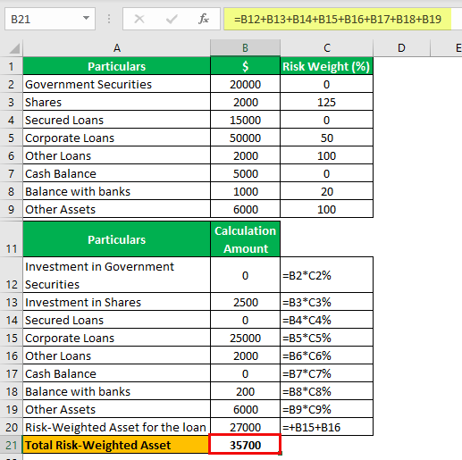

The modern banking sector operates within a framework of stringent regulations designed to ensure financial stability and safeguard depositors. Central to this framework are risk-weighted assets, banking regulations, and capital ratios, each contributing to the robust architecture needed to withstand financial turbulence. Risk-weighted assets (RWAs) represent the risk assessment of each type of asset a bank holds, with a significant impact on a bank's financial stability and regulatory requirements. By assigning different risk weights to different asset types, banks ensure they are prepared for potential losses, maintaining an adequate capital buffer as required by regulations.

Banking regulations provide a blueprint for financial institutions to maintain order and stability. These regulations impose minimum capital requirements to buffer against unexpected financial losses, with capital ratios serving as a critical measure of a bank's financial health. For instance, the Capital Adequacy Ratio (CAR) measures a bank's available capital as a percentage of its RWAs. Such measures are pivotal under regulatory frameworks like Basel III, which aims to promote global financial stability by enforcing strict capital requirements.



Algorithmic trading has emerged as a transformative element in financial markets, affecting banking strategies and risk management practices. While traditionally not at the core of banking activities, algorithmic trading influences asset management and portfolio strategies. As banks integrate algorithmic trading systems, new considerations for risk management and regulatory compliance arise.

This article will address the complex interplay among these elements—risk-weighted assets, banking regulations, capital ratios, and algorithmic trading—and their collective impact on the banking industry. By examining how these components work together, we aim to elucidate their influence on banking practices and regulatory compliance, providing insights into the evolving dynamics of financial regulation and technology in modern banking.

## Table of Contents

## Understanding Risk-Weighted Assets

Risk-weighted assets (RWAs) are a measurement used within the banking sector to evaluate the riskiness of a bank's asset portfolio. This concept is pivotal in guiding banks to maintain a sufficient capital buffer aligned with their exposure to risk. By weighting assets according to their risk levels, banks can more accurately determine their capital requirements, helping ensure both their stability and compliance with regulatory standards.

The primary purpose of RWAs is to allow banks to balance their risk exposure against their capital reserves. This balancing act is crucial for safeguarding depositor funds and maintaining overall financial system stability. The calculation of RWAs serves as the foundation for determining a bank's capital adequacy, which is evaluated by comparing the bank's capital against its RWAs, often expressed via the capital adequacy ratio (CAR). Essentially, CAR is calculated as:

$$
\text{CAR} = \frac{\text{Bank's Capital}}{\text{Risk-Weighted Assets}}
$$

Risk-weighteds assets take into account the varying degrees of risk associated with different types of assets. For example, secure government bonds might [carry](/wiki/carry-trading) a lower risk weighting, while unsecured loans to private parties may have a higher risk weighting due to the increased likelihood of default. 

To calculate RWAs, banks designate risk weights for various asset classes, which are often stipulated by regulatory frameworks such as Basel III. Basel III, introduced by the Basel Committee on Banking Supervision, laid out comprehensive guidelines for quantifying risk weights across a variety of asset types, aiming for greater international financial stability. 

The following is a simplified example in Python to illustrate how a bank might calculate its risk-weighted assets:
```python
# Define asset values and risk weightings
assets = {
    "government_bonds": 1000000,  # in monetary units
    "commercial_loans": 500000,
    "real_estate_loans": 300000
}

# Define risk weights based on regulatory scenarios
risk_weights = {
    "government_bonds": 0.00,  # 0% risk weighting for government bonds
    "commercial_loans": 0.50,  # 50% risk for commercial loans
    "real_estate_loans": 0.75  # 75% risk for real estate loans
}

# Calculate RWAs
risk_weighted_assets = sum(asset_value * risk_weights[asset_type] for asset_type, asset_value in assets.items())

print(f"Total Risk-Weighted Assets: {risk_weighted_assets}")
```

In this example, the bank holds various assets, each with a specific risk weight, and the total RWAs are calculated accordingly. This total plays a critical role in assessing the capital the bank needs to hold in order to safeguard against potential adverse economic developments. Understanding and effectively managing RWAs is a core practice for banks to ensure financial soundness and fulfill regulatory requirements.

## Banking Regulations and Capital Ratios

Banking regulations are critical in maintaining the stability and efficiency of the global financial system. These regulations aim to ensure that banks hold sufficient capital to offset risks and prevent financial crises. One key mechanism through which this is achieved is the imposition of minimum capital requirements that serve as a buffer against unexpected losses.

The Capital Adequacy Ratio (CAR) is a principal metric employed by regulators to evaluate a bank's capital relative to its risk-weighted assets (RWAs). The CAR is defined as:

$$
\text{CAR} = \frac{\text{Tier 1 Capital} + \text{Tier 2 Capital}}{\text{Risk-Weighted Assets}}
$$

CAR is expressed as a percentage, and banks are required to maintain a minimum threshold to ensure solvency under stressful conditions. This is particularly enforced through frameworks like Basel III, which was developed in response to the weaknesses revealed by the 2008 financial crisis. Basel III raises the resilience of banks by mandating higher minimum CARs, thereby enhancing their ability to absorb shocks arising from financial and economic stress.

Central to understanding CAR is the tiered capital structure, divided into Tier 1 and Tier 2 capitals. Tier 1 capital, often termed as core capital, comprises the most stable and readily available capital resources. This includes common equity Tier 1 (CET1) capital, which consists of stock and retained earnings. Tier 1 capital is critical as it provides the highest quality of capital protection.

On the other hand, Tier 2 capital, known as supplementary capital, includes elements like subordinated debt, hybrid instruments, and undisclosed reserves. Although less stable than Tier 1, Tier 2 capital complements the core capital by providing additional financial strength.

Basel III introduced a more stringent capital structure, requiring banks to hold a minimum Common Equity Tier 1 (CET1) ratio of 4.5% of RWAs and a total CAR of 8%. Furthermore, it established a conservation buffer, totaling 2.5% of RWAs, further reinforcing a bank's capacity to withstand economic downturns. This regulatory framework underscores the necessity for banks to strike a balance between maintaining sufficient capital levels and pursuing profitable lending and investment activities.

Implementing these regulations presents challenges to banks, particularly in optimizing their asset portfolios to comply with capital requirements without sacrificing profitability. Consequently, banks must judiciously manage their capital and pursue strategies that enhance both their regulatory compliance and financial performance.

## The Role of Algorithmic Trading

Algorithmic trading, or "algo trading," employs sophisticated computer algorithms to execute trades based on predefined strategies and market conditions. This approach allows for the rapid processing of vast datasets and enables traders to capitalize on market inefficiencies and opportunities that are often fleeting. By reducing human intervention, [algorithmic trading](/wiki/algorithmic-trading) enhances trading efficiency, lowers transaction costs, and optimizes the management of large trade volumes.

The algorithms, usually designed by quantitative analysts, use historical and real-time data to model and predict market trends. These models can include various statistical, econometric, and [machine learning](/wiki/machine-learning) techniques to highlight potential trade signals. For example, moving averages, statistical [arbitrage](/wiki/arbitrage), and [momentum](/wiki/momentum)-based strategies are foundational techniques in the construction of these algorithms.

A significant advantage of algorithmic trading is its ability to execute trades faster and at better prices than human traders. By automating the trade process, banks and financial institutions can minimize slippage—the difference between the expected price of a trade and the actual price—thus ensuring more favorable execution of trades. The use of limit orders, market orders, and stop orders within these algorithms further fine-tunes the precision and efficiency of trade execution.

While algorithmic trading is not directly related to traditional banking activities like deposits and loans, it significantly impacts banks' asset and portfolio management. Banks often hold substantial investment portfolios as part of their asset management strategies and use algorithmic trading to optimize these holdings. By leveraging algorithms, banks can efficiently manage and rebalance large and diverse portfolios, ensuring alignment with investment objectives and regulatory requirements.

However, the rise of algorithmic trading brings new challenges in risk management and regulatory compliance. The rapid, automated nature of algorithmic trading can potentially lead to market disruptions, as evidenced by events like the Flash Crash of May 2010. Consequently, regulators worldwide, such as the Securities and Exchange Commission (SEC) in the United States, have implemented measures to monitor and control high-frequency trading activities. These include mandating circuit breakers—temporary halts to trading when the market experiences drastic price movements—and requiring rigorous testing and monitoring of trading algorithms.

Moreover, banks must ensure that their algorithmic trading systems comply with overarching regulatory frameworks such as the Basel Accords, which mandate risk management practices and capital adequacy requirements. This necessitates robust risk measurement and mitigation frameworks that integrate algorithmic trading activities.

To summarize, while algorithmic trading presents considerable advantages through increased trading efficiency and cost reduction, it calls for enhanced risk management practices and adherence to stringent regulatory compliance standards within the banking sector. The successful integration of algorithmic strategies into banking operations requires a balanced approach—leveraging technological advancements while ensuring stability and compliance in financial markets.

## Strategies for Managing Risk-Weighted Assets

Effective risk management within banks hinges on the meticulous assessment and adjustment of risk-weighted assets (RWAs). These strategies are imperative for maintaining optimal capital ratios and ensuring financial stability. A primary approach involves asset diversification, which helps spread risk across a range of asset types, thereby minimizing the impact of any single asset's underperformance. By diversifying their portfolios, banks can mitigate the specific risks associated with particular asset classes.

Hedging is another crucial technique employed by banks to manage RWAs. Through hedging, banks use financial instruments such as derivatives to offset potential losses from adverse market movements. This approach allows banks to protect their capital from [volatility](/wiki/volatility-trading-strategies) and maintain the required capital adequacy ratios. For example, banks may engage in [interest rate](/wiki/interest-rate-trading-strategies) swaps to manage the risk of fluctuating interest rates affecting loan portfolios.

The adoption of cutting-edge technology, notably [artificial intelligence](/wiki/ai-artificial-intelligence) (AI) and machine learning, has become increasingly important in refining risk assessment processes. These technologies enable banks to analyze vast amounts of data with greater precision, identifying risk patterns and potential threats more effectively than traditional methods. Machine learning algorithms can predict default probabilities more accurately, allowing banks to adjust their capital reserves accordingly.

Continuous monitoring of market conditions and regulatory changes is vital to staying compliant and secure. Banks must stay abreast of economic indicators, geopolitical events, and evolving regulatory requirements that could impact their RWA calculations. By doing so, they can proactively adjust their risk management strategies to align with current and anticipated changes in the financial landscape.

Furthermore, banks are increasingly leveraging advanced software solutions to ensure compliance with regulatory standards and dynamically manage their RWAs. These solutions provide real-time analytics and reporting capabilities, facilitating quick decision-making and strategic adjustments. By integrating such technologies, banks can enhance their ability to respond to shifting market dynamics and regulatory expectations.

In summary, effective management of risk-weighted assets requires a multifaceted approach combining asset diversification, hedging, technology adoption, and continuous monitoring. These strategies enable banks to optimize their capital ratios, maintain regulatory compliance, and ensure financial stability in a constantly evolving financial environment.

## Challenges and Opportunities

Adapting to an evolving regulatory landscape presents significant challenges for banks, as the continuous introduction of regulations demands considerable adjustments in operational practices. Regulatory bodies, including the Basel Committee on Banking Supervision, regularly update frameworks to address emerging risks, compelling banks to alter their risk assessment mechanisms to stay compliant. These evolving regulations often require banks to invest in additional resources, alter existing policies, and apply innovative tools to maintain compliance. Ensuring adherence to such frameworks requires constant vigilance and strategic planning.

Amidst these regulatory challenges, the burgeoning influence of technology offers substantial opportunities to enhance risk management and trading strategies. Innovations, particularly in artificial intelligence (AI) and machine learning (ML), allow for more nuanced and sophisticated risk assessment models. These technologies can analyze vast datasets rapidly to identify risk patterns and predictions with higher accuracy than traditional methods. Moreover, algorithmic trading, powered by advanced computing, can optimize trade execution, minimize costs, and manage large trade volumes with precision and speed. 

Balancing compliance with innovative financial solutions is imperative for modern banks striving for efficiency and competitiveness. Banks need to harmonize their technology-driven strategies with regulatory mandates without compromising operational integrity. For instance, they must ensure that automated trading complies with market conduct codes and risk management frameworks specified in regulatory standards.

Understanding the intersection of risk-weighted assets, capital ratios, and algorithmic trading is vital for effectively leveraging these opportunities. Risk-weighted assets impact a bank's capital adequacy ratios, influencing how much capital a bank must hold against its potential risk exposure. Algorithmic trading, while expediting market transactions, introduces new risk dimensions, such as model risk and operational risk, which must be mitigated carefully. Therefore, a comprehensive understanding of how these elements interact enables banks to optimize their capital strategies while embracing technology-driven advancements in trading and risk assessment. 

To excel amidst these challenges, banks should focus on developing robust frameworks that incorporate evolving regulatory requirements and leverage technological innovations. This involves continuous education, investment in cutting-edge technologies, and fostering a culture of agility and compliance within the organization. Being adaptable and proactive in the face of regulatory and technological changes is crucial for banks to thrive in the dynamic financial landscape.

## Conclusion

The dynamic interplay between risk-weighted assets, capital ratios, banking regulation, and algorithmic trading presents a multifaceted challenge for the banking sector. Each element holds significant sway over a bank's operational health and regulatory standing, demanding strategic alignment and foresight. The intricate nature of risk management through risk-weighted assets necessitates a robust understanding of capital adequacy ratios and regulatory frameworks like Basel III, ensuring that banks maintain sufficient buffers to safeguard against potential downturns.

Strategic management of these components is indispensable for achieving financial stability and adhering to regulatory mandates. Banks must continuously adapt to evolving standards and market conditions, which underscores the importance of agility and informed decision-making. The integration of algorithmic trading into traditional banking practices further complicates this landscape. While offering enhancements in trading precision and cost efficiency, it introduces novel risks and regulatory challenges that must be addressed with careful oversight and innovation.

As the banking industry evolves, adopting innovative approaches to risk assessment and capital management becomes imperative. Leveraging advanced technologies, such as artificial intelligence and machine learning, can augment the precision and efficacy of these processes, positioning banks to better anticipate and mitigate potential risks.

Staying informed and adaptable in this dynamic environment is paramount for banks intent on thriving amid continual technological advancements and regulatory shifts. This proactive stance not only fortifies the institution's ability to navigate complexities but also enhances its competitive edge in an ever-shifting financial ecosystem. By maintaining a forward-looking approach, banks can optimize their strategic operations, ensuring resilience and sustained growth in a landscape that is simultaneously challenging and ripe with opportunity.

## References & Further Reading

[1]: Basel Committee on Banking Supervision. (2011). ["Basel III: A global regulatory framework for more resilient banks and banking systems."](https://www.bis.org/publ/bcbs189.htm) Bank for International Settlements.

[2]: Lopez, J. A. (1999). ["Methods for Evaluating Value-at-Risk Estimates."](https://www.newyorkfed.org/medialibrary/media/research/epr/98v04n3/9810lope.pdf) Economic Review, Federal Reserve Bank of San Francisco.

[3]: Aldridge, Irena. ["High-Frequency Trading: A Practical Guide to Algorithmic Strategies and Trading Systems"](https://www.amazon.com/High-Frequency-Trading-Practical-Algorithmic-Strategies/dp/1118343506). Wiley Finance.

[4]: Hull, John C. ["Risk Management and Financial Institutions"](https://books.google.com/books/about/Risk_Management_and_Financial_Institutio.html?id=1J1QDwAAQBAJ). Wiley.

[5]: Basel Committee on Banking Supervision. (2013). ["Fundamental review of the trading book: A revised market risk framework."](https://www.bis.org/publ/bcbs265.htm) Bank for International Settlements.