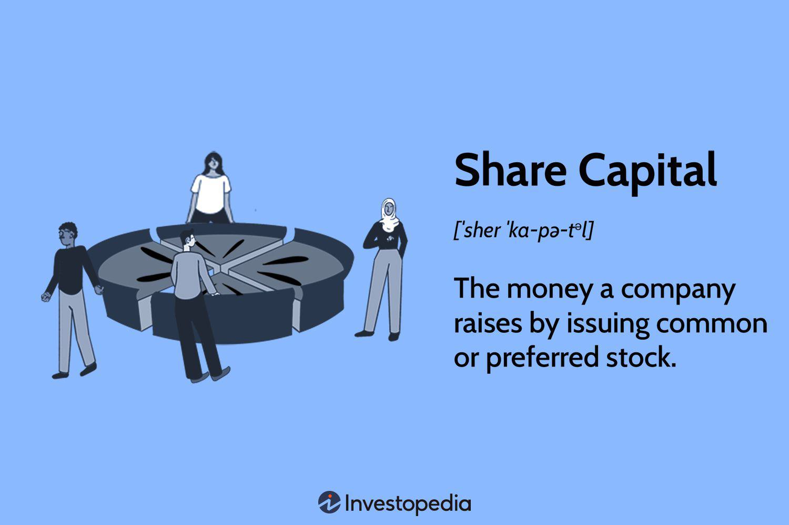

In this article, we explore the complex interactions between economic distribution, investment capital, and algorithmic trading, and their combined influence on modern financial markets. Algorithmic trading, also known as algo trading, has redefined how trades are executed, leading to enhanced market efficiencies and introducing new avenues for capital allocation and economic growth. Stakeholders, including investors and policymakers, must understand the impact of these components to effectively navigate the multifaceted landscape of today's financial investments.

Algorithmic trading employs sophisticated computer algorithms to perform trades at speeds and volumes unachievable by human traders, revolutionizing market dynamics. This technological advance allows for the rapid redistribution of capital, optimizing investment strategies while minimizing transaction costs and maximizing liquidity. The ability to swiftly execute trades based on preset conditions or real-time data profoundly influences market behaviors and has significant implications for resource distribution within an economy.



This introduction serves as a foundation for a thorough examination of how investment capital shares, economic distribution, and algorithmic trading interplay to shape financial ecosystems. These elements collectively define key aspects of market dynamics and economic progress. Join us in analyzing how these intertwined factors contribute to economic prosperity and the overall health of the financial markets, offering insights into the coming sections that dissect each component comprehensively.

## Table of Contents

## Understanding Economic Distribution

Economic distribution, a critical aspect of financial systems, focuses on how wealth and resources are allocated among individuals and sectors within an economy. This allocation profoundly influences investment outcomes by determining the resources available for individual, corporate, and government investments.

### Enhancing Economic Inclusivity and Growth

Effective economic distribution mechanisms can bolster inclusivity and economic growth. By ensuring a more equitable distribution of resources, economies can harness a broader base of human capital and entrepreneurial talent. This inclusivity often leads to increased consumer spending, which in turn stimulates demand for goods and services, driving further investment and economic expansion.

#### Indicators of Economic Distribution

To evaluate economic distribution, several key indicators are used:

1. **Gini Coefficient**: This measures income inequality within a population, where 0 represents perfect equality and 1 indicates maximal inequality. Economies with lower Gini coefficients are typically more inclusive, potentially fostering more stable and sustainable growth.

2. **Lorenz Curve**: A graphical representation of income or wealth distribution, where deviation from a line of perfect equality is observed.  

3. **Wealth Percentiles**: An assessment of the distribution of wealth across different percentiles of a population helps identify concentration levels that might hinder inclusive growth.

### Challenges and Opportunities

Economic distribution faces numerous challenges, including:

- **Income Inequality**: Discrepancies in income can lead to social tensions and economic imbalances.
- **Wealth Concentration**: Excessive concentration of wealth limits broader economic participation and innovation.
- **Access to Resources**: Differences in access to education, healthcare, and financial resources can perpetuate cycles of poverty.

Conversely, opportunities exist for creating balanced growth through:

- **Progressive Taxation**: Effective tax policies can redistribute wealth by investing in social programs and public infrastructure.
- **Education and Training**: Increasing educational access and vocational training opportunities can empower individuals, enabling them to contribute more effectively to the economy.
- **Technology Access**: Providing broader access to technology can bridge gaps and create new opportunities for growth across sectors.

### Role of Governmental Policies and Regulations

Governments play a pivotal role in shaping economic distribution. Policies and regulations designed to facilitate equitable distribution include:

- **Social Welfare Programs**: Initiatives that support healthcare, housing, and food security can reduce poverty and stimulate economic participation.
- **Labor Market Regulations**: Policies ensuring fair wages and working conditions contribute to a more balanced distribution of economic benefits.
- **Public Investment**: Strategic investments in infrastructure and innovation can provide the conditions necessary for equitable growth.

### Aligning Investment Strategies with Economic Objectives

An understanding of economic distribution is vital for aligning investment strategies with broader economic objectives. Investors should consider how their investments impact economic equality. Strategies that prioritize sustainable and inclusive growth can yield long-term economic benefits. By fostering a more equitable distribution of wealth and resources, not only can the foundations for a robust economy be established, but investment outcomes can also be optimized through enhanced economic stability and consumer confidence.

In summary, economic distribution is a multifaceted process that shapes the trajectory of economic growth and development. By addressing challenges and leveraging opportunities within this framework, it is possible to promote a more inclusive and prosperous economic future.

## Investment Capital and Capital Shares

Investment capital formation acts as a fundamental catalyst for economic growth. It signifies the economy's ability to generate the financial resources required to support infrastructure developments and propel innovations. This process encompasses various types of capital shares, each playing a unique role in investment portfolios by focusing on potential gains and dividends.

Capital shares are typically classified into equity and debt. Equity shares represent ownership in a company and provide the possibility of dividends and capital gains, while debt shares involve lending capital in exchange for periodic interest payments. Both types of shares are crucial for diversifying investment portfolios, thereby managing risk and optimizing returns.

Domestic savings form the backbone of investment capital, as they provide local financial institutions with the means to fund projects and initiate new ventures. Encouraging domestic savings is essential for maintaining a stable capital flow within an economy. Conversely, foreign investments bring in external capital, offering additional resources for economic expansion. These investments enhance the capital base, introducing new technology and expertise that can lead to increased productivity.

The current market conditions present both challenges and opportunities in capital share investing. Economic [volatility](/wiki/volatility-trading-strategies) and geopolitical tensions can affect investor confidence and market stability. However, advancements in financial technologies, such as blockchain, offer new platforms and methods for capital share transactions, increasing accessibility and transparency in the market.

Investors often face the dilemma of balancing high-risk capital shares with more stable and secure investments. High-risk shares usually come with the appeal of significant returns but are accompanied by the possibility of considerable losses. On the other hand, stable investments, such as government bonds or blue-chip stocks, generally provide steady but lower returns. A balanced approach involves diversifying across asset classes, sectors, and geographies to mitigate risk while capturing growth opportunities.

Leveraging data analytics and algorithmic models can assist investors in making informed decisions about capital share allocations. By evaluating historical data and market trends, such models can predict potential outcomes and guide investment strategies, enhancing portfolio performance over time.

In conclusion, understanding and navigating the various aspects of investment capital and capital shares can significantly impact economic growth and individual investment outcomes. By bolstering domestic savings, attracting foreign investments, and strategically balancing risk, economies can build resilient capital bases capable of sustaining development and fostering innovation.

## The Role of Algorithmic Trading

Algorithmic trading utilizes computer algorithms to automate trading decisions and execute orders at speeds and volumes that are unattainable for human traders. This approach has fundamentally transformed trading landscapes by improving market efficiency through precision, speed, and the ability to process large data sets in real-time.

### Benefits of Algorithmic Trading

1. **Efficiency and Speed:**
   Algorithms can make and execute trade decisions in fractions of a second, significantly faster than any human trader. This speed allows traders to capitalize on minute market discrepancies, leading to better pricing and reduced transaction costs.

2. **Liquidity:**
   By executing a high [volume](/wiki/volume-trading-strategy) of trades rapidly, [algorithmic trading](/wiki/algorithmic-trading) enhances [liquidity](/wiki/liquidity-risk-premium) in financial markets. Improved liquidity provides easier entry and [exit](/wiki/exit-strategy) points for traders, contributing to more stable markets.

3. **Cost Reduction:**
   Automating trades reduces the need for human intervention, decreasing errors and minimizing emotional biases. This leads to lower operational costs and increased access to complex trading strategies.

### Risks of Algorithmic Trading

Despite its advantages, algorithmic trading carries several risks:

1. **Market Manipulation:**
   Algorithms can potentially be programmed to engage in practices like spoofing or layering, where misleading orders are placed and canceled to create false impressions of supply and demand, affecting market prices.

2. **Flash Crashes:**
   High-frequency trading, a subset of algorithmic trading, can amplify market volatility, as seen in instances like the 2010 Flash Crash. Rapid algorithmic trades triggered by a single event can cascade through markets, causing severe, albeit temporary, disruptions.

### Technological Advancements and Future Implications

Algorithmic trading has evolved with advancements in technology, particularly in AI and [machine learning](/wiki/machine-learning). These technologies enhance the ability of trading algorithms to:

- Analyze vast datasets for patterns,
- Predict market movements with improved accuracy,
- Execute more sophisticated strategies that were once exclusive to human traders.

As AI and quantitative models become further integrated, algorithms will likely become even more autonomous, adaptive, and capable of complex decision-making.

### Integration of AI and Quantitative Models

The incorporation of AI in algorithmic trading is pushing boundaries through methodologies like:

```python
import numpy as np
from sklearn.model_selection import train_test_split
from sklearn.ensemble import RandomForestClassifier

# Sample code for using AI in algorithmic trading
def train_model(features, target):
    X_train, X_test, y_train, y_test = train_test_split(features, target, test_size=0.3, random_state=42)
    model = RandomForestClassifier(n_estimators=100, random_state=42)
    model.fit(X_train, y_train)
    return model.score(X_test, y_test)

# Hypothetical feature and target datasets
features = np.random.rand(1000, 10)
target = np.random.randint(2, size=1000)

# Model accuracy
accuracy = train_model(features, target)
print(f"Model Accuracy: {accuracy:.2f}")
```

This simplistic approach to AI-based trading models highlights the potential to predict market trends and optimize strategies effectively. As technology advances, the capacity for handling risks associated with algorithmic trading, through regulatory oversight and technological safeguards, becomes even more critical.

Algorithmic trading represents a significant shift in market operations, promising greater efficiency and cost-effectiveness. However, the associated risks necessitate careful management and innovative policy solutions to ensure that its growth leads to broader economic benefits.

## Synergy Between Economic Distribution, Investment Capital, and Algo Trading

The synergy between economic distribution, investment capital, and algorithmic trading creates a dynamic framework that influences market efficiency and economic growth. Algorithmic trading, by virtue of its advanced technological infrastructure, significantly contributes to capital allocation efficiency. This efficiency gains prominence as algorithmic systems optimize transaction times and reduce human errors, thereby ensuring a more effective spread of investment capital across diverse economic sectors. This optimized capital allocation strengthens economic distribution by potentially reducing barriers and enhancing accessibility to resources and financial tools for a broader range of participants.

The positive impacts on economic distribution can be illustrated with real-world examples. For instance, algorithmic trading platforms have enabled quicker dissemination of capital into emerging markets, fostering growth in regions that were previously underserved by traditional investment mechanisms. This facilitation of rapid investment can stimulate local economies, create jobs, and encourage innovation, resulting in a more equitable distribution of economic benefits.

However, the synergy is not without risks. The speed and complexity of algorithmic trading can exacerbate market volatility, as seen in incidents like the 2010 Flash Crash. Such events highlight the potential for market disruptions driven by algorithms acting on flawed or incomplete data. Furthermore, excessive dependency on algorithms might lead to systemic vulnerabilities, where correlated trading strategies trigger widespread financial repercussions.

Mitigating these risks requires robust risk management strategies and policy frameworks that keep pace with technological innovations. Ensuring transparent algorithms, implementing circuit breakers, and encouraging diverse trading strategies can help curb potential negative outcomes. Policymakers should strive to balance innovation with caution, promoting a regulatory environment conducive to technological advancements while safeguarding market integrity.

Achieving optimal synergy between economic distribution, investment capital, and algorithmic trading necessitates coordination among stakeholders. Aligning policy frameworks with cutting-edge technological developments in financial markets is essential. Encouraging collaboration between regulators, financial institutions, and technology providers will facilitate the development of standards and practices that maximize the beneficial impacts of this synergy while minimizing inherent risks. Through such collaborative efforts, the potential of these interconnected elements can be harnessed to enhance sustainable economic growth.

## Policy Implications and Recommendations

Policy considerations play a crucial role in shaping the framework for fostering investment capital formation and ensuring sustainable economic growth. In the context of algorithmic trading, regulatory measures are essential to ensure transparency, manage risks, and promote fair trading practices. These measures include implementing stringent regulatory standards that require market participants to disclose their trading algorithms and maintain robust audit trails. Such transparency mitigates the risk of market manipulation and enhances investor confidence, thereby fostering a healthier trading environment.

In addition to regulatory actions, enhancing domestic savings is vital for building a strong capital base. Policies aimed at incentivizing savings through tax benefits or higher interest rates can contribute significantly towards increasing domestic capital availability. Encouraging foreign direct investments (FDI) through favorable policies is another pathway to bolster capital formation. Strategies like reducing barriers to entry for foreign investors and providing tax incentives can attract substantial foreign investments, contributing to economic growth and infrastructure development.

Infrastructure development is another critical area that requires policy attention. Governments should prioritize investments in infrastructure projects that have a multiplier effect on the economy, such as transportation networks, telecommunications, and energy supply systems. Such investments not only create jobs but also lay the foundation for sustainable economic expansion.

Education, training, and innovation are key components that policies should focus on to support the integration of technology in financial markets. By investing in educational programs that emphasize data science, finance, and technology, a skilled workforce can be developed to effectively handle the demands of modern financial markets. Innovation-centric policies, including research and development grants, can stimulate advancements in algorithmic trading and other financial technologies.

Lastly, international cooperation is imperative for regulating global financial markets. Collaborative frameworks and agreements among countries can ensure consistent regulatory standards, preventing regulatory [arbitrage](/wiki/arbitrage) and fostering fair competition. This cooperation can also extend to sharing data and best practices, enhancing the global financial system's resilience and stability.

In summary, a multifaceted policy approach involving regulatory oversight, incentives for savings and investments, infrastructure focus, educational investments, and international collaboration is essential to maximize the benefits of investment capital formation and algorithmic trading, ultimately leading to sustainable economic growth.

## Conclusion

The interconnectedness of economic distribution, investment capital, and algorithmic trading forms a crucial backbone of contemporary economic strategies. Investment capital fuels economic growth by providing the necessary resources for infrastructure, innovation, and expansion. Capital serves as a catalyst, igniting opportunities across sectors and fostering a conducive environment for economic advancement.

Algorithmic trading, on the other hand, enhances market efficiency by executing trades with precision and speed, thereby optimizing liquidity. This increased liquidity facilitates smoother transactions, reduces market volatility, and lowers transaction costs, ultimately contributing to more stable financial markets. The efficiency brought about by algorithmic trading amplifies the effects of investment capital, allowing it to be utilized more effectively across the economic spectrum.

While these elements offer considerable benefits, challenges such as market manipulation and technological disruptions require attention. Addressing these challenges is essential to harness the full potential of these components. The path to sustainable economic development is paved with technological advancements and the strategic integration of these elements into cohesive policy frameworks.

Collaboration between investors, regulators, and policymakers is of paramount importance. By working in tandem, these stakeholders can develop policies that ensure transparency, manage risks, and propel sustainable economic growth. This multifaceted collaboration will amplify the benefits of investment capital and algorithmic trading while ensuring equitable economic distribution.

In conclusion, the strategic exploitation of the synergy between economic distribution, investment capital, and algorithmic trading presents an immense opportunity for fostering economic prosperity. As these elements continue to evolve and intersect, they promise to redefine market dynamics and pave the way for a prosperous economic future.

## References & Further Reading

[1]: Bergstra, J., Bardenet, R., Bengio, Y., & Kégl, B. (2011). ["Algorithms for Hyper-Parameter Optimization."](https://dl.acm.org/doi/10.5555/2986459.2986743) Advances in Neural Information Processing Systems 24.

[2]: ["Advances in Financial Machine Learning"](https://www.amazon.com/Advances-Financial-Machine-Learning-Marcos/dp/1119482089) by Marcos Lopez de Prado

[3]: ["Evidence-Based Technical Analysis: Applying the Scientific Method and Statistical Inference to Trading Signals"](https://www.amazon.com/Evidence-Based-Technical-Analysis-Scientific-Statistical/dp/0470008741) by David Aronson

[4]: ["Machine Learning for Algorithmic Trading"](https://github.com/stefan-jansen/machine-learning-for-trading) by Stefan Jansen

[5]: ["Quantitative Trading: How to Build Your Own Algorithmic Trading Business"](https://github.com/LucindaYa/quant-resources/blob/master/Quantitative%20Trading%20How%20to%20Build%20Your%20Own%20Algorithmic%20Trading%20Business.pdf) by Ernest P. Chan