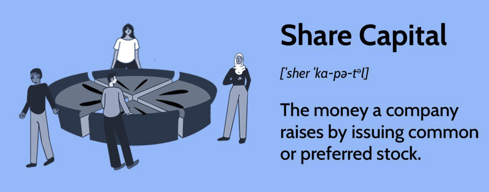

## Table of Contents

## What is capital share?

Capital share refers to the portion of a company's total income that goes to the people who own the company, like shareholders. It is usually shown as a percentage of the total income. This share comes from the profits the company makes after paying all its costs, like salaries and other expenses. If a company does well and makes more profit, the capital share might go up, which means more money for the owners.

The idea of capital share is important because it shows how the wealth created by a company is divided between the people who work there and the people who own it. When capital share is high, it means that a bigger part of the company's income is going to the owners. This can affect how much money workers get, as well as how the economy works overall. Understanding capital share helps us see how businesses share their success and how this impacts everyone involved.

## How is capital share different from labor share?

Capital share and labor share are two ways to look at how a company's money is split up. Capital share is the part of the company's income that goes to the owners or shareholders. It's like the slice of the pie that the people who own the company get to keep. This money comes from the profits after the company has paid for all its costs, including the salaries of the workers.

On the other hand, labor share is the part of the company's income that goes to the workers. It's the slice of the pie that pays for everyone's salaries and wages. When a company makes money, it has to decide how much goes to the owners and how much goes to the workers. If the capital share is high, it means the owners are getting a bigger piece of the pie, and if the labor share is high, it means the workers are getting a bigger piece.

These two shares together make up the whole pie of the company's income. Understanding how they are split can tell us a lot about how fair the company is to its workers and owners. It also helps us see how the economy works because changes in these shares can affect how much money people have to spend and save.

## What are the components of capital share?

Capital share is made up of different parts that all come from the money a company makes. The main part is the profit that the company keeps after paying all its bills, like salaries, rent, and other costs. This profit is what the owners or shareholders get to keep. Sometimes, this profit can be paid out as dividends, which are like little bonuses for the owners. Other times, the company might choose to keep the profit to grow the business, which can still benefit the owners because it can make the company worth more money.

Another part of capital share can come from the value of the company itself. If the company does well, the value of its shares can go up. This means that the owners can sell their shares for more money than they paid for them, which is another way they can make money from the company. So, capital share includes both the direct profits the company makes and the increase in the value of the company over time. Both of these parts help to show how much of the company's success goes to the people who own it.

## How is capital share calculated?

Capital share is calculated by looking at the total income of a company and figuring out how much of that income goes to the people who own the company. To do this, you first find out the company's total income. Then, you subtract all the costs like salaries, rent, and other expenses. What's left is the profit. The capital share is the part of this profit that goes to the owners, usually as dividends or by keeping the money to grow the business.

Sometimes, capital share also includes the increase in the value of the company. If the company does well, the price of its shares can go up. This means that the owners can sell their shares for more money than they paid for them. So, to calculate the full capital share, you might also look at how much the value of the company has grown over time. This gives a complete picture of how much of the company's success goes to the owners.

## What is the significance of capital share in economics?

Capital share is really important in economics because it shows how much of a company's money goes to the people who own it. When a company makes money, it has to decide how to split it up. Some of it goes to the workers as salaries, and some of it goes to the owners as profit. The capital share is the part that goes to the owners. If the capital share is high, it means the owners are getting a bigger piece of the pie. This can affect how much money workers get and how the economy works overall.

Understanding capital share helps us see how businesses share their success and how this impacts everyone involved. If the capital share keeps getting bigger, it might mean that the owners are getting more and more of the company's money, while the workers might not be getting as much. This can change how much money people have to spend and save, which can affect the whole economy. So, looking at capital share gives us a good idea of how fair the company is to its workers and owners, and how the economy might change over time.

## How does capital share affect income distribution?

Capital share plays a big role in how money is shared among people. When a company's capital share is high, it means that a bigger part of the company's money goes to the owners, like shareholders. This can lead to more money for people who already have a lot of money because they own parts of different companies. If the capital share keeps growing, the rich might get richer, while the workers might not see as much of the company's success. This can make the gap between rich and poor even bigger.

On the other hand, if the capital share is lower, it means more of the company's money might go to the workers as salaries. This can help make things more equal because more people get a share of the company's success. When workers earn more, they can spend more on things they need, which can help the economy grow. So, the capital share is important because it affects how money is split up and can change how fair things are in society.

## What are the historical trends in capital share?

Over the past few decades, the capital share in many countries has been going up. This means that more of the money made by companies is going to the people who own them, like shareholders, instead of the workers. In the United States, for example, studies show that the capital share started to grow a lot in the 1980s and has kept growing since then. This trend has been seen in other rich countries too, like those in Europe. The rise in capital share is linked to things like more technology being used in businesses, which can make workers less important, and changes in how companies are run to focus more on making profits for owners.

The growing capital share has had big effects on how money is shared in society. As more money goes to owners, the difference between rich and poor can get bigger. People who own a lot of shares in companies get more money, while workers might not see their pay go up as much. This can make it harder for regular people to keep up with the cost of living. Some people worry that if the capital share keeps growing, it could make society less fair and might even slow down the economy because people won't have as much money to spend.

## How do changes in technology impact capital share?

Changes in technology can make the capital share go up. When companies use more machines and computers, they might not need as many workers. This means that more of the money the company makes can go to the people who own it, instead of paying salaries. For example, if a factory starts using robots to do work that people used to do, the owners save money on wages. This extra money can then be kept as profit, which increases the capital share. Technology can also make businesses more efficient, which means they can make more money with the same amount of work. This extra money often goes to the owners, making the capital share even bigger.

On the other hand, technology can also change how companies are run. With new technology, companies can focus more on making profits for the owners. They might use software to find ways to save money or make more money, which can lead to higher profits. These higher profits usually go to the owners, increasing the capital share. As technology keeps getting better, it might keep pushing the capital share up, making the owners richer while workers might not see as much benefit. This can change how money is shared in society and make the difference between rich and poor even bigger.

## What role does capital share play in economic growth models?

Capital share is important in economic growth models because it shows how much of a country's money goes to the people who own things like businesses and factories. In these models, if the capital share goes up, it means that owners are getting more of the money made by the economy. This can make them want to invest more in new businesses or expand the ones they already have. More investment can help the economy grow because it means more jobs and more things being made. So, a higher capital share can lead to more economic growth if the owners use their extra money to help the economy.

But, if the capital share gets too high, it might not be good for everyone. When owners get a bigger piece of the pie, workers might get less. This can make it harder for regular people to buy things they need, which can slow down the economy. In some economic growth models, if the capital share keeps growing and workers don't get enough money, it can make the economy less fair and might even stop it from growing as fast. So, finding the right balance between capital share and labor share is important for keeping the economy healthy and growing.

## How does globalization influence capital share?

Globalization can make the capital share go up. When companies start doing business all over the world, they can find cheaper ways to make things. They might move their factories to countries where workers get paid less. This means the company can save money on salaries, and more of the money they make can go to the owners. Also, when companies sell their products in more countries, they can make more money. This extra money often goes to the owners as profit, which makes the capital share bigger.

But globalization can also change how companies are run. With the whole world as their market, companies might focus more on making profits for their owners. They can use technology and new ways of doing business to make more money. This extra money usually goes to the owners, making the capital share even bigger. As companies get better at making money from around the world, the capital share might keep growing, which can make the rich richer and the difference between rich and poor even bigger.

## What are the policy implications of changes in capital share?

Changes in capital share can affect how governments make rules and laws. If the capital share keeps going up, it means that owners are getting more money, and workers might be getting less. This can make the gap between rich and poor bigger. Governments might want to make rules to help balance this out. They could make laws to make sure workers get paid more, like raising the minimum wage. Or, they could make it easier for workers to join unions so they can ask for better pay and benefits. Governments might also change how much companies have to pay in taxes, so that owners don't get too much of the money.

Another thing governments can do is to make rules about how companies share their profits. They could make it so that companies have to give a certain amount of their money to their workers, not just the owners. This can help make things fairer. Governments might also look at how globalization and technology are changing the capital share. They could make rules to slow down these changes if they think it's making things too unfair. By thinking about the capital share, governments can try to make sure that the economy works well for everyone, not just the people who own things.

## How can capital share be measured accurately across different economies?

Measuring capital share accurately across different economies can be tricky because each country might do things a little differently. To measure it, you start by looking at the total money a country's businesses make. Then, you subtract all the costs like salaries and other expenses to find out the profit. The capital share is the part of this profit that goes to the owners of the businesses. Different countries might count some things as costs or profits in different ways, so it's important to make sure everyone is using the same rules when comparing them. Also, some countries might have different kinds of businesses or industries, which can make the capital share look different even if it's not really changing.

Another way to measure capital share is to look at how much the value of a company grows over time. If a company does well and its shares go up in price, the owners can make money by selling their shares for more than they paid. This increase in value is another part of the capital share. To compare this across economies, you need to look at how the stock markets in different countries are doing and how much companies are growing. It's not always easy to compare because some countries might have more big companies that can affect the overall numbers a lot. But by using the same methods and being careful about these differences, you can get a good idea of how capital share is changing around the world.

## References & Further Reading

[1]: Bergstra, J., Bardenet, R., Bengio, Y., & Kégl, B. (2011). ["Algorithms for Hyper-Parameter Optimization."](https://dl.acm.org/doi/10.5555/2986459.2986743) Advances in Neural Information Processing Systems 24.

[2]: ["Advances in Financial Machine Learning"](https://www.amazon.com/Advances-Financial-Machine-Learning-Marcos/dp/1119482089) by Marcos Lopez de Prado

[3]: ["Evidence-Based Technical Analysis: Applying the Scientific Method and Statistical Inference to Trading Signals"](https://www.amazon.com/Evidence-Based-Technical-Analysis-Scientific-Statistical/dp/0470008741) by David Aronson

[4]: ["Machine Learning for Algorithmic Trading"](https://github.com/stefan-jansen/machine-learning-for-trading) by Stefan Jansen

[5]: ["Quantitative Trading: How to Build Your Own Algorithmic Trading Business"](https://github.com/LucindaYa/quant-resources/blob/master/Quantitative%20Trading%20How%20to%20Build%20Your%20Own%20Algorithmic%20Trading%20Business.pdf) by Ernest P. Chan