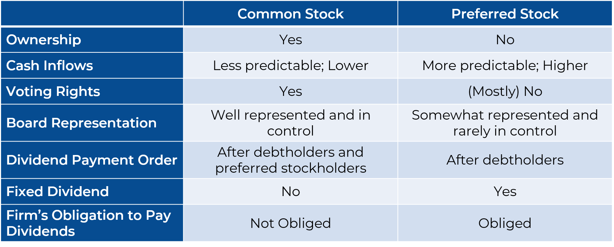

## Table of Contents

## What is capital stock?

Capital stock is the total amount of money a company raises by selling its shares to investors. When a company wants to grow or start new projects, it can sell pieces of itself, called shares, to people who want to invest in it. The money from these sales becomes the company's capital stock. This is important because it helps the company get the funds it needs without taking out loans.

The value of the capital stock can change over time. If the company does well, the value of its shares might go up, making the capital stock worth more. But if the company struggles, the value of the shares might go down, reducing the value of the capital stock. This makes capital stock a key part of understanding a company's financial health and its ability to raise money in the future.

## What is the difference between common stock and preferred stock?

Common stock and preferred stock are two types of shares a company can sell to raise money. Common stock is what most people think of when they talk about stocks. If you own common stock, you get to vote on big company decisions and you might get some of the company's profits as dividends. But, if the company goes bankrupt, common stockholders are the last in line to get any money back, after everyone else like banks and bondholders.

Preferred stock is a bit different. People who own preferred stock usually don't get to vote on company decisions, but they have a special perk: they get paid dividends before common stockholders. These dividends are often fixed, meaning they don't change much. Also, if the company goes bankrupt, preferred stockholders get their money back before common stockholders, but still after banks and bondholders. So, preferred stock can be seen as a safer investment, but it might not grow in value as much as common stock.

## How does one acquire capital stock?

To acquire capital stock, you need to buy shares of a company. You can do this by opening a brokerage account with a financial institution, like a bank or an online trading platform. Once your account is set up, you can search for the company you want to invest in and place an order to buy their shares. The price you pay for each share depends on what people are willing to sell them for at that time. After you buy the shares, they become part of your investment portfolio.

There are different ways to buy shares. You can buy them directly from the company if they offer a direct stock purchase plan. Some companies also have dividend reinvestment plans, where you can use the dividends you earn to buy more shares automatically. Another way is to invest in mutual funds or exchange-traded funds (ETFs) that hold a mix of different stocks. This can be a good way to spread out your risk because you're not putting all your money into one company.

## What are the voting rights associated with common stock?

When you own common stock, you usually get to vote on important company decisions. This is because each share of common stock comes with a vote. The number of votes you have depends on how many shares you own. For example, if you own 100 shares, you get 100 votes. These votes can be used in things like electing the board of directors or approving big changes to the company.

The voting process can happen at a company's annual meeting or through a proxy vote, where you tell the company how you want to vote without going to the meeting. Sometimes, owning common stock means you can vote on things like mergers, acquisitions, or changes to the company's bylaws. But, not all decisions need a vote from shareholders. Some things are decided by the company's management or board of directors. So, while common stock gives you a say in the company, it's not a say in everything the company does.

## What are the dividend preferences for preferred stock?

Preferred stock has special rules about dividends. When a company decides to pay dividends, preferred stockholders get paid before common stockholders. This means that if there's not enough money to pay everyone, preferred stockholders get their dividends first. Usually, the dividend for preferred stock is fixed, which means it doesn't change much. This can make preferred stock a bit safer because you know how much money you'll get.

Sometimes, preferred stock can have what's called "cumulative dividends." This means if the company can't pay the dividends one year, they have to pay them later before they can pay any dividends to common stockholders. Not all preferred stock works this way, but it's something to look out for. So, while preferred stock might not grow in value as much as common stock, it gives you a more predictable income from dividends.

## How does the risk profile differ between common and preferred stock?

Common stock is riskier than preferred stock. If you own common stock, you might make more money if the company does well. The price of common stock can go up a lot, and you might get bigger dividends. But, if the company does badly, the price of common stock can drop a lot too. Also, if the company goes bankrupt, common stockholders are the last to get any money back. So, common stock can be a bit like a roller coaster – it can be exciting, but also scary.

Preferred stock is usually less risky. The price of preferred stock doesn't change as much as common stock, so it's more stable. Preferred stockholders get their dividends before common stockholders, and sometimes they get their money back first if the company goes bankrupt. This makes preferred stock a bit safer. But, because it's safer, you might not make as much money as you could with common stock. So, preferred stock is like a safer ride – not as thrilling, but more predictable.

## Can you provide an example of a company that issues both common and preferred stock?

Ford Motor Company is an example of a business that offers both common and preferred stock. When you buy Ford's common stock, you get to vote on important things like who should be on the board of directors. If Ford does well, the price of the common stock might go up a lot, and you might get bigger dividends. But, if Ford has a tough time, the price of the common stock could drop a lot too. Plus, if Ford ever goes bankrupt, people with common stock are the last to get any money back.

On the other hand, Ford also issues preferred stock. If you buy Ford's preferred stock, you don't get to vote on company decisions. But, you do get your dividends before people with common stock. The dividends for preferred stock are usually fixed, so you know how much money you'll get. If Ford goes bankrupt, preferred stockholders get their money back before common stockholders. So, Ford's preferred stock is safer than its common stock, but it might not grow in value as much.

## What are the tax implications of holding common versus preferred stock?

When you own common or preferred stock, you need to think about taxes. Both types of stock can give you dividends, which are like a share of the company's profits. The tax you pay on these dividends depends on whether they are "qualified" or "non-qualified." Qualified dividends are taxed at a lower rate, like the rate for long-term capital gains, which can be 0%, 15%, or 20% depending on your income. Non-qualified dividends are taxed at your regular income tax rate, which can be higher. Usually, dividends from common stock can be qualified if you meet certain rules, while dividends from preferred stock are often non-qualified, meaning you might pay more tax on them.

There's also the tax on the profit you make when you sell your stock. If you sell your common or preferred stock for more than you paid for it, you have a capital gain. If you held the stock for more than a year, it's a long-term capital gain, taxed at 0%, 15%, or 20% depending on your income. If you held it for a year or less, it's a short-term capital gain, taxed at your regular income tax rate. The tax rules are the same for both common and preferred stock when it comes to selling them. So, while the type of stock might affect your dividend taxes, the tax on selling your stock is the same for both.

## How do the liquidation preferences of preferred stock work?

When a company goes bankrupt and has to close down, it has to pay back its debts. This is called liquidation. During liquidation, preferred stockholders get their money back before common stockholders. This is because preferred stock has what's called a "liquidation preference." It means that if there's any money left after paying off debts like loans and bonds, preferred stockholders get paid first. The amount they get is usually set when they buy the preferred stock. For example, if you bought preferred stock with a $10 liquidation preference, you would get $10 for each share before common stockholders get anything.

Sometimes, preferred stock can have different kinds of liquidation preferences. Some preferred stock might be "non-participating," which means once preferred stockholders get their set amount, they don't get any more money, even if there's some left over. Other preferred stock might be "participating," which means after getting their set amount, they can also share in any extra money with common stockholders. So, understanding the liquidation preference of preferred stock is important because it tells you how much money you might get back if the company goes bankrupt.

## What role does capital stock play in a company's capital structure?

Capital stock is a key part of a company's capital structure. It's the money a company gets from selling shares to people who want to invest in it. This money helps the company grow without having to borrow from banks. When a company sells shares, it can sell common stock or preferred stock. Common stock lets people vote on big company decisions, while preferred stock gives people a fixed dividend and a safer spot if the company goes bankrupt.

The capital structure of a company is all about how it mixes different kinds of money to run and grow. Besides capital stock, a company might use debt, like loans or bonds, to get money. The mix of capital stock and debt is important because it affects how risky the company is and how much it has to pay in interest or dividends. If a company has a lot of capital stock, it might have less debt, which can make it less risky. But, it also means the company has to share its profits with more people. So, capital stock is a big piece of the puzzle when a company decides how to get the money it needs.

## How can the conversion features of preferred stock impact investment decisions?

Preferred stock sometimes comes with a special feature called "convertibility." This means you can trade your preferred stock for common stock at a set rate. This can be a big deal for investors because it gives them a chance to get more out of their investment. If the company does well and the price of common stock goes up a lot, converting your preferred stock into common stock could make you more money. But, you have to think about when to convert. If you convert too early and the price of common stock drops later, you might wish you had waited.

Deciding whether to buy convertible preferred stock can be tricky. It's like having two investments in one. You get the safety of preferred stock, with its fixed dividends and better spot in line if the company goes bankrupt. But, you also get the chance to turn it into common stock and maybe make more money if the company does really well. So, when you're thinking about investing in convertible preferred stock, you need to look at both sides. You have to guess how the company might do in the future and decide if the chance to convert is worth it for you.

## What are the strategic considerations for a company when deciding between issuing common or preferred stock?

When a company thinks about issuing stock, it has to decide between common and preferred stock. Issuing common stock can bring in a lot of money, but it also means giving up some control. People who buy common stock get to vote on big company decisions, like who should be on the board of directors. If the company does well, the price of common stock can go up a lot, making investors happy. But, if the company has a tough time, the price can drop a lot too. So, the company needs to think about how much control it's willing to give up and how much risk it wants to take.

On the other hand, issuing preferred stock can be a safer choice for the company. Preferred stock doesn't let people vote on company decisions, so the company keeps more control. Plus, preferred stockholders usually get fixed dividends, which can make the company's financial planning easier. If the company ever goes bankrupt, preferred stockholders get their money back before common stockholders. But, preferred stock might not bring in as much money as common stock because it's seen as less risky and less exciting. So, the company has to weigh the need for control and stability against the need for more money to grow.

## What is Understanding Capital Stock?

Capital stock refers to the total number of common and preferred shares that a company is authorized to issue according to its corporate charter. This concept is fundamental to understanding a company's financial structure, as it plays a vital role in a company's ability to raise capital and grow its operations. Capital stock is divided into two primary components: common stock and preferred stock, each offering distinct benefits and characteristics to investors.

The role of capital stock in a company's financial framework can be observed in several ways. Primarily, it is an essential aspect of a company's equity financing. By issuing capital stock, companies can raise money without incurring debt, which helps preserve their debt-to-equity ratio and avoid burdensome interest payments. This capacity allows companies to invest in new projects, pay down other debts, or benefit from pursuing new strategic initiatives. Capital stock represents a critical tool for a company's growth and stability.

On a company's balance sheet, capital stock is recorded under shareholders' equity, reflecting the invested capital from stockholders in exchange for ownership interests. Shareholders' equity is calculated as the difference between total assets and total liabilities, demonstrating the residual value for stockholders if the company were to liquidate all its assets and settle all liabilities. The accounting equation can be represented as follows:

$$
\text{Shareholders' Equity} = \text{Assets} - \text{Liabilities}
$$

Here, capital stock contributes to the equity segment, adding to the resources available for sustaining and expanding the company's operations. By selling new shares, a company can effectively increase its capital stock, allowing it to tap into additional funding sources for further investment.

In conclusion, capital stock signifies a company's potential to enhance its operational capacity by raising funds while avoiding debt, providing a strategic advantage for growth and financial stability. Understanding capital stock is crucial for assessing a company's funding capabilities and its implications for future growth prospects.

## References & Further Reading

[1]: ["Common Stocks and Uncommon Profits"](https://www.amazon.com/Common-Stocks-Uncommon-Profits-Writings/dp/0471445509) by Philip A. Fisher

[2]: ["The Intelligent Investor"](https://www.amazon.com/Intelligent-Investor-Definitive-Investing-Essentials/dp/0060555661) by Benjamin Graham

[3]: Harris, L. (2003). ["Trading and Exchanges: Market Microstructure for Practitioners"](https://www.amazon.com/Trading-Exchanges-Market-Microstructure-Practitioners/dp/0195144708)

[4]: Aldridge, I. (2013). ["High-Frequency Trading: A Practical Guide to Algorithmic Strategies and Trading Systems"](https://www.amazon.com/High-Frequency-Trading-Practical-Algorithmic-Strategies/dp/1118343506)

[5]: Fabozzi, F. J. (2015). ["Handbook of High-Frequency Trading and Algorithmic Trading"](https://www.sciencedirect.com/book/9780128022054/handbook-of-high-frequency-trading)