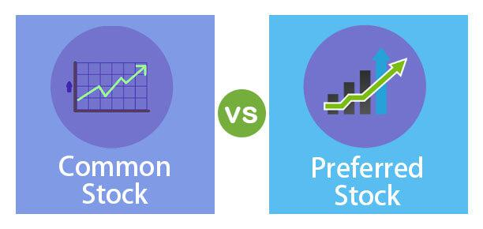

Understanding the basics of capital stock, common stock, preferred stock, and algorithmic trading is crucial for both investors and financial analysts. These financial instruments and tactics play vital roles in developing effective investment strategies and understanding market dynamics.

Capital stock forms the foundation of corporate financing, representing the total amount of shares a company is authorized to issue according to its charter. This not only influences a company's ability to raise funds but also offers insights into its overall financial health. The categorization of capital stock into common and preferred stock further delineates its impact on shareholder rights and company operations.



Common stock is perhaps the most well-known type of equity securities, granting holders a voice in corporate governance through voting rights and offering potential dividends. Preferred stock, while lacking voting rights, provides shareholders with priority in dividend payments and asset distribution. The distinction between these two forms of stock highlights the trade-offs investors must consider, balancing income stability with potential growth.

Algorithmic trading, on the other hand, leverages advanced computing techniques to automate and enhance trading processes. By using algorithms, traders can swiftly execute orders, process vast datasets, and optimize strategies to capitalize on fleeting market opportunities. This technological advancement has redefined trading by increasing both speed and accuracy, thereby affecting liquidity and market behavior.

This article aims to provide an in-depth explanation of these concepts and how they interrelate, offering insights that are valuable for investment strategies. Starting with the definitions, it explores the distinct roles each type of stock plays in corporate financing and the stock market. Additionally, it examines the techniques and implications of algorithmic trading in the modern financial world. Through understanding these components, investors and analysts can make more informed decisions, navigating the evolving landscape of the financial markets with greater confidence.

## Table of Contents

## Understanding Capital Stock

Capital stock refers to the total number of common and preferred shares that a company is authorized to issue according to its corporate charter. This concept is fundamental to understanding a company's financial structure, as it plays a vital role in a company's ability to raise capital and grow its operations. Capital stock is divided into two primary components: common stock and preferred stock, each offering distinct benefits and characteristics to investors.

The role of capital stock in a company's financial framework can be observed in several ways. Primarily, it is an essential aspect of a company's equity financing. By issuing capital stock, companies can raise money without incurring debt, which helps preserve their debt-to-equity ratio and avoid burdensome interest payments. This capacity allows companies to invest in new projects, pay down other debts, or benefit from pursuing new strategic initiatives. Capital stock represents a critical tool for a company's growth and stability.

On a company's balance sheet, capital stock is recorded under shareholders' equity, reflecting the invested capital from stockholders in exchange for ownership interests. Shareholders' equity is calculated as the difference between total assets and total liabilities, demonstrating the residual value for stockholders if the company were to liquidate all its assets and settle all liabilities. The accounting equation can be represented as follows:

$$
\text{Shareholders' Equity} = \text{Assets} - \text{Liabilities}
$$

Here, capital stock contributes to the equity segment, adding to the resources available for sustaining and expanding the company's operations. By selling new shares, a company can effectively increase its capital stock, allowing it to tap into additional funding sources for further investment.

In conclusion, capital stock signifies a company's potential to enhance its operational capacity by raising funds while avoiding debt, providing a strategic advantage for growth and financial stability. Understanding capital stock is crucial for assessing a company's funding capabilities and its implications for future growth prospects.

## Common Stock vs. Preferred Stock

Common stockholders own a portion of the company and typically have voting rights, granting them the ability to influence corporate decisions through mechanisms such as electing the board of directors. This ownership also ties their potential returns to the company's performance; when the company prospers, common stockholders may see an increase in stock value and possible dividends. However, this type of stock comes with higher risk, as dividends are not guaranteed and, in the event of liquidation, common stockholders are the last to be paid after debts and preferred shareholders.

In contrast, preferred stockholders have a different set of benefits. They receive a fixed dividend, which is usually higher than common stock dividends, providing more stable income. Importantly, preferred shareholders have a higher claim on company assets and income, ranking above common shareholders but below debt holders during liquidation. However, preferred stocks generally do not come with voting rights, which means less influence over corporate governance and operational decisions.

The key differences between common and preferred stock are thus evident in terms of risk, potential returns, voting rights, and behavior during liquidation events. The risk associated with common stock is higher given its [volatility](/wiki/volatility-trading-strategies) and the unpredictability of dividends. Conversely, the fixed income from preferred stocks makes them less volatile but typically limits capital appreciation potential.

Investors choose between common and preferred stock based on their individual financial goals and risk tolerance. If an investor prioritizes voting rights and the potential for capital gains, they might prefer common stock. In contrast, those seeking steady income with lower risk might opt for preferred stock. For example, an investor focusing on retirement income might select preferred stock for its regular dividends, while an investor with a higher risk appetite looking at long-term growth might invest in common stock.

## Role of Algorithmic Trading

Algorithmic trading uses automated, pre-programmed instructions to [carry](/wiki/carry-trading) out trading orders with remarkable speed and precision, dramatically altering how transactions occur in financial markets. These trading algorithms can analyze vast amounts of data and identify trading opportunities almost instantaneously, which humans may struggle to recognize due to [volume](/wiki/volume-trading-strategy) and complexity limitations. This speed and efficiency effectively mitigate human error, reduce transaction costs, and enhance the execution of large orders.

The significance of [algorithmic trading](/wiki/algorithmic-trading) in the modern stock market cannot be overstated. As markets have become increasingly data-driven, the ability to process and act upon data instantaneously provides a competitive advantage. Algorithmic trading systems are built to exploit small price discrepancies that may exist for only a fraction of a second, a task impossible without the use of technology. These systems utilize various strategies, such as statistical [arbitrage](/wiki/arbitrage), market-making, and trend-following, to optimize trading performance.

The integration of algorithms into trading practices has had a substantial impact on market behavior, particularly concerning [liquidity](/wiki/liquidity-risk-premium) and volatility. By facilitating high-frequency trading, algorithms provide liquidity to the markets, making it easier to buy or sell securities without causing large price movements. However, the same high-frequency trading is often scrutinized for contributing to increased volatility, as rapid and massive moves in stock prices can occur when many algorithmic systems react simultaneously to new data.

Algorithmic trading platforms are designed to handle complex calculations and execute trades based on pre-determined criteria. Below is a simple Python example using the popular trading library, `pandas` and `NumPy`, indicating how one might automate a moving average crossover strategy:

```python
import pandas as pd
import numpy as np

# Load historical stock data
# Assuming 'data' is a DataFrame with columns 'Date' and 'Close'
data['SMA_50'] = data['Close'].rolling(window=50).mean()
data['SMA_200'] = data['Close'].rolling(window=200).mean()

# Define signals
data['Signal'] = 0
data['Signal'][50:] = np.where(data['SMA_50'][50:] > data['SMA_200'][50:], 1, 0)
data['Position'] = data['Signal'].diff()

# Display signals
print(data[['Close', 'SMA_50', 'SMA_200', 'Signal', 'Position']].tail())
```

The example illustrates a crossover strategy involving two simple moving averages (50-day and 200-day). A buy signal is generated when the shorter moving average crosses above the longer moving average, and a sell signal is triggered when it crosses below. This type of strategy exemplifies how algorithms can be set to trade systematically based on specified rules.

The influence of algorithmic trading is a testament to the integration of technology in financial markets. It underscores both the opportunities and challenges inherent in the rapidly changing landscape of stock trading, where the only constant is the need for innovation and adaptation.

## Interconnections in the Financial Market

The interplay between capital stock and algorithmic trading emphasizes the complex nature of modern financial markets. One key aspect is how capital stock affects a company's financial health, which is an essential [factor](/wiki/factor-investing) for algorithm developers when predicting market trends. The capital stock, comprising both common and preferred shares, represents the equity value of a firm and is a fundamental component of its balance sheet. Changes in capital stock can significantly influence a company's valuation and stock price, impacting overall market behavior. Understanding these changes is vital for creating predictive algorithms that forecast market movements by analyzing how variations in capital stock affect a company’s risk profile and growth prospects.

Common and preferred stocks also play integral roles in portfolio strategies that are shaped by algorithmic insights. Each type of stock has distinct characteristics: common stocks usually offer voting rights and higher return potential, but with greater risk; preferred stocks provide more stable dividends and priority in asset liquidation. Algorithms are employed to identify patterns and correlations within these characteristics, enabling better portfolio optimization. For instance, an algorithm might allocate a higher weight to preferred stocks during uncertain market conditions due to their lower volatility, aiming to maximize returns while minimizing risk.

Investors increasingly rely on algorithms to sift through historical data and detect trends associated with various stock types. These algorithms can analyze vast amounts of information rapidly, uncovering insights that might not be immediately apparent to human analysts. Python, a popular programming language in finance, offers libraries such as Pandas and NumPy to handle complex data manipulation tasks. For example, a basic algorithm might look like this:

```python
import pandas as pd

# Load historical stock data
data = pd.read_csv('stock_data.csv')

# Calculate daily returns
data['Return'] = data['Close'].pct_change()

# Identify trends (Simple Moving Average)
data['SMA'] = data['Close'].rolling(window=20).mean()

# Generate buy/sell signals
data['Signal'] = 0
data.loc[data['Close'] > data['SMA'], 'Signal'] = 1  # Buy
data.loc[data['Close'] < data['SMA'], 'Signal'] = -1 # Sell
```

Informed decision-making, supported by these algorithms, empowers investors to construct resilient investment strategies that account for both short-term market volatility and long-term growth potentials. By interpreting the dynamic interplay of capital stock attributes and algorithmic strategies, investors can better navigate the complex and often unpredictable movements of financial markets.

## Conclusion

The nuances of capital stock, common stock, preferred stock, and algorithmic trading collectively contribute to the broader financial landscape. Understanding these core components is essential for investors aiming to develop robust investment strategies. Capital stock forms the foundation of a company's financing structure, allowing it to raise funds and support growth without incurring debt. This becomes crucial for investors evaluating a company's long-term stability and potential for expansion.

Common and preferred stocks offer distinct advantages and considerations for investors. Common stock typically provides voting rights and potential for higher returns, thus attracting those inclined towards growth and influence in corporate decisions. Preferred stock appeals to those seeking income stability and priority in dividend distributions, especially in volatile markets.

The emergence and proliferation of algorithmic trading bring a technological dimension to stock market dynamics. Algorithms facilitate high-speed trade executions and data-driven analysis, offering a competitive edge. Investors embracing this technology can significantly reduce transaction costs and enhance decision-making processes. Algorithmic trading's ability to process large volumes of data quickly aids in understanding market trends and behaviors, supporting informed trading decisions.

A well-rounded grasp of these components enables investors and financial professionals to navigate the complexities of financial markets. With the convergence of traditional financial principles and modern technological advances, those who integrate these elements into their strategies are better equipped to adapt to an evolving market landscape. Embracing such an integrative approach promises significant advantages, ensuring relevance and competitiveness in today's financial world.

## References & Further Reading

[1]: ["Common Stocks and Uncommon Profits"](https://www.amazon.com/Common-Stocks-Uncommon-Profits-Writings/dp/0471445509) by Philip A. Fisher

[2]: ["The Intelligent Investor"](https://www.amazon.com/Intelligent-Investor-Definitive-Investing-Essentials/dp/0060555661) by Benjamin Graham

[3]: Harris, L. (2003). ["Trading and Exchanges: Market Microstructure for Practitioners"](https://www.amazon.com/Trading-Exchanges-Market-Microstructure-Practitioners/dp/0195144708)

[4]: Aldridge, I. (2013). ["High-Frequency Trading: A Practical Guide to Algorithmic Strategies and Trading Systems"](https://www.amazon.com/High-Frequency-Trading-Practical-Algorithmic-Strategies/dp/1118343506)

[5]: Fabozzi, F. J. (2015). ["Handbook of High-Frequency Trading and Algorithmic Trading"](https://www.sciencedirect.com/book/9780128022054/handbook-of-high-frequency-trading)