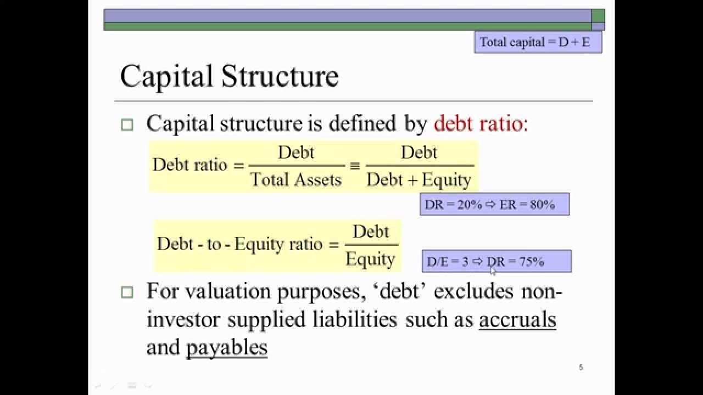

## Table of Contents

## What is capital structure in finance?

Capital structure in finance refers to the way a company finances its operations and growth through a combination of debt and equity. It's like a recipe that shows how much of the company's funds come from loans (debt) and how much comes from selling shares (equity). This mix is important because it affects the company's risk and its ability to grow. If a company uses more debt, it might have to pay more interest, which can be risky if the company's profits drop. On the other hand, using more equity means sharing ownership and profits with more shareholders.

Choosing the right capital structure is crucial for a company's success. A good balance can help a company grow without taking on too much risk. For example, a company might start with more equity to keep debt low, but as it grows and becomes more stable, it might add more debt to take advantage of tax benefits on interest payments. The goal is to find a mix that minimizes the cost of capital while maximizing the company's value. Different industries and companies might have different ideal structures, depending on their business models and market conditions.

## What are financial ratios and why are they important?

Financial ratios are tools that help people understand a company's financial health by comparing different numbers from its financial statements. They show things like how well a company is making money, how much debt it has, and how quickly it can pay its bills. For example, if you want to know if a company is good at turning its sales into profit, you can look at its profit margin ratio.

These ratios are important because they make it easier to see the big picture of a company's finances. They help investors, managers, and others make smart decisions. For instance, if a company's debt-to-equity ratio is high, it might mean the company is risky because it has a lot of debt. By using financial ratios, people can compare companies in the same industry, track a company's performance over time, and see if it's doing well or if it needs to make changes.

## Can you explain the debt-to-equity ratio and its significance in capital structure?

The debt-to-equity ratio is a financial ratio that shows how much a company uses debt compared to equity to finance its operations. It's calculated by dividing a company's total liabilities by its total shareholders' equity. If a company has a high debt-to-equity ratio, it means it's using a lot of borrowed money. A low ratio means it's using more of its own money from selling shares.

This ratio is important in understanding a company's capital structure because it shows the balance between risk and growth. A high debt-to-equity ratio can mean more risk because the company has to pay back a lot of loans, which can be hard if its profits go down. But it can also help the company grow faster because debt can be cheaper than equity. On the other hand, a low ratio might mean the company is safer because it doesn't have much debt, but it might grow slower because it's not using as much borrowed money. Finding the right balance is key for a company to be successful.

## How does the equity ratio help in understanding a company's capital structure?

The equity ratio is another important tool for understanding a company's capital structure. It shows what part of the company's total assets is paid for by the money from selling shares, which is called equity. To find the equity ratio, you divide the total equity by the total assets. A high equity ratio means the company is using more of its own money to buy assets, while a low ratio means it's using more borrowed money.

Knowing the equity ratio helps people see how much risk a company is taking. If the equity ratio is high, it might mean the company is safer because it doesn't have a lot of debt. But if the ratio is low, it could mean the company is riskier because it has more debt to pay back. This can affect how investors and others think about the company's financial health and its chances for growth.

## What is the debt ratio and how is it calculated?

The debt ratio is a simple way to see how much a company relies on borrowed money. It tells you what part of a company's total assets is paid for by debt. To find the debt ratio, you just divide the company's total liabilities by its total assets. If the debt ratio is high, it means the company has a lot of debt compared to its assets. If it's low, it means the company isn't using much borrowed money.

Understanding the debt ratio is helpful because it shows how risky a company might be. A high debt ratio can be a red flag because it means the company might have a hard time paying back what it owes if things don't go well. On the other hand, a low debt ratio can mean the company is safer because it's not relying too much on borrowed money. This can affect how investors and others see the company's financial health and its ability to grow in the future.

## How can the interest coverage ratio impact a company's capital structure decisions?

The interest coverage ratio shows how well a company can pay the interest on its debt with its earnings before interest and taxes (EBIT). It's calculated by dividing EBIT by the interest expenses. If this ratio is high, it means the company has plenty of earnings to cover its interest payments, which is good. A low ratio means the company might struggle to pay its interest, which can be risky.

This ratio can really affect how a company decides to structure its capital. If a company sees that its interest coverage ratio is high, it might feel more comfortable taking on more debt to grow. This could mean a higher debt-to-equity ratio in its capital structure. But if the ratio is low, the company might want to be careful and use less debt, maybe relying more on equity to avoid the risk of not being able to pay back what it owes. So, the interest coverage ratio helps companies balance growth and risk in their capital structure decisions.

## What role does the long-term debt to capitalization ratio play in assessing financial stability?

The long-term debt to capitalization ratio is a helpful tool for understanding how much of a company's total capital comes from long-term debt. It's found by dividing the long-term debt by the sum of long-term debt and total shareholders' equity. This ratio shows how much of the company's money is borrowed for the long term compared to the money from selling shares. A high ratio means the company relies a lot on long-term borrowing, which could be riskier. A lower ratio means the company uses less long-term debt and more equity, which might make it more stable.

This ratio is important for assessing a company's financial stability because it shows how the company balances risk and growth. If a company has a high long-term debt to capitalization ratio, it might have a harder time paying back what it owes if things go wrong. This could worry investors and make the company look less stable. On the other hand, a lower ratio can mean the company is safer because it's not as dependent on long-term debt. By looking at this ratio, people can get a better idea of how stable a company is and whether it's managing its finances well.

## How do financial leverage ratios like the degree of financial leverage (DFL) affect capital structure analysis?

Financial leverage ratios, like the degree of financial leverage (DFL), are important for understanding a company's capital structure. The DFL shows how sensitive a company's earnings per share (EPS) are to changes in its operating income. It's calculated by dividing the percentage change in EPS by the percentage change in operating income. A high DFL means that small changes in operating income can lead to big changes in EPS, which can be good if the company's profits are going up but risky if they're going down. This ratio helps people see how much a company is using debt to try to boost its earnings.

When looking at a company's capital structure, the DFL can tell us a lot about the balance between risk and reward. If a company has a high DFL, it means it's using a lot of debt, which can help it grow faster if things go well. But it also means the company could be in trouble if its profits drop, because it still has to pay back the debt. So, a high DFL might make investors nervous because it shows more risk. On the other hand, a low DFL means the company isn't using as much debt, which can make it safer but might also mean it's not growing as fast. By looking at the DFL, people can better understand how a company is managing its debt and equity and make smarter decisions about investing in or managing the company.

## Can you discuss the implications of the fixed charge coverage ratio on capital structure?

The fixed charge coverage ratio tells us how well a company can pay its fixed costs, like interest and lease payments, with its earnings before these charges. It's found by dividing earnings before interest, taxes, and fixed charges by the total fixed charges. If this ratio is high, it means the company has plenty of money to cover these costs, which is good. But if it's low, it might mean the company could have trouble paying its bills, which can be risky.

This ratio is important for deciding on a company's capital structure because it shows how much debt the company can safely handle. If a company has a high fixed charge coverage ratio, it might feel okay to use more debt in its capital structure to grow. This can help the company take advantage of the tax benefits of debt. But if the ratio is low, the company might want to use less debt and more equity to avoid the risk of not being able to pay its fixed charges. So, the fixed charge coverage ratio helps companies find the right balance between using debt to grow and keeping their finances stable.

## How do different industries' capital structure preferences influence the interpretation of financial ratios?

Different industries have their own ways of using debt and equity to fund their businesses, which affects how we look at financial ratios. For example, industries like utilities or telecoms often use a lot of debt because they need a lot of money to build things like power plants or phone networks. So, when we see a high debt-to-equity ratio in these industries, it might not be a bad thing. It's just how they usually do things. On the other hand, tech startups might use more equity because they're trying to grow fast without a lot of debt holding them back. So, a low debt-to-equity ratio in tech might be normal and even a good sign.

Because of these differences, we need to be careful when comparing financial ratios across different industries. A high debt ratio might be fine for a utility company but risky for a tech company. Similarly, a low interest coverage ratio might be a big problem for a company in a stable industry but less worrying for a company in a fast-growing industry where profits can change a lot. By understanding what's normal for each industry, we can better judge if a company's financial ratios are good or if they show something to worry about.

## What advanced techniques can be used to optimize capital structure using financial ratios?

To optimize a company's capital structure using financial ratios, one advanced technique is to use a combination of ratios to find the right balance between debt and equity. For example, a company can look at its debt-to-equity ratio to see how much debt it's using compared to equity. If this ratio is too high, the company might be too risky because it has a lot of debt to pay back. By also looking at the interest coverage ratio, the company can see if it has enough earnings to cover its interest payments. If the interest coverage ratio is low, the company might want to use less debt and more equity to be safer. By using these ratios together, the company can find a capital structure that helps it grow without taking on too much risk.

Another technique is to use financial modeling and simulation to see how different capital structures might affect the company's future performance. For example, a company can create different scenarios where it changes its debt-to-equity ratio and then use financial ratios like the return on equity (ROE) and the return on assets (ROA) to see how these changes might affect its profits and growth. By running these simulations, the company can find the best mix of debt and equity that maximizes its value and minimizes its cost of capital. This helps the company make smart decisions about how to finance its operations and growth in a way that fits its goals and the risks it's willing to take.

## How can scenario analysis and stress testing be integrated with financial ratios to predict the impact of capital structure changes?

Scenario analysis and stress testing can be used with financial ratios to see how changes in a company's capital structure might affect its future. By creating different scenarios, like increasing or decreasing the amount of debt the company uses, we can calculate how this would change ratios like the debt-to-equity ratio or the interest coverage ratio. For example, if a company decides to take on more debt, its debt-to-equity ratio would go up. We can then use scenario analysis to see if this higher debt level would still let the company cover its interest payments, by looking at the interest coverage ratio. This helps the company understand the risks and rewards of different capital structures before making big decisions.

Stress testing takes scenario analysis a step further by looking at what would happen if things went really badly. For instance, if the economy took a downturn and the company's profits dropped a lot, stress testing could show if the company would still be able to pay its debts. By using financial ratios like the debt ratio or the fixed charge coverage ratio in these stress tests, we can see if the company's capital structure is strong enough to handle tough times. This helps the company plan for the worst-case scenarios and make sure its capital structure can survive even if things don't go as planned.

## What is the key to understanding financial ratios?

Financial ratios are quantitative metrics derived from a company’s financial statements, which include the balance sheet, income statement, and cash flow statement. These ratios play a crucial role in evaluating the various facets of a company's performance and are key tools for financial analysts, investors, and management to assess the company's financial health.

Financial ratios can be broadly categorized into four types, each offering unique insights into different aspects of a company's operations:

1. **Profitability Ratios**: These ratios measure a company's ability to generate income relative to its revenue, assets, equity, and other financial metrics. Key profitability ratios include:
   - **Gross Profit Margin**: This ratio is calculated as gross profit divided by total revenue and indicates the efficiency in production and pricing strategies.
$$
     \text{Gross Profit Margin} = \frac{\text{Gross Profit}}{\text{Revenue}}

$$
   - **Return on Assets (ROA)**: ROA indicates how effectively a company uses its assets to generate profit. 
$$
     \text{ROA} = \frac{\text{Net Income}}{\text{Total Assets}}

$$
   - **Return on Equity (ROE)**: This measures the profitability relative to shareholder equity.
$$
     \text{ROE} = \frac{\text{Net Income}}{\text{Shareholder's Equity}}

$$

2. **Liquidity Ratios**: These ratios assess a company's ability to meet its short-term obligations using its most liquid assets. Important liquidity ratios include:
   - **Current Ratio**: It is calculated as current assets divided by current liabilities, providing an overview of the company's ability to cover its short-term obligations.
$$
     \text{Current Ratio} = \frac{\text{Current Assets}}{\text{Current Liabilities}}

$$
   - **Quick Ratio**: Also known as the acid-test ratio, it excludes inventory from current assets, offering a stricter test of short-term liquidity.
$$
     \text{Quick Ratio} = \frac{\text{Current Assets} - \text{Inventory}}{\text{Current Liabilities}}

$$

3. **Efficiency Ratios**: These ratios evaluate how well a company utilizes its assets and manages its operations. Common efficiency ratios include:
   - **Inventory Turnover Ratio**: This measures how efficiently inventory is managed by comparing the cost of goods sold with average inventory during a period.
$$
     \text{Inventory Turnover} = \frac{\text{Cost of Goods Sold}}{\text{Average Inventory}}

$$
   - **Total Asset Turnover**: This ratio shows how well the company uses its assets to generate revenue.
$$
     \text{Total Asset Turnover} = \frac{\text{Revenue}}{\text{Total Assets}}

$$

4. **Leverage Ratios**: These ratios assess the balance between debt and equity in financing the company's operations, indicating financial leverage and risk. Key leverage ratios include:
   - **Debt-to-Equity Ratio (D/E)**: This ratio is a measure of the company’s financial leverage, calculated by dividing total liabilities by shareholder's equity.
$$
     \text{Debt-to-Equity Ratio} = \frac{\text{Total Liabilities}}{\text{Shareholder's Equity}}

$$
   - **Interest Coverage Ratio**: It assesses the company’s ability to meet its interest obligations from its operating income.
$$
     \text{Interest Coverage Ratio} = \frac{\text{EBIT}}{\text{Interest Expense}}

$$

Each of these financial ratios provides a different perspective on a company’s financial health and operational efficiency, offering valuable insights for making informed investment decisions.

## What are Financial Ratios and how do they relate to Capital Structure?

Capital structure is a critical aspect of corporate finance, representing how a company finances its overall operations and growth through different sources of funds. The two primary components of capital structure are debt and equity. The balance between these forms of financing affects the company's risk level, cost of capital, and ultimately, its long-term financial stability.

The debt-to-equity (D/E) ratio serves as a crucial financial metric for evaluating a company's leverage. This ratio is calculated by dividing a company's total liabilities by its shareholder equity, as expressed in the formula:

$$
\text{Debt-to-Equity Ratio} = \frac{\text{Total Liabilities}}{\text{Shareholder Equity}}
$$

A higher debt-to-equity ratio indicates a greater reliance on debt financing relative to equity. While leverage can amplify returns on investment, it also increases financial risk and the potential for insolvency during economic downturns. This is because debt obligations typically come with fixed repayment schedules and interest payments, which must be met regardless of the company's financial performance.

Understanding the debt-to-equity ratio is pivotal for investors seeking to assess a company's financial health and risk profile. Companies with high leverage may face heightened risk, but could also offer higher returns if they successfully manage their debt and capital investments to enhance profitability. Conversely, a lower debt-to-equity ratio suggests a more conservative financial strategy with potentially lower risk but also lower return potential.

Beyond the debt-to-equity ratio, other ratios provide further insights into a company's capital structure. For example, the interest coverage ratio, which measures a firm's ability to meet interest payments with its earnings before interest and taxes (EBIT), offers additional context on financial stability. A high interest coverage ratio typically signifies that a company can comfortably cover interest expenses, reducing the risk posed by additional debt.

Investors use these ratios to gauge not only the potential return on investment but also the inherent risks, helping them make informed decisions about investing in a company's stock or bonds. By analyzing these financial ratios, stakeholders can identify companies with sound capital structures that are well-positioned to withstand market fluctuations and capitalize on growth opportunities.

## What is the relationship between Algorithmic Trading and Financial Ratios?

Algorithmic trading utilizes sophisticated computer algorithms to automate the process of trading financial instruments, relying on pre-established parameters to execute trades. Financial ratios can significantly enhance these algorithms by providing critical insights into a company's financial condition. Integrating financial ratios into [algorithmic trading](/wiki/algorithmic-trading) strategies not only improves decision-making but also optimizes the execution of trades.

Gearing ratios, such as the debt-to-equity ratio and the interest coverage ratio, are particularly valuable in assessing a company's financial leverage. The debt-to-equity ratio is expressed as:

$$
\text{Debt-to-Equity Ratio} = \frac{\text{Total Debt}}{\text{Total Equity}}
$$

This ratio indicates the proportion of debt and equity used to finance a company's assets. A higher ratio suggests greater leverage, which might imply higher risk, especially if earnings are volatile. Algorithmic trading systems can utilize this ratio to develop strategies that avoid over-leveraged companies or adjust trading parameters when the ratio exceeds a predetermined threshold.

The interest coverage ratio, calculated by dividing a company’s earnings before interest and taxes (EBIT) by its interest expenses, measures a firm’s ability to pay interest on outstanding debt:

$$
\text{Interest Coverage Ratio} = \frac{\text{EBIT}}{\text{Interest Expenses}}
$$

This ratio provides insights into a company's capacity to manage its debt obligations. Algorithms can incorporate this ratio to evaluate credit risk and potentially generate signals to buy or sell securities based on changes in a company's financial health.

By integrating these financial ratios into trading algorithms, risk management can be significantly enhanced. For instance, if the debt-to-equity ratio signals elevated leverage risk, algorithms can limit exposure to specific stocks or sectors. Conversely, a positive change in the interest coverage ratio might trigger a bullish trading signal, promoting increased investment in financially healthier companies.

Through algorithmic trading, financial ratios become powerful tools for creating automated strategies aimed at capitalizing on market movements while minimizing risk. Incorporating these metrics enables traders and investors to maintain disciplined strategies across varied market conditions, ensuring robust performance in a competitive financial landscape.

## References & Further Reading

[1]: ["Advances in Financial Machine Learning"](https://www.amazon.com/Advances-Financial-Machine-Learning-Marcos/dp/1119482089) by Marcos Lopez de Prado

[2]: ["Evidence-Based Technical Analysis: Applying the Scientific Method and Statistical Inference to Trading Signals"](https://www.amazon.com/Evidence-Based-Technical-Analysis-Scientific-Statistical/dp/0470008741) by David Aronson

[3]: ["Machine Learning for Algorithmic Trading"](https://github.com/stefan-jansen/machine-learning-for-trading) by Stefan Jansen

[4]: ["Quantitative Trading: How to Build Your Own Algorithmic Trading Business"](https://www.amazon.com/Quantitative-Trading-Build-Algorithmic-Business/dp/1119800064) by Ernest P. Chan

[5]: Ross, S.A., Westerfield, R.W., & Jaffe, J. (2010). ["Corporate Finance"](https://www.amazon.com/Corporate-Modigliani-Professor-Financial-Economics/dp/1259918947). McGraw-Hill.

[6]: Bodie, Z., Kane, A., & Marcus, A.J. (2014). ["Investments"](https://books.google.com/books/about/EBOOK_Investments_Global_edition.html?id=BMsvEAAAQBAJ). McGraw-Hill Education.