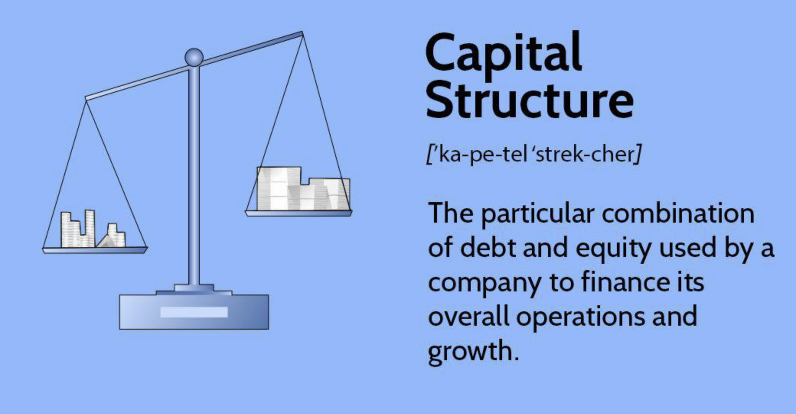

## Table of Contents

## What is capital structure in financial management?

Capital structure in financial management refers to the way a company finances its operations and growth by using different sources of funds. These sources can include debt, equity, or a combination of both. Debt involves borrowing money, usually through loans or bonds, which the company must pay back with interest. Equity, on the other hand, involves raising money by selling shares of the company to investors, who then become part owners. The choice between debt and equity affects the company's overall financial health and its ability to manage risks.

A company's capital structure is important because it impacts its cost of capital, which is the return rate it needs to earn to satisfy its investors. A well-balanced capital structure can lower the cost of capital, making it cheaper for the company to finance its projects. However, too much debt can increase financial risk because the company must make regular interest payments, which can be challenging during tough economic times. On the flip side, relying too much on equity might dilute existing shareholders' ownership and control. Therefore, finding the right mix of debt and equity is crucial for maintaining financial stability and maximizing shareholder value.

## Why is capital structure important for a company?

Capital structure is important for a company because it helps decide how to pay for its business activities and growth. It's about choosing between using borrowed money (debt) or selling pieces of the company (equity) to get the funds needed. This choice affects how much the company has to pay to use that money. If a company picks the right mix of debt and equity, it can make its money work better and grow faster.

Getting the capital structure right also helps a company manage risk. Too much debt can be risky because the company has to pay back the money with interest, no matter how the business is doing. If the business has a bad year, those payments can be hard to make. On the other hand, using too much equity means sharing more of the company with others, which can make it harder for the original owners to control decisions. So, finding a good balance between debt and equity helps keep the company stable and able to grow without taking on too much risk.

## What are the basic components of capital structure?

The basic components of capital structure are debt and equity. Debt is when a company borrows money, usually from banks or by issuing bonds. The company has to pay back this money over time, plus interest. Equity is when a company sells shares to investors. These investors become part owners of the company and might get dividends if the company makes a profit. They also hope the value of their shares will go up over time.

Choosing between debt and equity is important. Debt can be cheaper because interest payments can be tax-deductible, but it also comes with the risk of having to make regular payments. If a company can't pay its debts, it might have to declare bankruptcy. Equity doesn't have to be paid back, but it means sharing ownership and profits with more people. This can make it harder for the original owners to control the company. Balancing these two components helps a company grow while managing its financial health.

## Can you explain the concept of financial leverage in relation to capital structure?

Financial leverage is about using borrowed money, or debt, to try to increase the returns for the people who own the company. When a company uses debt in its capital structure, it can invest in projects or buy things that might make more money than the interest it has to pay on the debt. If the company makes more money than it pays in interest, the extra money goes to the owners, which can make their returns higher. This is like using a lever to lift something heavy with less effort; the borrowed money helps the owners lift their returns higher than they could with just their own money.

But financial leverage also comes with risks. If the company can't make enough money to pay the interest on its debt, it might have trouble paying its bills. This can lead to financial trouble, and in the worst case, the company might go bankrupt. So, when a company decides how much debt to use in its capital structure, it has to think about how much risk it's willing to take. The right amount of debt can help the company grow and make more money for its owners, but too much debt can put the company in danger.

## What is the trade-off theory of capital structure?

The trade-off theory of capital structure is about balancing the good and bad parts of using debt to finance a company. According to this theory, a company should use debt until the benefits of doing so are equal to the costs. The main benefit of debt is that the interest payments can be subtracted from the company's taxes, which saves money. This is called the tax shield. But, using debt also has costs, like the risk of not being able to pay back the money and going bankrupt. The trade-off theory says a company should keep adding debt until the tax savings are balanced by the risk of financial trouble.

So, the trade-off theory helps companies figure out the best mix of debt and equity. If a company uses too little debt, it might miss out on the tax benefits. But if it uses too much debt, the risk of bankruptcy becomes too high. The goal is to find the sweet spot where the company gets the most benefit from the tax shield without taking on too much risk. This way, the company can grow and be financially stable at the same time.

## How does the pecking order theory influence capital structure decisions?

The pecking order theory says that companies prefer to use their own money first when they need to finance their business. This means they like to use their profits or money they already have before they borrow money or sell shares. The reason they do this is because using their own money doesn't cost them anything extra, like interest on a loan or giving up part of the company to new owners. So, when a company needs money, it looks inside first and only goes outside if it has to.

If a company can't use its own money, the pecking order theory says it will borrow money next, instead of selling shares. Borrowing money is seen as less risky than selling shares because the company doesn't have to give up any ownership. But, if the company can't borrow more money, it might have to sell shares as a last choice. This theory helps explain why some companies have more debt than others; it's because they follow this pecking order when they need money.

## What role does the agency cost theory play in determining optimal capital structure?

The agency cost theory looks at how conflicts between different people in a company can affect its choices about money. In a company, managers and owners might want different things. Owners want the company to make more money for them, while managers might want to make their jobs easier or safer. When a company uses more debt, it can help control what managers do because they have to make sure they can pay back the money they borrowed. This can make managers work harder to make the company successful.

But, using more debt also has its problems. It can make managers too worried about paying back the debt, and they might miss out on good chances to grow the company. Plus, if the company can't pay back the debt, it might go bankrupt, which is bad for everyone. So, the agency cost theory says that a company should find a balance. It should use enough debt to keep managers working hard but not so much that it puts the company at risk. This way, the company can keep growing while making sure everyone's interests are taken care of.

## Can you describe the Modigliani-Miller theorem and its implications for capital structure?

The Modigliani-Miller theorem, often called the MM theorem, is a theory about how companies should use debt and equity to finance themselves. It says that, in a perfect world where there are no taxes, no bankruptcy costs, and everyone knows everything about the company, the way a company mixes debt and equity doesn't matter. The value of the company stays the same no matter how much debt or equity it uses. This means that if a company borrows money to buy back its own shares, the value of the company won't change because investors can borrow money themselves to buy more shares if they want to.

However, in the real world, things like taxes and the risk of going bankrupt do matter. The MM theorem has a second part that says when you add taxes into the mix, using debt can actually make the company more valuable. This is because the interest on debt can be subtracted from the company's taxes, which saves money. But if you also consider the costs of going bankrupt, using too much debt can be risky. So, the MM theorem helps companies think about how much debt to use by balancing the benefits of tax savings against the risks of financial trouble.

## How do taxes affect the choice of capital structure according to the static trade-off theory?

The static trade-off theory says that companies should use debt until the benefits of using debt are equal to the costs. One big benefit of using debt is that the interest you pay on it can be taken off your taxes. This means you pay less tax, which saves the company money. This tax saving is called a tax shield, and it's a reason why companies might want to use more debt.

But, using debt also has costs. If a company borrows too much money, it might not be able to pay it back, and this can lead to bankruptcy. The risk of going bankrupt is a big cost that companies need to think about. The static trade-off theory says that companies should keep adding debt until the tax savings from the debt are balanced by the risk of going bankrupt. This way, companies can get the most out of the tax benefits without taking on too much risk.

## What are the implications of market timing on capital structure decisions?

Market timing is when companies try to guess the best time to borrow money or sell shares based on what's happening in the market. If a company thinks the market is good and people are willing to pay more for its shares, it might sell more shares instead of borrowing money. On the other hand, if the market is bad and borrowing money is cheaper, the company might choose to borrow more instead of selling shares. This can change how much debt and equity a company uses, which is its capital structure.

The problem with market timing is that it's hard to guess the market right all the time. If a company gets it wrong, it might end up with too much debt or too many shares sold, which can make it harder to grow or manage risks. So, while market timing can help a company take advantage of good times, it also adds more risk because the market can change quickly. Companies need to be careful and think about both the short-term benefits and the long-term effects on their capital structure when they try to time the market.

## How do different industries approach capital structure differently, and why?

Different industries approach capital structure differently because each industry has its own needs and risks. For example, industries like utilities and telecoms often use a lot of debt because they need a lot of money to build things like power plants or phone networks. These industries can handle more debt because they have steady income from customers, which helps them pay back the money they borrow. On the other hand, tech companies might use more equity because they need money to grow fast and develop new products, and selling shares can help them do that without the pressure of paying back debt right away.

Another reason industries choose different capital structures is because of how much risk they are willing to take. For example, companies in the oil and gas industry might use less debt because the price of oil can go up and down a lot, making it hard to predict their income. If they borrow too much and the oil price drops, they might not be able to pay back their loans. In contrast, industries like consumer goods might use more debt because their income is more predictable, so they can plan better for paying back what they borrow. Each industry tries to find the right balance of debt and equity that fits its business and helps it grow while managing risks.

## What advanced quantitative models are used to optimize capital structure in practice?

In practice, companies use advanced quantitative models to help them decide the best mix of debt and equity for their capital structure. One common model is the Adjusted Present Value (APV) model. This model starts with the value of the company if it had no debt and then adds the value of the tax benefits from using debt. It also subtracts the costs of financial trouble that could come from using too much debt. Another model is the Weighted Average Cost of Capital (WACC) model. This model looks at the cost of using both debt and equity and tries to find the mix that makes the overall cost of money as low as possible. Both models help companies think about how much debt to use by balancing the benefits and risks.

Another useful model is the Capital Asset Pricing Model (CAPM), which helps companies understand the risk of using equity. CAPM looks at how the company's stock moves with the market and uses that to figure out how much return investors will expect. This helps companies decide if they should sell more shares or borrow money instead. Lastly, there's the Merton Model, which uses options pricing theory to estimate the chance of a company going bankrupt if it uses more debt. By using these models, companies can make smarter choices about their capital structure, making sure they grow while keeping risks under control.

## References & Further Reading

- Modigliani, F., & Miller, M. H. The Cost of Capital, Corporation Finance, and the Theory of Investment: This seminal work establishes foundational concepts in capital structure theory, introducing the Modigliani-Miller theorem, which argues that under certain conditions, the value of a company is unaffected by its capital structure. This provides critical insights into the financial management landscape.

- Bodie, Z., Kane, A., & Marcus, A. J. Investments: This comprehensive textbook covers fundamental and advanced investment topics. It explores asset allocation, diversification, and risk management, offering a solid foundation for understanding the principles underlying financial management and capital structure decisions.

- Fabozzi, F. J., & Peterson Drake, P. Finance: Capital Markets, Financial Management, and Investment Management: This book provides an extensive overview of financial markets, instruments, and management strategies. It serves as a valuable resource for understanding the complex interactions between capital markets, financial management practices, and investment decisions.

- Chan, E. P. Algorithmic Trading: Winning Strategies and Their Rationale: Edward Chan's work investigates into the mechanisms and strategies of algorithmic trading. It details the use of quantitative models and computer algorithms to execute trades efficiently, highlighting the impact of these technologies on market dynamics and financial strategies.

- Hull, J. C. Options, Futures, and Other Derivatives: John Hull's book is a key resource for understanding derivatives markets and their role in modern finance. It explores the pricing and use of various derivative instruments, providing insights into risk management and the strategic application of derivatives in financial management.

