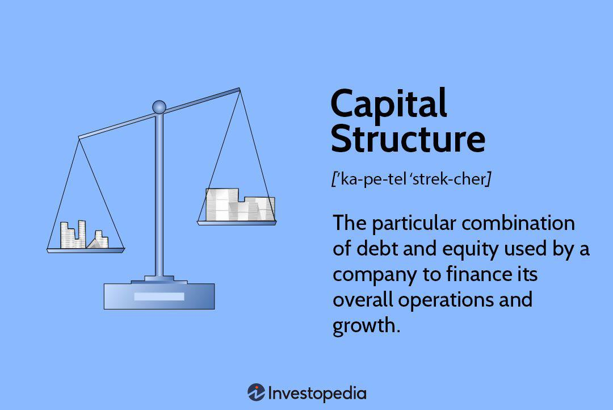

In the rapidly evolving world of finance, the convergence of financial management, capital structure theory, and algorithmic trading is redefining how firms approach decision-making. The globalization of markets and advancements in technology have accelerated this transformation, compelling businesses to innovate and adapt continuously. The synergy between these elements is increasingly pivotal in navigating the complexities of modern financial ecosystems.

This article explores the intersections among financial management, capital structure theory, and algorithmic trading, highlighting both their individual impacts and collective contributions to modern finance. Financial management, with its focus on capital allocation, resource optimization, and risk mitigation, forms the backbone of strategic decision-making in companies. Meanwhile, capital structure theory provides a framework for understanding how a firm finances its operations through different sources of capital, influencing the cost of capital and valuation.

On another front, algorithmic trading leverages technology to enhance trading efficiencies, allowing firms to process vast amounts of information quickly and execute trades with precision. This technological advancement introduces new considerations in financial strategy, challenging traditional theories and offering novel opportunities.

The integration of conventional capital structure theories with cutting-edge algorithmic trading methodologies presents opportunities for enhanced efficiency and profitability. However, it also brings challenges, such as increased volatility and the need for robust risk management systems. Understanding the interplay between these components is crucial for optimizing financial strategies and maintaining competitiveness in a crowded market.

Informed decisions rooted in a comprehensive understanding of financial management, capital structure, and algorithmic trading can significantly enhance a firm’s market position. Firms that can successfully navigate and integrate these facets are better positioned to harness their full potential, gaining a strategic advantage over less adaptable competitors.

## Table of Contents

## Understanding Financial Management

Financial management is a critical discipline within a corporation, focused on effectively planning, organizing, and controlling financial resources to achieve the organization's strategic goals. Essential components of financial management include capital budgeting, cash flow management, and profitability analysis.

Capital budgeting is the process of evaluating and selecting long-term investment opportunities that align with the firm's strategic objectives. It involves analyzing potential projects or investments to determine their expected cash flows and profitability. Tools such as Net Present Value (NPV), Internal Rate of Return (IRR), and Payback Period are commonly used methodologies in capital budgeting.

Cash flow management focuses on monitoring and optimizing the inflow and outflow of cash within a company to ensure [liquidity](/wiki/liquidity-risk-premium) and financial stability. Efficient cash flow management is crucial for maintaining operational stability and meeting financial obligations. Techniques such as cash flow forecasting and working capital management help firms maintain adequate liquidity.

Profitability analysis assesses the efficiency of a company in generating profit from its operations. This involves examining financial statements and calculating key metrics such as Gross Profit Margin, Return on Assets (ROA), and Return on Equity (ROE). These metrics help in understanding a firm's income-generating capacity and operational effectiveness.

Effective financial management aligns resources with business objectives by strategically allocating resources where they can achieve the highest returns. This strategic alignment is vital for enhancing long-term value creation. By identifying and managing financial risks, such as market fluctuations or [interest rate](/wiki/interest-rate-trading-strategies) changes, companies can minimize vulnerabilities and safeguard their investments.

In-depth understanding of financial management enables firms to make informed investment choices that support growth while ensuring cash liquidity for ongoing operations. Such knowledge is essential for maintaining financial health and competitive advantage. A firm's ability to innovate and adapt financially often correlates directly with its proficiency in managing financial resources.

## Traditional Theory of Capital Structure

Capital structure is a critical concept in corporate finance, referring to the way a firm finances its operations and growth by using different sources of funds, including debt, equity, or hybrid securities. The traditional theory of capital structure focuses on obtaining an optimal mix of these sources to minimize the Weighted Average Cost of Capital (WACC) and maximize the firm’s overall value.

One of the pillars of this theory is the Net Income Approach, which posits that the valuation of a firm can be increased by reducing the WACC through a higher proportion of cheaper debt in the capital structure. This approach suggests that as long as the cost of debt remains lower than the cost of equity, increasing leverage will enhance shareholder value.

Modigliani and Miller's Theorem, introduced by Franco Modigliani and Merton Miller in 1958, further revolutionized the understanding of capital structure. Their theorem introduced the idea of capital structure irrelevance under specific conditions such as perfect markets, no taxes, and no bankruptcy costs. According to the theorem, irrespective of the debt-equity mix, the firm's value remains unaffected by its capital structure decisions. However, the theorem acknowledges that real market conditions, such as taxes, financial distress, and asymmetric information, can lead to deviations from this principle, impacting capital structure choices.

The Pecking Order Theory, developed by Myers and Majluf (1984), provides another perspective by suggesting firms prioritize their sources of financing according to the principle of least resistance. It posits that firms prefer internal financing, and when outside funding is necessary, they opt for debt over equity, to avoid the dilution of existing shareholders’ interests and because it signals less undervaluation to the market.

Despite their significant contributions, these traditional theories rely on assumptions that are frequently challenged by the dynamism of market environments. Market imperfections such as agency costs, transaction costs, and corporate taxes, along with intrinsic factors like firm-specific risk profiles and industry characteristics, often affect the applicability and effectiveness of these theories in practical scenarios.

Decisions concerning capital structure have profound implications on a company’s financial health, risk profile, and its strategic initiatives. An optimally structured capital base can lower financing costs and enhance return on equity, all while maintaining an acceptable risk level, enabling firms to pursue growth opportunities more effectively and adapt to market volatilities with greater agility.

## Algorithmic Trading in Modern Finance

Algorithmic trading employs sophisticated computer programs to execute trades with unparalleled speed and precision, transforming how transactions occur in financial markets. This approach utilizes algorithms to process extensive datasets, swiftly analyze market trends, and make trading decisions much faster than any human trader could manage.

A fundamental advantage of [algorithmic trading](/wiki/algorithmic-trading) is its impact on market liquidity and [volatility](/wiki/volatility-trading-strategies). By enabling rapid execution of large volumes of trades, algorithmic trading improves liquidity, making it easier for buyers and sellers to find counterparties. This can lead to narrower bid-ask spreads and more efficient price discovery. However, the same speed and [volume](/wiki/volume-trading-strategy) capabilities can also exacerbate market volatility, particularly in times of financial stress, as algorithms may react to the same market trends simultaneously, causing rapid price swings.

Traditional financial theories are often challenged by the intricacies introduced by algorithmic trading. Concepts such as the Efficient Market Hypothesis, which assumes that prices reflect all available information, need to be reconsidered in the context of algorithms that can act on market data in microseconds. This technological prowess compels firms to rethink their strategies, often leading them to invest in competitive algorithmic systems to maintain a market edge.

Despite its efficiencies, algorithmic trading is not devoid of challenges. One prominent concern is the need for robust risk management frameworks. The intricate nature of these algorithms demands an understanding of their operations and potential failure points, as unexpected market conditions or software errors can lead to significant financial losses. To mitigate these risks, firms often employ a series of safeguards, such as circuit breakers, real-time monitoring systems, and post-trade analysis to ensure that unchecked algorithmic activity does not disrupt market stability.

Algorithmic trading has reshaped the financial landscape, necessitating a reevaluation of how market participants structure their operations and strategies. As this sector continues to grow, its influence on modern finance will likely expand, underlining the importance of combining technological advancements with sound financial and risk management practices.

## Financial Management and Capital Structure in the Age of Algo Trading

The integration of algorithmic trading into financial management and capital structure strategies marks a significant evolution in the financial landscape. This modern approach is reshaping how firms handle financial decisions, challenging traditional methods with the speed and precision offered by AI-driven algorithms.

Algorithmic trading employs advanced algorithms capable of analyzing large datasets in real time, which allows for more informed and efficient financial decision-making. These algorithms can process complex market data, recognize patterns, and make investment decisions that optimize financial performance. By leveraging these capabilities, firms can enhance their decision-making processes, minimizing human error and maximizing opportunities for profit.

With the rise of high-frequency trading ([HFT](/wiki/high-frequency-trading-strategies)), characterized by executing orders within fractions of a second, firms must consider its impact on capital structure decisions. The volatility associated with HFT demands that companies remain agile, enabling them to adjust their capital structures swiftly to mitigate risks and capitalize on market opportunities. Traditional financial management strategies, which may rely on longer decision horizons, must evolve to accommodate the rapid shifts brought about by algorithmic trading.

Balancing technological advancements with financial health is critical. While algorithmic trading offers substantial benefits, it also introduces complexities and potential risks, such as systemic market failures or algorithmic errors. Therefore, firms must develop robust risk management strategies to safeguard their financial stability. This involves implementing rigorous testing and regular updates of algorithms to ensure they perform as expected across diverse market conditions.

Successfully integrating algorithmically driven practices into financial strategies can significantly enhance a firm's agility, competitive advantage, and market responsiveness. By doing so, firms can better navigate the complexities of modern financial markets, aligning their capital structures with the dynamic landscape shaped by technological innovation. Embracing these changes not only helps maintain financial stability but also positions firms to exploit new opportunities in a rapidly evolving economic environment. 

Overall, algorithmic trading is not merely a supplementary tool but a fundamental driver of strategic and financial transformation, enabling enterprises to maintain a competitive edge in a world where financial agility and informed decision-making reign supreme.

## Conclusion

The convergence of financial management practices, traditional capital structure theories, and algorithmic trading is fundamentally reshaping the landscape of modern finance. As firms navigate this rapidly evolving environment, it becomes imperative to integrate technological advancements while still leveraging the insights offered by established financial theories.

Adapting to the new technological realities posed by algorithmic trading platforms is essential for modern corporations. These systems introduce unprecedented speed and complexity in market operations, necessitating that firms enhance their agility and responsiveness. Companies must remain vigilant and well-informed to harness these developments effectively, translating them into strategic advantage. This involves not only learning and adapting to new technologies but also continuously reevaluating and updating financial strategies to remain resilient against market volatility and dynamics.

Furthermore, firms should strive to extract value from traditional capital structure theories while embracing modern innovations. Theories such as Modigliani and Miller's theorem provide foundational insights on optimizing capital costs and structuring finance, which remain relevant in optimizing long-term value creation. However, the integration of algorithmic trading demands a flexible approach, blending classical principles with modern market efficiencies. This dual focus supports a more nuanced understanding of risk and opportunity in today's complex financial environment.

In conclusion, the current financial landscape underscores the critical need for comprehensive understanding and dynamic strategies. Firms capable of balancing traditional insights with cutting-edge practices are better positioned to secure competitive advantages and ensure sustained financial health. Continuous adaptation and strategic flexibility are not just desirable but necessary to thrive in today's intricate and fast-paced markets.

## References & Further Reading

- Modigliani, F., & Miller, M. H. The Cost of Capital, Corporation Finance, and the Theory of Investment: This seminal work establishes foundational concepts in capital structure theory, introducing the Modigliani-Miller theorem, which argues that under certain conditions, the value of a company is unaffected by its capital structure. This provides critical insights into the financial management landscape.

- Bodie, Z., Kane, A., & Marcus, A. J. Investments: This comprehensive textbook covers fundamental and advanced investment topics. It explores asset allocation, diversification, and risk management, offering a solid foundation for understanding the principles underlying financial management and capital structure decisions.

- Fabozzi, F. J., & Peterson Drake, P. Finance: Capital Markets, Financial Management, and Investment Management: This book provides an extensive overview of financial markets, instruments, and management strategies. It serves as a valuable resource for understanding the complex interactions between capital markets, financial management practices, and investment decisions.

- Chan, E. P. Algorithmic Trading: Winning Strategies and Their Rationale: Edward Chan's work delves into the mechanisms and strategies of algorithmic trading. It details the use of quantitative models and computer algorithms to execute trades efficiently, highlighting the impact of these technologies on market dynamics and financial strategies.

- Hull, J. C. Options, Futures, and Other Derivatives: John Hull's book is a key resource for understanding derivatives markets and their role in modern finance. It explores the pricing and use of various derivative instruments, providing insights into risk management and the strategic application of derivatives in financial management.

