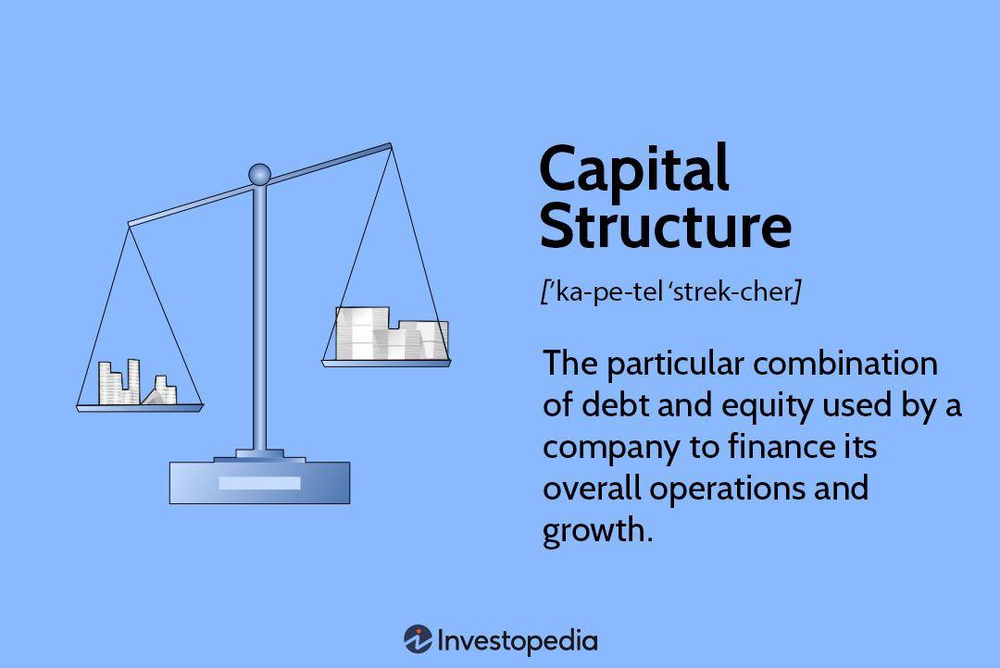

## Table of Contents

## What is capital structure?

Capital structure refers to the way a company finances its operations and growth by using different sources of funds. These sources mainly include debt and equity. Debt means borrowing money, often from banks or by issuing bonds, which the company must pay back with interest. Equity, on the other hand, involves selling shares of the company to investors, who then become part owners. The mix of debt and equity a company chooses is crucial because it affects the company's risk, cost of capital, and overall financial health.

A company's capital structure can significantly impact its profitability and stability. If a company uses more debt, it might have to pay higher interest, which can increase its risk, especially if it struggles to make those payments. However, debt can also be cheaper than equity because interest payments are tax-deductible. On the flip side, using more equity can dilute the ownership of existing shareholders but might make the company more stable since there's less pressure from debt repayments. Finding the right balance is key, and it depends on the company's goals, industry, and economic conditions.

## What are the main components of capital structure?

The main components of capital structure are debt and equity. Debt is money that a company borrows and has to pay back with interest. This can come from loans from banks or by issuing bonds. Equity is money that comes from selling shares of the company to investors. When people buy shares, they become part owners of the company.

These two components are important because they affect how a company grows and manages its money. Using more debt can be risky because the company has to make regular interest payments. If it can't, it might get into trouble. But debt can also be cheaper than equity because the interest paid on debt can reduce the company's taxes. On the other hand, using more equity means sharing ownership and profits with more people, but it can make the company more stable since there's less debt to worry about. Balancing debt and equity is key to a healthy capital structure.

## Why is capital structure important for a business?

Capital structure is important for a business because it helps decide how to pay for the company's growth and operations. It's all about choosing between using debt, like loans or bonds, and equity, like selling shares to investors. This choice affects how much money the company has to spend on interest and how much control the original owners keep. A good balance can help a business grow without taking too much risk.

If a company uses a lot of debt, it might have to pay high interest, which can be risky if the business doesn't make enough money to cover those payments. But debt can also be cheaper than equity because the interest paid on debt can lower the company's taxes. On the other hand, using more equity means sharing the company with more people, which can dilute the control of existing owners. But it can make the company more stable because there's less pressure from debt payments. Finding the right mix of debt and equity is crucial for a business to be successful and stable over time.

## What are the different types of capital structure?

There are different types of capital structure that a company can use, mainly depending on how much debt and equity they choose to use. One type is a conservative capital structure, where the company uses more equity than debt. This means they rely more on selling shares to investors. This can make the company more stable because they have less debt to pay back, but it might mean sharing more profits with shareholders.

Another type is an aggressive capital structure, where the company uses more debt than equity. This means they borrow a lot of money, maybe from banks or by issuing bonds. This can be risky because they have to make regular interest payments, but it can also help the company grow faster if they can manage the debt well.

A third type is a balanced capital structure, where the company tries to use a mix of debt and equity. They aim to find a good balance that helps the company grow without taking on too much risk. This type of structure can be flexible and can change as the company's needs and the economic situation change.

## How does debt financing differ from equity financing?

Debt financing means a company borrows money that it has to pay back with interest. This can come from loans from banks or by selling bonds to investors. The company has to make regular payments on the debt, which can be risky if it doesn't make enough money. But debt can also be cheaper than equity because the interest paid on debt can reduce the company's taxes. When a company uses debt, it doesn't have to give up any ownership, so the original owners keep control of the business.

Equity financing means a company sells shares to investors, who then become part owners of the company. The money from selling shares doesn't have to be paid back, and there are no interest payments. But the company has to share its profits with the new shareholders, which can mean less money for the original owners. Using equity can make the company more stable because there's less pressure from debt payments, but it also means sharing control with more people.

Choosing between debt and equity financing depends on what the company needs and how much risk it's willing to take. Debt can help a company grow quickly if it can manage the payments, but it's risky if things go wrong. Equity can make the company more stable but means sharing ownership and profits. Finding the right mix is important for a company's success.

## What is the optimal capital structure and how is it determined?

The optimal capital structure is the best mix of debt and equity that a company can use to keep its cost of capital as low as possible while also keeping the risk of financial trouble low. It's like finding the perfect balance that helps the company grow and stay stable. The right mix can be different for every company because it depends on things like how much money the company makes, what industry it's in, and what's happening in the economy.

To find the optimal capital structure, companies look at a few important things. They think about how much it costs to use debt and equity. Debt can be cheaper because the interest paid on it can lower the company's taxes, but too much debt can be risky if the company can't pay it back. They also look at how much risk they're willing to take and how much control they want to keep. Companies might use fancy math and models to help them decide, but in the end, it's about finding a balance that works for their specific situation.

## Can you explain the trade-off theory of capital structure?

The trade-off theory of capital structure is a way to think about how companies decide how much debt and equity to use. It says that companies try to balance the good and bad things about using debt. Debt can be good because it's cheaper than equity, and the interest paid on it can lower the company's taxes. But debt can also be bad because it's risky. If a company can't pay back the debt, it might get into big trouble. So, companies try to find the right amount of debt that gives them the benefits without too much risk.

To figure out the best balance, companies look at how much they can save on taxes by using debt and how much risk they're willing to take. If a company uses a lot of debt, it might save a lot on taxes, but it also faces a higher chance of not being able to pay it back. On the other hand, using less debt means less risk but also fewer tax savings. The trade-off theory helps companies decide where to draw the line, aiming to keep the cost of capital as low as possible while staying safe from financial trouble.

## How does the pecking order theory influence capital structure decisions?

The pecking order theory says that companies prefer to use their own money first, like profits they've saved up, before they borrow money or sell shares. This is because using their own money is the cheapest and easiest way to get funds. If they need more money after using their own, they'll usually borrow from banks or issue bonds next. Only if they really need to, they'll sell shares to investors. This order makes sense because borrowing money is often cheaper than selling shares, but it still costs more than using their own money.

This theory influences how companies decide their capital structure because it makes them think about where their money is coming from. Instead of trying to find the perfect mix of debt and equity right away, they focus on using the cheapest and least risky options first. So, a company might end up with more debt or equity just because of the order they follow to get money, not because they planned it that way. This can change how much debt and equity a company uses over time, depending on how much money they have saved up and how much they need to grow.

## What role does the cost of capital play in determining capital structure?

The cost of capital is super important when a company decides how to mix debt and equity in its capital structure. It's like the price a company has to pay for the money it uses to grow and run its business. The cost of capital helps the company figure out if using more debt or more equity is cheaper. Debt can be cheaper because the interest paid on it can lower the company's taxes. But too much debt can be risky because the company has to make regular payments, and if it can't, it might get into trouble. On the other hand, equity doesn't have to be paid back, but it can be more expensive because the company has to share its profits with shareholders.

When a company looks at its cost of capital, it tries to find the best mix of debt and equity that keeps this cost as low as possible while also keeping the business safe. If the cost of capital is low, the company can grow more easily because it's cheaper to get the money it needs. But if the cost of capital is high, it can be harder to grow because the money is more expensive. So, the company has to think carefully about how much debt and equity to use to keep the cost of capital down and the business stable.

## How do market conditions affect a company's capital structure choices?

Market conditions play a big role in how a company decides to mix debt and equity in its capital structure. When the economy is doing well, companies might find it easier to borrow money because banks and investors are more willing to lend. Interest rates might be lower too, making debt cheaper. In good times, a company might decide to use more debt to grow faster because it feels safer and the cost of borrowing is low. On the other hand, if the economy is struggling, banks might be more careful about lending, and interest rates could be higher. This makes debt more expensive and riskier, so a company might choose to use more equity instead, even though it means sharing more profits with shareholders.

Another thing to think about is what's happening in the stock market. When stock prices are high, selling shares can be a good way to raise money because investors are eager to buy. This might make a company lean towards using more equity. But if the stock market is down, selling shares might not bring in as much money, and the company might look more at debt. Also, if everyone is worried about the economy, a company might want to be more conservative and use less debt to stay safe. So, market conditions can push a company to change its capital structure, trying to find the best way to grow and stay stable no matter what's happening around it.

## What are some real-world examples of different capital structures in major companies?

Apple is a good example of a company with a conservative capital structure. They have a lot of cash and don't use much debt. In 2023, Apple had about $62 billion in debt, but they also had over $165 billion in cash. This means they can pay off their debt easily if they need to. Apple chooses to use more equity than debt, which makes them stable and less risky. They can still grow and do big things like buying back their own shares or paying dividends to shareholders without worrying too much about debt payments.

On the other hand, companies like AT&T have a more aggressive capital structure. They use a lot of debt to grow their business. In 2023, AT&T had around $136 billion in debt. They use this debt to buy other companies or invest in new technology. This can be risky because they have to make big interest payments, but it also helps them grow fast. If everything goes well, they can make a lot of money, but if things go wrong, the high debt can cause problems.

Another example is Amazon, which has a more balanced capital structure. They use a mix of debt and equity. In 2023, Amazon had about $59 billion in debt, but they also have a lot of equity from selling shares. This mix helps them grow without taking too much risk. They can borrow money when it's cheap and sell shares when the stock market is doing well. This flexibility helps Amazon stay stable while still growing their business in different ways.

## How can changes in tax laws impact a company's capital structure strategy?

Changes in tax laws can really change how a company thinks about its capital structure. If the government makes it easier to save on taxes by using debt, like by letting companies deduct more interest from their taxes, then companies might decide to use more debt. This is because debt becomes cheaper, and they can save more money on taxes. On the other hand, if the government makes it harder to save on taxes with debt, like by limiting how much interest can be deducted, then companies might use less debt. They might choose to use more equity instead, even though it means sharing more profits with shareholders.

For example, if a new tax law comes out that says companies can't deduct as much interest as before, a company like AT&T, which uses a lot of debt, might need to rethink its strategy. They might have to pay more in taxes, so using debt becomes more expensive. This could make them decide to use less debt and more equity to keep their costs down. On the flip side, if a company like Apple, which uses less debt, sees a tax law that makes debt cheaper, they might decide to use a bit more debt to take advantage of the tax savings. So, tax laws can push companies to change how they mix debt and equity to stay smart about their money.

## What are the key aspects of exploring capital structure?

Capital structure refers to the mix of financing sources that a company employs to fund its operations and growth. This mix typically includes debt and equity, each with distinct characteristics, costs, and implications for a firm's overall financial health. Achieving an optimal capital structure is crucial as it can significantly affect a company's market value and financial performance.

The concept of an ideal capital structure revolves around balancing the cost of capital and risk. Debt financing usually comes with lower costs compared to equity due to tax deductibility of interest payments, making it an attractive option for many firms. However, excessive reliance on debt can increase financial risk, potentially leading to financial distress. Conversely, equity financing, while expensive due to dividend expectations and dilution of ownership, offers more financial flexibility and less risk of default.

Several theories guide companies in making financing decisions. The debt-to-equity ratio, a fundamental metric, is used to evaluate the balance of debt and equity. It is defined as:

$$
\text{Debt-to-Equity Ratio} = \frac{\text{Total Debt}}{\text{Total Equity}}
$$

A higher ratio indicates more debt, thus higher financial leverage. However, a reasonable level of leverage can enhance returns on equity during favorable market conditions.

The trade-off theory suggests that companies strive to balance the tax advantages of debt financing with the potential costs of financial distress. According to this theory, there is an optimal point where the marginal benefit of debt equals the marginal cost. Firms aim to position themselves at this juncture to maximize their value.

The pecking order theory provides a different perspective, emphasizing that companies have a preferred hierarchy of financing options. This theory posits that firms prefer internal financing first, debt second, and issuing new equity as a last resort. This preference arises from asymmetric information and the desire to avoid the costs associated with new equity issues.

Understanding the implications of different capital structures is vital for maintaining a firm's financial flexibility and competitive advantage. A well-structured balance of debt and equity can provide organizations with the agility needed to respond to market changes, financing opportunities, and growth initiatives. As market conditions evolve, revisiting and adjusting capital structure strategies remains a key consideration for sustaining corporate financial health.

## References & Further Reading

[1]: ["Corporate Finance"](https://www.investopedia.com/terms/c/corporatefinance.asp) by Stephen A. Ross, Randolph W. Westerfield, and Jeffrey Jaffe

[2]: Modigliani, F., & Miller, M. H. (1958). [“The Cost of Capital, Corporation Finance and the Theory of Investment.”](https://www.jstor.org/stable/1812919) The American Economic Review, 48(3), 261-297.

[3]: ["Principles of Corporate Finance"](https://en.wikipedia.org/wiki/Principles_of_Corporate_Finance) by Richard A. Brealey, Stewart C. Myers, and Franklin Allen

[4]: ["Advances in Financial Machine Learning"](https://www.amazon.com/Advances-Financial-Machine-Learning-Marcos/dp/1119482089) by Marcos Lopez de Prado

[5]: ["Evidence-Based Technical Analysis: Applying the Scientific Method and Statistical Inference to Trading Signals"](https://www.amazon.com/Evidence-Based-Technical-Analysis-Scientific-Statistical/dp/0470008741) by David Aronson

[6]: ["Quantitative Trading: How to Build Your Own Algorithmic Trading Business"](https://www.amazon.com/Quantitative-Trading-Build-Algorithmic-Business/dp/1119800064) by Ernest P. Chan