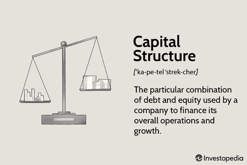

In the contemporary world of finance, the intersection of corporate finance, financial strategy, capital structure, and algorithmic trading forms a pivotal framework for businesses aiming to achieve sustainable growth. These elements are deeply interconnected, each playing a crucial role in determining a firm's financial health and strategic direction. Corporate finance serves as the backbone, focusing on managing a company's financial activities and resources efficiently. Financial strategy aligns this framework with a firm's broader business goals, ensuring that resource allocation and investment decisions support the achievement of these objectives.

Capital structure, which involves the mix of debt and equity a company uses to finance its operations, directly influences a firm's risk profile and cost of capital. An optimal capital structure balances these elements, affecting not only financial performance but also the firm's ability to remain competitive in dynamic markets. A well-considered capital structure is essential for supporting algorithmic trading approaches, which rely on advanced technologies and substantial investments in infrastructure. 



Algorithmic trading, an increasingly integral component of modern finance, leverages computer algorithms to optimize trading strategies, enhancing market efficiency and reducing costs. The interplay between capital structure and algorithmic trading highlights the necessity for firms to maintain strategic agility and robust financial frameworks. This article aims to explore these intricate relationships, offering insights into how businesses can harness these components to optimize their operations and achieve long-term growth. By understanding the significance of each element, organizations can better equip themselves to navigate the complexities of today's financial landscape and secure a competitive edge.

## Table of Contents

## Understanding Corporate Finance and Financial Strategy

Corporate finance involves the strategic management of an organization's financial activities, focusing on investment decisions, capital structuring, and funding to effectively achieve corporate goals. The underlying objective is to maximize shareholder value through both long-term and short-term financial planning and various strategic implementations. This dual approach helps businesses align their financial structures with operational goals and prevailing market conditions.

Financial strategy plays a critical role by ensuring that financial decisions support the organization's broader objectives. An effective financial strategy is characterized by its ability to balance risk and profitability while optimizing the allocation of resources. This balance helps maintain the financial health of the organization. Key components of a sound financial strategy include capital budgeting, financial forecasting, and risk management practices.

Capital budgeting involves the evaluation and selection of investment projects that are expected to generate value over time. The decision-making process often employs techniques such as Net Present Value (NPV) and Internal Rate of Return (IRR) to assess project viability. These methodologies serve to identify projects that are likely to contribute positively to the company's economic future.

Financial forecasting pertains to the estimation of future financial outcomes based on historical data and current market conditions. It provides insight into potential financial scenarios, assisting executives in making informed decisions about capital investments, resource allocation, and other strategic initiatives. Accurate financial forecasts are essential for maintaining [liquidity](/wiki/liquidity-risk-premium), planning capital expenditures, and securing future funding.

Risk management is integral to a comprehensive financial strategy. It involves identifying, assessing, and prioritizing risks followed by the application of resources to mitigate, monitor, and control the probability or impact of adverse events. Effective risk management practices can safeguard a company’s assets and ensure stable financial performance.

Through the integration of these components, businesses are better equipped to navigate financial complexities and enhance their strategic positioning. The robustness of a financial strategy is often reflected in the firm's ability to adapt to changing market conditions while meeting its financial commitments and goals.

## Exploring Capital Structure

Capital structure refers to the mix of financing sources that a company employs to fund its operations and growth. This mix typically includes debt and equity, each with distinct characteristics, costs, and implications for a firm's overall financial health. Achieving an optimal capital structure is crucial as it can significantly affect a company's market value and financial performance.

The concept of an ideal capital structure revolves around balancing the cost of capital and risk. Debt financing usually comes with lower costs compared to equity due to tax deductibility of interest payments, making it an attractive option for many firms. However, excessive reliance on debt can increase financial risk, potentially leading to financial distress. Conversely, equity financing, while expensive due to dividend expectations and dilution of ownership, offers more financial flexibility and less risk of default.

Several theories guide companies in making financing decisions. The debt-to-equity ratio, a fundamental metric, is used to evaluate the balance of debt and equity. It is defined as:

$$
\text{Debt-to-Equity Ratio} = \frac{\text{Total Debt}}{\text{Total Equity}}
$$

A higher ratio indicates more debt, thus higher financial leverage. However, a reasonable level of leverage can enhance returns on equity during favorable market conditions.

The trade-off theory suggests that companies strive to balance the tax advantages of debt financing with the potential costs of financial distress. According to this theory, there is an optimal point where the marginal benefit of debt equals the marginal cost. Firms aim to position themselves at this juncture to maximize their value.

The pecking order theory provides a different perspective, emphasizing that companies have a preferred hierarchy of financing options. This theory posits that firms prefer internal financing first, debt second, and issuing new equity as a last resort. This preference arises from asymmetric information and the desire to avoid the costs associated with new equity issues.

Understanding the implications of different capital structures is vital for maintaining a firm's financial flexibility and competitive advantage. A well-structured balance of debt and equity can provide organizations with the agility needed to respond to market changes, financing opportunities, and growth initiatives. As market conditions evolve, revisiting and adjusting capital structure strategies remains a key consideration for sustaining corporate financial health.

## Algorithmic Trading: An Overview

Algorithmic trading, often referred to as algo-trading, employs computer algorithms to automate and enhance trading activities. This technological method of executing trades capitalizes on speed and precision unattainable by human traders alone, allowing for more efficient market participation. The primary objective is to leverage algorithms to analyze extensive datasets in real-time, identifying profitable trading opportunities based on predefined criteria and strategic models.

The advancement of [algorithmic trading](/wiki/algorithmic-trading) has notably transformed financial markets by increasing market efficiency and substantially reducing transaction costs. By automating the trading process, these algorithms minimize the likelihood of human error and enable market participants to execute orders at optimal prices without the need for constant manual oversight.

A typical algorithm used in trading might involve statistical models or advanced [machine learning](/wiki/machine-learning) techniques to forecast price movements and determine the best time to buy or sell. For instance, a simple moving average crossover strategy might monitor the short-term and long-term moving averages of a stock price, executing a buy order when the short-term average crosses above the long-term average, indicating a potential upward trend.

```python
# Example of a simple moving average crossover algorithm in Python

def moving_average(data, window_size):
    """
    Calculate the moving average for a given dataset and window size.
    """
    return data.rolling(window=window_size).mean()

def crossover_strategy(prices, short_window, long_window):
    # Calculate the short and long moving averages
    prices['Short_MA'] = moving_average(prices['Close'], short_window)
    prices['Long_MA'] = moving_average(prices['Close'], long_window)

    # Determine when the short MA crosses the long MA
    prices['Signal'] = 0
    prices['Signal'][short_window:] = np.where(
        prices['Short_MA'][short_window:] > prices['Long_MA'][short_window:], 1, 0
    )
    prices['Position'] = prices['Signal'].diff()

    return prices
```

The growth of high-frequency trading ([HFT](/wiki/high-frequency-trading-strategies)), a subset of algorithmic trading, is a clear demonstration of how algorithms favorably impact the markets. High-frequency trading involves executing a large number of orders at extremely fast speeds, often within fractions of a second. This approach not only provides liquidity to the markets but also enhances price discovery, contributing to market stabilization.

To effectively integrate algorithmic trading systems, firms must understand the underlying operational mechanics of these algorithms. This knowledge ensures improved strategic implementation and helps maintain a competitive edge in the financial marketplace. Companies that successfully adopt algorithmic trading can benefit from enhanced liquidity management, superior risk management, and improved returns on investment.

Hence, algorithmic trading remains a pivotal element in modern financial strategies, offering significant benefits in terms of efficiency, cost effectiveness, and adaptability in rapidly changing market environments.

## The Intersection of Capital Structure and Algorithmic Trading

Capital structure decisions significantly influence a firm's engagement with algorithmic trading, as they dictate the risk profile and financial resilience required for such technologically intensive operations. Algorithmic trading, particularly high-frequency trading (HFT), demands substantial investment in sophisticated technological infrastructure. Efficiently balancing debt and equity is therefore critical to ensure that a firm can support these capital-intensive requirements without compromising its financial stability.

An optimized balance between debt and equity financing can provide the necessary funds for acquiring state-of-the-art trading systems while maintaining the firm's financial health. A higher equity ratio generally denotes a more robust financial position, reducing default risk and enhancing a firm’s ability to withstand market volatilities—a crucial consideration for firms leveraging algorithmic trading. However, too much equity might dilute control and returns for existing shareholders, thus necessitating careful strategic planning.

Cost-effective capital structuring is instrumental in harnessing the advantages of algorithmic trading, such as increased liquidity and improved market conditions. The reduction of transaction costs and enhanced execution speeds offered by algorithmic trading can enhance profitability, but optimizing these benefits requires a well-thought-out financial strategy. For instance, a lower cost of capital can be achieved by strategically managing the debt-to-equity ratio, which, according to the trade-off theory, involves balancing the tax benefits of debt against bankruptcy costs.

The pecking order theory, which suggests firms prefer internal financing and debt over new equity issuance, also plays a role in shaping capital structure decisions in relation to trading strategies. Firms may rely on retained earnings for funding algorithmic trading infrastructure, minimizing the risk associated with high debt levels while maintaining control over funding sources.

To effectively employ algorithmic trading, companies must assess how their capital structure influences liquidity, execution speed, and risk management capabilities. A flexible capital structure not only accommodates the dynamic nature of algorithmic trading but also enhances organizational agility, enabling firms to adapt swiftly to evolving market conditions and technological advancements. This requires continuous evaluation and alignment of financing decisions with strategic trading objectives to sustain competitive advantages in a fast-paced financial environment.

## Case Studies and Real-World Examples

Analyzing the approach of pioneering firms like Renaissance Technologies and Goldman Sachs offers valuable insights into how a balanced capital structure can effectively support algorithmic trading. Renaissance Technologies, for instance, is renowned for its Medallion Fund, which leverages complex mathematical models and sophisticated algorithms to execute trades. The firm maintains a strategic balance between leveraging debt and using equity, ensuring capital efficiency while minimizing risk exposure. This approach not only optimizes their financial structure but also supports the extensive technological infrastructure necessary for high-frequency trading operations.

Goldman Sachs presents another compelling example, having been one of the early adopters of technology-driven trading strategies. The firm employs algorithmic trading systems across multiple asset classes, benefiting from enhanced speed and precision of trade execution. Goldman's ability to integrate these systems is, in part, due to its attentive capital structure management, which focuses on maintaining liquidity and a lower cost of capital through a judicious mix of debt and equity.

Challenges faced by other companies highlight the critical nature of a well-balanced capital structure. For example, firms that over-leverage may encounter increased financial instability, impacting their ability to invest in the technological advancements necessary for successful algorithmic trading. Similarly, under-utilization of debt might lead to a higher cost of equity and less financial flexibility, constraining their competitive edge.

Practical insights from these examples underscore the necessity of aligning financial strategies with technological investments. Ensuring adequate funding through optimized capital structure not only supports the advantages of algorithmic trading, such as improved market liquidity and reduced transaction costs, but also fortifies firms against the [volatility](/wiki/volatility-trading-strategies) and rapid changes in modern financial markets.

## Conclusion

The interplay between corporate finance, financial strategy, capital structure, and algorithmic trading is crucial in today's dynamic financial landscape. An integrated understanding of these elements allows firms to optimize their financial frameworks, enhancing both operational efficiency and competitive edge in the marketplace. As businesses navigate the complexities of modern finance, they must focus on the alignment and continual adaptation of these core components to secure sustainable growth over the long term.

The ever-evolving financial environment demands that companies not only adopt innovative strategies but also ensure these strategies are underpinned by robust financial management processes. This synergy allows organizations to remain agile, responsive, and resilient in the face of changing market conditions and emerging technologies. By maintaining a strategic focus on the core components of corporate finance and algorithmic trading, firms can capitalize on new opportunities while mitigating associated risks.

In conclusion, the sophisticated interaction between these financial elements underscores the importance of a proactive and well-coordinated approach. It ensures that businesses are well-positioned to harness the benefits of technology-driven trading systems alongside effective financial strategies. As the financial landscape continues to evolve, the ability to integrate innovation with sound financial practices will be a key determinant of success for modern enterprises.

## References & Further Reading

[1]: ["Corporate Finance"](https://www.investopedia.com/terms/c/corporatefinance.asp) by Stephen A. Ross, Randolph W. Westerfield, and Jeffrey Jaffe

[2]: Modigliani, F., & Miller, M. H. (1958). [“The Cost of Capital, Corporation Finance and the Theory of Investment.”](https://www.jstor.org/stable/1812919) The American Economic Review, 48(3), 261-297.

[3]: ["Principles of Corporate Finance"](https://en.wikipedia.org/wiki/Principles_of_Corporate_Finance) by Richard A. Brealey, Stewart C. Myers, and Franklin Allen

[4]: ["Advances in Financial Machine Learning"](https://www.amazon.com/Advances-Financial-Machine-Learning-Marcos/dp/1119482089) by Marcos Lopez de Prado

[5]: ["Evidence-Based Technical Analysis: Applying the Scientific Method and Statistical Inference to Trading Signals"](https://www.amazon.com/Evidence-Based-Technical-Analysis-Scientific-Statistical/dp/0470008741) by David Aronson

[6]: ["Quantitative Trading: How to Build Your Own Algorithmic Trading Business"](https://www.amazon.com/Quantitative-Trading-Build-Algorithmic-Business/dp/1119800064) by Ernest P. Chan