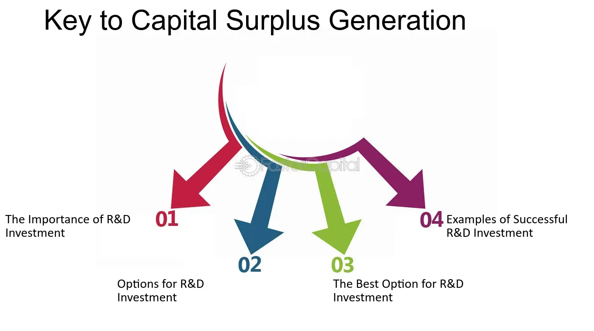

## Table of Contents

## What is capital surplus?

Capital surplus is the extra money a company has after it sells its stocks for more than what they are worth. When a company starts, it might sell its stocks to get money. If people want to buy these stocks and are willing to pay more than the stock's value, the company gets extra money. This extra money is called capital surplus.

This surplus is important because it shows how much extra money the company has that it didn't expect. Companies can use this money to grow their business, buy new things, or save for the future. It's different from other money the company makes because it comes from selling stocks, not from selling products or services.

## How is capital surplus different from retained earnings?

Capital surplus and retained earnings are both important for a company, but they come from different places. Capital surplus is the extra money a company gets when it sells its stocks for more than their value. Imagine you're selling lemonade for $1, but someone pays you $2 because they really want it. The extra $1 you get is like capital surplus. This money is not from selling products or services but from selling parts of the company to investors.

Retained earnings, on the other hand, are the profits a company keeps after it pays out dividends to its shareholders. If a company makes money from selling its products or services, and after paying all its bills and dividends, it still has money left, that's retained earnings. It's like saving the money you earn from your lemonade stand after buying more lemons and paying yourself a little. Retained earnings show how much profit the company has decided to keep and reinvest in the business or save for later.

Both capital surplus and retained earnings help a company grow, but they tell different stories about where the money came from. Capital surplus is about how much extra money the company got from selling its stocks, while retained earnings are about how much profit the company has saved up over time from its regular business activities.

## What are the common sources of capital surplus?

Capital surplus mainly comes from two places. The first is when a company sells its stocks for more than they are worth. Imagine you're selling cookies for $1 each, but someone offers you $2 because they really like your cookies. The extra dollar you get is like capital surplus. Companies do this when they first start selling their stocks or when they issue new stocks later on. If lots of people want to buy the stocks and are willing to pay more than the price, the company gets extra money.

The second source of capital surplus is when a company gets money from things like stock options or warrants. Stock options are like special deals that let employees or others buy the company's stocks at a lower price later on. If the stock's price goes up, and they buy it at the lower price, the difference goes into capital surplus. Warrants are similar; they give the right to buy stocks at a set price in the future. If the stock price is higher when someone uses the warrant, the extra money becomes capital surplus. Both of these ways help the company raise money without directly selling new stocks.

## Can you explain the process of creating capital surplus through stock issuance?

When a company wants to raise money, it can sell its stocks to people who want to invest in it. If the company sets a price for its stocks, but investors are willing to pay more because they think the company will do well, the company gets extra money. This extra money is called capital surplus. For example, if a company sells a stock for $10 but someone pays $12, the extra $2 goes into capital surplus. This often happens when a company first goes public or issues new stocks.

The process starts when the company decides to issue new stocks. They work with investment banks to figure out how many stocks to sell and at what price. If the demand for these stocks is high, the price can go up. When the stocks are sold at a higher price than planned, the difference between the selling price and the stock's value goes straight into capital surplus. This extra money can be used by the company to grow, invest in new projects, or save for future needs.

## How does capital surplus impact a company's financial statements?

Capital surplus shows up on a company's balance sheet, which is like a big list of what the company owns and owes. When a company sells its stocks for more than what they are worth, the extra money goes into an account called "capital surplus" or "additional paid-in capital." This account is part of the shareholders' equity section on the balance sheet. It tells everyone how much extra money the company got from selling its stocks. This can make the company look stronger because it has more money to use for growing or saving.

The capital surplus doesn't affect the income statement directly because it's not money made from selling products or services. The income statement shows how much money the company made or lost over a period of time. But having a big capital surplus can help the company in the long run. It can use this extra money to invest in new projects, buy new things, or save for tough times. This can help the company make more money in the future, which would then show up on the income statement. So, while capital surplus itself doesn't show up on the income statement, it can help the company do better financially over time.

## What role does capital surplus play in a company's overall financial health?

Capital surplus is like extra money that a company gets when it sells its stocks for more than what they are worth. This extra money can make a company look healthier on its balance sheet because it adds to the company's total equity. Think of it like having extra savings in your piggy bank. When a company has a big capital surplus, it shows that investors believe in the company and are willing to pay more for its stocks. This can make the company more attractive to other investors and can help the company get more money in the future if it needs to.

Having a capital surplus also gives a company more options for what to do with its money. The company can use this extra money to grow bigger, maybe by starting new projects or buying new equipment. Or, it can save the money for tough times when it might need extra cash. Even though capital surplus doesn't show up as income on the income statement, it can help the company make more money in the future. This makes the company stronger and more able to handle whatever comes its way.

## How can capital surplus be used by a company?

Capital surplus is like extra money a company gets when it sells its stocks for more than what they are worth. Companies can use this extra money in many ways. One way is to grow bigger. They might use the money to start new projects, buy new equipment, or even buy other companies. This helps the company make more money in the future and become stronger.

Another way to use capital surplus is to save it for tough times. If the company runs into problems, like not selling as many products or having unexpected costs, the saved money can help them get through it. It's like having a safety net. By saving some of the capital surplus, the company can keep going even when things are hard.

Overall, capital surplus gives a company more choices. It can help the company grow or act as a safety net. Either way, it makes the company healthier and better able to handle whatever comes its way.

## What are the tax implications of capital surplus?

When a company gets capital surplus, it usually doesn't have to pay taxes on it right away. Capital surplus comes from selling stocks for more than what they're worth, and this extra money isn't considered income that the company made from selling products or services. So, it's not taxed like regular income. Instead, it sits on the company's balance sheet as part of the shareholders' equity, and it's not taxed until the company does something with it, like giving it back to shareholders as dividends.

If the company decides to use the capital surplus to pay dividends to its shareholders, then the shareholders might have to pay taxes on that money. Dividends are usually taxed as income for the people who get them. But if the company uses the capital surplus to grow the business or invest in new projects, it might not trigger any immediate tax consequences. The tax situation can change depending on what the company does with the money, so it's important for the company to think about the tax rules when deciding how to use its capital surplus.

## How does capital surplus affect shareholders' equity?

Capital surplus is the extra money a company gets when it sells its stocks for more than what they are worth. This extra money goes straight into the shareholders' equity part of the company's balance sheet. Shareholders' equity shows how much of the company actually belongs to the shareholders. When a company has a big capital surplus, it makes the shareholders' equity bigger because it adds more money to what the shareholders own.

Having a bigger shareholders' equity because of capital surplus can make the company look healthier and stronger. It shows that investors believe in the company and are willing to pay more for its stocks. This can make the company more attractive to other investors and can give the company more money to use for growing bigger or saving for tough times. So, capital surplus can really help boost the overall value that belongs to the shareholders.

## What are the regulatory considerations for managing capital surplus?

When a company has a lot of capital surplus, it needs to follow certain rules set by different regulators. These rules can change depending on where the company is and what kind of business it does. For example, in some countries, there are rules about how much money a company can keep as capital surplus and how it can use that money. Companies need to make sure they follow these rules so they don't get into trouble with the government or other regulatory bodies.

One important thing to think about is how the company reports its capital surplus on its financial statements. Regulators want to make sure that companies are honest and clear about their money. This means the company has to show the capital surplus correctly on its balance sheet and explain it in its financial reports. If the company doesn't do this right, it could face fines or other penalties. So, it's really important for companies to manage their capital surplus carefully and follow all the rules.

## How do companies report capital surplus under different accounting standards?

Companies report capital surplus on their balance sheet under different accounting standards, like GAAP (Generally Accepted Accounting Principles) and IFRS (International Financial Reporting Standards). Under GAAP, capital surplus is often called "additional paid-in capital" and is shown in the shareholders' equity section. It represents the extra money a company gets when it sells its stocks for more than their value. When a company issues new stocks and gets more money than the stock's worth, this extra money goes into the capital surplus account. This makes the shareholders' equity bigger, showing that the company has more money from its investors.

Under IFRS, the reporting is similar, but the term used might be "share premium." Just like with GAAP, this account is part of the equity section on the balance sheet. It shows the extra money received from issuing stocks above their nominal value. Both standards want companies to be clear and honest about their capital surplus, so they have to show it correctly on their financial statements. This helps everyone who looks at the company's financials understand how much extra money the company has from selling its stocks.

## What advanced strategies can companies employ to optimize their capital surplus?

Companies can use smart strategies to make the most out of their capital surplus. One way is to reinvest the money into the business. This could mean starting new projects, buying new equipment, or even buying other companies. By doing this, the company can grow bigger and make more money in the future. Another strategy is to use the capital surplus to pay down debts. If the company has loans or other debts, using the extra money to pay them off can save on interest costs and make the company's finances healthier. This can also make the company look better to investors and lenders.

Another advanced strategy is to use the capital surplus for stock buybacks. When a company buys back its own stocks, it can increase the value of the remaining stocks because there are fewer of them. This can make the company's stock price go up, which is good for shareholders. Companies can also use the capital surplus to pay dividends to shareholders. While this doesn't help the company grow directly, it can make shareholders happy and attract more investors. By carefully choosing how to use the capital surplus, companies can improve their financial health and create more value for everyone involved.

## What are some case studies and real-world applications?

### Case Studies and Real-world Applications

The integration of capital surplus with [algorithmic trading](/wiki/algorithmic-trading) has provided numerous companies with opportunities to enhance financial performance and shareholder value. This exploration highlights case studies and applications demonstrating successful utilization of these financial resources and technologies.

One prominent example is Renaissance Technologies, a [hedge fund](/wiki/hedge-fund-trading-strategies) known for its extensive use of algorithmic trading strategies. Renaissance leverages its capital surplus to invest heavily in developing advanced algorithms and managing extensive data sets. This financial capability allows for continual improvement and adaptation of trading strategies, contributing to its impressive historical performance. Renaissance's strategic use of equity capital ensures sufficient resources are allocated towards technological innovation, keeping the firm competitive amidst evolving market conditions.

Another noteworthy case is Goldman Sachs. The firm has been at the forefront of implementing algorithmic trading, utilizing its significant capital surplus to maintain and upgrade its trading infrastructure. This investment in advanced algorithmic systems allows for rapid trade executions and optimizations, directly impacting market efficiency and shareholder value. By effectively channeling surplus funds into technology, Goldman Sachs has reduced transaction costs and improved its trading accuracy, resulting in enhanced financial outcomes.

In the context of real-world applications, quantifying the impact of algorithmic trading on financial performance can be observed through various metrics. Consider the Sharpe Ratio, a measure of risk-adjusted return. By utilizing surplus funds to enhance algorithm performance, companies can optimize their Sharpe Ratio, offering better returns for each level of risk undertaken. Mathematically, this can be represented as:

$$

\text{Sharpe Ratio} = \frac{E(R_i) - R_f}{\sigma_i} 
$$

where $E(R_i)$ is the expected return, $R_f$ is the risk-free rate, and $\sigma_i$ is the standard deviation of the portfolio's excess return. By investing in advanced technology and data analytics, companies can enhance the expected return $E(R_i)$ without proportionally increasing risk $\sigma_i$.

A real-world example of technological advancement in trading strategies is Two Sigma. Known for applying sophisticated [machine learning](/wiki/machine-learning) algorithms to trading, Two Sigma harnesses capital surplus to research and develop proprietary models. These models analyze vast amounts of historical and real-time data to identify profitable trading opportunities efficiently. The ability to consistently update and refine algorithms ensures Two Sigma maintains its edge in the competitive trading environment.

These case studies signify the importance of strategic financial planning in leveraging equity financing and capital surplus. As companies continue to innovate in algorithmic trading, they set benchmarks for achieving remarkable growth, thereby increasing shareholder value and promoting market efficiency. Through these examples, the transformative potential of integrating financial resources with technology in trading becomes evident, paving the way for future advancements.

## References & Further Reading

[1]: Bergstra, J., Bardenet, R., Bengio, Y., & Kégl, B. (2011). ["Algorithms for Hyper-Parameter Optimization."](https://dl.acm.org/doi/10.5555/2986459.2986743) Advances in Neural Information Processing Systems 24.

[2]: ["Advances in Financial Machine Learning"](https://www.amazon.com/Advances-Financial-Machine-Learning-Marcos/dp/1119482089) by Marcos Lopez de Prado

[3]: ["Evidence-Based Technical Analysis: Applying the Scientific Method and Statistical Inference to Trading Signals"](https://www.amazon.com/Evidence-Based-Technical-Analysis-Scientific-Statistical/dp/0470008741) by David Aronson

[4]: ["Machine Learning for Algorithmic Trading"](https://github.com/stefan-jansen/machine-learning-for-trading) by Stefan Jansen

[5]: ["Quantitative Trading: How to Build Your Own Algorithmic Trading Business"](https://www.amazon.com/Quantitative-Trading-Build-Algorithmic-Business/dp/1119800064) by Ernest P. Chan