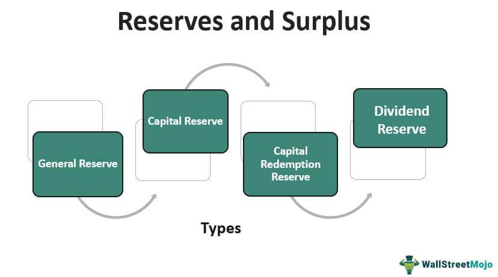

In the intricate world of corporate finance, understanding specific financial terms such as company equity, capital surplus, and their implications is essential. Company equity, often represented by stock ownership, defines a firm's capital structure and allows firms to raise capital without accruing debt. It serves as a pivotal resource for business operations and growth while promising potential dividends and capital gains to investors, albeit with higher risks than debt instruments.

Capital surplus, on the other hand, consists of funds exceeding the nominal value received from stock issuance, sometimes referred to as share premium. This surplus is retained within the equity section of a balance sheet, distinct from revenue, and can be derived from various actions like stock repurchases or revaluation reserves. It affords companies the financial flexibility for strategic investments without leveraging debt.

Adding algorithmic trading to this equation further complicates the landscape. As an automated method utilizing pre-programmed strategies, algo trading has redefined speed and efficiency in trading executions. By leveraging high-frequency trading strategies and advanced analytics, it adapts quickly to market changes, offering unmatched trading precision.

This article seeks to simplify these complex concepts, elucidate their interconnections, and emphasize their significance in present-day financial undertakings and strategic decisions. As industries evolve, the integration of cutting-edge technologies such as algorithmic trading shifts the conventional perceptions of financial tools and strategies. Explore with us the pivotal roles company equity and capital surplus play in algorithmic trading, enhancing financial stability and growth.

## Table of Contents

## Understanding Company Equity

Company equity, a fundamental aspect of a company's capital structure, signifies ownership and is predominantly manifested through stocks. It serves as a crucial mechanism for funding business operations and facilitating expansion without accruing debt, thereby making it an attractive option for many enterprises.

Equity is a form of financing that enhances a company's balance sheet by allowing it to raise essential capital while mitigating the financial burdens associated with debt. Unlike debt financing, which requires periodic interest payments and principal repayment, equity does not impose mandatory financial obligations on the company, providing more flexibility and stability in financial management.

For investors, equity offers the potential for dividends and capital gains, making it an appealing prospect despite the higher risks compared to debt instruments. Dividends represent a share of the company's profits distributed to shareholders, typically on a quarterly basis, whereas capital gains are realized when the stock is sold at a higher price than its purchase price. These potential returns can significantly augment an investor's portfolio, although the value of equity investments is subject to market fluctuations and company performance.

Types of company equity include common stock and preferred stock. Common stockholders have voting rights and may receive dividends, though they are last in line during liquidation after bondholders and preferred shareholders. Preferred stockholders, on the other hand, often do not possess voting rights but are entitled to fixed dividends and have a higher claim on assets than common stockholders in the event of a liquidation. This hierarchy of claims prioritizes the financial interests of various stakeholders in different scenarios.

Valuation of company equity is an essential consideration for both companies and investors, encompassing methods such as the discounted cash flow (DCF) model, price-to-earnings (P/E) ratio, and book value analysis. The DCF model involves estimating the present value of expected future cash flows, offering a comprehensive view of a company's intrinsic value. P/E ratio, calculated by dividing the stock's current market price by its earnings per share (EPS), provides insights into the relative value of stocks within an industry. Book value, which accounts for the net asset value of a company, offers another perspective on valuation by examining the accounting value of equity.

For companies, equity financing can be vital in fostering innovation, driving growth, and enhancing competitive positioning. It serves as a tool for structuring strategic acquisitions, supporting research and development initiatives, and facilitating international market expansions. By tapping into equity markets, companies can transcend immediate financial constraints and lay the groundwork for long-term success.

In summary, company equity not only underpins the financial framework of an enterprise but also attracts investors with its promise of returns. Its valuation and strategic utilization are pivotal in fostering robust financial health and driving sustainable growth, rendering it significant for companies and investors alike.

## Explaining Capital Surplus

Capital surplus, often referred to as share premium, arises when investors pay more for a company's shares than their nominal value at the time of issuance. This financial buffer is distinct from revenue and is recorded separately on the balance sheet under shareholders' equity. 

The generation of capital surplus can occur through several avenues. Primarily, it results from issuing shares at a higher price than their nominal value. For example, if a company issues shares with a nominal value of $1 each for $5, the excess $4 per share is recorded as capital surplus. Additionally, capital surplus can be augmented through the revaluation of fixed assets, where an increase in asset value is recognized without a corresponding sale. Another method involves stock repurchase, where a company buys back its own shares, sometimes utilizing the differential between book value and repurchase price to reflect it in the capital surplus.

Capital surplus serves several strategic purposes. It acts as a financial cushion, allowing companies to invest in growth opportunities or technological innovations without incurring debt. This flexibility can be crucial for maintaining financial stability during fluctuating business cycles. Moreover, it enhances a company's balance sheet strength, potentially improving credit ratings and investor perceptions.

The distinction between capital surplus and retained earnings is fundamental. While both are components of shareholders' equity, retained earnings represent accumulated profits not distributed as dividends, essentially profit retained within the company for reinvestment or distribution in the future. In contrast, capital surplus is derived not from operational profits but from transactions directly affecting equity, like the issuance of shares above par value.

Understanding the mechanics of capital surplus and its strategic applications is vital for companies aiming to optimize their financial resources, ensuring a robust platform for sustainable growth and shareholder value enhancement.

## The Role of Algorithmic Trading

Algorithmic trading, commonly referred to as algo trading, revolutionizes the execution of trades through the use of automated, pre-programmed software. This sophisticated method of trading is engineered to capitalize on market opportunities with unprecedented speed and efficiency, far surpassing the capabilities of human traders. By executing trades at high speeds and volumes, [algorithmic trading](/wiki/algorithmic-trading) aims to maximize profits while minimizing market impact and transaction costs.

A core aspect of algorithmic trading is its reliance on high-frequency trading ([HFT](/wiki/high-frequency-trading-strategies)) strategies. HFT employs algorithms to execute a large number of orders in fractions of a second, exploiting even the smallest price discrepancies across multiple markets. These strategies require advanced computing power and low-latency systems, enabling traders to respond instantly to changes in market conditions.

Machine learning is another critical component in the evolution of algorithmic trading. By utilizing vast datasets, [machine learning](/wiki/machine-learning) models can identify complex patterns and trends that are not readily apparent to human analysts. For example, a machine learning algorithm might recognize signals indicating market shifts, allowing traders to preemptively adjust their strategies. Python, a popular programming language in finance, offers libraries such as TensorFlow and PyTorch that facilitate the development of these predictive models.

Algo trading encompasses various strategies, each tailored to specific market conditions and objectives. Trend-following strategies, for instance, analyze historical price data and statistical indicators to predict future price movements, often using [momentum](/wiki/momentum) to guide trading decisions. On the other hand, [arbitrage](/wiki/arbitrage) strategies seek to profit from price discrepancies of the same asset across different markets. These strategies exploit inefficiencies, ensuring prices remain consistent and markets function efficiently.

The transformative impact of algorithmic trading on modern financial markets is evident. By automating the trading process, institutions can reduce human error, increase transaction speed, and improve execution accuracy. Moreover, algorithmic trading contributes to greater market [liquidity](/wiki/liquidity-risk-premium), as the continuous buying and selling of assets smooths market operations. However, the reliance on complex algorithms also raises concerns about market stability, as evidenced by flash crashes where rapid sell-offs are exacerbated by automated responses.

In summary, algorithmic trading is a powerful tool that enhances the efficiency and effectiveness of financial markets. By leveraging cutting-edge technologies like machine learning and HFT, algo trading allows for strategic, data-driven decision-making that shapes the modern financial landscape.

## Intersection of Capital Surplus and Algo Trading

Capital surplus plays a strategic role in algorithmic trading, primarily by affording companies the financial flexibility to invest in sophisticated trading technologies and infrastructures. This surplus, arising from the excess amount paid by investors over the nominal value of shares, is not considered operational revenue but forms part of shareholders' equity. With this additional financial buffer, firms are well-positioned to make substantial investments in developing or acquiring advanced algorithmic systems, essential for gaining a competitive edge in high-frequency trading environments.

Algorithmic trading depends on cutting-edge technology platforms and extensive data analysis capabilities, both of which require significant investment. Companies with a healthy capital surplus are better equipped to fund the acquisition of these technologies without incurring additional debt. This investment empowers them to develop proprietary trading algorithms or buy existing ones from specialized technology providers. Consequently, these companies can execute trades with unprecedented speed and accuracy, optimizing their trading strategies and enhancing profitability.

An example of how capital surplus can be leveraged in algorithmic trading is through the application of machine learning (ML) and [artificial intelligence](/wiki/ai-artificial-intelligence) (AI). These technologies require considerable computational power and sophisticated software, which are capital-intensive. Companies with ample capital surplus can channel resources into building and maintaining the necessary computational infrastructure, ensuring seamless integration of AI and ML into their trading strategies. This technological capability can lead to enhanced predictive analytics, allowing firms to anticipate market movements and respond rapidly to evolving market conditions.

Moreover, algorithmic trading offers a way for companies to make efficient use of their excess capital, improving both financial stability and profitability. Automated trading systems can handle high volumes of trades simultaneously, capturing minor price discrepancies across markets. This not only generates profits but also ensures liquidity, a critical [factor](/wiki/factor-investing) in maintaining a stable financial environment. Companies can utilize their capital surplus to back algorithms that statistically arbitrage these differences, thereby reinforcing their market position and financial robustness.

In conclusion, capital surplus, by enabling substantial investment in technology and infrastructure, provides a pathway for companies to harness the full potential of algorithmic trading. This symbiotic relationship allows firms to strategically deploy their excess capital, optimizing trading operations for enhanced stability and profitability and creating a stronger foothold in competitive financial markets.

## Case Studies and Real-world Applications

### Case Studies and Real-world Applications

The integration of capital surplus with algorithmic trading has provided numerous companies with opportunities to enhance financial performance and shareholder value. This exploration highlights case studies and applications demonstrating successful utilization of these financial resources and technologies.

One prominent example is Renaissance Technologies, a [hedge fund](/wiki/hedge-fund-trading-strategies) known for its extensive use of algorithmic trading strategies. Renaissance leverages its capital surplus to invest heavily in developing advanced algorithms and managing extensive data sets. This financial capability allows for continual improvement and adaptation of trading strategies, contributing to its impressive historical performance. Renaissance's strategic use of equity capital ensures sufficient resources are allocated towards technological innovation, keeping the firm competitive amidst evolving market conditions.

Another noteworthy case is Goldman Sachs. The firm has been at the forefront of implementing algorithmic trading, utilizing its significant capital surplus to maintain and upgrade its trading infrastructure. This investment in advanced algorithmic systems allows for rapid trade executions and optimizations, directly impacting market efficiency and shareholder value. By effectively channeling surplus funds into technology, Goldman Sachs has reduced transaction costs and improved its trading accuracy, resulting in enhanced financial outcomes.

In the context of real-world applications, quantifying the impact of algorithmic trading on financial performance can be observed through various metrics. Consider the Sharpe Ratio, a measure of risk-adjusted return. By utilizing surplus funds to enhance algorithm performance, companies can optimize their Sharpe Ratio, offering better returns for each level of risk undertaken. Mathematically, this can be represented as:

$$

\text{Sharpe Ratio} = \frac{E(R_i) - R_f}{\sigma_i} 
$$

where $E(R_i)$ is the expected return, $R_f$ is the risk-free rate, and $\sigma_i$ is the standard deviation of the portfolio's excess return. By investing in advanced technology and data analytics, companies can enhance the expected return $E(R_i)$ without proportionally increasing risk $\sigma_i$.

A real-world example of technological advancement in trading strategies is Two Sigma. Known for applying sophisticated machine learning algorithms to trading, Two Sigma harnesses capital surplus to research and develop proprietary models. These models analyze vast amounts of historical and real-time data to identify profitable trading opportunities efficiently. The ability to consistently update and refine algorithms ensures Two Sigma maintains its edge in the competitive trading environment.

These case studies signify the importance of strategic financial planning in leveraging equity financing and capital surplus. As companies continue to innovate in algorithmic trading, they set benchmarks for achieving remarkable growth, thereby increasing shareholder value and promoting market efficiency. Through these examples, the transformative potential of integrating financial resources with technology in trading becomes evident, paving the way for future advancements.

## Prospects and Challenges

Algorithmic trading continues to revolutionize the dynamics of financial markets by offering unprecedented speed and efficiency in executing trades. However, its widespread adoption presents several challenges that companies must strategically manage, often utilizing capital surplus as a critical resource.

One of the primary challenges associated with algo trading is market impact. High-frequency trades, executed based on complex algorithms, can significantly influence market prices and lead to increased [volatility](/wiki/volatility-trading-strategies). The algorithms' rapid response to market data can exacerbate price swings, challenging market stability. To mitigate these effects, companies might have to design algorithms with measures such as trade size limitations and staggered execution, although these introduce complexity to the trading strategies.

Infrastructure costs pose another significant hurdle. Algo trading requires robust technological frameworks that include powerful data servers, low-latency networks, and state-of-the-art computational hardware. Building and maintaining these infrastructures demand substantial financial investments. Companies with a capital surplus can channel these resources into developing advanced systems that ensure competitiveness in the high-speed trading arena. By allocating excess capital to technological upgrades, firms can bolster their trading capabilities and secure longevity in this fast-evolving domain.

Technical failures are an inherent risk in algorithmic systems, with software glitches and network lags potentially leading to significant financial losses. Developing resilient systems that can rapidly recover from failures and implementing stringent testing protocols prior to deployment are vital steps in risk management. Investing in machine learning models that adapt and learn from past trading data can enhance the reliability and accuracy of these algorithms.

The future prospects of integrating equity capital with algorithmic trading are exciting yet complex. The advent of artificial intelligence and quantum computing promises to push the boundaries of algorithmic capabilities, potentially leading to the next leap in trading strategy innovation. Innovations such as predictive analytics and sentiment analysis are emerging, offering new ways to forecast market movement and optimize trades.

However, these advancements must be navigated carefully. As algorithms become more sophisticated, regulatory scrutiny is expected to increase. Companies must ensure compliance with evolving legal standards while retrospectively analyzing the ethical implications of automated trading decisions.

In summary, while algorithmic trading offers transformative potential for financial markets, firms must strategically address the associated challenges by leveraging their capital surplus. This approach not only helps in maintaining competitive advantage but also contributes to market efficiency and sustainability.

## Conclusion

As financial markets continue to evolve, the integration of company equity, capital surplus, and algorithmic trading has become a crucial aspect of modern finance. The strategic management of these components is essential for businesses aiming to achieve sustainable growth and market efficiency. By allocating equity judiciously, companies can fund innovative ventures and expand operations without over-relying on debt, promoting a healthier financial structure. Capital surplus acts as a financial cushion, providing the flexibility to invest in advanced trading systems and algorithms, thereby enhancing competitive advantages.

Algorithmic trading, with its ability to process large datasets and execute trades at unprecedented speeds, can significantly optimize the use of capital surplus and equity. This optimization leads to improved asset liquidity and reduced market friction, fostering a more efficient trading environment. Moreover, by tapping into the potential of these financial elements, companies can more effectively manage risks and maximize returns on investments, ensuring long-term financial stability.

As technology advancements shape the financial landscape, understanding the synergies between equity, capital surplus, and algorithmic trading becomes increasingly important. Companies and investors who navigate these complexities with a strategic mindset are better positioned to capitalize on emerging opportunities and mitigate potential challenges. Ultimately, mastering these financial tools will enable stakeholders to thrive in the dynamic markets of today and the future.

## References & Further Reading

[1]: Bergstra, J., Bardenet, R., Bengio, Y., & Kégl, B. (2011). ["Algorithms for Hyper-Parameter Optimization."](https://dl.acm.org/doi/10.5555/2986459.2986743) Advances in Neural Information Processing Systems 24.

[2]: ["Advances in Financial Machine Learning"](https://www.amazon.com/Advances-Financial-Machine-Learning-Marcos/dp/1119482089) by Marcos Lopez de Prado

[3]: ["Evidence-Based Technical Analysis: Applying the Scientific Method and Statistical Inference to Trading Signals"](https://www.amazon.com/Evidence-Based-Technical-Analysis-Scientific-Statistical/dp/0470008741) by David Aronson

[4]: ["Machine Learning for Algorithmic Trading"](https://github.com/stefan-jansen/machine-learning-for-trading) by Stefan Jansen

[5]: ["Quantitative Trading: How to Build Your Own Algorithmic Trading Business"](https://www.amazon.com/Quantitative-Trading-Build-Algorithmic-Business/dp/1119800064) by Ernest P. Chan