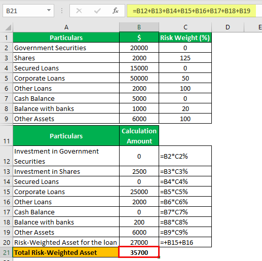

The integration of Excel in the domains of financial analysis and algorithmic trading represents a transformative development in the financial industry. This article focuses on the application of Excel in calculating the Capital-To-Risk Weighted Assets Ratio (CRAR) for banks and explores its utility in algorithmic trading environments.

Understanding the Capital-To-Risk Ratio is essential for evaluating a bank's financial health. This ratio serves as a crucial benchmark for ensuring stability and preventing potential insolvency. By measuring the bank's capital in relation to its risk-weighted assets, the CRAR provides insights into the bank’s ability to absorb financial shocks. Regulatory frameworks, such as the Basel III guidelines, emphasize its importance, highlighting the need for robust capital reserves as a safeguard against market turbulence.



Excel emerges as a powerful tool in computing this ratio, offering functionalities that streamline the complex calculations involved. It enables users to input data regarding Tier 1 and Tier 2 capitals alongside risk-weighted assets, facilitating accurate analyses and comparisons. The precision of such computations is vital for regulatory compliance and financial assessment, making Excel indispensable in modern banking operations.

In addition to its foundational role in banking, the CRAR finds significant applications in algorithmic trading. By leveraging these financial ratios, traders can make informed, data-driven decisions that optimize trading strategies and efficiently assess risk. Through Excel, it is possible to code strategies, analyze backtesting data, and generate real-time trading signals. The integration of dynamic data sources, like Yahoo Finance, into Excel models, allows for continuous monitoring and adaptation to market conditions, thereby enhancing the trading outcomes.

This article will explore the essential topics bridging traditional banking metrics with contemporary trading strategies. As financial systems become increasingly complex, the synergy between conventional metrics and advanced trading methodologies—facilitated by tools like Excel—remains pivotal in navigating the challenges of modern finance.

## Table of Contents

## Understanding the Capital-To-Risk Ratio

The Capital-To-Risk Weighted Assets Ratio, often referred to as the capital adequacy ratio (CAR), is a critical measure of a bank's financial strength and stability. This ratio serves as a buffer to protect depositors and ensure a stable financial system by requiring banks to hold a certain level of capital relative to their risk-weighted assets. A higher CAR indicates that a bank is well-capitalized and capable of absorbing potential losses, thereby reducing the risk of insolvency and promoting trust in the financial sector.

The CAR is calculated using the following formula:

$$
\text{CAR} = \frac{\text{Tier 1 Capital} + \text{Tier 2 Capital}}{\text{Risk-Weighted Assets}}
$$

**Components of the Capital-To-Risk Ratio:**

1. **Tier 1 Capital:**
   Often considered the core capital, Tier 1 capital includes equity capital and disclosed reserves. This form of capital is highly stable and can absorb losses without requiring the bank to cease trading. Examples of Tier 1 capital elements include common stock, retained earnings, and accumulated other comprehensive income.

2. **Tier 2 Capital:**
   Also known as supplementary capital, Tier 2 includes less secure forms of capital that can still provide a buffer against losses. This type of capital encompasses items such as subordinated term debt, hybrid instruments, and revaluation reserves. While less reliable than Tier 1, Tier 2 capital contributes to a bank's overall resilience.

3. **Risk-Weighted Assets (RWA):**
   The denominator in the CAR equation, risk-weighted assets, reflects the riskiness of the bank's assets. Assets are assigned weights based on their risk levels, with riskier assets receiving higher weights. This approach ensures that banks hold capital commensurate with the riskiness of their asset portfolios.

**Role in Capital Adequacy Assessment:**

The function of the CAR is to ascertain whether a bank holds sufficient capital to cover its risk-weighted assets, mitigating risk to depositors and the broader financial system. Regulators utilize the CAR to enforce minimum capital requirements, thereby enhancing banking system stability. Banks with a high CAR demonstrate robustness, which is especially critical during periods of economic uncertainty.

In summary, the Capital-To-Risk Weighted Assets Ratio is indispensable in the banking sector, offering a measure of financial strength that safeguards against market [volatility](/wiki/volatility-trading-strategies) and potential losses.

## Formula and Calculation in Excel

The Capital-To-Risk Weighted Assets Ratio is central to assessing a bank's financial strength. The formula for calculating this ratio is straightforward:

$$
\text{Capital-To-Risk Weighted Assets Ratio} = \frac{\text{Tier 1 Capital} + \text{Tier 2 Capital}}{\text{Risk-Weighted Assets}}
$$

Let's explore how this calculation can be efficiently executed in Excel, allowing for seamless financial analysis and comparison across banking institutions.

### Setting Up Excel for Calculation

1. **Data Input**: Begin by creating a spreadsheet with columns for Tier 1 Capital, Tier 2 Capital, and Risk-Weighted Assets. Ensure each bank you're analyzing has its data in a separate row.

    | Bank Name | Tier 1 Capital ($) | Tier 2 Capital ($) | Risk-Weighted Assets ($) |
    |-----------|---------------------|---------------------|--------------------------|
    | Bank A    | 1,000,000           | 500,000             | 10,000,000               |
    | Bank B    | 2,000,000           | 400,000             | 15,000,000               |

2. **Formula Application**: In the next column, calculate the Capital-To-Risk Weighted Assets Ratio using the formula. Input the following formula in cell D2 (assuming A columns are used for bank names and B, C, and D for the financial figures):

   ```excel
   = (B2 + C2) / D2
   ```

   Drag this formula down to calculate ratios for additional banks.

3. **Comparative Analysis**: To compare the ratios, include a ranking feature. In a new column, use the `RANK` function to organize banks based on their calculated ratios:

   ```excel
   =RANK(E2, $E$2:$E$3, 0)
   ```

   Adjust the range `$E$2:$E$3` accordingly to match your data range, and drag the formula down to apply it to all rows.

### Excel Functions Utilized

- **Basic Arithmetic**: The addition and division within the formula.
- **`RANK` Function**: Useful for quickly assessing which banks maintain more favorable ratios.

### Automating the Process

To enable dynamic calculations based on changing data, ensure your spreadsheet is set for automatic recalculation under the Excel options. This feature is crucial if you are integrating real-time data or regularly updated financial inputs.

By leveraging these Excel techniques, financial analysts can efficiently compute and compare the Capital-To-Risk Weighted Assets Ratios across banks, serving as an essential indicator for making informed decisions regarding financial health and stability assessments.

## Application in Algorithmic Trading

Algorithmic trading utilizes calculated financial ratios to execute trades based on data-driven decisions. A critical aspect of this approach is the ability to integrate various financial data and compute metrics such as the Capital-To-Risk Weighted Assets Ratio (CRAR) in real-time. This becomes achievable using Excel, a versatile tool that support coding strategies, [backtesting](/wiki/backtesting), and signal generation.

Excel's environment enables the coding of [algorithmic trading](/wiki/algorithmic-trading) strategies by leveraging its powerful functionalities combined with external data integration. Traders and analysts can write scripts in Excel using Visual Basic for Applications (VBA) or, more recently, integrate Python through Excel add-ins or standalone tools. This allows for complex analytical models and the automation of trading strategies based on predefined algorithms.

### Coding Strategies and Analyzing Backtesting Data

Backtesting is an essential component of algorithmic trading, as it allows traders to test their strategies against historical data to evaluate performance before actual deployment. Excel provides an environment where traders can utilize historical data to conduct these tests. This involves importing extensive datasets into Excel and using functions to calculate the CRAR. For example, if `Tier1_Capital`, `Tier2_Capital`, and `Risk_Weighted_Assets` are defined in Excel, the formula can be structured as:

$$
\text{CRAR} = \frac{\text{Tier1_Capital} + \text{Tier2_Capital}}{\text{Risk_Weighted_Assets}}
$$

Traders can automate the process of calculating these ratios across different timeframes and validate strategy efficiency by comparing historical performance.

### Real-Time Signal Generation

The real-time signal generation aspect of algorithmic trading can be powered by Excel through integration with live data sources such as Yahoo Finance or other financial data providers. By setting up data feeds that update continuously in Excel, traders can create models that react instantly to market changes. This involves connecting Excel to an API that fetches real-time financial data. Here's a simple example in Python, which shows how live data can be imported into an Excel sheet:

```python
import yfinance as yf  # For more datasets, visit: https://paperswithbacktest.com/datasets
import pandas as pd

# Fetching data for a financial asset
ticker_data = yf.Ticker("AAPL")
live_data = ticker_data.history(period="1d")

# Writing data to Excel
live_data.to_excel("live_data.xlsx")
```

Using this kind of data integration, traders can set up conditional formulas in Excel that generate buy or sell signals based on the CRAR and other indicators. The integration of Excel with real-time data sources enhances trading outcomes by facilitating the automatic execution of trades when certain financial thresholds or conditions are met. This ensures that algorithmic traders can capitalize on transient market opportunities with precision and speed.

### Optimizing Trading Strategies with CRAR

The Capital-To-Risk Ratio is crucial in optimizing trading strategies, as it provides insights into a bank's financial stability and risk exposure. By incorporating this ratio into trading algorithms, traders gain a measure to assess risk efficiently. This can assist in making informed decisions about asset allocation, leverage, and risk management. By ensuring that strategies align with established financial stability metrics like CRAR, traders can minimize potential losses and optimize returns, thereby achieving a balanced trading approach.

In summary, incorporating the Capital-To-Risk Ratio into algorithmic trading strategies using Excel can significantly enhance risk assessment and streamline decision-making processes. With the integration of real-time data coupled with Excel's analytical capabilities, traders are empowered to execute strategies that align with their risk tolerance and market expectations.

## Excel Functions for Financial Analysis

Excel's robust set of functions makes it a powerful tool for financial analysis, particularly in the areas of backtesting and strategy coding in algorithmic trading. Understanding both basic and advanced Excel functions is essential for conducting effective financial analysis.

Excel functions such as SUM and AVERAGE are fundamental tools used for aggregating data. The SUM function is employed to total numerical values in a range, while the AVERAGE function calculates the mean, providing essential insights into data trends. These functions are used extensively for assessing financial metrics, like total sales or average returns, which are crucial in evaluating algorithmic trading strategies.

Excel's logical functions, including IF, AND, and OR, allow users to implement decision-making logic within their spreadsheets. The IF function evaluates a condition and returns a specific value if the condition is true, and another if it's false. For example, the syntax `=IF(A1 > 0, "Profitable", "Not Profitable")` can be used to determine if a trading period was profitable. The AND and OR functions extend this capability, allowing multiple conditions to be assessed. An AND function requires all conditions to be true, while an OR function needs only one true condition to return a positive result. These functions are critical when constructing complex financial models and simulations.

An essential aspect of working with Excel functions is the understanding of relative and absolute cell references. Relative cell references, like A1, change when a formula is copied to another cell, which is useful for calculations that need to be replicated across a dataset. Conversely, absolute cell references, denoted as $A$1, remain constant regardless of where they are copied, essential for maintaining consistency in calculations involving fixed values. For instance, when calculating performance metrics relative to a fixed benchmark value located in a specific cell, absolute references ensure the benchmark value remains static across calculations.

Utilizing these functions effectively enhances accuracy in data processing and calculations. They support the refinement of predictive models and strategic decision-making frameworks in financial contexts. This skill set is particularly beneficial when analyzing historical data to backtest trading strategies, allowing traders to optimize for potential future outcomes by understanding past performance. The integration of these Excel functions into financial models thus plays a critical role in creating responsive and accurate financial analyses.

## Practical Example: Calculating and Comparing Bank Ratios

In this section, we focus on calculating and comparing the Capital-To-Risk Weighted Assets Ratio for two hypothetical banks, Bank A and Bank B. This practical example demonstrates the use of real-world data to gauge a bank's financial stability, which can significantly impact algorithmic trading strategies.

### Scenario

Consider two banks with the following parameters:

- **Bank A**:
  - Tier 1 Capital: $100 million
  - Tier 2 Capital: $50 million
  - Risk-Weighted Assets: $800 million

- **Bank B**:
  - Tier 1 Capital: $80 million
  - Tier 2 Capital: $40 million
  - Risk-Weighted Assets: $600 million

### Excel Calculation

The formula for calculating the Capital-To-Risk Weighted Assets Ratio is:

$$
\text{Capital-To-Risk Ratio} = \frac{\text{Tier 1 Capital + Tier 2 Capital}}{\text{Risk-Weighted Assets}}
$$

#### Step-by-Step Guide

1. **Prepare the Excel Sheet**:
   - Create columns for Tier 1 Capital, Tier 2 Capital, Risk-Weighted Assets, and Capital-To-Risk Ratio.

2. **Input Data**:
   - Enter the respective values for Bank A and Bank B in separate rows.

3. **Implement the Formula**:
   - In the cell designated for Bank A's ratio, input the formula:
$$
     =\frac{B2 + C2}{D2}

$$
     where `B2` is the Tier 1 Capital, `C2` is the Tier 2 Capital, and `D2` is Risk-Weighted Assets for Bank A.
   - Copy this formula to calculate Bank B's ratio similarly.

4. **Compare Ratios**:
   - Excel will compute the ratios, providing a quick comparison of the two banks' financial health.

### Interpretation

- **Bank A**:
  - Capital-To-Risk Ratio: $\frac{100 + 50}{800} = 0.1875$ or 18.75%

- **Bank B**:
  - Capital-To-Risk Ratio: $\frac{80 + 40}{600} = 0.20$ or 20%

Bank B demonstrates a slightly higher Capital-To-Risk Ratio, indicating a more robust capital position relative to its risk-weighted assets. This insight is pivotal for traders as a higher ratio implies greater stability, potentially influencing trading decisions in favor of Bank B.

### Adapting the Model

This template can be adapted to various financial models by adjusting for different capital values, asset classes, or additional banks. Excel formulas can further be enhanced through dynamic data links to automatically update with changing risk profiles or capital adjustments.

### Conclusion

Through this exercise, it is clear how essential accurate ratio calculations are for analyzing and comparing financial institutions. Leveraging Excel for such computations offers a robust framework for traders and analysts aiming to assess bank stability efficiently.

## Conclusion

The Capital-To-Risk Ratio, pivotal in ensuring banking stability, is a cornerstone of effective financial management and algorithmic trading strategies. Accurate calculation of this ratio using Excel empowers analysts and traders to effectively manage financial risks, as it provides a clear measure of a bank's ability to absorb potential losses and continue operations in adverse economic conditions.

For banking operations, a robust Capital-To-Risk Ratio indicates a bank's financial health and resilience against economic downturns. By ensuring sufficient capital to cover risk-weighted assets, banks can maintain depositor confidence and navigate financial disruptions with greater stability. This ratio is not only a regulatory requirement but also a strategic tool for banks to assess and strengthen their financial position.

In the context of algorithmic trading, the Capital-To-Risk Ratio offers valuable insights for developing data-driven trading strategies. By integrating this metric into trading algorithms, traders can better evaluate and mitigate risks, optimizing their portfolios to withstand market volatility. The implementation of these calculations using Excel is facilitated by the software's ability to handle complex financial data and perform real-time updates through integrations with financial data providers.

Ultimately, mastering the calculation and interpretation of the Capital-To-Risk Ratio in Excel bridges traditional bank assessments and cutting-edge trading techniques. This knowledge enhances financial analysis by leveraging precise data management and computational capabilities. Recognizing the importance of a high ratio aids stakeholders and investors in identifying stable banking institutions, making informed decisions that are especially crucial during periods of economic uncertainty.

## Further Reading and Resources

Explore more about financial ratios in banking through Investopedia's comprehensive guides, which offer detailed explanations and examples of important metrics such as the Capital-To-Risk Weighted Assets Ratio, [liquidity](/wiki/liquidity-risk-premium) ratios, and profitability ratios. These resources provide valuable insights into understanding how financial ratios are essential for assessing the stability and performance of financial institutions.

For those interested in algorithmic trading and using Excel for developing trading strategies, there are numerous e-resources and academic publications available. These materials cover a range of topics from basic algorithmic trading concepts to advanced strategies. William C. Barrett's "Algorithmic Trading: Winning Strategies and Their Rationale" is a recommended read that provides a thorough overview of algorithmic trading principles and methodologies. Additionally, websites such as QuantInsti and Coursera offer online courses that cover the use of tools like Excel, R, and Python for data analysis and backtesting trading algorithms.

Keeping abreast of financial news and market changes is crucial for successful financial analysis and trading. Websites like Bloomberg, Reuters, and CNBC are leading sources for real-time financial news and analysis. They provide access to the latest developments in the financial markets, economic data releases, and expert opinions on market trends. Additionally, financial simulation tools like TradingView and NinjaTrader allow users to practice trading strategies in a risk-free environment, which helps in refining and testing ideas before applying them in real markets.

These resources collectively offer a robust foundation for anyone looking to enhance their understanding and application of financial ratios in banking and algorithmic trading strategies. By leveraging this knowledge, individuals can make informed decisions and optimize their approaches in these complex fields.

## References & Further Reading

[1]: Basel Committee on Banking Supervision. (2010). ["Basel III: International Regulatory Framework for Banks."](https://www.bis.org/publ/bcbs189_dec2010.htm) Bank for International Settlements.

[2]: Benninga, S. (2014). ["Financial Modeling"](https://mitpress.mit.edu/9780262046428/financial-modeling/) (4th ed.). MIT Press.

[3]: Chance, D. M., & Brooks, R. (2014). ["Introduction to Derivatives and Risk Management"](https://books.google.com/books/about/Introduction_to_Derivatives_and_Risk_Man.html?id=b8PgBQAAQBAJ) (9th ed.). Cengage Learning.

[4]: Lopez de Prado, M. (2018). ["Advances in Financial Machine Learning."](https://www.amazon.com/Advances-Financial-Machine-Learning-Marcos/dp/1119482089) Wiley.

[5]: Aronson, D. R. (2006). ["Evidence-Based Technical Analysis: Applying the Scientific Method and Statistical Inference to Trading Signals."](https://www.amazon.com/Evidence-Based-Technical-Analysis-Scientific-Statistical/dp/0470008741) Wiley.

[6]: Hull, J. C. (2018). ["Options, Futures, and Other Derivatives"](https://www.semanticscholar.org/paper/Options%2C-Futures%2C-and-Other-Derivatives-Hull/89bdee500c8623864fc9eb7a471546aa713acc44) (9th ed.). Pearson.

[7]: Bodie, Z., Kane, A., & Marcus, A. J. (2020). ["Investments"](https://www.mheducation.com/highered/product/Investments-Bodie.html) (12th ed.). McGraw-Hill Education.