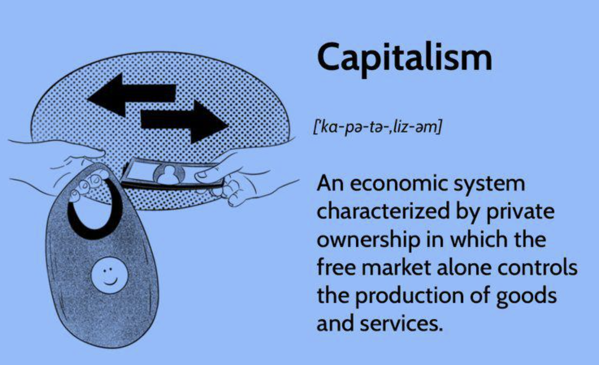

## Table of Contents

## What is capitalism?

Capitalism is an economic system where people and businesses own things like factories, shops, and farms. They use these to make money. In capitalism, the main goal is to make a profit. People can start their own businesses and compete with others. If they do well, they can earn a lot of money. If they don't, they might lose money or go out of business.

In this system, the government usually does not control the businesses. Instead, the market decides what to produce, how much to produce, and the price of goods and services. This is called a free market. People can buy and sell things freely. They can also choose what they want to buy. Capitalism can lead to new inventions and technologies because businesses are always trying to do better than their competitors.

## What are the different varieties of capitalism?

There are different types of capitalism around the world. One type is called laissez-faire capitalism. In this system, the government does not get involved much in the economy. Businesses can do what they want, and the market decides everything. Another type is called state capitalism. Here, the government plays a bigger role. It might own some businesses or control important parts of the economy. For example, the government might own the oil company or the electricity company.

Another variety is social market capitalism, which is common in some European countries. In this system, the government works to make sure that everyone has a fair chance. It provides things like healthcare and education to help people. At the same time, businesses are still free to compete and make profits. Lastly, there is welfare capitalism, where the government helps people who are poor or out of work. It gives them money or other support to help them live better lives. Each type of capitalism tries to balance the freedom of businesses with the needs of the people.

## How did capitalism develop historically?

Capitalism started to grow in Europe during the 16th and 17th centuries. Before that, many people lived and worked on land owned by lords or nobles. They were not free to move or start their own businesses. But as trade grew, especially with the discovery of new lands like America, people started to buy and sell things more. This led to the rise of merchants and traders who wanted to make money. They started to invest in new businesses and factories, which were the beginnings of capitalism. The idea of private property became more important, and people could own things and make profits from them.

By the 18th and 19th centuries, capitalism was spreading fast. The Industrial Revolution helped a lot. New machines and factories made it easier to produce goods quickly and cheaply. This meant more profits for business owners. At the same time, ideas about free markets and competition were becoming popular, thanks to thinkers like Adam Smith. He wrote about how the economy could work better if people were free to buy and sell without too much government control. Over time, capitalism spread to other parts of the world, changing and adapting to different places and cultures. Today, it is the main economic system in many countries, but it still faces challenges and criticisms.

## What are the key features of capitalism?

Capitalism is an economic system where people and businesses own things like factories, shops, and farms. They use these to make money. In capitalism, the main goal is to make a profit. People can start their own businesses and compete with others. If they do well, they can earn a lot of money. If they don't, they might lose money or go out of business. The market decides what to produce, how much to produce, and the price of goods and services. This is called a free market. People can buy and sell things freely. They can also choose what they want to buy.

Another important feature of capitalism is private property. People can own things and use them to make money. This is different from other systems where the government or the community might own everything. In capitalism, people are encouraged to work hard and take risks because they can keep the profits if they succeed. This can lead to new inventions and technologies because businesses are always trying to do better than their competitors. However, capitalism also has some challenges. It can lead to big differences between rich and poor people, and sometimes the government needs to step in to help those who are struggling.

## What are the advantages of capitalism?

Capitalism has many benefits. One big advantage is that it encourages people to work hard and start new businesses. Because people can keep the money they make, they have a reason to come up with new ideas and inventions. This can lead to new technologies and products that make life better for everyone. For example, companies might create new medicines or better ways to grow food. Capitalism also helps the economy grow. When businesses do well, they hire more people and pay them more money. This means more people can buy things, which helps other businesses grow too.

Another advantage of capitalism is that it gives people more choices. In a free market, businesses have to compete with each other. This means they try to offer better products at lower prices to attract customers. People can choose what they want to buy and from whom. This competition can also lead to lower prices and better quality goods. Capitalism also allows people to move up in society. If someone works hard and is successful, they can become rich, even if they started with very little. This idea of being able to improve your life through hard work is a big part of why many people like capitalism.

## What are the disadvantages of capitalism?

Capitalism can cause big differences between rich and poor people. Some people get very rich while others stay poor. This happens because in capitalism, people who own businesses or have a lot of money can make even more money. But people who don't have much to start with might find it hard to get ahead. They might not be able to afford good education or healthcare, which makes it harder for them to improve their lives. This can lead to a lot of people feeling left out and unhappy.

Another problem with capitalism is that it can be bad for the environment. Businesses often want to make as much money as they can, so they might not care about polluting the air or water. They might cut down forests or use up resources too quickly. This can harm the planet and make life harder for future generations. Also, in capitalism, the government might not step in to help people who are struggling. If someone loses their job or gets sick, they might not have enough money to live on. This can lead to a lot of suffering and can make people feel like the system is unfair.

## How does capitalism impact income inequality?

Capitalism can make income inequality worse. In a capitalist system, people who own businesses or have a lot of money can make even more money. They can invest in new businesses, buy more property, or save their money to earn interest. This means that the rich can get richer over time. On the other hand, people who don't have much money to start with might find it hard to get ahead. They might not be able to afford good education or healthcare, which makes it harder for them to find good jobs or start their own businesses. This gap between the rich and the poor can grow bigger over time.

Governments in capitalist countries sometimes try to help reduce income inequality. They might provide things like free education, healthcare, or welfare programs to help people who are struggling. But even with these programs, the difference between the rich and the poor can still be very big. Some people think that capitalism naturally leads to more inequality because it rewards people who already have money and resources. This can make it hard for everyone to have a fair chance to succeed.

## What is the role of government in capitalist economies?

In capitalist economies, the government plays an important role, even though the main idea is to let businesses and people do things on their own. The government makes rules to make sure businesses are fair and safe. For example, it might set rules about how workers should be treated or how much pollution factories can make. The government also protects people's rights to own things and to start their own businesses. This helps the economy grow because people feel safe to invest and try new things.

Another big job for the government in capitalist economies is to help people who are struggling. This can be done through programs like welfare, which gives money to people who are poor or out of work. The government might also provide things like free education and healthcare to help everyone have a fair chance. By doing these things, the government tries to balance the freedom of businesses with the needs of the people. This can help make the economy more fair and stable.

## How does capitalism compare to socialism?

Capitalism and socialism are two different ways to run an economy. In capitalism, people and businesses own things like factories and shops. The main goal is to make a profit. People can start their own businesses and compete with others. The market decides what to produce and how much it costs. This system can lead to new inventions and more choices for people. But it can also make the gap between rich and poor bigger, and it might not be good for the environment if businesses focus too much on making money.

In socialism, the government or the community owns the important parts of the economy, like factories and farms. The main goal is to make sure everyone's needs are met, not just to make a profit. The government decides what to produce and how to share it among people. This can help reduce the differences between rich and poor and make sure everyone has things like healthcare and education. But it might not encourage people to work hard or come up with new ideas as much as capitalism does, and it can be hard for the government to make all the decisions well.

Both systems have their good and bad points. Capitalism can lead to a lot of growth and new ideas, but it can also make some people very rich while others stay poor. Socialism can help make things more equal and take care of everyone's needs, but it might not be as good at growing the economy or encouraging new inventions. Many countries try to use a mix of both ideas to get the best of both worlds.

## What are the historical outcomes of capitalist versus socialist economies?

Capitalist economies have often led to a lot of growth and new inventions. Countries like the United States and many in Europe have used capitalism to become rich and powerful. Businesses in these countries have come up with new technologies and products, like computers and smartphones, which have made life better for many people. But capitalism has also made the gap between rich and poor bigger. In some places, a few people have a lot of money while many others struggle to get by. This has led to problems like homelessness and people not being able to afford healthcare.

Socialist economies have tried to make things more equal. Countries like the Soviet Union and Cuba have used socialism to make sure everyone has things like healthcare and education. In these places, the government tried to take care of everyone's needs, not just make profits. But socialist economies have often had a hard time growing as fast as capitalist ones. They might not encourage people to work hard or come up with new ideas as much. This can lead to fewer new products and slower economic growth. Over time, many socialist countries have faced challenges and some have even moved towards more capitalist ideas to help their economies grow.

Both systems have their good and bad points. Capitalist economies can lead to a lot of wealth and innovation, but they can also make inequality worse. Socialist economies can help make things more equal and take care of everyone's basic needs, but they might not be as good at growing the economy or encouraging new inventions. Many countries today try to use a mix of both ideas to get the best of both worlds.

## How do different countries implement capitalism differently?

Different countries use capitalism in their own ways. In the United States, they have a type of capitalism called laissez-faire. This means the government does not get involved much in the economy. Businesses can do what they want, and the market decides everything. People can start their own businesses easily, and there is a lot of competition. This has helped the U.S. become a leader in technology and business, but it has also made the gap between rich and poor bigger.

In some European countries like Germany and Sweden, they use a type of capitalism called social market capitalism. Here, the government plays a bigger role to make sure everyone has a fair chance. They provide things like healthcare and education to help people. At the same time, businesses are still free to compete and make profits. This system tries to balance the freedom of businesses with the needs of the people, so there is less inequality than in the U.S.

In China, they use a type of capitalism called state capitalism. The government owns some big businesses and controls important parts of the economy, like the oil and electricity companies. This helps the government guide the economy and make sure it grows in the way they want. At the same time, there are also many private businesses that can compete and make profits. This mix of government control and private business has helped China grow very fast, but it can also lead to less freedom for people and businesses.

## What are the future challenges and potential reforms for capitalism?

One big challenge for capitalism in the future is making sure it is fair for everyone. Right now, some people get very rich while others stay poor. This can cause a lot of problems, like people not being able to afford good healthcare or education. To fix this, governments might need to do more to help people who are struggling. They could make sure everyone has access to healthcare and education, and they could also make rules to stop businesses from getting too big and powerful. This way, more people can have a fair chance to succeed.

Another challenge is taking care of the environment. Many businesses in capitalist economies focus on making money, and this can lead to pollution and using up resources too quickly. To solve this, governments might need to make stricter rules about how much pollution businesses can make. They could also encourage businesses to use clean energy and recycle more. This would help protect the planet for future generations. It might be hard to do these things without slowing down the economy, but it is important to find a balance.

A third challenge is dealing with new technology and jobs. As machines and computers get better, they can do more of the work that people used to do. This can lead to fewer jobs for people, which can be a big problem in capitalist economies. To fix this, governments and businesses might need to help people learn new skills so they can get different kinds of jobs. They could also make sure that the benefits of new technology are shared fairly, so everyone can benefit from progress, not just the people who own the technology.

## References & Further Reading

[1]: Heilbroner, R. L. (1999). ["The Worldly Philosophers: The Lives, Times, and Ideas of the Great Economic Thinkers"](https://archive.org/details/worldlyphilosoph00heil_2). Simon & Schuster.

[2]: Keynes, J. M. (1936). ["The General Theory of Employment, Interest, and Money"](https://www.files.ethz.ch/isn/125515/1366_KeynesTheoryofEmployment.pdf). Palgrave Macmillan.

[3]: Polanyi, K. (1944). ["The Great Transformation: The Political and Economic Origins of Our Time"](https://inctpped.ie.ufrj.br/spiderweb/pdf_4/Great_Transformation.pdf). Beacon Press.

[4]: Marx, K. (1867). ["Capital: Critique of Political Economy, Volume 1"](https://www.marxists.org/archive/marx/works/download/pdf/Capital-Volume-I.pdf). Penguin Classics.

[5]: Friedman, M. (1962). ["Capitalism and Freedom"](https://ctheory.sitehost.iu.edu/resources/fall2020/Friedman_Capitalism_and_Freedom.pdf). University of Chicago Press.

[6]: Shiller, R. J. (2000). ["Irrational Exuberance"](http://www.library.fa.ru/files/Shiller2.pdf). Princeton University Press.

[7]: Lopez de Prado, M. (2018). ["Advances in Financial Machine Learning"](https://www.amazon.com/Advances-Financial-Machine-Learning-Marcos/dp/1119482089). Wiley.

[8]: Aronson, D. R. (2006). ["Evidence-Based Technical Analysis: Applying the Scientific Method and Statistical Inference to Trading Signals"](https://www.amazon.com/Evidence-Based-Technical-Analysis-Scientific-Statistical/dp/0470008741). Wiley.

[9]: Chan, E. P. (2008). ["Quantitative Trading: How to Build Your Own Algorithmic Trading Business"](https://github.com/ftvision/quant_trading_echan_book). Wiley.