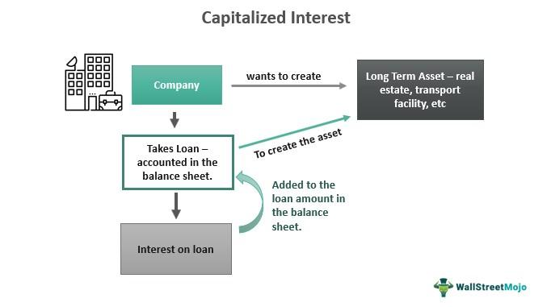

## Table of Contents

## What is accrued interest?

Accrued interest is the amount of interest that has been earned but not yet paid or received. It often comes up with bonds, loans, and savings accounts. For example, if you have a savings account, the bank owes you interest that has built up over time but hasn't been added to your account yet. This interest is called accrued interest.

In the case of bonds, when someone buys or sells a bond between interest payment dates, the buyer pays the seller the accrued interest for the period they held the bond. This makes sure that the seller gets the interest they earned up to the sale date, and the buyer only pays for the interest that will be earned after they buy the bond. Accrued interest is important because it helps keep financial transactions fair and accurate.

## Why is capitalization of accrued interest important?

Capitalization of accrued interest is important because it helps to accurately show how much money someone owes or is owed. When interest is capitalized, it means the interest that has built up over time is added to the original amount of money. This is common with loans and bonds. For example, if you have a student loan, the interest that hasn't been paid might be added to the loan balance. This makes the total amount you owe bigger.

This process is important for keeping financial records correct. It makes sure that everyone knows the true amount of money involved. For businesses, it helps them report their financial situation accurately to investors and regulators. For individuals, it helps them understand their debts or investments better. By capitalizing accrued interest, everyone can see a clearer picture of their financial situation.

## How does capitalization of accrued interest affect a loan?

When you capitalize accrued interest on a loan, it means you add the interest that has built up to the original amount you borrowed. Let's say you borrowed $10,000 and the interest that hasn't been paid yet is $500. After capitalizing the interest, you now owe $10,500. This new amount is called the principal, and future interest will be calculated based on this higher number.

This can make your loan grow faster because you're now paying interest on a bigger amount. If you don't pay off the loan quickly, the interest can keep adding up and getting added to the principal over and over. This is called compound interest. It's important to understand this because it can make your loan much bigger over time if you're not careful.

## What are the common scenarios where accrued interest is capitalized?

One common scenario where accrued interest is capitalized is with student loans. If you have a student loan and you're not making payments while you're in school, the interest that builds up can be added to your loan balance. This means when you start paying back your loan, you'll be paying interest on a bigger amount. This can make your loan grow faster over time.

Another scenario is with mortgages, especially if you have an adjustable-rate mortgage. If you miss some payments, the interest that you owe can be added to the loan balance. This can increase the total amount you owe and affect how much you pay each month. It's important to keep up with your payments to avoid this happening.

Accrued interest is also commonly capitalized in business loans. If a business takes out a loan and doesn't pay the interest right away, that interest can be added to the loan's principal. This can make the loan bigger and affect the business's financial health. Businesses need to manage their loans carefully to avoid this situation.

## Can you explain the process of capitalizing accrued interest?

When you capitalize accrued interest, you add the interest that has built up to the original amount of money you owe or are owed. Let's say you have a loan for $10,000 and you haven't paid the interest that has been building up, which is $500. When you capitalize the interest, you add that $500 to the $10,000, making the new total you owe $10,500. This new total is called the principal, and any future interest will be calculated based on this bigger amount.

This process can make your loan grow faster because you're now paying interest on a larger amount. If you keep not paying the interest and it keeps getting added to the principal, it can create a cycle where your loan gets bigger and bigger. This is called compound interest. It's important to understand this because it can make your loan much larger over time if you're not careful with your payments.

## What is the impact of capitalization on the total interest paid over the life of a loan?

When you capitalize accrued interest on a loan, it can make the total interest you pay over the life of the loan go up a lot. This is because when you add the interest to the loan, you are now paying interest on a bigger amount. Let's say you borrowed $10,000 and the interest that hasn't been paid is $500. After capitalizing the interest, you now owe $10,500. The interest you pay in the future will be based on this new, higher amount.

This can lead to a cycle where the loan keeps getting bigger because you're always paying interest on a growing amount. This is called compound interest. Over time, this can make the total amount of interest you pay much higher than if you had paid the interest as it built up. It's important to understand this because it can make your loan much more expensive if you're not careful.

## How does the frequency of capitalization affect the amount of interest?

The more often you capitalize interest, the more interest you will end up paying over time. This is because when you add the interest to the loan, you start paying interest on a bigger amount. If you capitalize the interest every month instead of every year, the loan will grow faster. This is because you're adding the interest to the loan more often, so the amount you owe keeps getting bigger more quickly.

For example, if you have a student loan and the interest is capitalized every month, the interest you owe will be added to your loan balance each month. This means that each month, you're paying interest on a larger amount than if the interest were capitalized once a year. Over the life of the loan, this can add up to a lot more interest paid. It's important to know how often the interest is capitalized so you can understand how much the loan will cost you in the end.

## What are the legal and regulatory considerations regarding the capitalization of accrued interest?

When it comes to capitalizing accrued interest, there are rules that banks and lenders have to follow. These rules are set by the government and other groups to make sure that people are treated fairly. For example, in the United States, the Department of Education has rules about how student loan interest can be capitalized. They say that interest can only be added to the loan in certain situations, like when you leave school or if you don't make payments for a while. This helps make sure that student loans don't grow too fast.

There are also laws that require lenders to tell you how much interest you owe and when it will be added to your loan. This is called disclosure, and it's important because it helps you understand how much you will have to pay back. Different countries have different rules, but the main idea is the same: to make sure that people know what they are getting into and that they are treated fairly. If a lender doesn't follow these rules, they could get in trouble with the government or be sued by borrowers.

## How do different types of loans handle the capitalization of accrued interest?

Different types of loans handle the capitalization of accrued interest in different ways. For student loans, the interest might be added to the loan when you leave school or if you don't make payments for a while. This is to make sure that the loan doesn't grow too fast while you're still studying. The government has rules about when and how this can happen, so it's important to know these rules if you have a student loan.

For mortgages, especially adjustable-rate mortgages, the interest might be added to the loan if you miss payments. This can make the total amount you owe bigger and affect how much you pay each month. It's important to keep up with your payments to avoid this happening. Business loans also work this way, where the interest that builds up can be added to the loan if it's not paid right away. This can make the loan bigger and affect the business's financial health, so businesses need to manage their loans carefully.

## What strategies can borrowers use to minimize the effects of capitalized interest?

Borrowers can minimize the effects of capitalized interest by making payments on their loans regularly, even if they are small. For student loans, paying the interest while in school can prevent it from being added to the loan balance. This means the loan won't grow as fast, and you'll end up paying less interest over time. If you can't pay the full interest, paying even a little bit can help keep the loan from growing too much.

Another strategy is to choose a loan with a lower interest rate or a different repayment plan that doesn't capitalize interest as often. Some loans let you pay just the interest while you're in school, which can stop the loan from getting bigger. It's also a good idea to talk to your lender about your options. They might be able to help you find a plan that works better for you and keeps the interest from being added to your loan as much.

## How do financial institutions calculate and report capitalized interest?

Financial institutions calculate capitalized interest by adding the interest that has built up to the original amount of the loan. For example, if you owe $10,000 on a loan and the interest that hasn't been paid is $500, the bank will add that $500 to the $10,000. This makes the new total you owe $10,500. From then on, the interest will be calculated based on this new, higher amount. This process can make the loan grow faster because you're now paying interest on a bigger amount.

When it comes to reporting capitalized interest, banks have to follow rules set by the government and other groups. They need to tell you how much interest you owe and when it will be added to your loan. This is called disclosure, and it's important because it helps you understand how much you will have to pay back. The bank will include this information in your loan statements and other documents, so you can keep track of how much you owe and plan your payments accordingly.

## What are the advanced financial models used to predict the effects of interest capitalization on long-term debt instruments?

To predict how interest capitalization affects long-term debt instruments, financial experts use advanced models like the compound interest formula. This formula helps them see how adding interest to the loan makes it grow over time. For example, if you have a loan and the interest keeps getting added to it every month or year, the loan gets bigger and bigger. By using this formula, experts can figure out how much the loan will be in the future and how much interest you will have to pay. They can also change the numbers in the formula to see what happens if you make different payments or if the interest rate changes.

Another model used is the amortization schedule. This model shows how each payment you make on a loan is split between paying off the interest and paying off the principal. When interest is capitalized, the principal gets bigger, so more of your payment goes toward interest. By using an amortization schedule, financial experts can predict how long it will take to pay off the loan and how much interest you will pay over time. This helps them give good advice on how to manage the loan and avoid paying too much interest.

## What is Understanding Accrued Interest?

Accrued interest represents the amount of interest accumulated on a financial instrument, such as bonds or loans, from the last interest payment until the current date. In financial accounting and investing, understanding accrued interest is crucial as it directly impacts the valuation of bonds and other fixed income securities. This accumulated interest becomes particularly significant during the purchase or sale of a bond, where the buyer compensates the seller for the interest earned since the last coupon payment.

Accrued interest affects financial statements by influencing both the income statement and balance sheet. In the income statement, it appears as interest revenue or interest expense, depending on whether the entity holds the asset or liability. On the balance sheet, it is recorded under current assets as "interest receivable" or under current liabilities as "interest payable," based on whether the entity expects to receive or owes accrued interest.

The calculation of accrued interest involves the following formula:

$$
\text{Accrued Interest} = \left(\frac{\text{Annual Interest Rate}}{\text{Number of Periods per Year}}\right) \times \text{Principal Amount} \times \text{Time Elapsed}
$$

Here, the time elapsed represents the fraction of the year that has passed since the last interest payment, often calculated in days or months.

For example, consider a bond with a principal amount of $10,000, an annual [interest rate](/wiki/interest-rate-trading-strategies) of 5%, and semi-annual interest payments. If 60 days have passed since the last payment, the accrued interest can be computed as follows:

$$
\text{Accrued Interest} = \left(\frac{0.05}{2}\right) \times 10,000 \times \left(\frac{60}{180}\right) = \$83.33
$$

This computation signifies that the bondholder is entitled to receive $83.33 as accrued interest if they sell the bond before the next interest payment.

For investors, understanding accrued interest is essential for evaluating the true yield of a bond or fixed income security. When purchasing a bond, the buyer must consider both the clean price of the bond and the accrued interest to determine the total price paid, known as the dirty price. This distinction helps investors accurately compare bonds and make informed investment decisions.

For companies, accurately recording and managing accrued interest ensures compliance with accounting standards and transparent financial reporting. It allows businesses to reflect true financial performance and maintain accurate forecasts of cash flows. 

In conclusion, accrued interest is a pivotal component of financial accounting and investment strategy. It not only affects valuations and transaction prices but also ensures the precision and reliability of financial reports. Understanding how to calculate and record accrued interest is indispensable for any finance professional.

## What is the Role of Capitalization in Financial Terms?

Capitalization is a key concept in financial accounting, involving the allocation of the costs of an asset to its capital base rather than expensing these costs immediately. This practice is crucial for organizations managing long-term assets like property, equipment, and intangible assets such as patents and trademarks. Proper capitalization allows companies to spread the cost of an asset over its useful life, thereby aligning the recognition of expenses with the asset’s revenue-generating potential.

### Application in Accounting

In accounting, capitalization follows specific guidelines under generally accepted accounting principles (GAAP) or International Financial Reporting Standards (IFRS). The costs that are capitalized typically include the purchase price of the asset and any additional expenses necessary to bring the asset to a usable state, such as transportation and installation costs.

When an asset is capitalized, it is recorded on the balance sheet as a fixed asset, increasing the company's asset base. This not only affects the balance sheet metrics but also impacts the income statement through the depreciation expense. Over the asset's useful life, its cost is systematically allocated as depreciation expense, reducing net income each period.

### Depreciation and Amortization

The systematic reduction in the value of a tangible capitalized asset is known as depreciation. Different methods can be used for calculating depreciation, including:

1. **Straight-Line Method**: Divides the asset’s cost evenly over its useful life.
$$
   \text{Annual Depreciation} = \frac{\text{Cost of Asset} - \text{Salvage Value}}{\text{Useful Life}}

$$

2. **Declining Balance Method**: Accelerates depreciation, higher in the earlier years.
$$
   \text{Depreciation Rate} = \text{Depreciation \%} \times \text{Book Value}

$$

For intangible assets, amortization applies, reflecting the systematic write-off of the asset’s value over time.

### Benefits of Capitalization

Capitalizing expenses provides several advantages:

- **Improved Financial Ratios**: Capitalization increases asset values and spreads cost recognition, often enhancing key financial metrics like return on assets (ROA) and earnings before interest, taxes, depreciation, and amortization (EBITDA).
- **Tax Efficiency**: By deferring expense recognition, businesses can lower their taxable income temporarily, leading to potential tax savings.
- **Long-term Planning**: Businesses can better match expenses with the revenues generated by their assets, aiding in long-term financial planning and investment analysis.

### Limitations and Challenges

Despite its benefits, capitalization has certain limitations:

- **Complexity**: Determining which costs should be capitalized and the appropriate methods of depreciation can be complex and vary between jurisdictions.
- **Subjectivity**: The process can introduce subjectivity, particularly in estimating an asset’s useful life and residual value, potentially leading to inconsistencies.
- **Cash Flow Impact**: While capitalization defers expenses, it does not affect the actual cash flow. Businesses must manage liquidity carefully to avoid cash shortfalls.

Understanding capitalization allows organizations to accurately represent their financial health, making it a fundamental tool in financial management and reporting.

## How can one integrate financial terms such as accrued interest and algo trading?

Accrued interest and [algorithmic trading](/wiki/algorithmic-trading), though seemingly distinct facets of finance, intersect powerfully in the automated trading of fixed income securities. Fixed income trading refers primarily to the buying and selling of bonds and other debt instruments. Central to these transactions is the concept of accrued interest, which represents the interest accumulated on a bond since its last coupon payment. This value significantly affects the pricing and valuation of bonds.

Algorithmic trading, or algo trading, uses pre-programmed software instructions to execute trades. In the fixed income market, it's crucial for these algorithms to account for accrued interest when pricing and trading bonds. Algorithms leverage this data to calculate the clean price (excluding accrued interest) and the dirty price (including accrued interest), essential in bond pricing and yield calculations. 

The formula for calculating accrued interest can be expressed as:

$$
\text{Accrued Interest} = \frac{\text{Annual Coupon Payment}}{\text{Coupon Periods per Year}} \times \frac{\text{Days since Last Coupon Payment}}{\text{Days in Coupon Period}}
$$

For algorithmic models, accurate calculation of accrued interest ensures precise bond pricing, affecting buy and sell decisions. In Python, a simple code snippet for calculating accrued interest might look like this:

```python
def calculate_accrued_interest(coupon_payment, coupon_periods, days_since_last, days_in_period):
    return (coupon_payment / coupon_periods) * (days_since_last / days_in_period)
```

Financial institutions use robust technological solutions to integrate accrued interest data into their trading algorithms. These tools process market data in real-time, adjusting strategies based on interest rate changes, market [liquidity](/wiki/liquidity-risk-premium), and other variables. By effectively incorporating accrued interest into these models, traders can optimize returns and manage risks more efficiently.

The interplay between accrued interest and algorithmic trading underscores the need for precise data processing capabilities. As the prominence of algo trading continues to grow, incorporating detailed financial data such as accrued interest becomes imperative for developing effective trading strategies in the fixed income market.

## References & Further Reading

[1]: ["Fixed Income Securities: Tools for Today's Markets"](https://www.amazon.com/Fixed-Income-Securities-Markets-Finance/dp/1119835550) by Bruce Tuckman and Angel Serrat

[2]: Philippe Jorion. (2006). ["Value at Risk: The New Benchmark for Managing Financial Risk"](https://books.google.com/books/about/Value_at_Risk_3rd_Ed.html?id=nnblKhI7KP8C) Third Edition, McGraw Hill.

[3]: ["Algorithmic Trading and DMA: An introduction to direct access trading strategies"](https://www.amazon.com/Algorithmic-Trading-DMA-introduction-strategies/dp/0956399207) by Barry Johnson

[4]: [Chaboud, A. P., Chiquoine, B., Hjalmarsson, E., & Vega, C. (2014). "Rise of the Machines: Algorithmic Trading in the Foreign Exchange Market."](https://www.jstor.org/stable/43612951) The Review of Economics and Statistics.

[5]: ["Intermediate Accounting"](https://open.umn.edu/opentextbooks/textbooks/474) by Donald E. Kieso, Jerry J. Weygandt, and Terry D. Warfield

[6]: ["Fundamentals of Corporate Finance"](https://www.pearson.com/en-us/subject-catalog/p/fundamentals-of-corporate-finance/P200000009821/9780137852826) by Stephen A. Ross, Randolph W. Westerfield, and Bradford D. Jordan